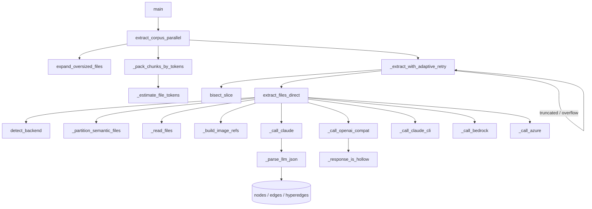

# LLM extraction backends — turning source into graph nodes/edges

## Overview
This is graphify's front door: the layer that reads a corpus of files and asks a
language model to emit the semantic nodes, edges and hyperedges that everything
downstream (build → cluster → analyze → serve) operates on. The central design
idea is **provider-neutral, self-healing extraction**: one prompt and one JSON
shape are dispatched to any of a dozen backends (Anthropic, OpenAI-compatible,
Bedrock, Azure, Ollama, the local Claude Code CLI), and the corpus is sliced into
token-budgeted chunks that run in parallel and *recursively split themselves* when
a model truncates or rejects them. A model is untrusted in two directions — its
output can be malformed and the input files can be hostile — so parsing is
defensive and every file is wrapped as inert data before it reaches the model.

## Diagram

## Design rationale (why it's built this way)
**One JSON contract, many providers.** Every backend call ends at the same parsed
`{nodes, edges, hyperedges, input_tokens, output_tokens}` dict, so the rest of
graphify never learns which vendor produced a graph. [`extract_files_direct`](../catalog/graphify/llm.md#extract_files_direct)
is a dispatch table over [`BACKENDS`](../catalog/graphify/llm.md#BACKENDS.BACKENDS)
— it resolves a key, a model and vision support, then hands off to the one call
helper that speaks that vendor's wire format. Adding a provider is adding a
`BACKENDS` entry plus (usually) reusing [`_call_openai_compat`](../catalog/graphify/llm.md#_call_openai_compat),
which already covers Kimi, OpenAI, DeepSeek and Ollama.

**Retry is signal-driven, not blanket.** Rather than pre-computing a safe chunk
size for every model, the author lets chunks fail and recover. [`_extract_with_adaptive_retry`](../catalog/graphify/llm.md#_extract_with_adaptive_retry)
funnels three distinct failures — `finish_reason="length"` truncation, a
context-window HTTP rejection, and a hollow 200 response — into the *same*
"split in half and recurse" path. Its docstring is explicit that this is a
tradeoff: "chunks too dense to fit in one response self-heal by splitting until
they do, while well-sized chunks pay no extra cost."

**Files are untrusted data.** The corpus is attacker-controllable (you can
`/graphify` any repo). [`_read_files`](../catalog/graphify/llm.md#_read_files)
wraps each file in a hash-stamped `<untrusted_source>` block and defangs known
chat-template/jailbreak sentinels, so a file cannot forge a system turn or smuggle
instructions out of the data block. The system prompt from [`_extraction_system`](../catalog/graphify/llm.md#_extraction_system)
tells the model to treat that block as inert.

> [!inferred]
> The `<untrusted_source>` wrapping and sentinel-defanging live in helpers
> (`_wrap_untrusted`, `_neutralise_injection_sentinels`) that are called from
> `_read_files` but are not in this packet's subgraph, so they are described here
> from the source of `_read_files` rather than cited directly.

**Determinism over speed.** Parallel chunks are merged in *submission* order, not
completion order (see Dynamics) — the author chose reproducible graph.json over
the marginally simpler merge-as-they-finish.

## Entry points
- [`main`](../catalog/graphify/__main__.md#main) — the CLI dispatcher. For the
  extract command it resolves a backend from the environment via
  [`detect_backend`](../catalog/graphify/llm.md#detect_backend) and drives the
  corpus through [`extract_corpus_parallel`](../catalog/graphify/llm.md#extract_corpus_parallel).
- [`extract_corpus_parallel`](../catalog/graphify/llm.md#extract_corpus_parallel)
  — the corpus-level entry: slices oversized docs, packs chunks to a token budget,
  runs them concurrently and merges. This is what a full ingest calls.
- [`extract_files_direct`](../catalog/graphify/llm.md#extract_files_direct) — the
  single-request entry: one list of files → one model call → one parsed graph
  fragment. Callable directly for small inputs and reused by the retry path.
- [`_call_llm`](../catalog/graphify/llm.md#_call_llm) — the lightweight text entry
  for callers that want a plain reply, not the extraction schema (community
  labelling, dedup tiebreaks). It mirrors the backend dispatch but skips the
  extraction prompt and JSON parsing.

## Mechanism (step-by-step)
1. **Resolve a backend and its credentials.** With no explicit backend,
   [`detect_backend`](../catalog/graphify/llm.md#detect_backend) scans
   [`BACKENDS`](../catalog/graphify/llm.md#BACKENDS.BACKENDS) for the first one
   whose API key is set; [`_get_backend_api_key`](../catalog/graphify/llm.md#_get_backend_api_key)
   reads it and [`_default_model_for_backend`](../catalog/graphify/llm.md#_default_model_for_backend)
   picks the model. Ollama is special-cased: it needs no key but the OpenAI client
   demands a non-empty string, so a placeholder is used and [`_validate_ollama_base_url`](../catalog/graphify/llm.md#_validate_ollama_base_url)
   hard-blocks link-local/metadata URLs (an SSRF guard, "F3") before any corpus is
   sent. A missing key surfaces the accepted variable names via
   [`_format_backend_env_keys`](../catalog/graphify/llm.md#_format_backend_env_keys).

2. **Split oversized documents into slices.** Before packing,
   [`extract_corpus_parallel`](../catalog/graphify/llm.md#extract_corpus_parallel)
   runs [`expand_oversized_files`](../catalog/graphify/file_slice.md#expand_oversized_files),
   which replaces any splittable text file larger than
   [`_FILE_CHAR_CAP`](../catalog/graphify/llm.md#_FILE_CHAR_CAP) with a list of
   [`FileSlice`](../catalog/graphify/file_slice.md#FileSlice) units cut at heading/
   paragraph/line boundaries. This fixes the old failure where content past the
   char cap was silently dropped; each slice reports its parent file as source (via
   [`unit_path`](../catalog/graphify/file_slice.md#unit_path)) so nodes never
   fragment per-slice.

3. **Pack chunks to a token budget.** [`_pack_chunks_by_tokens`](../catalog/graphify/llm.md#_pack_chunks_by_tokens)
   groups units by parent directory (so related files land in one request and
   cross-file edges are more likely extracted) and greedily fills each chunk up to
   the budget, sizing each unit with [`_estimate_file_tokens`](../catalog/graphify/llm.md#_estimate_file_tokens)
   (tiktoken when available, else a chars/token heuristic, both capped at
   [`_FILE_CHAR_CAP`](../catalog/graphify/llm.md#_FILE_CHAR_CAP)). This replaces the
   legacy fixed-count chunking whose worst case blew past a model's context window.

4. **Run chunks with adaptive self-healing.** Each chunk goes through
   [`_extract_with_adaptive_retry`](../catalog/graphify/llm.md#_extract_with_adaptive_retry),
   which calls [`extract_files_direct`](../catalog/graphify/llm.md#extract_files_direct)
   and, on truncation or context overflow, splits the chunk in half and recurses up
   to `max_depth`. A lone chunk that is a single [`FileSlice`](../catalog/graphify/file_slice.md#FileSlice)
   is bisected further with [`bisect_slice`](../catalog/graphify/file_slice.md#bisect_slice);
   a single whole non-splittable file that overflows can't be shrunk, so it returns
   empty with a warning rather than looping.

5. **Build the request and dispatch.** [`extract_files_direct`](../catalog/graphify/llm.md#extract_files_direct)
   partitions the chunk with [`_partition_semantic_files`](../catalog/graphify/llm.md#_partition_semantic_files)
   into text and raster images, renders text with [`_read_files`](../catalog/graphify/llm.md#_read_files)
   (which reads each [`FileSlice`](../catalog/graphify/file_slice.md#FileSlice) via
   [`read_slice_text`](../catalog/graphify/file_slice.md#read_slice_text) between its
   [`start`](../catalog/graphify/file_slice.md#FileSlice.start)/[`end`](../catalog/graphify/file_slice.md#FileSlice.end)
   offsets), then routes to the vendor helper: [`_call_claude`](../catalog/graphify/llm.md#_call_claude),
   [`_call_openai_compat`](../catalog/graphify/llm.md#_call_openai_compat),
   [`_call_bedrock`](../catalog/graphify/llm.md#_call_bedrock),
   [`_call_azure`](../catalog/graphify/llm.md#_call_azure), or the subscription-auth
   [`_call_claude_cli`](../catalog/graphify/llm.md#_call_claude_cli). Temperature and
   timeout are normalised per model by [`_resolve_temperature`](../catalog/graphify/llm.md#_resolve_temperature)
   and [`_resolve_api_timeout`](../catalog/graphify/llm.md#_resolve_api_timeout).

6. **Handle vision inputs by capability.** [`_build_image_refs`](../catalog/graphify/llm.md#_build_image_refs)
   turns raster images into [`_ImageRef`](../catalog/graphify/llm.md#_ImageRef)
   objects; whether they carry pixel bytes depends on
   [`_backend_supports_vision`](../catalog/graphify/llm.md#_backend_supports_vision).
   Each vendor formats them differently — inline base64 blocks via
   [`_anthropic_content`](../catalog/graphify/llm.md#_anthropic_content) /
   [`_openai_content`](../catalog/graphify/llm.md#_openai_content), raw bytes via
   [`_bedrock_content`](../catalog/graphify/llm.md#_bedrock_content), and for the CLI
   backend, images are passed **by path**: [`_call_claude_cli`](../catalog/graphify/llm.md#_call_claude_cli)
   allowlists each image's directory with `--add-dir` (using its
   [`path`](../catalog/graphify/llm.md#_ImageRef.path)) and asks the model to open it
   with its Read tool. The image-listing note that makes the model emit one node per
   image comes from [`_with_image_notes`](../catalog/graphify/llm.md#_with_image_notes) /
   [`_image_notes`](../catalog/graphify/llm.md#_image_notes).

7. **Parse defensively and detect empties.** [`_parse_llm_json`](../catalog/graphify/llm.md#_parse_llm_json)
   strips markdown fences *anywhere* in the reply, then falls back to scanning for
   the first balanced `{...}` object (models love to wrap JSON in prose), and caps
   input size so a runaway reply can't exhaust memory. [`_response_is_hollow`](../catalog/graphify/llm.md#_response_is_hollow)
   catches a "successful" HTTP response that parsed to nothing usable — the
   [`_call_openai_compat`](../catalog/graphify/llm.md#_call_openai_compat) path
   re-labels those as `finish_reason="length"` so they take the same retry path
   instead of being silently dropped.

8. **Lightweight text calls for graph refinement.** Separate from extraction,
   [`_call_llm`](../catalog/graphify/llm.md#_call_llm) serves callers that need a
   short reply: community labelling via [`_label_batch_with_retry`](../catalog/graphify/llm.md#_label_batch_with_retry)
   (which halves a batch and retries on parse failure) and the dedup tiebreaker
   [`_llm_tiebreak`](../catalog/graphify/dedup.md#_llm_tiebreak) that resolves
   ambiguous merge candidates. These reuse the same backend dispatch but not the
   extraction schema.

## Key data structures
- [`FileSlice`](../catalog/graphify/file_slice.md#FileSlice) — a frozen
  `[start, end)` char range of one splittable file, carrying its parent
  [`path`](../catalog/graphify/llm.md#_ImageRef.path) so all slices of a file merge
  under one source. It is the unit that makes an oversized document extractable.
- [`_ImageRef`](../catalog/graphify/llm.md#_ImageRef) — one image destined for a
  vision request; the same object is rendered inline (base64), as raw bytes, or by
  path depending on the backend.
- [`BACKENDS`](../catalog/graphify/llm.md#BACKENDS.BACKENDS) — the provider registry
  (base_url, model, vision, token caps) that every dispatch and detection reads.
- The extraction result dict — `{nodes, edges, hyperedges, input_tokens,
  output_tokens}` — is the invariant contract all `_call_*` helpers return and the
  retry path merges by concatenation.

## Dynamics (design intent)
[`extract_corpus_parallel`](../catalog/graphify/llm.md#extract_corpus_parallel) runs
chunks in a thread pool capped at `max_concurrency` (default 4, "conservative to
stay under provider rate limits"), but merges results in **submission order** after
the pool drains — its comment notes that merging in completion order made
graph.json depend on which network call returned first, so identical input churned
run-to-run (#1632). Two backends are forced serial unless the user opts in: Ollama
(one request per GPU-loaded model) and claude-cli (parallel subprocesses conflict
over session state). Failed chunks are logged and skipped so one bad chunk never
aborts the run, with a loud end-of-run summary. Test coverage confirms the edge
behaviour: oversized markdown does not crash on a `FileSlice`
([`test_corpus_parallel_oversized_markdown_does_not_crash_on_fileslice`](../catalog/tests/test_llm_backends.md#test_corpus_parallel_oversized_markdown_does_not_crash_on_fileslice)),
temperature is omitted for reasoning models
([`test_openai_compat_omits_temperature_for_o3_model`](../catalog/tests/test_llm_backends.md#test_openai_compat_omits_temperature_for_o3_model)),
and the CLI backend adds `--add-dir` for oversized images
([`test_claude_cli_passes_oversized_image_by_path`](../catalog/tests/test_image_vision.md#test_claude_cli_passes_oversized_image_by_path)).

## Edge cases
- **No backend configured.** [`extract_files_direct`](../catalog/graphify/llm.md#extract_files_direct)
  raises with the full list of accepted env vars rather than guessing.
- **Ollama with no key.** Proceeds with a placeholder key but prints a visible
  warning and validates the URL via [`_validate_ollama_base_url`](../catalog/graphify/llm.md#_validate_ollama_base_url)
  so a corpus is never silently shipped to an unexpected host.
- **Windows Claude CLI shim.** [`_call_claude_cli`](../catalog/graphify/llm.md#_call_claude_cli)
  prefers `claude.cmd` because `CreateProcess` can't execute the `.ps1` that
  `shutil.which` may return; regression-guarded by
  [`test_windows_prefers_claude_cmd_over_bare_claude`](../catalog/tests/test_claude_cli_backend.md#test_windows_prefers_claude_cmd_over_bare_claude).
- **Unicode round-trip.** Subprocess calls must pass `encoding="utf-8"` or arrows/
  emoji corrupt under the Windows locale codec —
  [`test_subprocess_called_with_utf8_encoding`](../catalog/tests/test_charmap_encoding.md#TestSubprocessEncoding.test_subprocess_called_with_utf8_encoding).
- **Non-splittable oversized file.** A single huge code file that overflows context
  is returned empty with a warning — [`bisect_slice`](../catalog/graphify/file_slice.md#bisect_slice)
  only helps for document slices.
- **Missing SDK.** Backend helpers raise `ImportError` with an install hint from
  [`_backend_pkg_hint`](../catalog/graphify/llm.md#_backend_pkg_hint).

## Open questions
- The actual node/edge JSON schema the model is told to emit lives in the
  `_EXTRACTION_SYSTEM` constant behind [`_extraction_system`](../catalog/graphify/llm.md#_extraction_system);
  its exact field grammar (and how confidence tiers like INFERRED/AMBIGUOUS are
  assigned) is not part of this packet's subgraph.
- The `<untrusted_source>` wrapping is described from `_read_files`'s body but its
  helper functions aren't in the subgraph, so the precise sentinel set is only
  visible in source, not citable here.

## See also
- [graphify-analyze](graphify-analyze.md) — consumes the extracted graph to surface
  god nodes and surprising connections.
- [graphify-security](graphify-security.md) — the sanitisation and size-cap guards
  applied when these extraction results are written and served.
- [graphify-reflect](graphify-reflect.md) — the persistent-learning loop layered
  over the same graph.
