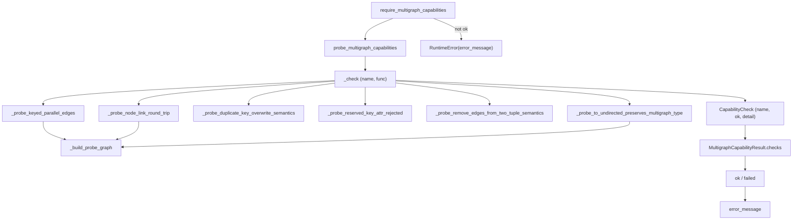

# graphify-multigraph_compat — probing MultiDiGraph support before committing

## Overview
`--multigraph` mode lets graphify keep *parallel* edges between the same two nodes — a `calls`
and an `imports` edge from `a` to `b` instead of collapsing them — by using an
`nx.MultiDiGraph` with per-edge keys. But that mode depends on subtle NetworkX/Python behaviors
that vary by version, so this module's single idea is **fail fast and loud with a
runtime capability probe**: before graphify persists a keyed multigraph, it actually builds a
tiny probe graph and checks that keyed parallel edges, node-link JSON round-trips, and
`to_undirected` all behave as required.
[`probe_multigraph_capabilities`](../catalog/graphify/multigraph_compat.md#probe_multigraph_capabilities)
runs the checks (cached), [`require_multigraph_capabilities`](../catalog/graphify/multigraph_compat.md#require_multigraph_capabilities)
raises an actionable error if any fail, and
[`MultigraphCapabilityResult`](../catalog/graphify/multigraph_compat.md#MultigraphCapabilityResult)
carries the verdict with a rebuild-safe fallback message.

## Diagram

## Design rationale (why it's built this way)
The module doesn't *assume* NetworkX behaves; it *proves* it on the live runtime. Each probe
builds the same fixture via
[`_build_probe_graph`](../catalog/graphify/multigraph_compat.md#_build_probe_graph) — an
`nx.MultiDiGraph` with two keyed parallel `a→b` edges (`calls:a.py:L1`, `imports:a.py:L2`) — and
asserts a specific property returning either `True` or a human-readable failure string. The set
covers exactly the behaviors graphify's multigraph persistence relies on: keyed parallel edges
survive ([`_probe_keyed_parallel_edges`](../catalog/graphify/multigraph_compat.md#_probe_keyed_parallel_edges)),
the `node_link_data(edges="links")` JSON round-trip preserves the `multigraph`/`directed` flags
and the edge keys
([`_probe_node_link_round_trip`](../catalog/graphify/multigraph_compat.md#_probe_node_link_round_trip)),
a duplicate-key add overwrites attributes rather than adding a third edge
([`_probe_duplicate_key_overwrite_semantics`](../catalog/graphify/multigraph_compat.md#_probe_duplicate_key_overwrite_semantics)),
`remove_edges_from([(a,b)])` drops only one parallel edge
([`_probe_remove_edges_from_two_tuple_semantics`](../catalog/graphify/multigraph_compat.md#_probe_remove_edges_from_two_tuple_semantics)),
and `to_undirected` keeps the multigraph type
([`_probe_to_undirected_preserves_multigraph_type`](../catalog/graphify/multigraph_compat.md#_probe_to_undirected_preserves_multigraph_type)).

The failure mode is a first-class design goal, not an afterthought. When any check fails,
[`error_message`](../catalog/graphify/multigraph_compat.md#MultigraphCapabilityResult.error_message)
names each failed check and its detail, reports the detected Python/NetworkX versions, and — the
key line for a survey of usability — reassures that "Default simple graph mode remains available."
So an unsupported runtime degrades to the simple-graph path rather than corrupting a persisted
graph. This is the same MultiGraph-tolerance concern that the builder's `edge_data` reader handles
at read time — see [graphify-build](graphify-build.md).

One probe is deliberately a documentation device.
[`_probe_reserved_key_attr_rejected`](../catalog/graphify/multigraph_compat.md#_probe_reserved_key_attr_rejected)
"always passes on any Python 3.x version" — its docstring says its purpose is to "document the
invariant explicitly in the probe suite" that a future JSON loader can't accidentally set `key`
twice, so a hypothetical language change would surface here.

## Entry points
- [`require_multigraph_capabilities`](../catalog/graphify/multigraph_compat.md#require_multigraph_capabilities)
  — the gate callers use when they *need* multigraph mode; returns the result or raises
  `RuntimeError` with the actionable message.
- [`probe_multigraph_capabilities`](../catalog/graphify/multigraph_compat.md#probe_multigraph_capabilities)
  — the underlying (lru-cached) probe run; callers that want to *inspect* rather than *require*
  read its
  [`ok`](../catalog/graphify/multigraph_compat.md#MultigraphCapabilityResult.ok) property.

## Mechanism (step-by-step)
1. **Run each probe under a guard.**
   [`probe_multigraph_capabilities`](../catalog/graphify/multigraph_compat.md#probe_multigraph_capabilities)
   invokes [`_check`](../catalog/graphify/multigraph_compat.md#_check) for each named probe;
   [`_check`](../catalog/graphify/multigraph_compat.md#_check) calls the probe, turns `True` into a
   passing [`CapabilityCheck`](../catalog/graphify/multigraph_compat.md#CapabilityCheck), a
   returned string into a failing one, and catches any exception as a failure with the exception
   text as its [`detail`](../catalog/graphify/multigraph_compat.md#CapabilityCheck.detail).
2. **Assemble the result.**
   [`probe_multigraph_capabilities`](../catalog/graphify/multigraph_compat.md#probe_multigraph_capabilities)
   packages the six checks plus the detected
   [`python_version`](../catalog/graphify/multigraph_compat.md#MultigraphCapabilityResult.python_version)
   and [`networkx_version`](../catalog/graphify/multigraph_compat.md#MultigraphCapabilityResult.networkx_version)
   into a [`MultigraphCapabilityResult`](../catalog/graphify/multigraph_compat.md#MultigraphCapabilityResult).
3. **Aggregate the verdict.**
   [`ok`](../catalog/graphify/multigraph_compat.md#MultigraphCapabilityResult.ok) is `all(check.ok …)`
   over [`checks`](../catalog/graphify/multigraph_compat.md#MultigraphCapabilityResult.checks), and
   [`failed`](../catalog/graphify/multigraph_compat.md#MultigraphCapabilityResult.failed) returns
   just the failing ones.
4. **Require or degrade.**
   [`require_multigraph_capabilities`](../catalog/graphify/multigraph_compat.md#require_multigraph_capabilities)
   raises with [`error_message`](../catalog/graphify/multigraph_compat.md#MultigraphCapabilityResult.error_message)
   when [`ok`](../catalog/graphify/multigraph_compat.md#MultigraphCapabilityResult.ok) is false,
   otherwise returns the passing result.

## Key data structures
- [`CapabilityCheck`](../catalog/graphify/multigraph_compat.md#CapabilityCheck) — a frozen
  dataclass of one probe's outcome:
  [`name`](../catalog/graphify/multigraph_compat.md#CapabilityCheck.name),
  [`ok`](../catalog/graphify/multigraph_compat.md#CapabilityCheck.ok), and
  [`detail`](../catalog/graphify/multigraph_compat.md#CapabilityCheck.detail).
- [`MultigraphCapabilityResult`](../catalog/graphify/multigraph_compat.md#MultigraphCapabilityResult)
  — the full verdict: the tuple of
  [`checks`](../catalog/graphify/multigraph_compat.md#MultigraphCapabilityResult.checks), the
  runtime versions, and the derived
  [`ok`](../catalog/graphify/multigraph_compat.md#MultigraphCapabilityResult.ok) /
  [`failed`](../catalog/graphify/multigraph_compat.md#MultigraphCapabilityResult.failed) /
  [`error_message`](../catalog/graphify/multigraph_compat.md#MultigraphCapabilityResult.error_message).
- The probe fixture from
  [`_build_probe_graph`](../catalog/graphify/multigraph_compat.md#_build_probe_graph) — two keyed
  parallel `a→b` edges, the minimal shape that exercises every checked behavior.

## Dynamics (design intent)
`test_probe_multigraph_capabilities_passes_current_runtime` asserts the suite passes on the test
runtime and that the six expected check names are present
([`probe_multigraph_capabilities`](../catalog/graphify/multigraph_compat.md#probe_multigraph_capabilities)).
`test_require_multigraph_capabilities_returns_result` confirms
[`require_multigraph_capabilities`](../catalog/graphify/multigraph_compat.md#require_multigraph_capabilities)
returns an [`ok`](../catalog/graphify/multigraph_compat.md#MultigraphCapabilityResult.ok) result,
and `test_failure_message_is_actionable` constructs a failing
[`CapabilityCheck`](../catalog/graphify/multigraph_compat.md#CapabilityCheck) and asserts
[`error_message`](../catalog/graphify/multigraph_compat.md#MultigraphCapabilityResult.error_message)
names the failed check and offers the simple-graph fallback.

## Edge cases
- A probe that raises (rather than returning) is caught by
  [`_check`](../catalog/graphify/multigraph_compat.md#_check) and recorded as a failure with the
  exception type/message — a broken NetworkX never crashes the probe itself.
- The probe results are memoized (`lru_cache`), so
  [`probe_multigraph_capabilities`](../catalog/graphify/multigraph_compat.md#probe_multigraph_capabilities)
  runs the checks once per process.
- [`_probe_reserved_key_attr_rejected`](../catalog/graphify/multigraph_compat.md#_probe_reserved_key_attr_rejected)
  passes on all current Python 3.x — it exists to surface a future regression, not to gate today.

## Open questions
- The subgraph contains the probe suite and its result types but not the `--multigraph` CLI
  wiring or the loader that consumes a passing verdict, so *where* graphify commits to multigraph
  persistence (versus the simple-graph default) is out of this packet's scope.

## See also
- [graphify-build](graphify-build.md) — the builder whose `edge_data` reader tolerates MultiGraph at
  read time, the read-side counterpart to this write-side probe.
