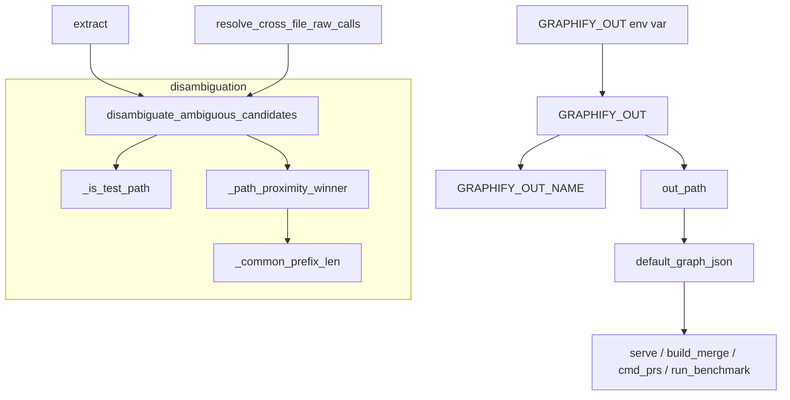

# graphify-paths — where the graph lives and how its edges get disambiguated

## Overview
`graphify.paths` is a small foundational module that carries two concerns the rest of the system leans
on constantly. First, it is the **single source of truth for the output-directory name** — the answer to
"where does the persistent `graph.json` live?" — so a `GRAPHIFY_OUT` override (worktrees, shared output)
is honored everywhere instead of being hardcoded in a dozen modules (#1423). Second, it holds the
**shared cross-file call disambiguator** — the tie-breaker that decides *which* same-named definition a
bare-name call resolves to when the graph's edges are built. The two live together because both are
low-level, dependency-free primitives every layer imports: the location primitive
[`default_graph_json`](../catalog/graphify/paths.md#default_graph_json) and the edge-correctness
primitive [`disambiguate_ambiguous_candidates`](../catalog/graphify/paths.md#disambiguate_ambiguous_candidates).

## Diagram

## Design rationale (why it's built this way)
- **One constant, read once, honored everywhere.** The module docstring is explicit that
  [`GRAPHIFY_OUT`](../catalog/graphify/paths.md#GRAPHIFY_OUT) used to be duplicated as `_GRAPHIFY_OUT` in
  `__main__`, `cache`, and `watch` while `security` and `callflow_html` hardcoded the literal
  `"graphify-out"` and *silently ignored the override*. Centralising it fixes that class of bug: the value
  is read once at import, and [`default_graph_json`](../catalog/graphify/paths.md#default_graph_json) is
  the package-wide fallback used by serve/build/benchmark/prs so every reader resolves the same file.
  [`out_path`](../catalog/graphify/paths.md#out_path) makes this correct for both a relative name and an
  absolute path, and [`GRAPHIFY_OUT_NAME`](../catalog/graphify/paths.md#GRAPHIFY_OUT_NAME) gives the bare
  directory name that path-guards and the detect-scan exclude need so a custom output dir is never
  re-ingested as source.

- **Disambiguation is a shared god-node guard, not per-language code.**
  [`disambiguate_ambiguous_candidates`](../catalog/graphify/paths.md#disambiguate_ambiguous_candidates)
  exists (#1553) so the inline cross-file call pass in `extract.py` and
  [`resolve_cross_file_raw_calls`](../catalog/graphify/symbol_resolution.md#resolve_cross_file_raw_calls)
  use *identical* heuristics across languages. Its contract is conservative by design: it returns a single
  candidate only when exactly one survives the tie-breaks, otherwise `None` — and the caller then keeps
  its god-node guard (skips the edge). This is what stops a bare call to a common name like `run` from
  fanning out into a false high-degree hub connected to every same-named definition in the repo.

- **Test-vs-non-test preference before proximity.** The ordering matters:
  [`disambiguate_ambiguous_candidates`](../catalog/graphify/paths.md#disambiguate_ambiguous_candidates)
  first drops test mocks/stubs when the call site is non-test (and prefers test-local defs when the call
  site *is* a test), then falls back to path proximity. A test double should never masquerade as the real
  callee in production code's call graph — so the classification runs first.

- **Path classification matches segments, never substrings.**
  [`_is_test_path`](../catalog/graphify/paths.md#_is_test_path) checks whole path segments against
  [`_TEST_DIR_SEGMENTS`](../catalog/graphify/paths.md#_TEST_DIR_SEGMENTS) and filenames against
  [`_TEST_FILENAME_PATTERNS`](../catalog/graphify/paths.md#_TEST_FILENAME_PATTERNS), so `latest.py`,
  `src/contest.py`, and `src/greatest/x.py` are *not* misclassified as tests. The docstring calls out this
  conservatism explicitly; it's the difference between a correct filter and one that corrupts edges near
  innocently-named files.

## Entry points
- [`default_graph_json`](../catalog/graphify/paths.md#default_graph_json) — the resolver every read path
  calls when no explicit `--graph` is passed: [`serve`](../catalog/graphify/serve.md#serve) and
  [`serve_http`](../catalog/graphify/serve.md#serve_http) (via [`_main`](../catalog/graphify/serve.md#_main)),
  [`build_merge`](../catalog/graphify/build.md#build_merge), [`cmd_prs`](../catalog/graphify/prs.md#cmd_prs),
  and [`run_benchmark`](../catalog/graphify/benchmark.md#run_benchmark) all bottom out here.
- [`out_path`](../catalog/graphify/paths.md#out_path) — the general "path inside the output dir" helper
  ([`default_graph_json`](../catalog/graphify/paths.md#default_graph_json) is just `out_path("graph.json")`);
  the cache layer ([`cache_dir`](../catalog/graphify/cache.md#cache_dir)) and others build on
  [`GRAPHIFY_OUT`](../catalog/graphify/paths.md#GRAPHIFY_OUT) the same way.
- [`disambiguate_ambiguous_candidates`](../catalog/graphify/paths.md#disambiguate_ambiguous_candidates) —
  invoked during graph *construction*: [`extract`](../catalog/graphify/extract.md#extract)'s cross-file
  pass and [`resolve_cross_file_raw_calls`](../catalog/graphify/symbol_resolution.md#resolve_cross_file_raw_calls)
  call it once per ambiguous bare-name call.
- [`main`](../catalog/graphify/__main__.md#main) / [`_default_graph_path`](../catalog/graphify/__main__.md#_default_graph_path) —
  the CLI reads [`GRAPHIFY_OUT`](../catalog/graphify/paths.md#GRAPHIFY_OUT) to resolve the graph path for
  `path`/`explain`/`query` and for [`uninstall_all`](../catalog/graphify/__main__.md#uninstall_all)'s
  `--purge`.

## Mechanism (step-by-step)
1. **Resolve the output dir at import.** [`GRAPHIFY_OUT`](../catalog/graphify/paths.md#GRAPHIFY_OUT) reads
   the env var once (default `"graphify-out"`), and
   [`GRAPHIFY_OUT_NAME`](../catalog/graphify/paths.md#GRAPHIFY_OUT_NAME) derives the bare basename even when
   the override is an absolute path.
2. **Build a path inside it.** [`out_path`](../catalog/graphify/paths.md#out_path) joins parts under
   [`GRAPHIFY_OUT`](../catalog/graphify/paths.md#GRAPHIFY_OUT), correct for both relative and absolute
   forms; [`default_graph_json`](../catalog/graphify/paths.md#default_graph_json) specialises it to
   `graph.json`.
3. **On an ambiguous call, filter by test/non-test.**
   [`disambiguate_ambiguous_candidates`](../catalog/graphify/paths.md#disambiguate_ambiguous_candidates)
   short-circuits the trivial 0/1-candidate cases, then classifies the call site and each candidate with
   [`_is_test_path`](../catalog/graphify/paths.md#_is_test_path): a non-test call site keeps only non-test
   candidates; a test call site prefers a same-file test def, then any test def, then falls back.
4. **Break remaining ties by proximity.** If more than one candidate survives, it hands them to
   [`_path_proximity_winner`](../catalog/graphify/paths.md#_path_proximity_winner), which prefers the
   candidate in the same file, then same directory, then the strict-unique longest common path prefix
   computed by [`_common_prefix_len`](../catalog/graphify/paths.md#_path_proximity_winner._common_prefix_len).
5. **Return one, or give up.** [`disambiguate_ambiguous_candidates`](../catalog/graphify/paths.md#disambiguate_ambiguous_candidates)
   returns a unique winner; any residual ambiguity yields `None` so the caller's god-node guard holds
   and no spurious edge is added.

## Key data structures
- **[`GRAPHIFY_OUT`](../catalog/graphify/paths.md#GRAPHIFY_OUT) /
  [`GRAPHIFY_OUT_NAME`](../catalog/graphify/paths.md#GRAPHIFY_OUT_NAME)** — the two module-level strings
  that fix the persistent graph's home; read once so setting the env var before process start suffices.
- **`candidate_files` map** — the `{candidate_id -> source_file}` dict
  [`disambiguate_ambiguous_candidates`](../catalog/graphify/paths.md#disambiguate_ambiguous_candidates)
  and [`_path_proximity_winner`](../catalog/graphify/paths.md#_path_proximity_winner) reason over; the sole
  input needed to rank same-named definitions by locality.
- **[`_TEST_DIR_SEGMENTS`](../catalog/graphify/paths.md#_TEST_DIR_SEGMENTS) /
  [`_TEST_FILENAME_PATTERNS`](../catalog/graphify/paths.md#_TEST_FILENAME_PATTERNS)** — the cross-ecosystem
  test-path vocabulary [`_is_test_path`](../catalog/graphify/paths.md#_is_test_path) matches against.

## Dynamics (design intent)
Everything here is deterministic and side-effect-free — pure string/path logic with no I/O — which is why
it can be imported by extraction, serving, caching, and the CLI without ordering hazards. The
disambiguation contract is pinned directly by tests:
[`test_disambiguate_drops_test_candidate_for_nontest_call_site`](../catalog/tests/test_paths.md#test_disambiguate_drops_test_candidate_for_nontest_call_site),
[`test_disambiguate_test_call_site_prefers_test_local`](../catalog/tests/test_paths.md#test_disambiguate_test_call_site_prefers_test_local),
[`test_disambiguate_path_proximity_same_dir`](../catalog/tests/test_paths.md#test_disambiguate_path_proximity_same_dir),
and the "bail" case
[`test_disambiguate_bails_on_two_nontest_candidates`](../catalog/tests/test_paths.md#test_disambiguate_bails_on_two_nontest_candidates)
confirm the module returns `None` rather than guessing when two real candidates remain — the invariant
that keeps the built graph free of fabricated call edges.

## Edge cases
- **Absolute vs relative output dir.** [`out_path`](../catalog/graphify/paths.md#out_path) and
  [`GRAPHIFY_OUT_NAME`](../catalog/graphify/paths.md#GRAPHIFY_OUT_NAME) both handle an absolute
  `GRAPHIFY_OUT` (e.g. `/shared/graphify-out`) so path guards and the detect exclude still work.
- **Innocently test-like names.** [`_is_test_path`](../catalog/graphify/paths.md#_is_test_path) returns
  `False` for `latest.py`/`contest.py`/`greatest/` because it matches segments and filename patterns, not
  substrings.
- **Empty call-site file.** [`_path_proximity_winner`](../catalog/graphify/paths.md#_path_proximity_winner)
  returns `None` when the call site is unknown, so proximity can't invent a winner.
- **Genuinely ambiguous within one file.** If multiple candidates sit in the *same* file as the call site,
  [`_path_proximity_winner`](../catalog/graphify/paths.md#_path_proximity_winner) bails rather than pick
  arbitrarily.

## Open questions
- The catalog resolution of the output dir constants uses `graphify/paths.py` line numbers; the two
  concerns (location vs disambiguation) share this module for import-hygiene reasons but are otherwise
  independent, and this Subgraph doesn't reveal any code linking them beyond co-location.
- [`resolve_cross_file_raw_calls`](../catalog/graphify/symbol_resolution.md#resolve_cross_file_raw_calls)
  is listed as a caller but its surrounding two-pass resolution is out of this packet, so exactly how
  candidate sets are assembled before disambiguation isn't grounded here.

## See also
- [graphify-serve](graphify-serve.md) — resolves its default graph via `default_graph_json`.
- [graphify-export](graphify-export.md) — writes the `graph.json` this module locates.
- [graphify-callflow_html](graphify-callflow_html.md) — resolves paths through `GRAPHIFY_OUT` the same way.
