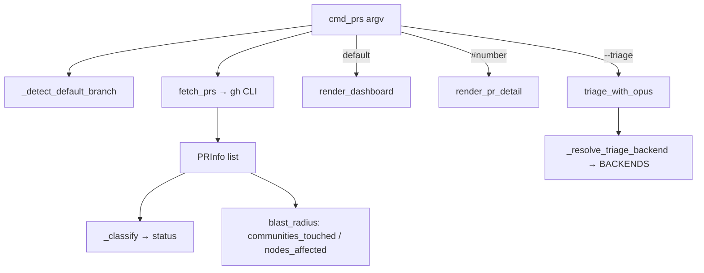

# PR review dashboard & graph-impact triage

`graphify prs` is a terminal PR review queue that overlays *knowledge-graph impact* onto
GitHub's open PRs — this is where the graph feeds back into everyday code review.

## Overview
The subsystem fetches open PRs from the `gh` CLI into a
[`PRInfo`](../catalog/graphify/prs.md#PRInfo) dataclass, classifies each into an actionable
status ([`_classify`](../catalog/graphify/prs.md#_classify)), and renders either a sorted
dashboard ([`render_dashboard`](../catalog/graphify/prs.md#render_dashboard)) or a single-PR
detail view ([`render_pr_detail`](../catalog/graphify/prs.md#render_pr_detail)). The
graphify-specific twist is **blast radius**: when `graph.json` exists, a PR's changed files
are mapped to the communities and nodes they touch, and
[`blast_radius`](../catalog/graphify/prs.md#PRInfo.blast_radius) turns that into a
"N nodes / M communities" impact string that ranks merge risk. An optional
[`triage_with_opus`](../catalog/graphify/prs.md#triage_with_opus) step hands the queue to an
LLM to produce a prioritized action list.

## Diagram

## Entry points
- [`cmd_prs`](../catalog/graphify/prs.md#cmd_prs) — the `graphify prs` verb; parses flags
  (`--triage`, `--base`, `--repo`, a bare `#number`), resolves the base branch, fetches PRs,
  and routes to the dashboard, detail, or triage view.
- [`fetch_prs`](../catalog/graphify/prs.md#fetch_prs) — the data source; shells out to
  `gh pr list --json …` via [`_gh`](../catalog/graphify/prs.md#_gh) and builds
  [`PRInfo`](../catalog/graphify/prs.md#PRInfo) rows. Also called from the MCP server tools
  [`_tool_list_prs`](../catalog/graphify/serve.md#_build_server._tool_list_prs) and
  [`_tool_triage_prs`](../catalog/graphify/serve.md#_build_server._tool_triage_prs).

## Mechanism (step-by-step)
1. **Parse & resolve base.** [`cmd_prs`](../catalog/graphify/prs.md#cmd_prs) reads the argv
   flags and, if no `--base` is given, calls
   [`_detect_default_branch`](../catalog/graphify/prs.md#_detect_default_branch) — which tries
   `gh repo view`, then `git symbolic-ref`, then falls back to `main`.
2. **Fetch.** [`fetch_prs`](../catalog/graphify/prs.md#fetch_prs) requests the open-PR JSON
   through [`_gh`](../catalog/graphify/prs.md#_gh) and constructs one
   [`PRInfo`](../catalog/graphify/prs.md#PRInfo) per PR, parsing the CI rollup with
   [`_parse_ci`](../catalog/graphify/prs.md#_parse_ci) into a single
   [`ci_status`](../catalog/graphify/prs.md#PRInfo.ci_status) (`SUCCESS`/`FAILURE`/`PENDING`/`NONE`)
   and stamping [`expected_base`](../catalog/graphify/prs.md#PRInfo.expected_base) from the
   resolved default branch.
3. **Classify.** Each PR's [`status`](../catalog/graphify/prs.md#PRInfo.status) property calls
   [`_classify`](../catalog/graphify/prs.md#_classify), a priority ladder over
   [`base_branch`](../catalog/graphify/prs.md#PRInfo.base_branch),
   [`ci_status`](../catalog/graphify/prs.md#PRInfo.ci_status),
   [`review_decision`](../catalog/graphify/prs.md#PRInfo.review_decision),
   [`is_draft`](../catalog/graphify/prs.md#PRInfo.is_draft), and
   [`days_old`](../catalog/graphify/prs.md#PRInfo.days_old) (stale past
   [`_STALE_DAYS`](../catalog/graphify/prs.md#_STALE_DAYS)) — yielding `WRONG-BASE`, `CI-FAIL`,
   `CHANGES-REQ`, `DRAFT`, `STALE`, `APPROVED`, `PENDING`, or `READY`.
4. **Compute blast radius.** [`blast_radius`](../catalog/graphify/prs.md#PRInfo.blast_radius)
   reads [`nodes_affected`](../catalog/graphify/prs.md#PRInfo.nodes_affected) and
   [`communities_touched`](../catalog/graphify/prs.md#PRInfo.communities_touched) (populated when
   `graph.json` exists, from a PR's [`files_changed`](../catalog/graphify/prs.md#PRInfo.files_changed))
   and formats "N nodes / M communities" — the graph-derived merge-risk signal.
5. **Render the dashboard.** [`render_dashboard`](../catalog/graphify/prs.md#render_dashboard)
   splits PRs into on-base vs. wrong-base, sorts the actionable set by
   [`_STATUS_ORDER`](../catalog/graphify/prs.md#_STATUS_ORDER) then recency, and prints a table:
   number, a CI glyph from [`_ci_icon`](../catalog/graphify/prs.md#_ci_icon), a colorized status
   from [`_status_color`](../catalog/graphify/prs.md#_status_color), age, and the truncated
   [`blast_radius`](../catalog/graphify/prs.md#PRInfo.blast_radius). Columns are width-aligned with
   [`_pad`](../catalog/graphify/prs.md#_pad) (which strips ANSI for length) and
   [`_truncate`](../catalog/graphify/prs.md#_truncate).
6. **Render detail.** [`render_pr_detail`](../catalog/graphify/prs.md#render_pr_detail) prints one
   PR's [`branch`](../catalog/graphify/prs.md#PRInfo.branch) → base,
   [`author`](../catalog/graphify/prs.md#PRInfo.author), CI, review decision,
   [`worktree_path`](../catalog/graphify/prs.md#PRInfo.worktree_path), and — when present — the
   graph impact plus the first ten [`files_changed`](../catalog/graphify/prs.md#PRInfo.files_changed).
7. **Triage with an LLM.** [`triage_with_opus`](../catalog/graphify/prs.md#triage_with_opus) filters
   to actionable PRs, builds a prompt embedding each PR's status/CI/review/age/blast-radius,
   resolves a backend via [`_resolve_triage_backend`](../catalog/graphify/prs.md#_resolve_triage_backend)
   (env override or first configured key across [`BACKENDS`](../catalog/graphify/llm.md#BACKENDS.BACKENDS)),
   and streams a ranked action list back.

## Key data structures
- **`PRInfo`** — the [`PRInfo`](../catalog/graphify/prs.md#PRInfo) dataclass: GitHub fields
  ([`number`](../catalog/graphify/prs.md#PRInfo.number),
  [`title`](../catalog/graphify/prs.md#PRInfo.title),
  [`branch`](../catalog/graphify/prs.md#PRInfo.branch),
  [`base_branch`](../catalog/graphify/prs.md#PRInfo.base_branch),
  [`author`](../catalog/graphify/prs.md#PRInfo.author),
  [`is_draft`](../catalog/graphify/prs.md#PRInfo.is_draft),
  [`review_decision`](../catalog/graphify/prs.md#PRInfo.review_decision),
  [`ci_status`](../catalog/graphify/prs.md#PRInfo.ci_status),
  [`updated_at`](../catalog/graphify/prs.md#PRInfo.updated_at)) plus derived properties
  ([`status`](../catalog/graphify/prs.md#PRInfo.status),
  [`days_old`](../catalog/graphify/prs.md#PRInfo.days_old),
  [`blast_radius`](../catalog/graphify/prs.md#PRInfo.blast_radius)) and graph-impact fields
  ([`communities_touched`](../catalog/graphify/prs.md#PRInfo.communities_touched),
  [`nodes_affected`](../catalog/graphify/prs.md#PRInfo.nodes_affected),
  [`files_changed`](../catalog/graphify/prs.md#PRInfo.files_changed),
  [`worktree_path`](../catalog/graphify/prs.md#PRInfo.worktree_path)).
- **Status ordering & thresholds** — [`_STATUS_ORDER`](../catalog/graphify/prs.md#_STATUS_ORDER)
  drives dashboard sort priority; [`_STALE_DAYS`](../catalog/graphify/prs.md#_STALE_DAYS) and
  [`_CI_FAILURE_CONCLUSIONS`](../catalog/graphify/prs.md#_CI_FAILURE_CONCLUSIONS) feed
  classification.
- **ANSI color helpers** — [`_c`](../catalog/graphify/prs.md#_c) (gated by
  [`_NO_COLOR`](../catalog/graphify/prs.md#_NO_COLOR)) underpins
  [`red`](../catalog/graphify/prs.md#red), [`green`](../catalog/graphify/prs.md#green),
  [`yellow`](../catalog/graphify/prs.md#yellow), [`cyan`](../catalog/graphify/prs.md#cyan),
  [`bold`](../catalog/graphify/prs.md#bold), [`dim`](../catalog/graphify/prs.md#dim); width math
  uses [`_ANSI_RE`](../catalog/graphify/prs.md#_ANSI_RE).

## Dynamics (design intent)
Rendering is pure terminal output; the only I/O is the `gh`/`git` subprocess calls in
[`_gh`](../catalog/graphify/prs.md#_gh) and
[`_detect_default_branch`](../catalog/graphify/prs.md#_detect_default_branch), each timeout-guarded
and returning a safe fallback on failure. The classification ladder in
[`_classify`](../catalog/graphify/prs.md#_classify) is deterministic and thoroughly unit-tested
(`test_ready`, `test_ci_fail`, `test_changes_req`, `test_draft`, `test_stale`, `test_pending`,
`test_wrong_base` in `tests/test_prs.py`), as is CI parsing
(`test_failure_conclusion`, `test_in_progress_is_pending`, `test_success`). The graph-impact fields
are populated concurrently by the MCP triage tool
[`_tool_triage_prs`](../catalog/graphify/serve.md#_build_server._tool_triage_prs), which fetches PR
diffs in a thread pool and computes impact against the in-memory graph before ranking.

## Edge cases
- **`gh` missing / unauthenticated.** [`_gh`](../catalog/graphify/prs.md#_gh) returns `None` on any
  subprocess or JSON error, and [`fetch_prs`](../catalog/graphify/prs.md#fetch_prs) raises a clear
  "run `gh auth login`" `RuntimeError`.
- **No graph impact.** [`blast_radius`](../catalog/graphify/prs.md#PRInfo.blast_radius) returns an
  empty string when [`nodes_affected`](../catalog/graphify/prs.md#PRInfo.nodes_affected) is zero, so
  the dashboard shows "–" rather than a fake number when no `graph.json` is present.
- **Wrong base is first-class.** A PR whose [`base_branch`](../catalog/graphify/prs.md#PRInfo.base_branch)
  differs from the resolved base is classified `WRONG-BASE` and separated out by
  [`render_dashboard`](../catalog/graphify/prs.md#render_dashboard) rather than mixed into the
  actionable queue.
- **No TTY / `NO_COLOR`.** [`_NO_COLOR`](../catalog/graphify/prs.md#_NO_COLOR) disables ANSI codes so
  piped output stays clean.
- **No triage backend.** [`_resolve_triage_backend`](../catalog/graphify/prs.md#_resolve_triage_backend)
  falls back through a `claude` CLI probe to `ollama` when no API key is set.

## Open questions
- `fetch_worktrees`, `fetch_pr_files`, and `compute_pr_impact` (which actually populate
  [`communities_touched`](../catalog/graphify/prs.md#PRInfo.communities_touched) /
  [`nodes_affected`](../catalog/graphify/prs.md#PRInfo.nodes_affected) from graph.json) are referenced by
  [`cmd_prs`](../catalog/graphify/prs.md#cmd_prs) and
  [`_tool_triage_prs`](../catalog/graphify/serve.md#_build_server._tool_triage_prs) but are outside this
  packet's subgraph, so the exact file→node mapping isn't cited here.
- `_TRIAGE_MODEL_DEFAULTS` ([`_TRIAGE_MODEL_DEFAULTS`](../catalog/graphify/prs.md#_TRIAGE_MODEL_DEFAULTS._TRIAGE_MODEL_DEFAULTS))
  and the per-backend key/model lookups
  ([`_get_backend_api_key`](../catalog/graphify/llm.md#_get_backend_api_key),
  [`_backend_env_keys`](../catalog/graphify/llm.md#_backend_env_keys),
  [`_default_model_for_backend`](../catalog/graphify/llm.md#_default_model_for_backend)) are cited but
  the full `BACKENDS` schema lives in the llm module.

## See also
- graphify-__main__ — the `prs` verb dispatch into
  [`cmd_prs`](../catalog/graphify/prs.md#cmd_prs).
- graphify-watch / graphify-cache — how the `graph.json` that powers blast radius is built and kept
  fresh.
