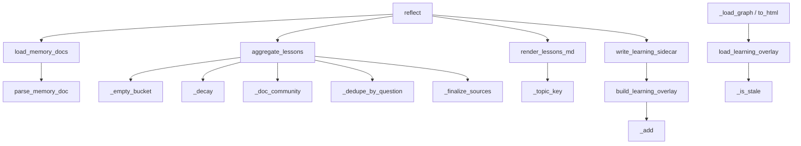

# Reflect — deterministic learning from session memories

## Overview
Reflect is graphify's persistence-across-sessions loop. Each time a query is saved,
a small memory doc records what was asked, which graph nodes it touched, and how it
turned out (`useful`, `dead_end`, `corrected`). [`reflect`](../catalog/graphify/reflect.md#reflect)
folds every such doc into two artefacts: a human-readable **LESSONS.md** and a
machine-readable **learning sidecar** that annotates graph nodes with an
experiential trust signal. The defining design idea is **determinism without an
LLM**: identical `memory/` contents plus the same `now` timestamp produce
byte-identical output, so the learning layer is a pure, reproducible function of the
recorded history — verifiable, diffable, and safe to commit. Evidence is
time-decayed and corroboration-gated, so a single lucky answer can't mint a
"preferred" lesson and a stale win yields to a fresh correction.

## Diagram

## Design rationale (why it's built this way)
**Byte-stability is the headline guarantee.** The author treats reproducibility as
the feature: [`aggregate_lessons`](../catalog/graphify/reflect.md#aggregate_lessons)
takes `now` explicitly so the time-decay is anchored, docs are loaded in a stable
`(date, filename)` order by [`load_memory_docs`](../catalog/graphify/reflect.md#load_memory_docs),
and [`write_learning_sidecar`](../catalog/graphify/reflect.md#write_learning_sidecar)
emits sorted-key JSON. This is what lets the sidecar and LESSONS.md be regenerated
on every run without churning the diff, and it's directly regression-tested.

**Corroboration and decay encode epistemic caution.** A lesson isn't promoted to
`preferred` on a single save — [`_finalize_sources`](../catalog/graphify/reflect.md#_finalize_sources)
requires at least `min_corroboration` *distinct* positive results, and a node that
has both positive and negative results is filed as `contested` with a verdict rather
than being silently averaged away. [`_decay`](../catalog/graphify/reflect.md#_decay)
halves a signal's weight every `half_life_days`, so recency can flip a contested
verdict. The rendered header explicitly nudges the reader to *verify before relying*,
not to trust blindly.

**Nodes that no longer exist are dropped, not surfaced.** Because code moves, a
lesson pinned to a node that has left the graph is worse than useless.
[`reflect`](../catalog/graphify/reflect.md#reflect) passes a `known_nodes` set so
[`aggregate_lessons`](../catalog/graphify/reflect.md#aggregate_lessons) can gate out
vanished nodes, and the loader recomputes staleness against a code fingerprint so a
lesson about *changed* code is flagged for re-verification rather than trusted.

**The output must never feed itself.** LESSONS.md has no frontmatter, so
[`parse_memory_doc`](../catalog/graphify/reflect.md#parse_memory_doc) rejects it and
[`load_memory_docs`](../catalog/graphify/reflect.md#load_memory_docs) skips it even
if it lands inside `memory/` — a deliberate guard against a feedback loop.

## Entry points
- [`reflect`](../catalog/graphify/reflect.md#reflect) — the orchestrator: scan a
  memory dir, aggregate, write LESSONS.md, and (when a graph is supplied) project
  the sidecar. Returns `(path, aggregate)`.
- [`main`](../catalog/graphify/__main__.md#main) — the CLI `reflect` command wires
  the memory dir under [`GRAPHIFY_OUT`](../catalog/graphify/paths.md#GRAPHIFY_OUT) to
  [`reflect`](../catalog/graphify/reflect.md#reflect), and the query/report paths
  read the overlay back via [`load_learning_overlay`](../catalog/graphify/reflect.md#load_learning_overlay)
  and [`load_learning_for_report`](../catalog/graphify/report.md#load_learning_for_report).
- [`load_learning_overlay`](../catalog/graphify/reflect.md#load_learning_overlay) —
  the read-side entry: consumers ([`_load_graph`](../catalog/graphify/serve.md#_load_graph),
  [`to_html`](../catalog/graphify/export.md#to_html)) call it to annotate node output
  with the learned status and a freshly recomputed `stale` flag.

## Mechanism (step-by-step)
1. **Load and parse memory docs.** [`load_memory_docs`](../catalog/graphify/reflect.md#load_memory_docs)
   globs `*.md` under the memory dir, runs each through
   [`parse_memory_doc`](../catalog/graphify/reflect.md#parse_memory_doc) (which reads
   only frontmatter — `type`, `date`, `question`, `outcome`, `correction`,
   `source_nodes` — and returns `None` for docs without it), and sorts the survivors
   deterministically by `(date, filename)`.

2. **Resolve the graph context (optional).** When [`reflect`](../catalog/graphify/reflect.md#reflect)
   is given a graph path, it loads a `node → community` map and a `known_nodes` set
   from the sibling analysis/labels files, so lessons can be grouped by topic and
   stale nodes gated out. Without a graph, aggregation still runs but stays a single
   flat section.

3. **Aggregate into a lessons structure.** [`aggregate_lessons`](../catalog/graphify/reflect.md#aggregate_lessons)
   walks the docs, mapping each `outcome` to a sign against the recognised
   [`OUTCOMES`](../catalog/graphify/ingest.md#OUTCOMES) tuple, weighting it by
   [`_decay`](../catalog/graphify/reflect.md#_decay), and accumulating per-node signed
   scores and positive/negative counts into buckets built by
   [`_empty_bucket`](../catalog/graphify/reflect.md#_empty_bucket). It also files
   dead-ends and corrections per bucket for the narrative sections.

4. **Assign each doc to a topic.** [`_doc_community`](../catalog/graphify/reflect.md#_doc_community)
   picks the plurality community of a doc's source nodes (ties broken to the
   lexicographically-smallest label for determinism); docs with no resolvable
   community fall into an Uncategorized bucket. This is what turns a flat lesson list
   into "By topic" sections.

5. **Split nodes into trust buckets.** [`_finalize_sources`](../catalog/graphify/reflect.md#_finalize_sources)
   classifies each scored node: positive-and-negative → `contested` (with a
   useful/dead-end/even verdict), positive-only with enough corroboration →
   `preferred`, otherwise → `tentative`. Repeated dead-end/correction questions are
   collapsed by [`_dedupe_by_question`](../catalog/graphify/reflect.md#_dedupe_by_question)
   so saving the same Q&A twice doesn't duplicate lines.

6. **Render deterministic markdown.** [`render_lessons_md`](../catalog/graphify/reflect.md#render_lessons_md)
   emits the LESSONS.md body — a cautious header, a summary count line, the flat
   lessons, then "By topic" sections ordered by [`_topic_key`](../catalog/graphify/reflect.md#render_lessons_md._topic_key)
   (alphabetical, Uncategorized last), ending in a single trailing
   newline so re-runs are byte-identical.

7. **Project the graph sidecar.** When a graph is present,
   [`write_learning_sidecar`](../catalog/graphify/reflect.md#write_learning_sidecar)
   calls [`build_learning_overlay`](../catalog/graphify/reflect.md#build_learning_overlay),
   whose inner [`_add`](../catalog/graphify/reflect.md#build_learning_overlay._add)
   resolves each cited node to a single canonical id (skipping ambiguous or vanished
   citations), records its status/score/provenance and a `code_fingerprint`, and
   writes `{version, generated_at, nodes}` keyed by canonical id under
   [`LEARNING_SIDECAR_NAME`](../catalog/graphify/reflect.md#LEARNING_SIDECAR_NAME).
   A sidecar failure is swallowed so it can never break LESSONS.md.

8. **Read the overlay back with fresh staleness.** [`load_learning_overlay`](../catalog/graphify/reflect.md#load_learning_overlay)
   loads the sidecar and, per node, recomputes [`_is_stale`](../catalog/graphify/reflect.md#_is_stale)
   by re-hashing the source file against the stored fingerprint — a changed or
   vanished file over-flags as stale (the safe direction). [`_load_graph`](../catalog/graphify/serve.md#_load_graph)
   attaches this overlay to the graph so query/MCP output can annotate node lines
   display-only, and [`to_html`](../catalog/graphify/export.md#to_html) can style the
   visualisation with it.

## Key data structures
- **The aggregate** — `{total, counts, min_corroboration, preferred, tentative,
  contested, dead_ends, corrections, by_community}` returned by
  [`aggregate_lessons`](../catalog/graphify/reflect.md#aggregate_lessons); the public
  shape both the renderer and the overlay builder read.
- **The bucket** — from [`_empty_bucket`](../catalog/graphify/reflect.md#_empty_bucket):
  per-node signed score, positive/negative counters, last-seen date, and a private
  provenance trail of `(date, question, outcome)` for `useful`/`corrected` events.
- **The sidecar** — `{version, generated_at, nodes: {canonical_id → entry}}` written
  under [`LEARNING_SIDECAR_NAME`](../catalog/graphify/reflect.md#LEARNING_SIDECAR_NAME),
  each entry carrying status, score, uses, `code_fingerprint`, provenance, and (for
  contested) a verdict.

## Dynamics (design intent)
Determinism is asserted directly:
[`test_render_byte_stable_across_independent_aggregations`](../catalog/tests/test_reflect.md#test_render_byte_stable_across_independent_aggregations)
and [`test_sidecar_is_byte_identical_across_runs`](../catalog/tests/test_reflect.md#test_sidecar_is_byte_identical_across_runs)
guarantee reproducibility; [`test_half_life_actually_feeds_decay`](../catalog/tests/test_reflect.md#test_half_life_actually_feeds_decay)
and [`test_recency_decides_contested_verdict`](../catalog/tests/test_reflect.md#test_recency_decides_contested_verdict)
show recency overriding stale evidence; and the end-to-end
[`test_second_session_benefits_from_the_first`](../catalog/tests/test_reflect.md#test_second_session_benefits_from_the_first)
demonstrates the whole point — session 2 reads back session 1's win and dead end.
Corroboration counting is per-*doc*, not per-citation
([`test_corroboration_counts_distinct_docs_not_citations`](../catalog/tests/test_reflect.md#test_corroboration_counts_distinct_docs_not_citations)),
and `min_corroboration` is a real parameter, not hardcoded
([`test_min_corroboration_is_honored_not_hardcoded`](../catalog/tests/test_reflect.md#test_min_corroboration_is_honored_not_hardcoded)).

## Edge cases
- **Empty memory.** [`aggregate_lessons`](../catalog/graphify/reflect.md#aggregate_lessons)
  + [`render_lessons_md`](../catalog/graphify/reflect.md#render_lessons_md) produce a
  graceful, valid doc — [`test_render_empty_memory_is_graceful`](../catalog/tests/test_reflect.md#test_render_empty_memory_is_graceful).
- **Ambiguous/vanished citation.** [`build_learning_overlay`](../catalog/graphify/reflect.md#build_learning_overlay)
  skips a label that maps to >1 node or is absent from the graph —
  [`test_ambiguous_or_unresolved_citation_is_skipped`](../catalog/tests/test_reflect.md#test_ambiguous_or_unresolved_citation_is_skipped).
- **Changed source file.** [`load_learning_overlay`](../catalog/graphify/reflect.md#load_learning_overlay)
  marks the entry stale via [`_is_stale`](../catalog/graphify/reflect.md#_is_stale) —
  [`test_loader_marks_entry_stale_when_source_file_changes`](../catalog/tests/test_reflect.md#test_loader_marks_entry_stale_when_source_file_changes).
- **Non-positive half-life.** Disables decay entirely (full weight) —
  [`test_nonpositive_half_life_disables_decay`](../catalog/tests/test_reflect.md#test_nonpositive_half_life_disables_decay).
- **Relative source paths / flat layout.** Staleness resolution handles a
  `graphify-out/` layout and a `.graphify_root` marker without spurious staleness —
  [`test_relative_source_file_not_spuriously_stale_in_graphify_out_layout`](../catalog/tests/test_reflect.md#test_relative_source_file_not_spuriously_stale_in_graphify_out_layout).

## Open questions
- The per-node score accumulation and provenance recording happen in an internal
  helper (`_record_node`) not in this packet's subgraph, so its exact signed-weight
  bookkeeping is described here from the body of
  [`aggregate_lessons`](../catalog/graphify/reflect.md#aggregate_lessons) rather than
  cited directly.
- The canonical-id resolution and code-fingerprint helpers behind
  [`build_learning_overlay`](../catalog/graphify/reflect.md#build_learning_overlay)
  (`_resolve_canonical_id`, `_code_fingerprint`) are outside the subgraph.

## See also
- [graphify-analyze](graphify-analyze.md) — supplies the community map that groups
  lessons by topic.
- [graphify-llm](graphify-llm.md) — builds the graph whose nodes lessons are pinned
  to.
- [graphify-security](graphify-security.md) — the size-cap guard on the graph loads
  this layer depends on.
