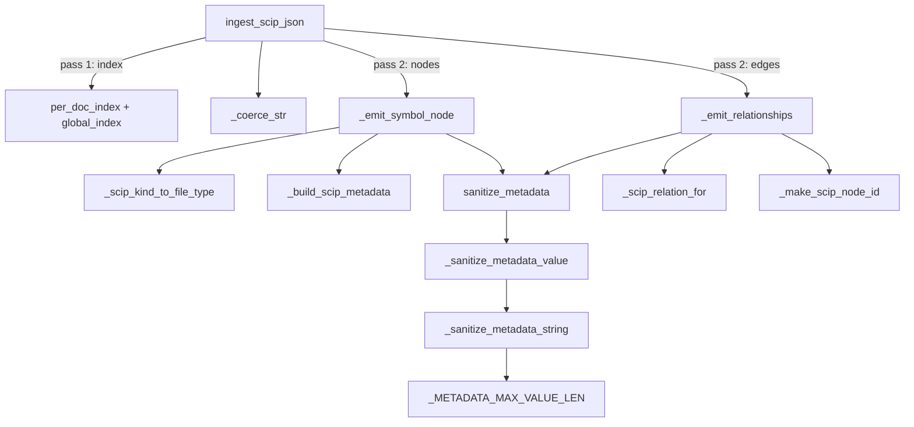

# SCIP ingest — a dormant, un-wired pseudo-SCIP skeleton

## Overview
`graphify.scip_ingest` is a **dormant, un-wired skeleton — not an active part of graphify's
pipeline.** Its own module docstring is explicit
([`scip_ingest.py:1`](../../../../raw/code/graphify/graphify/scip_ingest.py#L1)): it is a
*"simplified subset"* that is *"NOT a full SCIP protobuf implementation"* and is *"Not wired to the
CLI in this phase."* It reads a **simplified, LLM-generated SCIP-*style* JSON shape** — explicitly
*not* the output of a real indexer like scip-python — and would convert each symbol into a graph node
and each relationship into an edge via
[`ingest_scip_json`](../catalog/graphify/scip_ingest.md#ingest_scip_json). In this repo at commit
`983da3c`, no production code path calls it: the only reference to `ingest_scip_json` anywhere is
`tests/test_scip_ingest.py`, and SCIP appears **nowhere** in graphify's README, ARCHITECTURE, or docs.

> [!important]
> **graphify does not ground on SCIP.** Its actual code grounding is the deterministic AST extractors
> ([graphify-extract](graphify-extract.md), [graphify-extractors-base](graphify-extractors-base.md)),
> with non-code inputs routed to an LLM extractor. This module is an *aspirational* lane for a future
> where graphify could fold real SCIP output into the same node/edge schema — it is not that today.
> Unlike [wikify-repo](../../wikify-repo/concepts/wikify-scip_index.md), graphify has **no** real SCIP
> grounding.

When it *is* invoked (only by its unit test), its one design idea is a **two-pass, document-aware
resolution**: pass one builds a `symbol → node_id` index across every document, pass two emits nodes
and then relationship edges whose targets are resolved through that index — falling back to a stub
node so **an edge never dangles**. Because the input is treated as untrusted, defensive coercion and
metadata sanitization run throughout.

## Diagram

## Design rationale (why it's built this way)
The two-pass design is spelled out in the
[`ingest_scip_json`](../catalog/graphify/scip_ingest.md#ingest_scip_json) docstring: *"1. Build a
symbol_str → node_id index across every valid symbol in every valid document … 2. Emit nodes … and
then emit relationship edges. Relationship targets are resolved via the index when present; otherwise
a stub scip_external node is added so edges never dangle."* You can't resolve a cross-file
relationship on first sight of a symbol, so the index must be complete before edges are drawn — the
same reason the tree-sitter path has a second resolution pass.

The subtlety is **document-aware resolution**. The
[`_emit_relationships`](../catalog/graphify/scip_ingest.md#_emit_relationships) docstring gives the
priority: same-document match first (so a duplicate local symbol name routes to *this* file's
symbol), then a *unique* cross-document match, then a stub — and it explicitly *"refus[es] to guess
silently"* when a target is ambiguous across documents. This is why two indices exist: a per-doc map
for precedence and a global map used only when unambiguous.

The third theme is **treating the input as hostile**. The `doc: object` (not `dict`) signature is
deliberate — the docstring notes SCIP documents *"come from external tools — we may be handed
arbitrary deserialized JSON"* — so [`_coerce_str`](../catalog/graphify/scip_ingest.md#_coerce_str)
guards every string field and [`sanitize_metadata`](../catalog/graphify/security.md#sanitize_metadata)
strips control characters and HTML-escapes descriptions before they reach a node.

## Entry points
- [`ingest_scip_json`](../catalog/graphify/scip_ingest.md#ingest_scip_json) — the sole public entry;
  given a deserialized SCIP document, returns `{"nodes": [...], "edges": [...]}`. The whole
  `test_scip_ingest` suite (e.g.
  [`test_ingest_single_symbol_no_relationships`](../catalog/tests/test_scip_ingest.md#test_ingest_single_symbol_no_relationships),
  [`test_relationship_edges_survive_validate_extraction_and_build`](../catalog/tests/test_scip_ingest.md#test_relationship_edges_survive_validate_extraction_and_build))
  drives it.

## Mechanism (step-by-step)
1. **Guard the input.** [`ingest_scip_json`](../catalog/graphify/scip_ingest.md#ingest_scip_json)
   returns empty node/edge lists if `doc` is not a dict or `documents` is not a list — asserted by
   [`test_ingest_non_dict_input_returns_empty`](../catalog/tests/test_scip_ingest.md#test_ingest_non_dict_input_returns_empty)
   and
   [`test_ingest_documents_not_a_list_is_skipped`](../catalog/tests/test_scip_ingest.md#test_ingest_documents_not_a_list_is_skipped).

2. **Pass 1 — build the symbol indices.** For each document it derives the path with
   [`_coerce_str`](../catalog/graphify/scip_ingest.md#_coerce_str)
   (a document's `relative_path` overriding the `source_file` parameter, per
   [`test_ingest_document_relative_path_overrides_source_file_param`](../catalog/tests/test_scip_ingest.md#test_ingest_document_relative_path_overrides_source_file_param)),
   then for each symbol mints a node id with
   [`_make_scip_node_id`](../catalog/graphify/scip_ingest.md#_make_scip_node_id) and records it in
   both a per-document index and a global index. Non-dict documents/symbols are silently skipped
   (e.g. [`test_ingest_symbol_item_not_a_dict_is_skipped`](../catalog/tests/test_scip_ingest.md#test_ingest_symbol_item_not_a_dict_is_skipped)).

3. **Pass 2a — emit one node per symbol.**
   [`_emit_symbol_node`](../catalog/graphify/scip_ingest.md#_emit_symbol_node) *"Append[s] the
   canonical node for a SCIP symbol record"*: it derives a non-empty label (display name or the
   `#`-suffix), sets `file_type` via
   [`_scip_kind_to_file_type`](../catalog/graphify/scip_ingest.md#_scip_kind_to_file_type), builds
   metadata with [`_build_scip_metadata`](../catalog/graphify/scip_ingest.md#_build_scip_metadata)
   (carrying `scip_symbol`, `scip_kind`, and an optional `scip_description`), and passes it through
   [`sanitize_metadata`](../catalog/graphify/security.md#sanitize_metadata). Duplicate node ids are
   dropped via a `seen_node_ids` set.

4. **Pass 2b — emit relationship edges.**
   [`_emit_relationships`](../catalog/graphify/scip_ingest.md#_emit_relationships) walks each
   symbol's `relationships`, picks the Graphify relation tag with
   [`_scip_relation_for`](../catalog/graphify/scip_ingest.md#_scip_relation_for), and resolves the
   target id against the per-doc then global index. When the target is unknown or ambiguous it mints a
   stub with [`_make_scip_node_id`](../catalog/graphify/scip_ingest.md#_make_scip_node_id) and adds an
   external node so the edge is anchored. Duplicate edges collapse via a `seen_edges` set
   ([`test_ingest_duplicate_edges_are_deduplicated`](../catalog/tests/test_scip_ingest.md#test_ingest_duplicate_edges_are_deduplicated)).

5. **Map SCIP flags to relation tags.**
   [`_scip_relation_for`](../catalog/graphify/scip_ingest.md#_scip_relation_for) picks the tag by
   priority — implementation > type-definition > definition > reference, defaulting to `scip_ref`.
   The mapping is nailed down by
   [`test_ingest_is_implementation_emits_scip_impl_edge`](../catalog/tests/test_scip_ingest.md#test_ingest_is_implementation_emits_scip_impl_edge),
   [`test_ingest_is_type_definition_emits_scip_typed_edge`](../catalog/tests/test_scip_ingest.md#test_ingest_is_type_definition_emits_scip_typed_edge),
   [`test_ingest_is_definition_emits_scip_def_edge`](../catalog/tests/test_scip_ingest.md#test_ingest_is_definition_emits_scip_def_edge),
   [`test_ingest_relationship_priority_order`](../catalog/tests/test_scip_ingest.md#test_ingest_relationship_priority_order),
   and
   [`test_ingest_relationship_no_boolean_flags_defaults_to_ref`](../catalog/tests/test_scip_ingest.md#test_ingest_relationship_no_boolean_flags_defaults_to_ref).

6. **Sanitize every value.**
   [`sanitize_metadata`](../catalog/graphify/security.md#sanitize_metadata) recurses through nested
   values with [`_sanitize_metadata_value`](../catalog/graphify/security.md#_sanitize_metadata_value)
   and normalizes each string with
   [`_sanitize_metadata_string`](../catalog/graphify/security.md#_sanitize_metadata_string) —
   stripping control chars, HTML-escaping, and truncating at
   [`_METADATA_MAX_VALUE_LEN`](../catalog/graphify/security.md#_METADATA_MAX_VALUE_LEN). Verified by
   [`test_ingest_node_metadata_control_chars_stripped`](../catalog/tests/test_scip_ingest.md#test_ingest_node_metadata_control_chars_stripped)
   and
   [`test_ingest_node_metadata_html_escaped`](../catalog/tests/test_scip_ingest.md#test_ingest_node_metadata_html_escaped).

## Key data structures
- **`per_doc_index: (symbol_id, doc_path) → node_id`** and **`global_index: symbol_id → list[node_id]`**
  — the two resolution maps built in pass one and consumed by
  [`_emit_relationships`](../catalog/graphify/scip_ingest.md#_emit_relationships); the per-doc map
  gives same-file precedence, the global map is used only when the match is unique.
- **The node dict** — `id`, `label`, `file_type`, `source_file`, `source_location`, and sanitized
  `metadata`, assembled by
  [`_emit_symbol_node`](../catalog/graphify/scip_ingest.md#_emit_symbol_node). `file_type` is always
  `"code"` — [`_scip_kind_to_file_type`](../catalog/graphify/scip_ingest.md#_scip_kind_to_file_type)
  keeps the SCIP `kind` in metadata instead of routing on it.
- **The edge dict** — carries `relation` (from
  [`_scip_relation_for`](../catalog/graphify/scip_ingest.md#_scip_relation_for)), `confidence`
  `"EXTRACTED"`, `context` `"scip"`, and a sanitized `scip_relationship` metadata blob, per
  [`test_ingest_edge_structure_complete`](../catalog/tests/test_scip_ingest.md#test_ingest_edge_structure_complete).
- **The node id** — [`_make_scip_node_id`](../catalog/graphify/scip_ingest.md#_make_scip_node_id)
  hashes `source_file:symbol` (SHA-1 truncated to 12 hex chars) and prefixes a slugified suffix; its
  docstring calls the hash *"an identifier, not a security boundary."*

## Dynamics (design intent)
Determinism and interoperability are asserted by tests, not observed at runtime:
[`test_ingest_node_id_is_deterministic`](../catalog/tests/test_scip_ingest.md#test_ingest_node_id_is_deterministic)
pins that the same input yields the same id;
[`test_ingest_node_id_differs_by_source_file`](../catalog/tests/test_scip_ingest.md#test_ingest_node_id_differs_by_source_file)
pins that the same symbol in different files gets different ids; and
[`test_relationship_edges_survive_validate_extraction_and_build`](../catalog/tests/test_scip_ingest.md#test_relationship_edges_survive_validate_extraction_and_build)
confirms the output passes graphify's `validate_extraction` and that
`build_from_json` keeps the edges — i.e. SCIP ingest produces the *same* extraction schema the
tree-sitter path does, so the two lanes feed one graph.

## Edge cases
- **Unresolvable / ambiguous target** — a stub `scip_external` node is emitted so the edge is
  anchored;
  [`test_ambiguous_duplicate_target_across_docs_creates_stub`](../catalog/tests/test_scip_ingest.md#test_ambiguous_duplicate_target_across_docs_creates_stub)
  covers the ambiguous case, and
  [`test_duplicate_local_symbol_resolves_to_same_document`](../catalog/tests/test_scip_ingest.md#test_duplicate_local_symbol_resolves_to_same_document)
  covers same-doc precedence.
- **Relationship with no target symbol** — skipped
  ([`test_ingest_relationship_without_target_symbol_is_skipped`](../catalog/tests/test_scip_ingest.md#test_ingest_relationship_without_target_symbol_is_skipped)).
- **Symbol ending in `#` with no display name** — still gets a non-empty label
  ([`test_ingest_symbol_trailing_hash_no_display_name_has_non_empty_label`](../catalog/tests/test_scip_ingest.md#test_ingest_symbol_trailing_hash_no_display_name_has_non_empty_label)).
- **Zero source line** — edge `source_location` becomes an empty string
  ([`test_ingest_edge_with_zero_sourceline_has_empty_location`](../catalog/tests/test_scip_ingest.md#test_ingest_edge_with_zero_sourceline_has_empty_location)).
- **Missing `documents` key / empty list** — returns empty results
  ([`test_ingest_dict_without_documents_key`](../catalog/tests/test_scip_ingest.md#test_ingest_dict_without_documents_key),
  [`test_ingest_documents_empty_list`](../catalog/tests/test_scip_ingest.md#test_ingest_documents_empty_list)).
- **Non-string documentation entry** — yields an empty description rather than crashing
  ([`test_documentation_with_non_string_entries_is_ignored`](../catalog/tests/test_scip_ingest.md#test_documentation_with_non_string_entries_is_ignored)).

## Open questions
- The actual target-resolution helper and the first-occurrence line extractor used inside
  [`_emit_relationships`](../catalog/graphify/scip_ingest.md#_emit_relationships) (called
  `_resolve_relationship_target` and `_first_occurrence_line` in the source I read) are **not** in
  this packet's Subgraph, so the precise same-doc/global fallback logic is described from source and
  tests only, not a citable symbol.
- How this lane is invoked from the CLI (whether an `ingest` subcommand routes SCIP JSON here) is not
  established by the Subgraph.

## See also
- [`graphify-extract`](graphify-extract.md) — the tree-sitter code lane producing the same schema.
- [`graphify-extractors-base`](graphify-extractors-base.md) — the file-stem id scheme this lane's
  hash-based ids deliberately differ from.
- [`graphify-detect`](graphify-detect.md) — classification that decides which lane a file takes.
