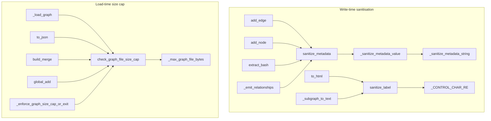

# Security — the write-time sanitisation and load-time size cap

## Overview
graphify ingests arbitrary, untrusted repositories and then renders the result as
JSON, interactive HTML, and an MCP read surface — so a hostile source file could try
to smuggle control characters, HTML, or a multi-gigabyte payload into the graph.
This module is the thin, centralised guard against that. It provides exactly two
defences, applied at every boundary: **write-time sanitisation** — every label and
metadata value is stripped of control chars and length-capped (and metadata strings
are *additionally* HTML-escaped; labels are deliberately not — see rationale) before
it enters `graph.json` or a rendered page ([`sanitize_label`](../catalog/graphify/security.md#sanitize_label),
[`sanitize_metadata`](../catalog/graphify/security.md#sanitize_metadata)) — and
**load-time size capping** — every `graph.json` read is size-checked before parsing
to prevent a memory bomb ([`check_graph_file_size_cap`](../catalog/graphify/security.md#check_graph_file_size_cap)).
The design idea is *one small trusted core, called consistently* rather than
scattered ad-hoc escaping.

## Diagram

## Design rationale (why it's built this way)
**Sanitise once, at the choke points, not everywhere.** Node labels are constrained
enough that [`sanitize_label`](../catalog/graphify/security.md#sanitize_label) only
strips control characters (via [`_CONTROL_CHAR_RE`](../catalog/graphify/security.md#_CONTROL_CHAR_RE))
and caps at [`_MAX_LABEL_LEN`](../catalog/graphify/security.md#_MAX_LABEL_LEN); it
deliberately does *not* HTML-escape, because its docstring notes the output is safe
inside JSON `<script>` blocks and the HTML renderer escapes at the point of direct
injection. Metadata is richer — nested dicts, lists, source snippets, docstrings — so
[`sanitize_metadata`](../catalog/graphify/security.md#sanitize_metadata) is the
heavier hammer: it strips control chars, HTML-escapes strings, caps string length and
list length, and drops entries whose key sanitises to empty.

**Recurse, but preserve JSON types.** [`_sanitize_metadata_value`](../catalog/graphify/security.md#_sanitize_metadata_value)
recurses into dicts and lists while keeping simple JSON-compatible types intact. A
subtle-but-important detail: it checks `bool` *before* `int`, because `bool` is an
`int` subclass in Python and would otherwise be coerced to `0/1` — a correctness bug
the tests guard explicitly. Lists are truncated to
[`_METADATA_MAX_LIST_ITEMS`](../catalog/graphify/security.md#_METADATA_MAX_LIST_ITEMS)
and strings to [`_METADATA_MAX_VALUE_LEN`](../catalog/graphify/security.md#_METADATA_MAX_VALUE_LEN)
so a pathological metadata blob can't bloat the graph.

**Fail fast before reading, resolve the cap at call time.**
[`check_graph_file_size_cap`](../catalog/graphify/security.md#check_graph_file_size_cap)
`stat()`s the file and raises before a multi-GiB `graph.json` is ever read into
memory and JSON-parsed. The cap is resolved on *every* call through
[`_max_graph_file_bytes`](../catalog/graphify/security.md#_max_graph_file_bytes)
(default [`_MAX_GRAPH_FILE_BYTES`](../catalog/graphify/security.md#_MAX_GRAPH_FILE_BYTES),
512 MiB) so the `GRAPHIFY_MAX_GRAPH_BYTES` env var can override it without editing
source, and it silently returns when `stat()` fails so the caller's own existence
check surfaces a clearer error.

## Entry points
- [`main`](../catalog/graphify/__main__.md#main) — the CLI reaches the guards on
  nearly every command: it calls [`check_graph_file_size_cap`](../catalog/graphify/security.md#check_graph_file_size_cap)
  and [`sanitize_label`](../catalog/graphify/security.md#sanitize_label) directly and
  drives exports/merges that call them internally.
- [`add_edge`](../catalog/graphify/extract.md#_extract_generic.add_edge) and
  [`add_node`](../catalog/graphify/extract.md#_extract_generic.add_node) — the inner
  helpers of the AST extractor: every node/edge with metadata passes it through
  [`sanitize_metadata`](../catalog/graphify/security.md#sanitize_metadata) at the
  moment it is created, so untrusted content is cleaned at the source.
- [`to_json`](../catalog/graphify/export.md#to_json) and
  [`to_html`](../catalog/graphify/export.md#to_html) — the export choke points:
  `to_json` size-caps before writing, `to_html` sanitises every label it embeds in
  the vis.js page.
- [`_load_graph`](../catalog/graphify/serve.md#_load_graph) — the MCP server's graph
  loader, and the many sibling loaders (below) that all funnel through the size cap.

## Mechanism (step-by-step)
1. **Cap the file before parsing.** Every entry that reads a graph JSON first calls
   [`check_graph_file_size_cap`](../catalog/graphify/security.md#check_graph_file_size_cap),
   which compares `stat().st_size` to the value from
   [`_max_graph_file_bytes`](../catalog/graphify/security.md#_max_graph_file_bytes)
   and raises a `ValueError` naming the observed size, the cap, and how to raise it.
   This runs in [`_load_graph`](../catalog/graphify/serve.md#_load_graph),
   [`load_graph`](../catalog/graphify/callflow_html.md#load_graph),
   [`_read_json_file`](../catalog/graphify/diagnostics.md#_read_json_file),
   [`_load_graph_json`](../catalog/graphify/prs.md#_load_graph_json),
   [`_load_global_graph`](../catalog/graphify/global_graph.md#_load_global_graph),
   [`run_benchmark`](../catalog/graphify/benchmark.md#run_benchmark), and
   [`write_tree_html`](../catalog/graphify/tree_html.md#write_tree_html) — one guard,
   uniformly applied at every read.

2. **Cap on the CLI hot path with exit semantics.** [`_enforce_graph_size_cap_or_exit`](../catalog/graphify/__main__.md#_enforce_graph_size_cap_or_exit)
   wraps [`check_graph_file_size_cap`](../catalog/graphify/security.md#check_graph_file_size_cap)
   in the CLI's exit-on-fail flavour, rejecting an oversized graph before any command
   parses it.

3. **Cap on write and merge too.** The cap is not only a read guard: [`to_json`](../catalog/graphify/export.md#to_json)
   checks it before overwriting an existing graph, and the merge/reconcile paths
   [`build_merge`](../catalog/graphify/build.md#build_merge),
   [`_reconcile_existing_graph`](../catalog/graphify/watch.md#_reconcile_existing_graph)
   (reached from [`_rebuild_code`](../catalog/graphify/watch.md#_rebuild_code)) and
   the cross-project [`global_add`](../catalog/graphify/global_graph.md#global_add)
   all size-check the source graph before loading it into memory.

4. **Sanitise metadata at extraction.** As the AST extractor builds nodes and edges,
   [`add_node`](../catalog/graphify/extract.md#_extract_generic.add_node) and
   [`add_edge`](../catalog/graphify/extract.md#_extract_generic.add_edge) run any
   attached metadata through [`sanitize_metadata`](../catalog/graphify/security.md#sanitize_metadata).
   The same call is made from language-specific extractors like
   [`extract_bash`](../catalog/graphify/extract.md#extract_bash) (whose local
   [`add_node`](../catalog/graphify/extract.md#extract_bash.add_node) sanitises the
   `{language, kind}` metadata) and [`_import_csharp`](../catalog/graphify/extract.md#_import_csharp),
   and from the external-index ingesters [`_emit_relationships`](../catalog/graphify/scip_ingest.md#_emit_relationships),
   [`_emit_symbol_node`](../catalog/graphify/scip_ingest.md#_emit_symbol_node), and
   [`resolve_python_import_guided_calls`](../catalog/graphify/symbol_resolution.md#resolve_python_import_guided_calls).

5. **Sanitise recursively, preserving types.** [`sanitize_metadata`](../catalog/graphify/security.md#sanitize_metadata)
   cleans each key with [`_sanitize_metadata_string`](../catalog/graphify/security.md#_sanitize_metadata_string)
   (dropping keys that empty out) and each value with
   [`_sanitize_metadata_value`](../catalog/graphify/security.md#_sanitize_metadata_value),
   which returns `bool` unchanged (checked before `int`), recurses into dicts (back
   through `sanitize_metadata`) and lists (capped at
   [`_METADATA_MAX_LIST_ITEMS`](../catalog/graphify/security.md#_METADATA_MAX_LIST_ITEMS)),
   keeps numbers and `None`, and coerces anything else to a sanitised string.

6. **Sanitise labels at render.** Everything user-facing that embeds a label routes
   through [`sanitize_label`](../catalog/graphify/security.md#sanitize_label): the
   HTML export [`to_html`](../catalog/graphify/export.md#to_html), the text-budgeted
   subgraph renderer [`_subgraph_to_text`](../catalog/graphify/serve.md#_subgraph_to_text),
   the community header [`_community_header`](../catalog/graphify/serve.md#_community_header),
   the MCP tools [`_tool_get_node`](../catalog/graphify/serve.md#_build_server._tool_get_node),
   [`_tool_get_neighbors`](../catalog/graphify/serve.md#_build_server._tool_get_neighbors)
   and [`_tool_get_community`](../catalog/graphify/serve.md#_build_server._tool_get_community),
   and the MCP ingest node builder [`_add_node`](../catalog/graphify/mcp_ingest.md#_add_node).
   The single [`_CONTROL_CHAR_RE`](../catalog/graphify/security.md#_CONTROL_CHAR_RE)
   backs both label and metadata cleaning.

## Key data structures
- **The regex and caps** — [`_CONTROL_CHAR_RE`](../catalog/graphify/security.md#_CONTROL_CHAR_RE)
  (`[\x00-\x1f\x7f]`), [`_MAX_LABEL_LEN`](../catalog/graphify/security.md#_MAX_LABEL_LEN)
  (256), [`_METADATA_MAX_VALUE_LEN`](../catalog/graphify/security.md#_METADATA_MAX_VALUE_LEN)
  (512) and [`_METADATA_MAX_LIST_ITEMS`](../catalog/graphify/security.md#_METADATA_MAX_LIST_ITEMS)
  (50) are the entire sanitisation policy, kept as module constants so they're
  discoverable and tunable.
- **The byte cap** — [`_MAX_GRAPH_FILE_BYTES`](../catalog/graphify/security.md#_MAX_GRAPH_FILE_BYTES)
  (512 MiB default), resolved per-call by [`_max_graph_file_bytes`](../catalog/graphify/security.md#_max_graph_file_bytes)
  so an env override applies even after import.

## Dynamics (design intent)
The guards' contracts are pinned by tests rather than assumed. The size cap raises
over the limit ([`test_graph_size_cap_over_limit_raises`](../catalog/tests/test_security.md#test_graph_size_cap_over_limit_raises)),
passes exactly at the boundary ([`test_graph_size_cap_at_boundary_passes`](../catalog/tests/test_security.md#test_graph_size_cap_at_boundary_passes)),
puts both size and cap in the message ([`test_graph_size_cap_error_message_includes_size_and_cap`](../catalog/tests/test_security.md#test_graph_size_cap_error_message_includes_size_and_cap)),
and returns silently on a missing or unreadable path
([`test_graph_size_cap_missing_file_silently_returns`](../catalog/tests/test_security.md#test_graph_size_cap_missing_file_silently_returns)).
Label cleaning strips control chars ([`test_sanitize_label_strips_control_chars`](../catalog/tests/test_security.md#test_sanitize_label_strips_control_chars)),
caps at 256 ([`test_sanitize_label_caps_at_256`](../catalog/tests/test_security.md#test_sanitize_label_caps_at_256))
and, notably, *passes HTML chars through* unescaped
([`test_sanitize_label_passthrough_html_chars`](../catalog/tests/test_security.md#test_sanitize_label_passthrough_html_chars))
— confirming the label/metadata split is intentional. Metadata cleaning recurses
into nested dicts/lists ([`test_sanitize_metadata_recursive_nested`](../catalog/tests/test_security.md#test_sanitize_metadata_recursive_nested)),
caps list length ([`test_sanitize_metadata_value_caps_list_length`](../catalog/tests/test_security.md#test_sanitize_metadata_value_caps_list_length)),
and does not coerce `bool` to `int`
([`test_sanitize_metadata_bool_not_coerced_to_int`](../catalog/tests/test_security.md#test_sanitize_metadata_bool_not_coerced_to_int)).

## Edge cases
- **`None` metadata.** [`sanitize_metadata`](../catalog/graphify/security.md#sanitize_metadata)
  returns `{}` — [`test_sanitize_metadata_none_returns_empty_dict`](../catalog/tests/test_security.md#test_sanitize_metadata_none_returns_empty_dict).
- **Key that sanitises to empty.** Dropped entirely —
  [`test_sanitize_metadata_drops_empty_key`](../catalog/tests/test_security.md#test_sanitize_metadata_drops_empty_key).
- **Tuple value.** [`_sanitize_metadata_value`](../catalog/graphify/security.md#_sanitize_metadata_value)
  converts it to a list so the result stays JSON-serialisable —
  [`test_sanitize_metadata_value_converts_tuple_to_list`](../catalog/tests/test_security.md#test_sanitize_metadata_value_converts_tuple_to_list).
- **Unreadable directory as graph path.** [`check_graph_file_size_cap`](../catalog/graphify/security.md#check_graph_file_size_cap)
  swallows the `OSError` and returns — [`test_graph_size_cap_unreadable_directory_silently_returns`](../catalog/tests/test_security.md#test_graph_size_cap_unreadable_directory_silently_returns).
- **`None` label.** [`sanitize_label`](../catalog/graphify/security.md#sanitize_label)
  returns the empty string rather than raising.

## Open questions
- The prompt-injection defences for *extraction input* (the `<untrusted_source>`
  wrapper and chat-template sentinel defanging) live in `graphify.llm`, not this
  module — see [graphify-llm](graphify-llm.md). This packet covers only the
  graph-artefact guards.
- HTML escaping at the point of direct injection (which `sanitize_label`
  deliberately defers to) happens inside the templating in
  [`to_html`](../catalog/graphify/export.md#to_html); the exact escape call sites
  aren't individually in this subgraph.

## See also
- [graphify-llm](graphify-llm.md) — the untrusted-input side of the threat model
  (SSRF-blocking Ollama URLs, defanging injection sentinels).
- [graphify-analyze](graphify-analyze.md) — produces the labels this layer sanitises
  into reports.
- [graphify-reflect](graphify-reflect.md) — its graph loads ride the same size cap.
