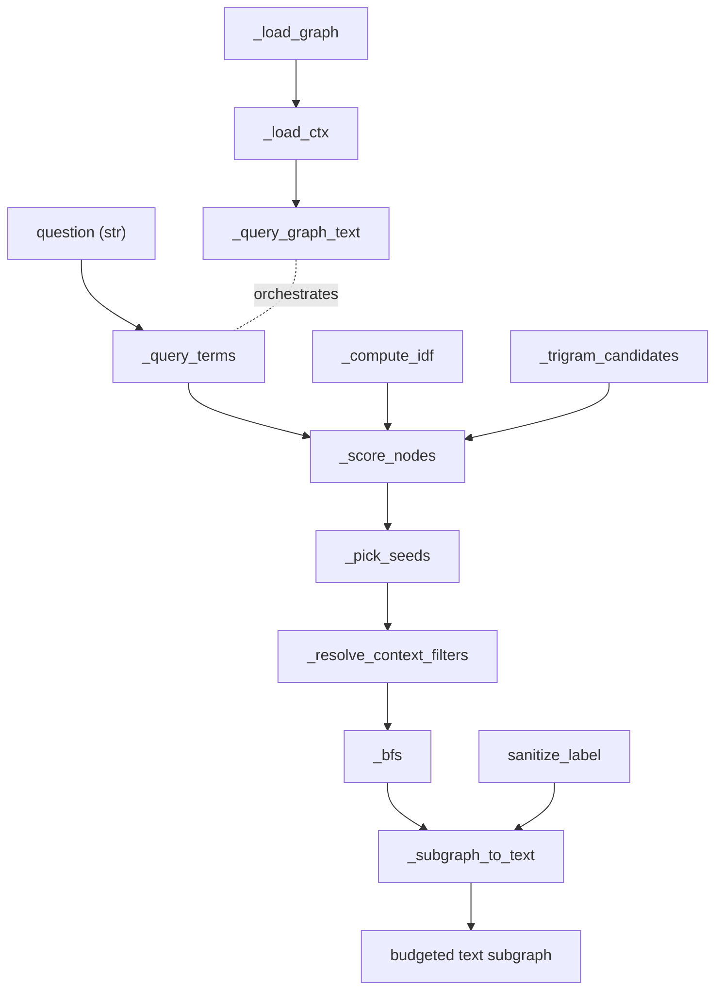

# graphify-serve — the query/path/explain interface over the graph

## Overview
`graphify serve` is the read side of graphify: once the ingest pipeline has crystallised a corpus
into a persistent `graph.json`, this module is how a human or an LLM *asks the graph questions* instead
of re-reading the corpus. Its central idea is a five-stage query pipeline —
**tokenise → score → seed → traverse → render-under-a-token-budget** — that turns a natural-language
question into a small, relevant, sanitised text subgraph an agent can drop straight into its context.
The same scoring/seeding primitives back the CLI's `query`, `path`, and `explain` commands and an MCP
server exposing graph tools over stdio or HTTP; a graph-powered PR-triage feature sits on top to show
what the persistent graph *buys you* — a diff's blast radius measured in communities, not files. The
whole surface is built by [`_build_server`](../catalog/graphify/serve.md#_build_server), and the query
core is [`_query_graph_text`](../catalog/graphify/serve.md#_query_graph_text).

## Diagram

## Design rationale (why it's built this way)
The module is organised around one hard constraint: an answer must fit an LLM's context window, so it
is **retrieval, then aggressive pruning**, never a dump.

- **Score, don't embed.** [`_score_nodes`](../catalog/graphify/serve.md#_score_nodes) ranks nodes with a
  hand-built three-tier lexical scheme (exact > prefix > substring per term, plus a source-file bonus),
  each tier weighted by IDF from [`_compute_idf`](../catalog/graphify/serve.md#_compute_idf). There is no
  vector index; matching is transparent and reproducible, which is why the survey can treat graphify's
  retrieval as inspectable rather than a black box. A whole-query tier gives a multi-word label that
  equals the query a `_EXACT_MATCH_BONUS * 10` boost so that `path`/`query` resolve to the *same* node
  `explain` would (via [`_find_node`](../catalog/graphify/serve.md#_find_node)) — the source comment
  notes that without it every node sharing the token set ties and BFS explores the wrong neighborhood.

- **A trigram prefilter that must not change answers.** On large graphs, scoring every node is wasteful,
  so [`_trigram_candidates`](../catalog/graphify/serve.md#_trigram_candidates) restricts scoring to nodes
  whose text *could* contain a query term, using a lazily-built postings map from
  [`_get_trigram_index`](../catalog/graphify/serve.md#_get_trigram_index). The invariant is spelled out
  in a comment and pinned by
  [`test_score_nodes_prefilter_is_identical_to_full_scan`](../catalog/tests/test_serve.md#test_score_nodes_prefilter_is_identical_to_full_scan):
  a non-candidate node always scores 0, so prefiltering is a pure speedup, not a behavior change.

- **Seed selection guards against noise-term hijacking.**
  [`_pick_seeds`](../catalog/graphify/serve.md#_pick_seeds) stops adding seeds once a score drops below
  20% of the top, so a dominant identifier match isn't diluted by common words. Its docstring documents
  the failure mode this caused (#1445): one incidental exact match on an unrelated identifier could
  outscore every substring match by ~1000×, starving the query's real terms — so when `G` and `terms` are
  supplied it *guarantees at least one seed per distinct query term*, breaking ties by graph degree.

- **The budget is the product.** [`_subgraph_to_text`](../catalog/graphify/serve.md#_subgraph_to_text)
  renders at ~3 chars/token and truncates at the budget, emitting a "narrow with context_filter" hint
  rather than silently cutting. Every field it emits passes through
  [`sanitize_label`](../catalog/graphify/security.md#sanitize_label) — the comment (F-010) is explicit
  that a corpus document is untrusted input that could otherwise inject ANSI escapes or prompt-injection
  markup into the model's context.

- **IDF is cached on the graph object, per graph.** [`_compute_idf`](../catalog/graphify/serve.md#_compute_idf)
  stashes weights in `G.graph['_idf_cache']` so repeated queries don't recompute;
  [`test_idf_cached_on_graph`](../catalog/tests/test_serve.md#test_idf_cached_on_graph) and
  [`test_idf_new_graph_starts_fresh`](../catalog/tests/test_serve.md#test_idf_new_graph_starts_fresh)
  pin both the reuse and the isolation (two graph instances must not share a cache).

## Entry points
- [`serve`](../catalog/graphify/serve.md#serve) — starts the MCP server over stdio, the default
  per-developer transport; [`_build_http_app`](../catalog/graphify/serve.md#_build_http_app) is the
  Streamable-HTTP variant for a shared server. Both wrap the same
  [`_build_server`](../catalog/graphify/serve.md#_build_server), whose docstring notes the tools are
  registered once and the transport is the caller's choice.
- [`_build_server`](../catalog/graphify/serve.md#_build_server) — constructs the low-level MCP `Server`
  and registers every graph tool as a closure over a per-graph context cache
  ([`_load_ctx`](../catalog/graphify/serve.md#_build_server._load_ctx)). This is where the query pipeline,
  the neighbor/community tools, and the PR tools all become callable.
- [`main`](../catalog/graphify/__main__.md#main) — the CLI dispatcher; its `query`/`path`/`explain`
  subcommands call [`_query_graph_text`](../catalog/graphify/serve.md#_query_graph_text),
  [`_score_nodes`](../catalog/graphify/serve.md#_score_nodes), and
  [`_find_node`](../catalog/graphify/serve.md#_find_node) directly against a loaded graph, and log each
  run with [`log_query`](../catalog/graphify/querylog.md#log_query).
- [`_query_graph_text`](../catalog/graphify/serve.md#_query_graph_text) — the single query orchestrator
  shared by the `query` CLI command and the MCP `query_graph` tool; give it a question and it returns the
  budgeted text subgraph.

## Mechanism (step-by-step)
1. **Load once, hot-reload transparently.** [`_load_ctx`](../catalog/graphify/serve.md#_build_server._load_ctx)
   keys a context cache on `(mtime, size)` so a query reuses the parsed graph until `graph.json` changes,
   then transparently rebuilds. The underlying read is
   [`_load_graph`](../catalog/graphify/serve.md#_load_graph), which enforces
   [`check_graph_file_size_cap`](../catalog/graphify/security.md#check_graph_file_size_cap) (a memory-bomb
   guard), checks [`graph_has_legacy_ids`](../catalog/graphify/build.md#graph_has_legacy_ids) for
   pre-#1504 node IDs, and merges the work-memory sidecar via
   [`load_learning_overlay`](../catalog/graphify/reflect.md#load_learning_overlay). Unlike the CLI's
   loader, `_load_ctx` raises instead of exiting, so a bad project path is a tool error, not a dead server.
2. **Tokenise the question.** [`_query_terms`](../catalog/graphify/serve.md#_query_terms) splits the
   query, segmenting Chinese runs, lowercasing and stripping punctuation via
   [`_search_tokens`](../catalog/graphify/serve.md#_search_tokens) /
   [`_strip_diacritics`](../catalog/graphify/serve.md#_strip_diacritics), then drops English stopwords so
   content words drive seeding — falling back to the unfiltered terms if the query is *all* stopwords, so
   "how does it work" still seeds on something.
3. **Score candidate nodes.** [`_score_nodes`](../catalog/graphify/serve.md#_score_nodes) computes IDF
   weights ([`_compute_idf`](../catalog/graphify/serve.md#_compute_idf)), restricts the scan to trigram
   candidates ([`_trigram_candidates`](../catalog/graphify/serve.md#_trigram_candidates)), and assigns
   each surviving node the strongest matching tier per term plus source-file and whole-query bonuses,
   sorting by score then shorter-label tie-break.
4. **Pick seeds.** [`_pick_seeds`](../catalog/graphify/serve.md#_pick_seeds) takes the top scorers within
   the gap threshold and augments them with one best-per-term seed (degree-broken ties) so every query
   term is represented in the traversal roots.
5. **Resolve context filters, then traverse.**
   [`_resolve_context_filters`](../catalog/graphify/serve.md#_resolve_context_filters) turns explicit
   filters (normalised by [`_normalize_context_filters`](../catalog/graphify/serve.md#_normalize_context_filters))
   or question-inferred hints into edge-relation classes; the filtered graph is then walked by
   [`_bfs`](../catalog/graphify/serve.md#_bfs) (or a DFS variant) to `depth`. The BFS deliberately refuses
   to *expand through* high-degree hubs (p99 of the degree distribution, floored at 50) unless they are
   seeds — so a god node doesn't blow the traversal open into the whole graph.
6. **Render under budget.** [`_subgraph_to_text`](../catalog/graphify/serve.md#_subgraph_to_text) orders
   seeds first then degree-sorted expansion, emits `NODE`/`EDGE` lines with every field passed through
   [`sanitize_label`](../catalog/graphify/security.md#sanitize_label), and cuts at the token budget with an
   explanatory truncation notice.
7. **(Neighbor/PR tools reuse the primitives.)**
   [`_tool_get_neighbors`](../catalog/graphify/serve.md#_build_server._tool_get_neighbors) resolves a
   label with [`_find_node`](../catalog/graphify/serve.md#_find_node) and walks one hop using
   [`edge_data`](../catalog/graphify/build.md#edge_data); the god-node tool ranks by degree via
   [`god_nodes`](../catalog/graphify/analyze.md#god_nodes) (which excludes mechanical file hubs through
   [`_is_file_node`](../catalog/graphify/analyze.md#_is_file_node)).

## The PR-triage application (graph-as-leverage)
The PR tools are where the persistent graph earns its keep for the survey's comparison: instead of "N
files changed", they report **which communities a change touches**.
[`_tool_triage_prs`](../catalog/graphify/serve.md#_build_server._tool_triage_prs) fetches open PRs with
[`fetch_prs`](../catalog/graphify/prs.md#fetch_prs) (into
[`PRInfo`](../catalog/graphify/prs.md#PRInfo) records), maps each to a worktree via
[`fetch_worktrees`](../catalog/graphify/prs.md#fetch_worktrees), keeps only actionable PRs by
[`status`](../catalog/graphify/prs.md#PRInfo.status)/[`base_branch`](../catalog/graphify/prs.md#PRInfo.base_branch),
then fetches diffs concurrently and scores each with
[`compute_pr_impact`](../catalog/graphify/prs.md#compute_pr_impact) to derive the
[`blast_radius`](../catalog/graphify/prs.md#PRInfo.blast_radius) it sorts by (via
[`_STATUS_ORDER`](../catalog/graphify/prs.md#_STATUS_ORDER)). The lighter
[`_tool_list_prs`](../catalog/graphify/serve.md#_build_server._tool_list_prs) renders the same records
with [`format_prs_text`](../catalog/graphify/prs.md#format_prs_text), and
[`_tool_get_pr_impact`](../catalog/graphify/serve.md#_build_server._tool_get_pr_impact) reports one PR's
graph impact — "nodes affected across communities" — as the merge-risk signal.

## Key data structures
- **The per-graph context cache** — built by
  [`_load_ctx`](../catalog/graphify/serve.md#_build_server._load_ctx), mapping a resolved `graph.json`
  path to `{key=(mtime,size), G, communities}`. One cache routes both the server's default graph and any
  per-call project graph through identical hot-reload and eager-trigram behavior.
- **The IDF cache on `G.graph`** — written by
  [`_compute_idf`](../catalog/graphify/serve.md#_compute_idf); a whole-graph term-weight statistic that
  survives across queries but never leaks between graph instances.
- **[`PRInfo`](../catalog/graphify/prs.md#PRInfo)** — the PR record whose computed properties
  ([`status`](../catalog/graphify/prs.md#PRInfo.status),
  [`blast_radius`](../catalog/graphify/prs.md#PRInfo.blast_radius),
  [`days_old`](../catalog/graphify/prs.md#PRInfo.days_old)) and graph-impact fields drive triage ordering;
  [`_classify`](../catalog/graphify/prs.md#_classify) computes its status against the expected base and
  [`_detect_default_branch`](../catalog/graphify/prs.md#_detect_default_branch) supplies that base.

## Dynamics (design intent)
The MCP server is transport-agnostic by construction: [`_build_server`](../catalog/graphify/serve.md#_build_server)
registers tools once and hot-reload lives *inside* the tool handlers, so stdio
([`serve`](../catalog/graphify/serve.md#serve)) and HTTP
([`_build_http_app`](../catalog/graphify/serve.md#_build_http_app)) behave identically. Concurrency shows
up in two places: the context cache takes a lock so two threads don't rebuild the same graph, and
[`_tool_triage_prs`](../catalog/graphify/serve.md#_build_server._tool_triage_prs) fetches PR diffs on a
bounded `ThreadPoolExecutor` (≤8 workers) then computes impact against the shared in-memory graph.
[`main`](../catalog/graphify/__main__.md#main) records every CLI query through
[`log_query`](../catalog/graphify/querylog.md#log_query), whose docstring stresses it "never raises" — so
telemetry can't break a query.

## Edge cases
- **Same node resolves for source and target.** The `path` command guards against src == tgt (bug #828),
  which would report a trivial zero-hop path; it and the MCP shortest-path tool both rely on
  [`_score_nodes`](../catalog/graphify/serve.md#_score_nodes) picking the top match.
- **Ambiguous endpoints.** When the runner-up score is within 10% of the top, the path handlers warn the
  match was ambiguous rather than silently choosing — the scoring signal from
  [`_score_nodes`](../catalog/graphify/serve.md#_score_nodes) is surfaced, not hidden.
- **No match.** [`_query_graph_text`](../catalog/graphify/serve.md#_query_graph_text) returns "No matching
  nodes found." when [`_pick_seeds`](../catalog/graphify/serve.md#_pick_seeds) yields nothing, so an
  off-corpus question fails loudly.
- **Oversized / legacy graphs.** [`_load_graph`](../catalog/graphify/serve.md#_load_graph) rejects graphs
  over the byte cap via [`check_graph_file_size_cap`](../catalog/graphify/security.md#check_graph_file_size_cap)
  and flags legacy IDs through [`graph_has_legacy_ids`](../catalog/graphify/build.md#graph_has_legacy_ids).

## Open questions
- The DFS traversal variant and the `_filter_graph_by_context` helper that
  [`_query_graph_text`](../catalog/graphify/serve.md#_query_graph_text) calls are not in this packet's
  Subgraph, so their exact edge-classification semantics aren't grounded here.
- HTTP transport auth/DNS-rebinding behavior in
  [`_build_http_app`](../catalog/graphify/serve.md#_build_http_app) is only partially visible in the
  packet snippet; the full session-reaping path is not cited here.

## See also
- [graphify-export](graphify-export.md) — writes the `graph.json` this module reads.
- [graphify-paths](graphify-paths.md) — resolves the default `graph.json` location every serve entry point uses.
- [graphify-callflow_html](graphify-callflow_html.md) — the other read surface: a static HTML render of the same graph.
