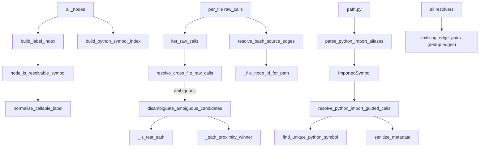

# graphify-symbol_resolution — recovering cross-file call edges conservatively

<!-- connect:up:begin -->
> **Cross-repo concept:** part of [symbol-graph](../../../concepts/symbol-graph.md) across this wiki's repos.
<!-- connect:up:end -->
## Overview
A single-file AST pass sees a call `transform(x)` but not *which* `transform` across the repo it
targets — the cross-file edge a call graph most needs is exactly the one local parsing can't
draw. This module recovers those edges *after all files are known*, and its defining principle is
**conservatism: emit an edge only when exactly one target is provably correct, otherwise skip**.
It offers three resolvers of decreasing certainty:
[`resolve_python_import_guided_calls`](../catalog/graphify/symbol_resolution.md#resolve_python_import_guided_calls)
uses explicit `from module import symbol` evidence (EXTRACTED, confidence 1.0),
[`resolve_bash_source_edges`](../catalog/graphify/symbol_resolution.md#resolve_bash_source_edges)
follows `source ./file.sh` to back function calls with real definitions, and
[`resolve_cross_file_raw_calls`](../catalog/graphify/symbol_resolution.md#resolve_cross_file_raw_calls)
resolves a bare name only when its label is globally unique or survives shared tie-breakers
(INFERRED, confidence 0.8).

## Diagram

## Design rationale (why it's built this way)
Every resolver shares one shape: build an index, compute the set of already-known
`(source, target, relation)` triples via
[`existing_edge_pairs`](../catalog/graphify/symbol_resolution.md#existing_edge_pairs), and only
add an edge when it is both unambiguous and new. Including the *relation* in the triple is
deliberate — the docstring notes a prior "contains"/"method" edge must not suppress a
"calls" edge between the same endpoints (#F5).

The three-tier confidence ladder is the core idea. Import evidence is strongest:
[`parse_python_import_aliases`](../catalog/graphify/symbol_resolution.md#parse_python_import_aliases)
parses only *top-level* `from … import …` statements — the docstring is explicit that
function-local imports "do NOT" count because "our raw-call records don't currently carry enough
scope info to match the import site safely," and it "deliberately does not resolve plain
`import helper` member calls" since raw-call facts don't preserve the receiver name. An import
alias plus a strict `(module_stem, symbol)` lookup via
[`find_unique_python_symbol`](../catalog/graphify/symbol_resolution.md#find_unique_python_symbol)
gives a proof strong enough to stamp `EXTRACTED, 1.0`. A bare name with no import proof only gets
`INFERRED, 0.8`.

The "god-node guard" is the other load-bearing decision.
[`resolve_cross_file_raw_calls`](../catalog/graphify/symbol_resolution.md#resolve_cross_file_raw_calls)
skips ambiguous labels rather than pick one, because a wrong high-degree merge fabricates a god
node. When more than one candidate exists it defers to the shared
[`disambiguate_ambiguous_candidates`](../catalog/graphify/paths.md#disambiguate_ambiguous_candidates),
whose tie-breakers — drop test mocks when the call site is non-test via
[`_is_test_path`](../catalog/graphify/paths.md#_is_test_path), then
[`_path_proximity_winner`](../catalog/graphify/paths.md#_path_proximity_winner) — resolve only if
*exactly one* candidate survives (#1553, so a same-named test mock no longer erases a real call).

A subtle but important detail is that only **code** nodes can be call targets.
[`node_is_resolvable_symbol`](../catalog/graphify/symbol_resolution.md#node_is_resolvable_symbol)
gates on `file_type == "code"` so a Markdown heading whose text happens to match an identifier
never becomes a callee — the same "labels are display, not identity" discipline dedup enforces.

Finally, resolver output is treated as **untrusted**: the import-guided resolver runs every field
that lands in edge metadata through
[`sanitize_metadata`](../catalog/graphify/security.md#sanitize_metadata), because an alias/local
name is attacker-influenced text about to be written into `graph.json`.

## Entry points
- [`resolve_python_import_guided_calls`](../catalog/graphify/symbol_resolution.md#resolve_python_import_guided_calls)
  — the highest-confidence resolver; called after extraction with per-file fragments, paths, and
  the full node/edge lists. Emits `EXTRACTED` call edges backed by import aliases.
- [`resolve_cross_file_raw_calls`](../catalog/graphify/symbol_resolution.md#resolve_cross_file_raw_calls)
  — the conservative fallback for unqualified calls; emits `INFERRED` edges only for unique or
  tie-broken targets.
- [`resolve_bash_source_edges`](../catalog/graphify/symbol_resolution.md#resolve_bash_source_edges)
  — resolves Bash `source`/import edges and source-backed function calls, using a static-analysis
  path policy rather than shell runtime semantics.
- [`parse_python_import_aliases`](../catalog/graphify/symbol_resolution.md#parse_python_import_aliases)
  — the per-file evidence extractor feeding the import-guided resolver; returns
  `local_name → ImportedSymbol`.

## Mechanism (step-by-step)
1. **Index resolvable symbols.**
   [`build_label_index`](../catalog/graphify/symbol_resolution.md#build_label_index) and
   [`build_python_symbol_index`](../catalog/graphify/symbol_resolution.md#build_python_symbol_index)
   walk `all_nodes`, keeping only those that pass
   [`node_is_resolvable_symbol`](../catalog/graphify/symbol_resolution.md#node_is_resolvable_symbol)
   and keying by [`normalise_callable_label`](../catalog/graphify/symbol_resolution.md#normalise_callable_label)
   (label → ids, and `(module_stem, symbol) → ids` for the stricter Python index).
2. **Parse import evidence.**
   [`parse_python_import_aliases`](../catalog/graphify/symbol_resolution.md#parse_python_import_aliases)
   AST-parses each `.py` file, emitting an
   [`ImportedSymbol`](../catalog/graphify/symbol_resolution.md#ImportedSymbol) per top-level
   `from`-import that records its
   [`local_name`](../catalog/graphify/symbol_resolution.md#ImportedSymbol.local_name),
   [`imported_name`](../catalog/graphify/symbol_resolution.md#ImportedSymbol.imported_name),
   [`module_stem`](../catalog/graphify/symbol_resolution.md#ImportedSymbol.module_stem), and
   [`source_location`](../catalog/graphify/symbol_resolution.md#ImportedSymbol.source_location).
3. **Resolve import-guided calls.**
   [`resolve_python_import_guided_calls`](../catalog/graphify/symbol_resolution.md#resolve_python_import_guided_calls)
   matches each raw call's callee to an alias, resolves it via
   [`find_unique_python_symbol`](../catalog/graphify/symbol_resolution.md#find_unique_python_symbol)
   (which returns a target only when the `(module_stem, imported_name)` key maps to exactly one
   node), and emits an `EXTRACTED` edge whose metadata is scrubbed by
   [`sanitize_metadata`](../catalog/graphify/security.md#sanitize_metadata).
4. **Resolve bare cross-file calls.**
   [`resolve_cross_file_raw_calls`](../catalog/graphify/symbol_resolution.md#resolve_cross_file_raw_calls)
   pulls raw calls via [`iter_raw_calls`](../catalog/graphify/symbol_resolution.md#iter_raw_calls),
   looks the callee up in the label index, and either takes the unique candidate or defers to
   [`disambiguate_ambiguous_candidates`](../catalog/graphify/paths.md#disambiguate_ambiguous_candidates);
   member calls and unresolved names are skipped, and survivors become `INFERRED` edges.
5. **Resolve bash source graph.**
   [`resolve_bash_source_edges`](../catalog/graphify/symbol_resolution.md#resolve_bash_source_edges)
   computes each file's node id with
   [`_file_node_id_for_path`](../catalog/graphify/symbol_resolution.md#_file_node_id_for_path)
   (which reuses [`_bash_make_id`](../catalog/graphify/symbol_resolution.md#_bash_make_id) and
   [`_file_stem`](../catalog/graphify/extractors/base.md#_file_stem) so IDs match the builder's),
   emits `imports_from` edges for each resolved `source ./file`, then backs bash function calls
   with a `calls` edge only when the callee is defined in exactly one sourced file.
6. **Dedup against existing edges.** All resolvers filter through
   [`existing_edge_pairs`](../catalog/graphify/symbol_resolution.md#existing_edge_pairs) so a
   re-resolution never double-emits.

## Key data structures
- [`ImportedSymbol`](../catalog/graphify/symbol_resolution.md#ImportedSymbol) — a frozen dataclass
  of import evidence; its
  [`module_stem`](../catalog/graphify/symbol_resolution.md#ImportedSymbol.module_stem) +
  [`imported_name`](../catalog/graphify/symbol_resolution.md#ImportedSymbol.imported_name) are the
  lookup key, while [`local_name`](../catalog/graphify/symbol_resolution.md#ImportedSymbol.local_name)
  and [`source_location`](../catalog/graphify/symbol_resolution.md#ImportedSymbol.source_location)
  are stored verbatim into (sanitized) metadata.
- The label index (`label → [node_ids]`) and Python symbol index (`(module_stem, symbol) → [node_ids]`)
  built by [`build_label_index`](../catalog/graphify/symbol_resolution.md#build_label_index) and
  [`build_python_symbol_index`](../catalog/graphify/symbol_resolution.md#build_python_symbol_index).
- The `(source, target, relation)` triple set from
  [`existing_edge_pairs`](../catalog/graphify/symbol_resolution.md#existing_edge_pairs) — the
  idempotence key shared by all resolvers.
- Sanitizer bounds [`_METADATA_MAX_VALUE_LEN`](../catalog/graphify/security.md#_METADATA_MAX_VALUE_LEN)
  and [`_METADATA_MAX_LIST_ITEMS`](../catalog/graphify/security.md#_METADATA_MAX_LIST_ITEMS) used by
  [`_sanitize_metadata_string`](../catalog/graphify/security.md#_sanitize_metadata_string) /
  [`_sanitize_metadata_value`](../catalog/graphify/security.md#_sanitize_metadata_value).

## Dynamics (design intent)
Tests fix the conservatism precisely:
`test_resolve_cross_file_raw_calls_skips_ambiguous_duplicate_labels` and
`test_resolve_cross_file_raw_calls_real_edge_survives_test_mock` pin the god-node guard and the
non-test preference; `test_resolve_python_import_guided_calls_emits_extracted_edge` confirms the
import-guided path fires an `EXTRACTED` edge; and
`test_resolve_python_import_guided_calls_metadata_sanitizes_hostile_alias` proves hostile alias
text is HTML-escaped/NUL-stripped by
[`sanitize_metadata`](../catalog/graphify/security.md#sanitize_metadata). The bash resolver's
static-analysis path policy is exercised by
`test_resolve_bash_source_edges_relative_path_resolves_against_source_dir`.

## Edge cases
- Every resolver is defensive against malformed extraction fragments: non-dict `per_file` slots,
  missing keys, `None` entries, unhashable callees, and `per_file` shorter than `paths` are
  silently skipped — a large set of tests on
  [`resolve_bash_source_edges`](../catalog/graphify/symbol_resolution.md#resolve_bash_source_edges)
  and [`resolve_python_import_guided_calls`](../catalog/graphify/symbol_resolution.md#resolve_python_import_guided_calls)
  assert "no crash."
- Member calls (`obj.method()`) are always skipped — the raw-call fact lacks receiver type
  ([`resolve_cross_file_raw_calls`](../catalog/graphify/symbol_resolution.md#resolve_cross_file_raw_calls)).
- Bash `source ./X` is resolved relative to the *file being analyzed*, not the shell CWD — a
  deliberate static-analysis choice for reproducible edges, documented in
  [`resolve_bash_source_edges`](../catalog/graphify/symbol_resolution.md#resolve_bash_source_edges).

## Open questions
- [`normalize_id`](../catalog/graphify/ids.md#normalize_id) and
  [`make_id`](../catalog/graphify/ids.md#make_id) appear in the subgraph as the canonical id
  recipe [`_bash_make_id`](../catalog/graphify/symbol_resolution.md#_bash_make_id) delegates to,
  but the C++/ObjC receiver-typed member-call resolvers (referenced in build's language-family
  logic) live elsewhere and are outside this packet.

## See also
- [graphify-build](graphify-build.md) — ingests these resolved edges and preserves their
  direction/confidence.
- [graphify-cluster](graphify-cluster.md) — the community structure these cross-file edges feed.
- [graphify-dedup](graphify-dedup.md) — shares the "labels are display, not identity" discipline.
