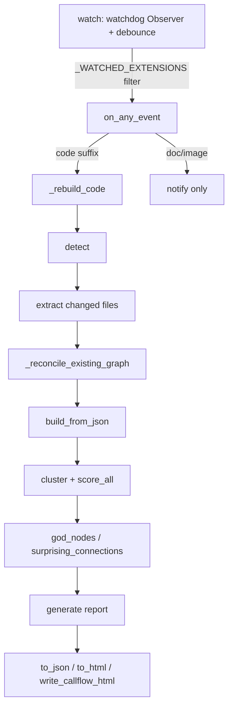

# File watching & live re-ingest

<!-- connect:up:begin -->
> **Cross-repo concept:** part of [incremental-reconcile](../../../concepts/incremental-reconcile.md) across this wiki's repos.
<!-- connect:up:end -->
## Overview
`graphify watch` keeps the knowledge graph in sync with a working tree as you edit it. The
key design split is between **code and everything else**: a code change is cheap to
re-ingest — AST extraction needs no LLM — so the watcher re-extracts and rebuilds
immediately via [`_rebuild_code`](../catalog/graphify/watch.md#_rebuild_code); a doc, paper,
or image change requires LLM extraction, so the watcher only *notifies* and defers to
`/graphify --update`. The second key idea is **incremental reconciliation**: on an edit,
only the changed files are re-extracted, and
[`_reconcile_existing_graph`](../catalog/graphify/watch.md#_reconcile_existing_graph) merges
the fresh nodes into the existing graph while evicting stale ones — so a live rebuild never
throws away the semantic (LLM-derived) nodes from a prior full run.

## Diagram

## Design rationale (why it's built this way)
**Code rebuilds are LLM-free and instant.** [`_rebuild_code`](../catalog/graphify/watch.md#_rebuild_code)
is documented as "Re-run AST extraction + build + optional cluster + report for code files.
No LLM needed." That is the whole reason a watcher is viable: the AST pipeline
([`detect`](../catalog/graphify/detect.md#detect) → [`extract`](../catalog/graphify/extract.md#extract)
→ [`build_from_json`](../catalog/graphify/build.md#build_from_json) →
[`cluster`](../catalog/graphify/cluster.md#cluster)) is fast and free, so it can run on every
save; the expensive semantic path stays behind the manual `--update`.

**Debounce, and filter cheaply.** The watchdog handler runs on the observer thread and is
invoked for *every* OS event (Time Machine writes, Docker/Colima I/O, Spotlight indexing).
So [`watch`](../catalog/graphify/watch.md#watch) loads `.graphifyignore` patterns *once* at
startup via [`_load_graphifyignore`](../catalog/graphify/detect.md#_load_graphifyignore) and
short-circuits with [`_is_ignored`](../catalog/graphify/detect.md#_is_ignored) before the
extension check, then only keeps files whose suffix is in
[`_WATCHED_EXTENSIONS`](../catalog/graphify/watch.md#_WATCHED_EXTENSIONS) — the union of code,
doc, paper, and image extensions. A 3-second debounce coalesces a burst of saves into one
rebuild instead of running on every keystroke.

**Preserve, don't rebuild-from-scratch.** When only some files changed,
[`_reconcile_existing_graph`](../catalog/graphify/watch.md#_reconcile_existing_graph) keeps
nodes for unchanged files (including INFERRED/AMBIGUOUS semantic nodes) and evicts only the
sources that were re-extracted or deleted. The comment in
[`_rebuild_code`](../catalog/graphify/watch.md#_rebuild_code) is explicit that it filters by
node-ID membership in the new AST output, *not* by `file_type`, because semantic nodes
extracted from code files also carry `file_type="code"` and would otherwise be wrongly
dropped.

> [!inferred]
> The `acquire_lock` / `block_on_lock` machinery in
> [`_rebuild_code`](../catalog/graphify/watch.md#_rebuild_code) exists so that back-to-back
> triggers (a commit hook firing while a watcher rebuild is mid-flight) don't pile up: an
> incremental caller queues its change set and a non-blocking flock skips if another rebuild
> holds the lock, while the interactive `update` CLI blocks instead. This reads from the
> docstring and the `_queue_pending` comment rather than observed runtime.

## Entry points
- [`watch`](../catalog/graphify/watch.md#watch) — the long-running command (`graphify watch
  <path>`); starts a watchdog observer and the debounce loop, dispatching each batch to a
  rebuild or a notification.
- [`_rebuild_code`](../catalog/graphify/watch.md#_rebuild_code) — the rebuild engine; also the
  entry point the post-commit / post-checkout git hooks and the `update` CLI verb re-enter
  through [`main`](../catalog/graphify/__main__.md#main).

## Mechanism (step-by-step)
1. **Observe.** [`watch`](../catalog/graphify/watch.md#watch) schedules a watchdog
   `Observer` (a `PollingObserver` on macOS, where FSEvents can miss rapid editor saves) and
   installs a handler that records changed paths after passing the
   [`_is_ignored`](../catalog/graphify/detect.md#_is_ignored) and
   [`_WATCHED_EXTENSIONS`](../catalog/graphify/watch.md#_WATCHED_EXTENSIONS) filters.
2. **Debounce & classify.** The loop in [`watch`](../catalog/graphify/watch.md#watch) waits
   for `debounce` seconds of quiet, then splits the batch: code suffixes (from
   [`CODE_EXTENSIONS`](../catalog/graphify/detect.md#CODE_EXTENSIONS)) trigger
   [`_rebuild_code`](../catalog/graphify/watch.md#_rebuild_code); non-code files only notify.
3. **Lock & queue.** [`_rebuild_code`](../catalog/graphify/watch.md#_rebuild_code) takes a
   per-repo flock; an incremental rebuild queues its `changed_paths` first so a lock-holder
   can drain and merge them, avoiding a dropped change set under contention.
4. **Detect & extract the delta.** It re-runs [`detect`](../catalog/graphify/detect.md#detect)
   to know the current corpus, resolves which changed paths are still tracked code files, and
   calls [`extract`](../catalog/graphify/extract.md#extract) on just those targets — routed to
   the right language extractor by [`_get_extractor`](../catalog/graphify/extract.md#_get_extractor)
   / [`_DISPATCH`](../catalog/graphify/extract.md#_DISPATCH._DISPATCH) (e.g.
   [`extract_python`](../catalog/graphify/extract.md#extract_python),
   [`extract_js`](../catalog/graphify/extract.md#extract_js),
   [`extract_cpp`](../catalog/graphify/extract.md#extract_cpp)), with IDs from
   [`_make_id`](../catalog/graphify/extractors/base.md#_make_id) /
   [`_file_stem`](../catalog/graphify/extractors/base.md#_file_stem).
5. **Reconcile.** [`_reconcile_existing_graph`](../catalog/graphify/watch.md#_reconcile_existing_graph)
   loads the current `graph.json` (size-guarded by
   [`check_graph_file_size_cap`](../catalog/graphify/security.md#check_graph_file_size_cap)),
   computes source identities for the live corpus and the re-extracted targets, and evicts
   nodes/edges belonging to changed or deleted sources while keeping the rest — the merge that
   makes the rebuild incremental.
6. **Build.** The reconciled extraction is turned into a NetworkX graph by
   [`build_from_json`](../catalog/graphify/build.md#build_from_json), which first runs
   [`validate_extraction`](../catalog/graphify/validate.md#validate_extraction) against the
   schema.
7. **Cluster & score.** Unless `no_cluster`, [`cluster`](../catalog/graphify/cluster.md#cluster)
   re-runs Leiden community detection and
   [`score_all`](../catalog/graphify/cluster.md#score_all) computes per-community cohesion.
8. **Analyze & report.** [`god_nodes`](../catalog/graphify/analyze.md#god_nodes) and
   [`surprising_connections`](../catalog/graphify/analyze.md#surprising_connections) recompute
   the structural highlights, and [`generate`](../catalog/graphify/report.md#generate) rewrites
   the report; [`save_manifest`](../catalog/graphify/detect.md#save_manifest) records the new
   mtimes/hashes for next-time change detection.
9. **Export.** Before overwriting, [`backup_if_protected`](../catalog/graphify/export.md#backup_if_protected)
   snapshots the prior artifacts; then [`to_json`](../catalog/graphify/export.md#to_json),
   [`to_html`](../catalog/graphify/export.md#to_html) (labels cleaned by
   [`sanitize_label`](../catalog/graphify/security.md#sanitize_label)), and
   [`write_callflow_html`](../catalog/graphify/callflow_html.md#write_callflow_html) regenerate
   the outputs.

## Key data structures
- **`_WATCHED_EXTENSIONS`** — the suffix allowlist
  ([`_WATCHED_EXTENSIONS`](../catalog/graphify/watch.md#_WATCHED_EXTENSIONS)); the union of code,
  doc, paper, and image extensions that decides whether an OS event is even considered.
- **The change batch** — the debounce loop accumulates a `set` of changed `Path`s and hands a
  snapshot to [`_rebuild_code`](../catalog/graphify/watch.md#_rebuild_code) as `changed_paths`;
  `None` means "full corpus" (used by the post-checkout hook).
- **`graph.json`** — read and rewritten each rebuild; the reconciliation in
  [`_reconcile_existing_graph`](../catalog/graphify/watch.md#_reconcile_existing_graph) treats it
  as the durable state to merge into, keyed by normalized source-file identity.

## Dynamics (design intent)
The debounce loop in [`watch`](../catalog/graphify/watch.md#watch) is single-threaded polling on
a 0.5s tick; the observer thread only mutates the pending flag and the changed-set. Concurrency
across *processes* — e.g. a watcher and a post-commit hook racing — is handled inside
[`_rebuild_code`](../catalog/graphify/watch.md#_rebuild_code) by the per-repo flock plus the
pending-work queue, not by the watcher itself. A full-corpus rebuild (`changed_paths is None`,
the branch-switch/hook case) skips the queue because it already covers every file.

## Edge cases
- **All-deleted / no tracked files.** [`_rebuild_code`](../catalog/graphify/watch.md#_rebuild_code)
  short-circuits with a log line when a change set contains no tracked code files and no
  deletions.
- **Dotfiles and `graphify-out/`.** The handler in [`watch`](../catalog/graphify/watch.md#watch)
  drops any path with a dot-prefixed segment or one inside
  [`GRAPHIFY_OUT`](../catalog/graphify/paths.md#GRAPHIFY_OUT), so writing the graph doesn't
  retrigger a rebuild.
- **Shrink guard.** A rebuild that legitimately deletes code can produce fewer nodes;
  [`_rebuild_code`](../catalog/graphify/watch.md#_rebuild_code)'s `force` flag bypasses the
  node-count safety check in [`to_json`](../catalog/graphify/export.md#to_json) so the smaller
  graph still overwrites.
- **`--no-cluster`.** Skips [`cluster`](../catalog/graphify/cluster.md#cluster) and writes raw
  merged extraction, deduping parallel edges so repeated `update`s don't accumulate duplicates.

## Open questions
- The `_notify_only` doc/image path and the `_apply_resource_limits` used by the hook bodies are
  outside this packet's subgraph, so the exact notification and rlimit behavior isn't cited here.
- Symbol-resolution helpers like
  [`_apply_symbol_resolution_facts`](../catalog/graphify/extract.md#_apply_symbol_resolution_facts)
  and [`_collect_js_symbol_resolution_facts`](../catalog/graphify/extract.md#_collect_js_symbol_resolution_facts)
  appear in the subgraph but their cross-file edge inference is documented on the extract/main
  pages.

## See also
- graphify-cache — the content-addressed cache that makes re-extraction cheap.
- graphify-hooks — git hooks that call [`_rebuild_code`](../catalog/graphify/watch.md#_rebuild_code).
- graphify-__main__ — the `watch`/`update` verbs.
