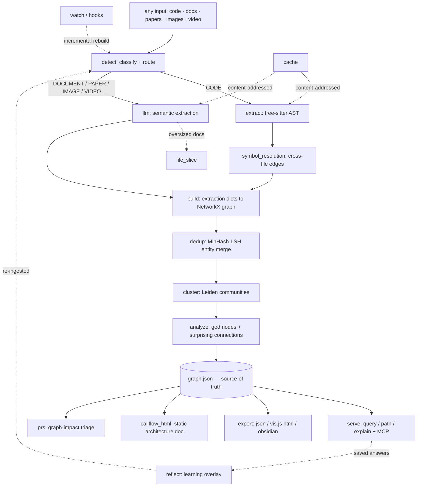
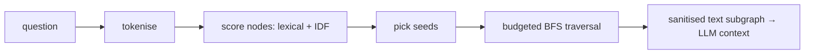

# graphify — what it is and how it fits together

## In one paragraph
graphify turns **any input** — source code, docs, papers, images, video — into a single
**persistent knowledge graph** you query instead of re-reading the corpus. One ingest pipeline
routes each file to the right lane (deterministic AST parsing for code, an LLM for prose/media),
reconciles everything onto one canonical node identity, clusters the graph
into communities, and ranks the core abstractions ("god nodes") and non-obvious cross-boundary
edges ("surprising connections"). The graph is written once to `graph.json` and re-read by every
downstream surface — a `query`/`path`/`explain` CLI, an MCP server, a static HTML architecture doc,
and a PR-impact dashboard — so understanding is *compiled once and kept current* rather than
re-derived per question. Two properties run through the whole design: **determinism** (the same
corpus always yields the same graph, community IDs, and answers) and **idempotent incrementality**
(a watch/hook/`update` re-run re-extracts only the changed files and merges them into the existing
graph without discarding prior work). Because the source is untrusted, extraction, resolution, and
rendering all pass through centralized sanitisation and size-cap guards.

## Core architecture

The read side — how a natural-language question becomes a small, relevant answer — is its own spine:

## Main concepts

**One graph, many source types (detection & routing).** Before anything is parsed, graphify
classifies each file into a `FileType` — `CODE`, `DOCUMENT`, `PAPER`, `IMAGE`, or `VIDEO` — and that
single decision picks the lane. Classification is extension-first but signal-aware: package
manifests are forced to the code lane, a `.md` can be promoted to `PAPER`, and extensionless scripts
are resolved by shebang. Detection is also the security boundary, pruning noise dirs, honoring
`.graphifyignore`, and screening secrets and zip-bombs. See
[detect](concepts/graphify-detect.md).

**Deterministic AST extraction with stable identity.** The LLM-free code lane parses ~30 languages
(mostly through one tree-sitter driver parameterized per language, plus bespoke extractors for
formats tree-sitter can't handle) into a flat `{nodes, edges}` dict. The load-bearing invariant is
**collision-free node identity**: every extractor mints ids through one function keyed off the full
path stem, so the same symbol always lands on the same node across runs and moves. See
[extract](concepts/graphify-extract.md) and [extractors-base](concepts/graphify-extractors-base.md).

**Conservative cross-file symbol resolution.** A single-file parse sees a call but not *which*
definition it targets — the edge a call graph most needs. A second, whole-corpus pass recovers those
edges under a strict rule: **emit only when exactly one target is provably correct, otherwise skip**,
with a three-tier confidence ladder (import-backed `EXTRACTED` > bare-name `INFERRED`) and a
god-node guard that refuses to fan a common name out into a false hub. See
[symbol_resolution](concepts/graphify-symbol_resolution.md). (graphify also ships a
[scip_ingest](concepts/graphify-scip_ingest.md) module, but it is a **dormant, un-wired skeleton** for
LLM-generated pseudo-SCIP JSON — not a real SCIP lane and not part of the pipeline; graphify grounds on
AST, not SCIP.)

**LLM-driven semantic extraction (prose, papers, media).** Docs, papers, and images go to a
provider-neutral, self-healing LLM layer: one JSON contract dispatched to any of a dozen backends,
with the corpus sliced into token-budgeted chunks that recursively split when a model truncates.
Oversized documents are cut into `FileSlice` ranges that always report their parent file, so a big
doc never fragments into per-chunk nodes; code is deliberately never sliced. Input files are wrapped
as inert, untrusted data. See [llm](concepts/graphify-llm.md) and
[file_slice](concepts/graphify-file_slice.md).

**Graph build & persistence.** `build` is the seam where every lane's extractions become one
NetworkX graph. Most of its code is not "add node, add edge" but **identity reconciliation** —
re-deriving drifted ids from `source_file`, ghost-merging duplicates onto AST canonicals, and
preserving caller→callee direction even in undirected storage. The incremental path loads the
persisted `graph.json`, replaces only the changed files' slice, and refuses to silently shrink — the
mechanism that makes the graph *persistent and idempotent* rather than rebuilt from scratch. See
[build](concepts/graphify-build.md) (and the write-side [multigraph_compat](concepts/graphify-multigraph_compat.md) probe).

**Entity deduplication via MinHash-LSH.** When many chunks describe the same real entity under
slightly different labels, dedup collapses them through a staged funnel that only gets more
conservative: exact normalization, an entropy gate, MinHash/LSH blocking (a home-grown, scipy-free
datasketch clone) to avoid the O(n²) scan, Jaro-Winkler verification, and a battery of guards that
veto merging genuine siblings. Code nodes are never label-merged, and cross-repo dedup is refused
outright. See [dedup](concepts/graphify-dedup.md) and [_minhash](concepts/graphify-_minhash.md).

**Community detection & god nodes.** Clustering turns the flat graph into a *navigable* structure:
Leiden (falling back to Louvain) partitions the graph into communities/subsystems, splits oversized
and hub-glued ones, and re-indexes deterministically so the same corpus always yields the same
integer IDs. Each community is named after its highest-degree member — its "god node" — so a report
reads `auth` instead of `Community 70`. See [cluster](concepts/graphify-cluster.md).

**Analysis: the two questions a reader actually asks.** Over the clustered graph, `god_nodes`
surfaces the core abstractions (degree-ranked, with mechanical file-hubs and noise suppressed) and
`surprising_connections` ranks non-obvious cross-boundary edges by a composite score — while
deliberately zeroing out resolver false-positives (an `INFERRED` call bridging two language
families). Most of this code is principled *suppression*, separating architectural signal from
extraction artefacts. See [analyze](concepts/graphify-analyze.md).

**The query / path / explain interface.** The read side answers questions *from the graph, not from
grep*: a five-stage pipeline — tokenise → score (transparent lexical + IDF, no vector index) → seed
→ budgeted BFS (refusing to expand through god nodes) → render a sanitised text subgraph that fits an
LLM's context window. The same primitives back the CLI's `query`/`path`/`explain`, an MCP server over
stdio or HTTP, and a PR-triage tool that reports a diff's blast radius in *communities* rather than
files. See [serve](concepts/graphify-serve.md); the report and dashboard views are
[callflow_html](concepts/graphify-callflow_html.md) and [prs](concepts/graphify-prs.md).

**Incremental freshness: cache, watch, hooks.** Extraction is the expensive half, so a
content-addressed cache (SHA256 of contents + relative path, AST-versioned, semantic-unversioned)
means a re-ingest pays only for changed files. A file watcher rebuilds code instantly (no LLM) and
merges into the existing graph; git `post-commit`/`post-checkout` hooks fire detached rebuilds so the
graph stays fresh with no human action. See [cache](concepts/graphify-cache.md),
[watch](concepts/graphify-watch.md), and [hooks](concepts/graphify-hooks.md).

**Persistence, learning, and trust guards.** `graph.json` is the single source of truth, so writing
it is guarded like a database commit (refuse-to-shrink, direction-preserving, community-stamped),
with backups for expensive graphs. A `reflect` loop folds saved query outcomes into a deterministic
learning overlay so past answers inform future ones. A thin security core sanitises every label and
metadata value at write time and size-caps every graph read. Both durably route through one
output-directory resolver. See [export](concepts/graphify-export.md),
[reflect](concepts/graphify-reflect.md), [security](concepts/graphify-security.md), and
[paths](concepts/graphify-paths.md).

## How comprehension is represented and queried (the lens)
Because graphify exists to make a codebase (or any corpus) *comprehensible*, the surfaces below are
where that understanding lives — read these first:

- **God nodes** — the core abstractions. Each community is labeled by its highest-degree hub
  ([cluster](concepts/graphify-cluster.md)), and `god_nodes` ranks the architectural spine of the
  whole corpus while filtering out mechanical hubs and noise ([analyze](concepts/graphify-analyze.md)).
- **Communities** — the graph's subsystems. Leiden clustering groups thousands of nodes into a
  dozen navigable themes with cohesion scores and stable IDs
  ([cluster](concepts/graphify-cluster.md)); they become the chapters of the static architecture doc
  ([callflow_html](concepts/graphify-callflow_html.md)) and the unit of PR blast radius
  ([prs](concepts/graphify-prs.md)).
- **Surprising connections** — the non-obvious cross-file / cross-language / cross-community edges a
  call-graph walk misses, scored and suppression-filtered ([analyze](concepts/graphify-analyze.md)).
- **`query "…"`** — a natural-language question answered as a budgeted, sanitised text subgraph
  ([serve](concepts/graphify-serve.md)).
- **`path "A" "B"`** — how two entities connect, over the resolved cross-file edges
  ([serve](concepts/graphify-serve.md), [symbol_resolution](concepts/graphify-symbol_resolution.md)).
- **`explain "X"`** — a symbol and its neighborhood ([serve](concepts/graphify-serve.md)).
- **`affected` / PR impact** — the blast radius of a change, measured in communities
  ([serve](concepts/graphify-serve.md), [prs](concepts/graphify-prs.md)).

## How a request flows
The ingest spine is a strict linear order with the graph as the hand-off between stages:
**detect → extract (AST / LLM) → symbol-resolution → build → dedup → cluster → analyze →
export**, all conducted by the single `main` dispatcher ([__main__](concepts/graphify-__main__.md)).
Incremental verbs (`update`, `watch`, hook-triggered rebuilds) re-enter at the same rebuild engine
([watch](concepts/graphify-watch.md)) but re-extract only the changed files and *merge* into the
persisted graph. A **query** then runs the read-side spine — score → seed → traverse → render — over
that graph, and a saved answer re-enters ingest through the learning loop
([reflect](concepts/graphify-reflect.md)), so explorations compound like ingests.

## Map of the wiki
- **Where do I start / what are the systems?** — this page, then the concept table in
  [index.md](index.md).
- **How does graphify turn X into a graph?** — [detect](concepts/graphify-detect.md) →
  [extract](concepts/graphify-extract.md) / [llm](concepts/graphify-llm.md) →
  [build](concepts/graphify-build.md). ([scip_ingest](concepts/graphify-scip_ingest.md) is a dormant
  skeleton, not part of this path.)
- **How is understanding structured?** — [cluster](concepts/graphify-cluster.md) (communities /
  god nodes) and [analyze](concepts/graphify-analyze.md) (god nodes / surprising connections).
- **How do I ask the graph a question?** — [serve](concepts/graphify-serve.md) (query / path /
  explain / MCP), [callflow_html](concepts/graphify-callflow_html.md) (static doc),
  [prs](concepts/graphify-prs.md) (impact triage).
- **How does it stay fresh & correct?** — [cache](concepts/graphify-cache.md),
  [watch](concepts/graphify-watch.md), [hooks](concepts/graphify-hooks.md),
  [export](concepts/graphify-export.md), [reflect](concepts/graphify-reflect.md).
- **What keeps nodes clean / the tool portable / safe?** — [dedup](concepts/graphify-dedup.md),
  [_minhash](concepts/graphify-_minhash.md), [extractors-base](concepts/graphify-extractors-base.md),
  [symbol_resolution](concepts/graphify-symbol_resolution.md), [security](concepts/graphify-security.md),
  [paths](concepts/graphify-paths.md), [multigraph_compat](concepts/graphify-multigraph_compat.md).
- **How is it all wired together?** — [__main__](concepts/graphify-__main__.md) (CLI dispatch).
- **Every symbol — signature, definition, callers** — the per-module index under
  [`catalog/`](catalog/).
- **The concept table (all 24 pages, with status)** — [index.md](index.md).
