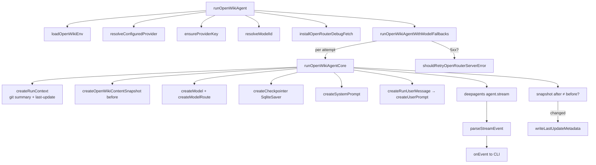

# Agent runtime — the deep-agent doc-writing loop

<!-- connect:up:begin -->
> **Cross-repo concept:** part of [incremental-reconcile](../../../concepts/incremental-reconcile.md) across this wiki's repos.
<!-- connect:up:end -->
## Overview
This is the heart of OpenWiki, and the single most important thing to understand about it
is what it is *not*: there is no SCIP index, no symbol graph, no chunker, no embedding store,
no citation linter. OpenWiki's entire "understand the codebase" step is **an LLM agent turned
loose on the repository with a shell and a filesystem**. [`runOpenWikiAgentCore`](../catalog/src/agent/index.ts.md#runOpenWikiAgentCore)
constructs a `deepagents` agent (from LangChain's `deepagents` package) whose only tools are
the built-in filesystem/shell toolset — `ls`, `read_file`, `write_file`, `edit_file`, `glob`,
`grep`, and `execute` — pointed at a `LocalShellBackend` rooted (`rootDir`) at the target repo
in `virtualMode`. The "representation" of the code is therefore the code itself: the model reads
source with the same tools a human agent would, and writes Markdown into
[`OPEN_WIKI_DIR`](../catalog/src/constants.ts.md#OPEN_WIKI_DIR) (`openwiki/`). Grounding is a
**prompt instruction** ("ground every important claim in source files, existing docs, or git
evidence you have inspected"), not a build gate — the sharpest contrast with the other surveyed
tools. What this module actually *contains*, beyond wiring that agent, is three hard problems:
multi-provider model routing with fallback, a defensive stream-event parser that turns LangGraph's
polymorphic chunks into a clean typed event feed, and a git-anchored incremental-reconcile decision.

## Diagram

## Design rationale (why it's built this way)
**Why an agent instead of a pipeline.** The other tools in this survey (wikify-repo, graphify,
understand-anything) treat "represent the code" as a deterministic extraction problem — index with
SCIP/AST, build a graph, then synthesize. OpenWiki inverts that: it trusts a strong model with good
tools to do its own discovery, and spends its engineering budget on *steering* the model with a long
system prompt ([`createSystemPrompt`](../catalog/src/agent/prompt.ts.md#createSystemPrompt)) rather
than on building an index. The payoff is language-agnosticism for free (no per-language indexer) and
docs organized "like human documentation, not a raw file inventory"; the cost is that nothing
mechanically verifies a claim against a symbol — correctness rests on the prompt and the model.

**Why the shell backend is virtual.** [`createRunUserMessage`](../catalog/src/agent/index.ts.md#createRunUserMessage)
spends a whole "Runtime note" block hammering one point: filesystem tools use a *virtual* root where
`/` means the repo, but `execute` shell commands run on the *host*. This split is the sharp edge of
`LocalShellBackend` in `virtualMode` — a host absolute path like `/Users/...` handed to `write_file`
would be treated as a virtual path and silently write to the wrong place inside the repo. The prompt
pre-empts a mistake the model would otherwise make constantly.

**Why the agent has zero custom tools.** `tools: []` is deliberate — OpenWiki adds no domain tools;
it relies entirely on the deep-agent's built-in filesystem/shell/task tools. The product *is* the
prompt plus that generic toolset.

## Entry points
- [`runOpenWikiAgent`](../catalog/src/agent/index.ts.md#runOpenWikiAgent) — the sole public entry.
  Called from both the interactive TUI (`App`) and the one-shot `runPrintCommand` path. It resolves
  provider + credentials + model, installs the OpenRouter debug fetch shim, then delegates to the
  fallback wrapper and guarantees `restore()` of global `fetch` in a `finally`.
- The run itself always flows through
  [`runOpenWikiAgentWithModelFallbacks`](../catalog/src/agent/index.ts.md#runOpenWikiAgentWithModelFallbacks)
  → [`runOpenWikiAgentCore`](../catalog/src/agent/index.ts.md#runOpenWikiAgentCore); a `chat` follow-up
  re-enters the same core on the checkpointed thread rather than re-running discovery.

## Mechanism (step-by-step)
1. **Resolve who and what will run.** [`runOpenWikiAgent`](../catalog/src/agent/index.ts.md#runOpenWikiAgent)
   first calls [`loadOpenWikiEnv`](../catalog/src/env.ts.md#loadOpenWikiEnv) to hydrate `process.env`
   from `~/.openwiki/.env`, then [`resolveConfiguredProvider`](../catalog/src/constants.ts.md#resolveConfiguredProvider)
   picks the provider, [`ensureProviderKey`](../catalog/src/agent/index.ts.md#ensureProviderKey) fails
   fast if that provider's API key is absent, and [`resolveModelId`](../catalog/src/agent/index.ts.md#resolveModelId)
   settles the model id from the CLI flag → `OPENWIKI_MODEL_ID` env → provider default, validating it.
   Everything after this point can assume a usable provider/model/key triple.

2. **Wrap the run in a model-fallback loop.** [`runOpenWikiAgentWithModelFallbacks`](../catalog/src/agent/index.ts.md#runOpenWikiAgentWithModelFallbacks)
   expands the single model into an attempt list via [`createModelRoute`](../catalog/src/agent/index.ts.md#createModelRoute)
   (for OpenRouter, the chosen model followed by `OPENROUTER_FALLBACK_MODEL_IDS`, de-duplicated).
   Each iteration runs the core; on failure it consults [`shouldRetryOpenRouterServerError`](../catalog/src/agent/index.ts.md#shouldRetryOpenRouterServerError),
   which retries **only** on a captured HTTP 5xx and only if another attempt remains. Non-5xx errors
   (auth, bad request) rethrow immediately — a 4xx will never improve by switching models.

3. **Build the per-run context (the reconcile inputs).** [`runOpenWikiAgentCore`](../catalog/src/agent/index.ts.md#runOpenWikiAgentCore)
   calls [`createRunContext`](../catalog/src/agent/utils.ts.md#createRunContext), which reads prior
   run metadata ([`readLastUpdate`](../catalog/src/agent/utils.ts.md#readLastUpdate)) and assembles a
   git evidence block ([`createGitSummary`](../catalog/src/agent/utils.ts.md#createGitSummary)). For an
   `update` run with a recorded `gitHead`, that summary is literally `git log <gitHead>..HEAD` — the
   diff since the last successful run — which is how OpenWiki tells the model *what changed* (see
   Incremental reconcile below).

4. **Snapshot before, to detect real change.** Still in the core, for non-chat commands it takes a
   content hash of `openwiki/` via [`createOpenWikiContentSnapshot`](../catalog/src/agent/utils.ts.md#createOpenWikiContentSnapshot)
   *before* the agent runs, so it can later tell whether the agent actually wrote anything.

5. **Construct the agent and stream.** [`createModel`](../catalog/src/agent/index.ts.md#createModel)
   returns the right LangChain chat model for the provider; [`createCheckpointer`](../catalog/src/agent/index.ts.md#createCheckpointer)
   opens a `SqliteSaver` at `~/.openwiki/openwiki.sqlite` so a thread's messages persist across
   interactive turns; [`createSystemPrompt`](../catalog/src/agent/prompt.ts.md#createSystemPrompt) and
   [`createRunUserMessage`](../catalog/src/agent/index.ts.md#createRunUserMessage) (which wraps
   [`createUserPrompt`](../catalog/src/agent/prompt.ts.md#createUserPrompt)) become the system/user
   messages. The deep-agent then `.stream(...)`s with `streamMode: ["messages","tools"]` and
   `subgraphs: true`.

6. **Normalize the stream into typed events.** Every chunk goes through
   [`parseStreamEvent`](../catalog/src/agent/index.ts.md#parseStreamEvent), which routes on a
   normalized `{isSubgraph, mode, payload}` shape from [`normalizeStreamEvent`](../catalog/src/agent/index.ts.md#normalizeStreamEvent),
   extracts human-readable text with [`extractMessageTextValue`](../catalog/src/agent/index.ts.md#extractMessageTextValue),
   and turns tool activity into `tool_start`/`tool_end` events via
   [`parseToolStreamEvent`](../catalog/src/agent/index.ts.md#parseToolStreamEvent). Parsed events are
   handed to `options.onEvent` for the TUI; unrecognized chunks are counted and (in debug) described.

7. **Commit only if the docs changed.** After the stream drains, the core re-snapshots `openwiki/`
   and, if the hash differs from the before-snapshot, calls
   [`writeLastUpdateMetadata`](../catalog/src/agent/utils.ts.md#writeLastUpdateMetadata) to record the
   new `gitHead`, timestamp, command, and model. If nothing changed (or command is `chat`), it writes
   no metadata — so a no-op update run does not advance the reconcile baseline.

## Incremental reconcile (the survey axis)
OpenWiki's reconcile is **git-commit-anchored and prose-shaped**, not symbol-shaped. The state it
carries between runs is a single JSON file, `openwiki/.last-update.json`
([`UPDATE_METADATA_PATH`](../catalog/src/constants.ts.md#UPDATE_METADATA_PATH)), holding the `gitHead`
of the last successful run. On the next `update`, [`createGitSummary`](../catalog/src/agent/utils.ts.md#createGitSummary)
computes `git log <lastHead>..HEAD --name-status` and feeds that changed-files list to the model,
which is *prompted* to build a "source change → docs affected → edit needed" plan and touch only the
pages implicated. Two consequences worth internalizing:
- **The diff is advisory, not enforced.** Unlike wikify-repo (which rebuilds exactly the packets whose
  symbols moved) or understand-anything (fingerprint-gated file rebuilds), nothing here restricts which
  files the model edits — the surgical-update discipline lives entirely in the prompt.
- **Change detection is a whole-tree content hash.** [`createOpenWikiContentSnapshot`](../catalog/src/agent/utils.ts.md#createOpenWikiContentSnapshot)
  hashes every file under `openwiki/` (excluding the metadata file) so the baseline only advances when
  the documentation genuinely changed — a run that decides "already current" leaves `.last-update.json`
  untouched, preserving the true diff base for next time. See the sibling
  [`incremental-reconcile`](../../../concepts/incremental-reconcile.md) cross-repo page.

## Key data structures
- **`OpenRouterFetchCapture` / `OpenRouterFetchFailure`** — the state behind the debug fetch shim.
  [`installOpenRouterDebugFetch`](../catalog/src/agent/index.ts.md#installOpenRouterDebugFetch) monkeypatches
  global `fetch`, and on any non-OK OpenRouter `/chat/completions` response records a sanitized
  summary (via [`summarizeOpenRouterRequest`](../catalog/src/agent/index.ts.md#summarizeOpenRouterRequest)
  and a body preview with secrets redacted). On error, [`attachOpenRouterDebugInfo`](../catalog/src/agent/index.ts.md#attachOpenRouterDebugInfo)
  glues that failure onto the thrown error so the TUI's diagnostics panel can show *why* a provider 500'd.
- **`NormalizedStreamEvent`** — the `{isSubgraph, mode, payload}` triple every chunk is reduced to
  before dispatch, the seam that lets one parser handle both array-tuple and protocol-object chunk shapes.

## Dynamics (design intent)
The stream is consumed serially with `for await`, and events are emitted in order to `onEvent`; there
is no concurrency inside a run. Parallelism, when it happens, is *inside* the agent — the system prompt
explicitly permits 1–4 read-only `task` subagents for multi-domain repos, but "the main agent must
synthesize the final docs and is responsible for all writes." So fan-out is a model-level strategy, not
a runtime feature of this module. The one piece of global mutable state is the patched `globalThis.fetch`,
which is always restored in the `finally` of [`runOpenWikiAgent`](../catalog/src/agent/index.ts.md#runOpenWikiAgent).

## Edge cases
- **Followup turns bypass the prompt scaffolding.** [`createRunUserMessage`](../catalog/src/agent/index.ts.md#createRunUserMessage)
  returns the raw trimmed user message when `isFollowup` is true, so interactive chat turns reuse the
  checkpointed thread instead of re-injecting the full init/update prompt.
- **Retry threads are namespaced.** A fallback attempt gets a `-retry-N` suffix on its thread id so a
  retried run does not collide with the failed attempt's checkpoint.
- **Text extraction guards against cycles.** [`extractMessageTextValue`](../catalog/src/agent/index.ts.md#extractMessageTextValue)
  threads a `seen` set through recursion and skips `tool`/`reasoning` content blocks, so only
  assistant-visible prose reaches the UI.

## Open questions
- The retry policy only reacts to failures the fetch shim can see — i.e. OpenRouter HTTP errors. A
  non-OpenRouter provider (Anthropic/OpenAI direct) that 500s is not covered by
  [`shouldRetryOpenRouterServerError`](../catalog/src/agent/index.ts.md#shouldRetryOpenRouterServerError);
  whether the underlying LangChain client retries independently is outside this module.

## See also
- [Run contract — commands, events, options, metadata](openwiki-agent-types.ts.md)
- [Provider & model catalog — multi-provider routing](openwiki-constants.ts.md)
- [Credential store — ~/.openwiki/.env](openwiki-env.ts.md)
- [TUI orchestration — the Ink app & run lifecycle](openwiki-cli.tsx.md)
- Cross-repo: [`incremental-reconcile`](../../../concepts/incremental-reconcile.md)
