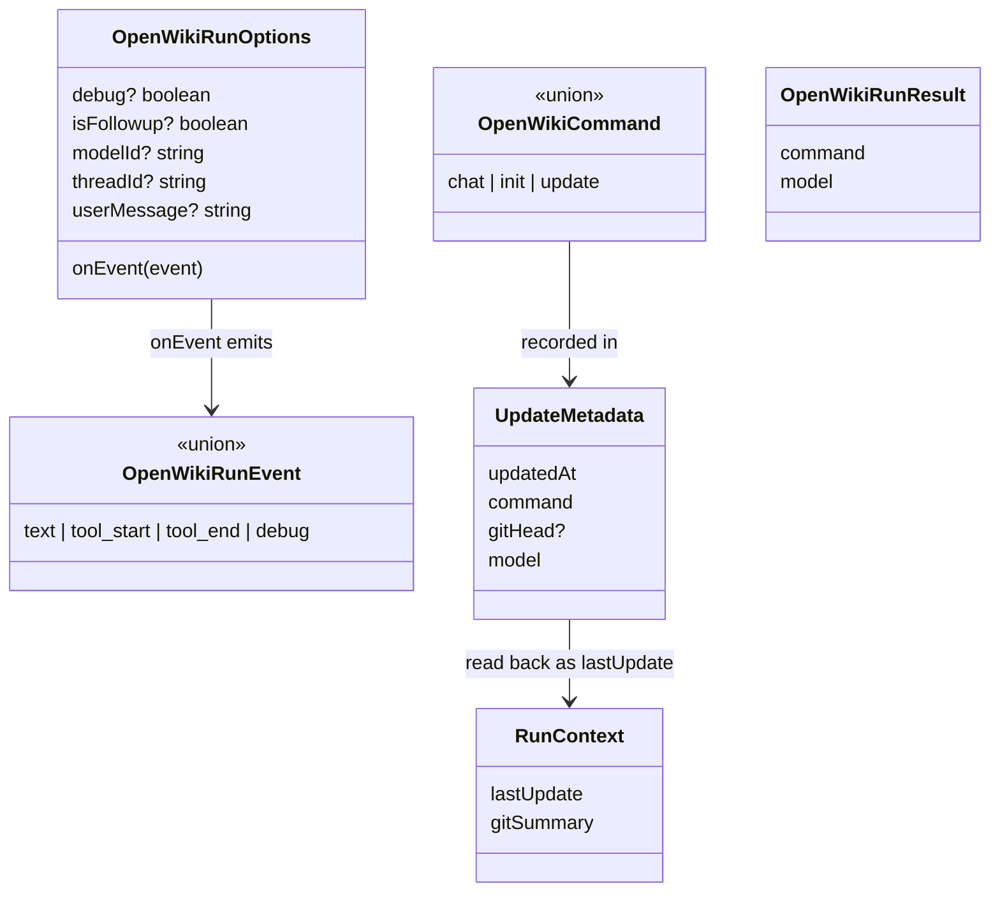

# Run contract — commands, events, options, and update metadata

## Overview
`agent/types.ts` is tiny — 51 lines, all type declarations, no runtime code — but it is the
*contract* that lets OpenWiki's two halves stay decoupled: the **agent runtime** (which drives an
LLM over the repo) and the **Ink TUI** (which renders progress). Everything that crosses that boundary
is one of four types. A run is named by a [`OpenWikiCommand`](../catalog/src/agent/types.ts.md#OpenWikiCommand)
(`"chat" | "init" | "update"`); the caller passes [`OpenWikiRunOptions`](../catalog/src/agent/types.ts.md#OpenWikiRunOptions)
in and gets streamed [`OpenWikiRunEvent`](../catalog/src/agent/types.ts.md#OpenWikiRunEvent)s back via a
callback; the run persists a [`UpdateMetadata`](../catalog/src/agent/types.ts.md#UpdateMetadata) record so
the next run can diff from it. Reading this file first is the fastest way to understand OpenWiki's shape,
because the three-mode command and the four-variant event union define the whole surface.

## Diagram

## Design rationale (why it's built this way)
**Three commands, not a flag soup.** Collapsing the CLI's many argv shapes down to
[`OpenWikiCommand`](../catalog/src/agent/types.ts.md#OpenWikiCommand) means the agent runtime never sees
`--print`, `--dry-run`, or `--modelId`; those are resolved in the CLI layer
([`parseCommand`](../catalog/src/commands.ts.md#parseCommand) → [`CliCommand`](../catalog/src/commands.ts.md#CliCommand))
and only the semantic mode reaches [`createSystemPrompt`](../catalog/src/agent/prompt.ts.md#createSystemPrompt)
and [`createModeInstructions`](../catalog/src/agent/prompt.ts.md#createModeInstructions). The three modes
map cleanly to prompt behavior: `chat` answers without writing docs, `init` builds from scratch, `update`
does a surgical diff-driven refresh.

**A callback event stream, not a return value.** Because doc generation is long-running and the TUI wants
live progress, the contract is push-based: [`OpenWikiRunOptions.onEvent`](../catalog/src/agent/types.ts.md#OpenWikiRunOptions.typeLiteral20.onEvent)
is invoked repeatedly with [`OpenWikiRunEvent`](../catalog/src/agent/types.ts.md#OpenWikiRunEvent)s while the
run proceeds, and the awaited return ([`OpenWikiRunResult`](../catalog/src/agent/types.ts.md#OpenWikiRunResult.typeLiteral0.command))
is just the final `{command, model}` summary. This is what lets the same runtime power both the interactive
`App` (renders every event) and the `-p` print path (keeps only `text` events, discards the rest).

**`isFollowup` is the interactive/one-shot switch.** A single boolean on
[`OpenWikiRunOptions`](../catalog/src/agent/types.ts.md#OpenWikiRunOptions) decides whether the run reuses the
checkpointed conversation thread (a chat follow-up) or injects the full init/update scaffolding — see how
[`createRunUserMessage`](../catalog/src/agent/index.ts.md#createRunUserMessage) branches on it.

## Entry points
- [`OpenWikiRunOptions`](../catalog/src/agent/types.ts.md#OpenWikiRunOptions) is the input contract every
  caller of [`runOpenWikiAgent`](../catalog/src/agent/index.ts.md#runOpenWikiAgent) fills in — the TUI's
  `App` and the print path both construct one and supply `onEvent`.
- [`OpenWikiRunEvent`](../catalog/src/agent/types.ts.md#OpenWikiRunEvent) is the output contract consumed by
  [`appendRunLogEvent`](../catalog/src/cli.tsx.md#appendRunLogEvent) (and its tool-log helpers) to build the
  rendered run log; [`parseStreamEvent`](../catalog/src/agent/index.ts.md#parseStreamEvent) and
  [`parseToolStreamEvent`](../catalog/src/agent/index.ts.md#parseToolStreamEvent) are its producers.

## Mechanism (step-by-step)
1. **The command selects behavior everywhere.** [`OpenWikiCommand`](../catalog/src/agent/types.ts.md#OpenWikiCommand)
   is threaded through the whole runtime: [`runOpenWikiAgentCore`](../catalog/src/agent/index.ts.md#runOpenWikiAgentCore)
   skips snapshotting for `chat`, [`createRunContext`](../catalog/src/agent/utils.ts.md#createRunContext) skips
   the git summary for `chat`, and [`createGitSummary`](../catalog/src/agent/utils.ts.md#createGitSummary)
   chooses a "since last head" vs. "recent history" log based on `update` vs. `init`.
2. **Events fan out by variant.** Each [`OpenWikiRunEvent`](../catalog/src/agent/types.ts.md#OpenWikiRunEvent)
   is a discriminated union on `type`: `text` (assistant prose, tagged main vs. subgraph), `tool_start` /
   `tool_end` (tool lifecycle, consumed by [`appendToolStartLogItem`](../catalog/src/cli.tsx.md#appendToolStartLogItem),
   [`completeToolLogItem`](../catalog/src/cli.tsx.md#completeToolLogItem), and
   [`completeToolGroupItem`](../catalog/src/cli.tsx.md#completeToolGroupItem)), and `debug` (verbose tracing,
   emitted by [`emitDebug`](../catalog/src/agent/index.ts.md#emitDebug)).
3. **Metadata closes the reconcile loop.** [`UpdateMetadata`](../catalog/src/agent/types.ts.md#UpdateMetadata)
   is written by [`writeLastUpdateMetadata`](../catalog/src/agent/utils.ts.md#writeLastUpdateMetadata) after a
   changing run and read back by [`readLastUpdate`](../catalog/src/agent/utils.ts.md#readLastUpdate) into
   `RunContext.lastUpdate` ([`lastUpdate`](../catalog/src/agent/types.ts.md#RunContext.typeLiteral24.lastUpdate));
   [`formatLastUpdate`](../catalog/src/agent/prompt.ts.md#formatLastUpdate) then serializes it into the update
   prompt so the model knows the prior `gitHead`.

## Key data structures
- [`RunContext`](../catalog/src/agent/types.ts.md#RunContext.typeLiteral24.lastUpdate) — `{lastUpdate, gitSummary}`,
  the per-run evidence bundle the prompt layer reasons over.
- [`UpdateMetadata.command`](../catalog/src/agent/types.ts.md#UpdateMetadata.typeLiteral23.command) — records
  whether the baseline was set by an `init` or `update`, which `readLastUpdate` normalizes on read.

## Edge cases
- `OpenWikiRunResult` deliberately carries the *resolved* model id (which may be a fallback model, not the
  requested one), so what gets recorded in metadata reflects what actually ran.

## Open questions
- The event union has no explicit "run finished/error" variant; completion is signalled by the promise
  resolving/rejecting rather than by an event, so the TUI must track lifecycle out of band via
  [`RunState`](../catalog/src/cli.tsx.md#RunState).

## See also
- [Agent runtime — the deep-agent doc-writing loop](openwiki-agent-index.ts.md)
- [CLI command parsing & help](openwiki-commands.ts.md)
- [TUI orchestration — the Ink app & run lifecycle](openwiki-cli.tsx.md)
