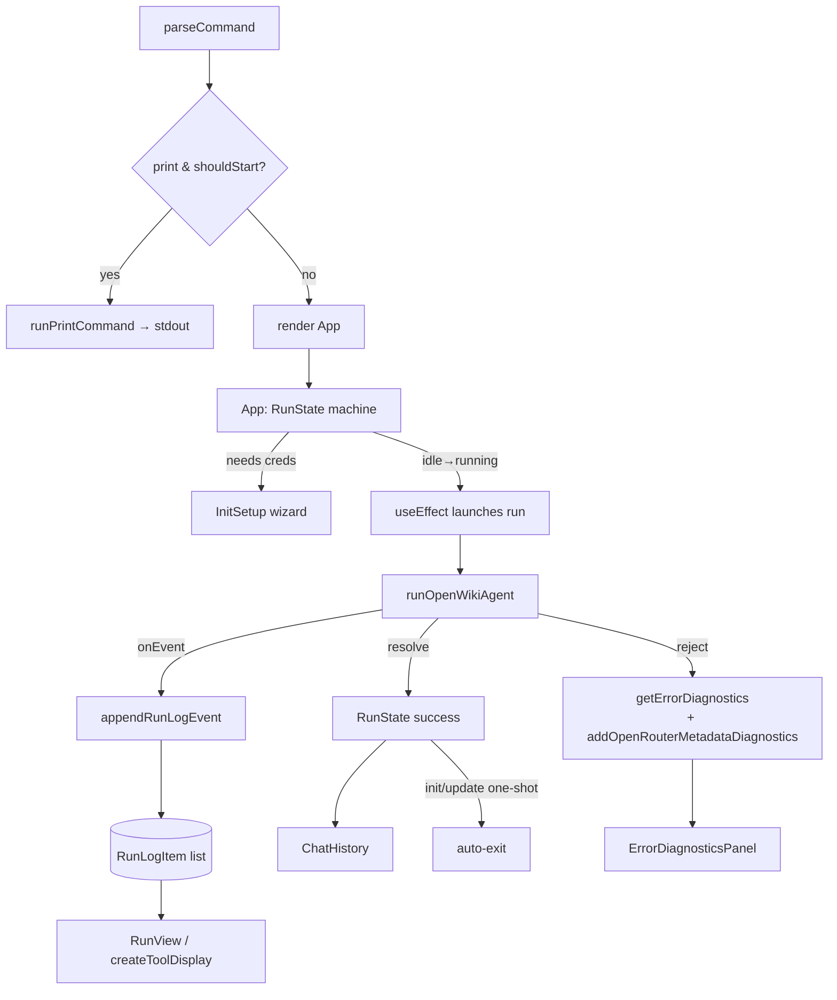

# TUI orchestration — the Ink app & run lifecycle

## Overview
`cli.tsx` is by far the largest module (~3,150 lines) and it is almost entirely **presentation**: an
Ink (React-for-the-terminal) app that drives the agent runtime and renders its stream. The mental model
that matters: [`App`](../catalog/src/cli.tsx.md#App) is a state machine over a
[`RunState`](../catalog/src/cli.tsx.md#RunState) (`idle → running → success | error`), a `useEffect`
launches [`runOpenWikiAgent`](../catalog/src/agent/index.ts.md#runOpenWikiAgent) when there is work to do,
and every streamed event is folded into a growing run log by
[`appendRunLogEvent`](../catalog/src/cli.tsx.md#appendRunLogEvent) and rendered by
[`RunView`](../catalog/src/cli.tsx.md#RunView). Around that core sit the chat input with a slash-command
menu ([`ChatInput`](../catalog/src/cli.tsx.md#ChatInput)), a markdown renderer, the credential wizard
mount point, and — the genuinely load-bearing non-UI logic — an error-diagnostics extractor
([`getErrorDiagnostics`](../catalog/src/cli.tsx.md#getErrorDiagnostics)) that turns opaque provider
failures into a readable, secret-redacted panel. For the survey lens this module is *how a coding agent's
work is surfaced to a human*, not how the code is analyzed.

## Diagram

## Design rationale (why it's built this way)
**A run id guards against stale async.** Every launch bumps an `activeRunId` ref, and both the `onEvent`
callback and the promise handlers bail if `activeRunId.current !== runId`. This is the standard React
defense against a superseded run's events mutating state after the user has moved on (cleared the session,
started a new run) — essential because the agent stream and the credential-diagnostics fetch are both
long-lived and racy.

**Two front doors, one runtime.** The entry point chooses between `runPrintCommand` (non-interactive `-p`:
collect only `text` events, write to stdout, exit) and `render(<App/>)` (interactive). Both call the same
[`runOpenWikiAgent`](../catalog/src/agent/index.ts.md#runOpenWikiAgent); the difference is purely how events
are consumed. `shouldAutoExitStartupRun` then makes `--init`/`--update` behave like a batch command (exit on
success) while a bare chat stays open.

**Diagnostics are defensive and privacy-preserving.** [`getErrorDiagnostics`](../catalog/src/cli.tsx.md#getErrorDiagnostics)
and its helpers walk an arbitrary thrown error — nested causes, attached OpenRouter debug info
([`addOpenRouterMetadataDiagnostics`](../catalog/src/cli.tsx.md#addOpenRouterMetadataDiagnostics)), response
headers — through secret-key detection and value truncation, then de-duplicate. The goal is to show a user
*why* a provider call failed (status, request-id, body preview) without ever surfacing an API key. This
mirrors the redaction the runtime already applies when capturing the failed fetch.

**Tool activity is grouped, not spammed.** [`appendRunLogEvent`](../catalog/src/cli.tsx.md#appendRunLogEvent)
threads `tool_start`/`tool_end` events into grouped log items and [`createToolDisplay`](../catalog/src/cli.tsx.md#createToolDisplay)
turns a raw tool call into a friendly one-liner (e.g. counting file targets), so a burst of `read_file`/`grep`
calls reads as coherent progress rather than a wall of JSON.

## Entry points
- [`App`](../catalog/src/cli.tsx.md#App) — the root component; owns session state (provider, model, thread id,
  completed runs) and the launch `useEffect`.
- The process entry script parses argv and either prints or `render`s [`App`](../catalog/src/cli.tsx.md#App);
  that top-level `parseCommand → resolveStartupCommand → runPrintCommand`/`render` flow is covered on the
  [CLI command parsing](openwiki-commands.ts.md) page.

## Mechanism (step-by-step)
1. **Gate on credentials.** If a run is requested in a TTY but the config is incomplete, `App` renders the
   [`InitSetup`](../catalog/src/credentials.tsx.md#InitSetup) wizard instead of launching; on non-TTY with a
   missing key it sets an `error` [`RunState`](../catalog/src/cli.tsx.md#RunState) telling the user to run
   interactively.
2. **Launch when idle.** The launch `useEffect` bumps the run id, sets `RunState` to `running`, optionally
   kicks off a [`getCredentialDiagnostics`](../catalog/src/env.ts.md#getCredentialDiagnostics) fetch, and calls
   [`runOpenWikiAgent`](../catalog/src/agent/index.ts.md#runOpenWikiAgent) with an `onEvent` that folds events
   into `activeRunLog` via [`appendRunLogEvent`](../catalog/src/cli.tsx.md#appendRunLogEvent).
3. **Render the live log.** [`RunView`](../catalog/src/cli.tsx.md#RunView) renders the
   [`RunLogItem`](../catalog/src/cli.tsx.md#RunLogItem) list — assistant markdown plus grouped tool lines from
   [`createToolDisplay`](../catalog/src/cli.tsx.md#createToolDisplay), with active tools discovered via
   [`getActiveToolCallIds`](../catalog/src/cli.tsx.md#getActiveToolCallIds). Header/status chrome comes from
   [`Header`](../catalog/src/cli.tsx.md#Header), [`StatusLine`](../catalog/src/cli.tsx.md#StatusLine), and
   [`Panel`](../catalog/src/cli.tsx.md#Panel).
4. **Resolve or fail.** On success `App` records a completed run (rendered by
   [`ChatHistory`](../catalog/src/cli.tsx.md#ChatHistory)) and, for one-shot `init`/`update`, auto-exits. On
   rejection it builds an [`getErrorDiagnostics`](../catalog/src/cli.tsx.md#getErrorDiagnostics) list plus fresh
   credential diagnostics and shows the error panel.
5. **Accept the next message.** [`ChatInput`](../catalog/src/cli.tsx.md#ChatInput) handles keystrokes
   ([`applyRawInputValue`](../catalog/src/cli.tsx.md#applyRawInputValue)) and a slash-command menu
   ([`slashCommandOptions`](../catalog/src/cli.tsx.md#slashCommandOptions)) for switching model/provider or
   triggering init/update, feeding back into the same state machine.

## Key data structures
- [`RunState`](../catalog/src/cli.tsx.md#RunState) — the discriminated union `{idle} | {running, command, log}
  | {success, result, log, ...} | {error, message, ...} | {init-setup-saved}` that drives what `App` renders.
- [`RunLogItem`](../catalog/src/cli.tsx.md#RunLogItem) — one rendered log entry (assistant text or a tool
  group with active/among-done state); the reduced form of the runtime's event stream.
- `ErrorDiagnostic` — a `{label, value}` row; the diagnostics panels
  ([`CredentialDiagnosticsPanel`](../catalog/src/cli.tsx.md#CredentialDiagnosticsPanel.-diagnostics-.typeLiteral250.diagnostics)
  and [`ErrorDiagnosticsPanel`](../catalog/src/cli.tsx.md#ErrorDiagnosticsPanel.-diagnostics-.typeLiteral251.diagnostics))
  render lists of them.

## Dynamics (design intent)
State updates are all funnelled through React refs + `setRunState`, and the run-id guard means only the
newest run can write state — older resolutions are no-ops. There is no worker/thread concurrency; the only
asynchronicity is the awaited agent stream and the parallel credential-diagnostics fetch, both id-guarded.

## Edge cases
- Non-TTY startup with a print/auto-start command routes errors to stderr (`shouldPrintStartupError`) rather
  than mounting Ink, so scripted/CI usage gets plain output.
- [`createToolDisplay`](../catalog/src/cli.tsx.md#createToolDisplay) parses possibly-stringified tool input and
  counts targets/todos, using [`formatCount`](../catalog/src/cli.tsx.md#formatCount) for singular/plural — it
  degrades to a generic label when the input shape is unknown.
- Provider/model changes made mid-session via the slash menu persist through `saveOpenWikiEnv` and update
  session state without restarting the process.

## Open questions
- Much of the file is Ink layout/keyboard handling not central to OpenWiki's thesis; the load-bearing parts
  are the run-lifecycle effect and the diagnostics extractor. The catalog page lists the remaining UI helpers.

## See also
- [Run contract — commands, events, options, metadata](openwiki-agent-types.ts.md)
- [Agent runtime — the deep-agent doc-writing loop](openwiki-agent-index.ts.md)
- [CLI command parsing & help](openwiki-commands.ts.md)
- [Interactive credential setup wizard](openwiki-credentials.tsx.md)
