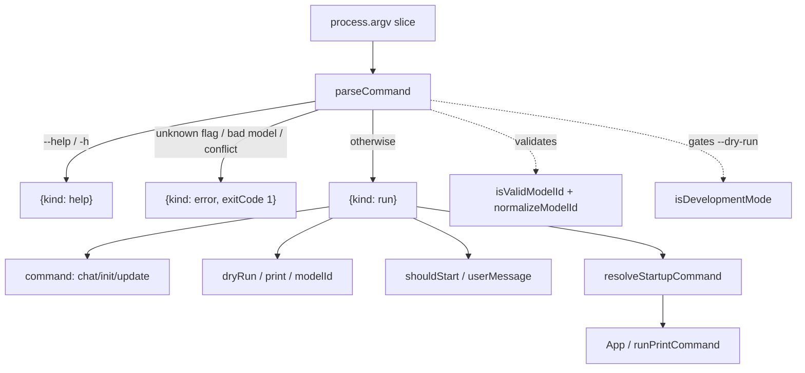

# CLI command parsing & help

## Overview
`commands.ts` is OpenWiki's hand-rolled argument parser — no `commander`/`yargs`, just a single
[`parseCommand`](../catalog/src/commands.ts.md#parseCommand) that folds `process.argv` into one
discriminated [`CliCommand`](../catalog/src/commands.ts.md#CliCommand) value (`help` | `run` | `error`).
The design goal is a *total* function: it never throws and never exits; it returns a value the entry
point then acts on. This keeps argv handling pure and testable, and it is where the many surface flags
(`--init`, `--update`, `-p`, `--modelId`, `--dry-run`) collapse down to the three-mode
`OpenWikiCommand` the agent runtime actually understands. The file also owns the static
[`helpContent`](../catalog/src/commands.ts.md#helpContent) and its plain-text renderer
[`getHelpText`](../catalog/src/commands.ts.md#getHelpText).

## Diagram

## Design rationale (why it's built this way)
**Parsing returns data, dispatch is elsewhere.** [`parseCommand`](../catalog/src/commands.ts.md#parseCommand)
produces a [`CliCommand`](../catalog/src/commands.ts.md#CliCommand) but performs no side effects — the
entry point (`resolveStartupCommand` → `render(<App/>)` or `runPrintCommand`) decides what to *do*. That
separation is why the parser can be exercised in isolation and why `error` is a first-class variant with
an `exitCode` rather than a thrown exception.

**`--dry-run` is dev-gated at parse time.** The flag is only accepted when
[`isDevelopmentMode`](../catalog/src/commands.ts.md#isDevelopmentMode) is true (`NODE_ENV=development` or
`OPENWIKI_DEV=1`); otherwise it is rejected as an unknown option. Gating in the parser (not the runtime)
keeps a development affordance from leaking into the published CLI's surface — and the same predicate
also controls whether help even *lists* the development section.

**`shouldStart` encodes "is there work to do".** A bare `openwiki` (chat mode, no message) should open an
idle interactive prompt, not launch a run. So the parser computes `shouldStart = command !== "chat" ||
userMessage !== null`, and pairs it with a guard that `-p/--print` requires actual work — printing nothing
is an error.

## Entry points
- [`parseCommand`](../catalog/src/commands.ts.md#parseCommand) — called once at startup on
  `process.argv.slice(2)`; every other consumer (`App`, `runPrintCommand`, `resolveStartupCommand`,
  `shouldPrintStartupError`, `shouldAutoExitStartupRun`) branches on the [`CliCommand`](../catalog/src/commands.ts.md#CliCommand)
  it returns.
- [`getHelpText`](../catalog/src/commands.ts.md#getHelpText) — renders [`helpContent`](../catalog/src/commands.ts.md#helpContent)
  to the string the `HelpView` and `--help` path show.

## Mechanism (step-by-step)
1. **Fast-path help.** If the first arg (or any arg) is `--help`/`-h`,
   [`parseCommand`](../catalog/src/commands.ts.md#parseCommand) short-circuits to `{kind: "help"}` before
   any other interpretation.
2. **Single left-to-right scan.** It walks argv once, setting `dryRun`, `print`, `modelId`, and `command`
   as it goes. `--init`/`--update` set the mode but conflict-check against each other (both → error). A
   `--modelId <id>` (or `--modelId=<id>`) value is normalized and validated via
   [`normalizeModelId`](../catalog/src/constants.ts.md#normalizeModelId) and
   [`isValidModelId`](../catalog/src/constants.ts.md#isValidModelId); an invalid id is a hard error, not a
   silent default. Any other `-`-prefixed token is an "Unknown option" error; bare tokens accumulate into
   the user message.
3. **Derive run intent.** After the scan [`parseCommand`](../catalog/src/commands.ts.md#parseCommand) joins the
   message parts, computes `shouldStart`, and enforces that `-p/--print` has something to print. It returns the
   `run` [`CliCommand`](../catalog/src/commands.ts.md#CliCommand) variant carrying all resolved fields.
4. **Render help deterministically.** [`getHelpText`](../catalog/src/commands.ts.md#getHelpText) assembles
   title/usage/commands/options/examples from [`helpContent`](../catalog/src/commands.ts.md#helpContent),
   column-aligning rows with [`formatRows`](../catalog/src/commands.ts.md#formatRows), and appends the
   development sections only when [`isDevelopmentMode`](../catalog/src/commands.ts.md#isDevelopmentMode) holds.

## Key data structures
- [`CliCommand`](../catalog/src/commands.ts.md#CliCommand) — the union `{help} | {run, command, dryRun,
  modelId, print, shouldStart, userMessage} | {error, message}`, each carrying an `exitCode`. This is the
  parser's whole output type.
- [`HelpContent`](../catalog/src/commands.ts.md#HelpContent) / [`HelpRow`](../catalog/src/commands.ts.md#HelpRow)
  — the static, structured help spec (title, [`usage`](../catalog/src/commands.ts.md#HelpContent.typeLiteral1.usage),
  [`commands`](../catalog/src/commands.ts.md#HelpContent.typeLiteral1.commands),
  [`options`](../catalog/src/commands.ts.md#HelpContent.typeLiteral1.options),
  [`examples`](../catalog/src/commands.ts.md#HelpContent.typeLiteral1.examples)) that both the CLI and the
  system prompt's "CLI reference" describe to the model.

## Edge cases
- `--init --update` together is rejected explicitly; repeating the *same* mode flag is allowed (idempotent).
- `--modelId` with a missing or `-`-prefixed next token errors rather than swallowing the following flag.
- An empty-string user message passes `parseCommand` (non-null) but is caught later by `resolveStartupCommand`.

## Open questions
- None material — this module is self-contained and deterministic.

## See also
- [Run contract — commands, events, options, metadata](openwiki-agent-types.ts.md)
- [TUI orchestration — the Ink app & run lifecycle](openwiki-cli.tsx.md)
- [Provider & model catalog — multi-provider routing](openwiki-constants.ts.md)
