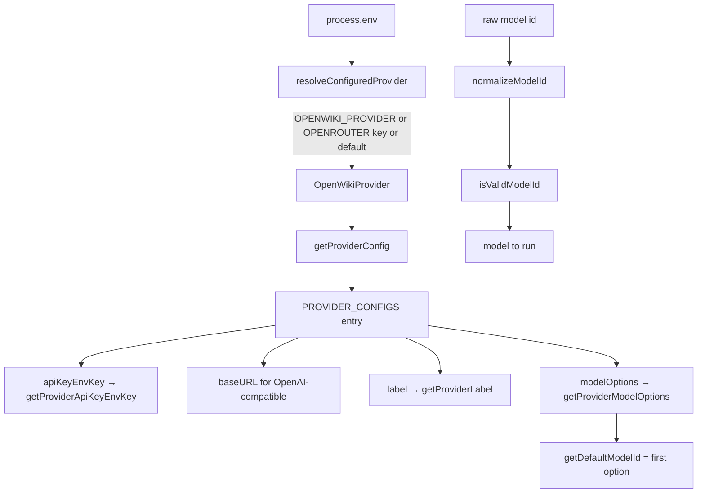

# Provider & model catalog — multi-provider routing

## Overview
`constants.ts` is the single source of truth for *which LLM runs OpenWiki*. Its centre is
[`PROVIDER_CONFIGS`](../catalog/src/constants.ts.md#PROVIDER_CONFIGS): a record keyed by
[`OpenWikiProvider`](../catalog/src/constants.ts.md#OpenWikiProvider)
(`anthropic | baseten | fireworks | openai | openrouter`) where each entry declares its API-key env var,
an optional OpenAI-compatible `baseURL`, a display label, and a curated list of model options. Everything
else in the module is a lookup or a validator over that table — resolving the configured provider from the
environment ([`resolveConfiguredProvider`](../catalog/src/constants.ts.md#resolveConfiguredProvider)),
picking a default model ([`getDefaultModelId`](../catalog/src/constants.ts.md#getDefaultModelId)), and
sanitizing user-supplied model/provider strings. For the survey, the takeaway is that OpenWiki treats the
*inference backend* as the configurable axis (five providers, BYO model id), whereas the code-analysis
backend is fixed (there is no code index to configure at all).

## Diagram

## Design rationale (why it's built this way)
**One config table, many accessors.** Rather than scatter provider knowledge, every provider fact is a
field on [`PROVIDER_CONFIGS`](../catalog/src/constants.ts.md#PROVIDER_CONFIGS) and every consumer reaches it
through a typed getter ([`getProviderConfig`](../catalog/src/constants.ts.md#getProviderConfig),
[`getProviderApiKeyEnvKey`](../catalog/src/constants.ts.md#getProviderApiKeyEnvKey),
[`getProviderLabel`](../catalog/src/constants.ts.md#getProviderLabel),
[`getProviderModelOptions`](../catalog/src/constants.ts.md#getProviderModelOptions)). Adding a provider is a
one-entry change; the README's "open a PR" invitation to add providers is realistic precisely because of this shape.

**OpenAI-compatible as the common denominator.** Baseten and Fireworks are just OpenAI-compatible endpoints,
so they carry only a `baseURL` and reuse the OpenAI client at runtime; Anthropic and OpenRouter get their
own clients. Encoding the `baseURL` here keeps the runtime `createModel` switch small.

**Provider resolution has a deliberate precedence.** [`resolveConfiguredProvider`](../catalog/src/constants.ts.md#resolveConfiguredProvider)
prefers an explicit `OPENWIKI_PROVIDER`, then infers `openrouter` if an OpenRouter key is present, then
falls back to the default provider. That "a present OpenRouter key implies OpenRouter" heuristic makes the
common setup (paste one OpenRouter key) work with no extra configuration.

**Defensive string validation.** [`isValidModelId`](../catalog/src/constants.ts.md#isValidModelId) enforces a
charset, a length ceiling, and no `://`, and [`normalizeProvider`](../catalog/src/constants.ts.md#normalizeProvider)
lowercases/trims before checking membership. Because model ids are user-supplied (CLI flag, env, interactive
prompt), this guards every entry path — the same validators are reused by the credential-store diagnostics.

## Entry points
- [`resolveConfiguredProvider`](../catalog/src/constants.ts.md#resolveConfiguredProvider) — the first thing
  the runtime and the TUI call to learn which provider is active.
- [`getDefaultModelId`](../catalog/src/constants.ts.md#getDefaultModelId) — supplies the model when neither a
  flag nor `OPENWIKI_MODEL_ID` is set; returns the provider's first
  [`modelOptions`](../catalog/src/constants.ts.md#ProviderConfig.typeLiteral1.modelOptions) entry.
- [`isValidModelId`](../catalog/src/constants.ts.md#isValidModelId) / [`normalizeModelId`](../catalog/src/constants.ts.md#normalizeModelId)
  — the sanitizers the CLI parser, the runtime, and the env diagnostics all share.

## Mechanism (step-by-step)
1. **Resolve provider.** [`resolveConfiguredProvider`](../catalog/src/constants.ts.md#resolveConfiguredProvider)
   maps the environment to one [`OpenWikiProvider`](../catalog/src/constants.ts.md#OpenWikiProvider) using
   [`normalizeProvider`](../catalog/src/constants.ts.md#normalizeProvider) and
   [`isValidProvider`](../catalog/src/constants.ts.md#isValidProvider).
2. **Look up its config.** [`getProviderConfig`](../catalog/src/constants.ts.md#getProviderConfig) indexes
   [`PROVIDER_CONFIGS`](../catalog/src/constants.ts.md#PROVIDER_CONFIGS); the label
   ([`getProviderLabel`](../catalog/src/constants.ts.md#getProviderLabel)), key env var
   ([`getProviderApiKeyEnvKey`](../catalog/src/constants.ts.md#getProviderApiKeyEnvKey)), and model list
   ([`getProviderModelOptions`](../catalog/src/constants.ts.md#getProviderModelOptions)) are read from it.
3. **Choose and validate the model.** If the caller gave no id, [`getDefaultModelId`](../catalog/src/constants.ts.md#getDefaultModelId)
   returns the first option (falling back to [`DEFAULT_MODEL_ID`](../catalog/src/constants.ts.md#DEFAULT_MODEL_ID));
   any supplied id is run through [`normalizeModelId`](../catalog/src/constants.ts.md#normalizeModelId) +
   [`isValidModelId`](../catalog/src/constants.ts.md#isValidModelId) before use.
4. **Expose the interactive menu.** [`SELECTABLE_OPENWIKI_PROVIDERS`](../catalog/src/constants.ts.md#SELECTABLE_OPENWIKI_PROVIDERS)
   orders the providers for the setup wizard and [`SUGGESTED_MODEL_IDS`](../catalog/src/constants.ts.md#SUGGESTED_MODEL_IDS)
   seeds default-provider suggestions.

## Key data structures
- [`PROVIDER_CONFIGS`](../catalog/src/constants.ts.md#PROVIDER_CONFIGS) — `Record<OpenWikiProvider, ProviderConfig>`;
  each `ProviderConfig` has `apiKeyEnvKey`, optional `baseURL`, `label`, and
  [`modelOptions`](../catalog/src/constants.ts.md#ProviderConfig.typeLiteral1.modelOptions) of
  `{`[`id`](../catalog/src/constants.ts.md#ProviderModelOption.typeLiteral0.id)`, `[`label`](../catalog/src/constants.ts.md#ProviderModelOption.typeLiteral0.label)`}`.
- Path constants [`OPEN_WIKI_DIR`](../catalog/src/constants.ts.md#OPEN_WIKI_DIR) (`openwiki/`) and
  [`UPDATE_METADATA_PATH`](../catalog/src/constants.ts.md#UPDATE_METADATA_PATH) (`openwiki/.last-update.json`)
  also live here — the only two filesystem locations OpenWiki hard-codes in the target repo.
- Env-key constants ([`OPENWIKI_PROVIDER_ENV_KEY`](../catalog/src/constants.ts.md#OPENWIKI_PROVIDER_ENV_KEY),
  [`OPENWIKI_MODEL_ID_ENV_KEY`](../catalog/src/constants.ts.md#OPENWIKI_MODEL_ID_ENV_KEY),
  [`OPENROUTER_API_KEY_ENV_KEY`](../catalog/src/constants.ts.md#OPENROUTER_API_KEY_ENV_KEY),
  [`ANTHROPIC_API_KEY_ENV_KEY`](../catalog/src/constants.ts.md#ANTHROPIC_API_KEY_ENV_KEY),
  [`OPENAI_API_KEY_ENV_KEY`](../catalog/src/constants.ts.md#OPENAI_API_KEY_ENV_KEY),
  [`FIREWORKS_API_KEY_ENV_KEY`](../catalog/src/constants.ts.md#FIREWORKS_API_KEY_ENV_KEY),
  [`BASETEN_API_KEY_ENV_KEY`](../catalog/src/constants.ts.md#BASETEN_API_KEY_ENV_KEY)) are the names shared
  with the credential store.

## Edge cases
- OpenRouter carries a fallback model list used by the runtime's route builder; that fallback behavior is
  documented on the [agent-runtime](openwiki-agent-index.ts.md) page (it lives in `createModelRoute`, not here).
- [`getDefaultModelId`](../catalog/src/constants.ts.md#getDefaultModelId) and
  [`DEFAULT_MODEL_ID`](../catalog/src/constants.ts.md#DEFAULT_MODEL_ID) both guard against an empty
  `modelOptions` list with a hard-coded fallback id, so a mis-edited config never yields an undefined model.

## Open questions
- Model option lists are curated constants (e.g. "GLM 5.2", "Kimi K2.7 Code", Claude/GPT ids); they drift
  from provider catalogs over time and are refreshed by hand rather than fetched.

## See also
- [Agent runtime — the deep-agent doc-writing loop](openwiki-agent-index.ts.md)
- [Credential store — ~/.openwiki/.env](openwiki-env.ts.md)
- [Interactive credential setup wizard](openwiki-credentials.tsx.md)
