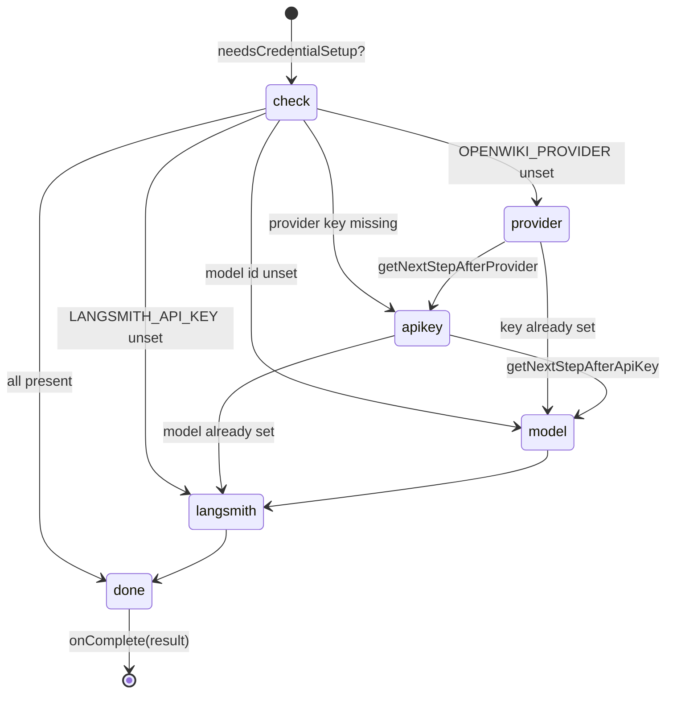

# Interactive credential setup wizard

## Overview
`credentials.tsx` is the Ink component that walks a first-time user through configuring OpenWiki:
pick a provider, paste an API key, choose a model, optionally add a LangSmith tracing key. The whole
thing is a small **step machine** — [`InitSetup`](../catalog/src/credentials.tsx.md#InitSetup) holds a
current `PromptStep` (`"provider" | "api-key" | "model" | "langsmith"`) and advances through only the
steps that are actually missing. The gate for whether the wizard runs at all is
[`needsCredentialSetup`](../catalog/src/credentials.tsx.md#needsCredentialSetup); the gate for *which*
step to start on is [`getInitialStep`](../catalog/src/credentials.tsx.md#getInitialStep). Each step
accumulates its value in React state and advances; the whole set is written **atomically at the end** in a
single `saveOpenWikiEnv` call, so a wizard abandoned mid-way persists nothing. Resumability comes instead
from the *environment*: on the next launch `getInitialStep` re-reads `process.env` and skips any step whose
value is already present (from a completed prior run or an exported variable).

## Diagram

## Design rationale (why it's built this way)
**Only ask what's missing.** [`getInitialStep`](../catalog/src/credentials.tsx.md#getInitialStep) and its
two successors ([`getNextStepAfterProvider`](../catalog/src/credentials.tsx.md#getNextStepAfterProvider),
[`getNextStepAfterApiKey`](../catalog/src/credentials.tsx.md#getNextStepAfterApiKey)) each check
`process.env` and skip a step whose value is already present. This is why a user who exported an
`OPENROUTER_API_KEY` is dropped straight to the model step, and why a fully-configured environment makes
[`needsCredentialSetup`](../catalog/src/credentials.tsx.md#needsCredentialSetup) return false and the wizard
never mounts. The step logic mirrors [`resolveConfiguredProvider`](../catalog/src/constants.ts.md#resolveConfiguredProvider)'s
precedence so the wizard and the runtime agree on what "configured" means.

**One atomic commit, not per-step saves.** Values are held in React state as the user advances; only when a
step has no successor does `completeSetup` run, building one `updates` object and issuing a single
`saveOpenWikiEnv` (also enabling LangSmith tracing env vars when a LangSmith key was given). Committing once
avoids leaving a half-configured `~/.openwiki/.env` if the user quits mid-wizard. The reported
`InitSetupResult` records *what* was saved (`savedProvider`, `savedApiKey`, `savedModelId`,
`savedLangSmithKey`) so the caller can render an accurate "here's what I stored" summary.

**Presets plus an escape hatch.** The model step lists the provider's curated
[`getProviderModelOptions`](../catalog/src/constants.ts.md#getProviderModelOptions) via
[`getModelSelectionOptions`](../catalog/src/credentials.tsx.md#getModelSelectionOptions), but always appends a
"custom" option so a user can type any model id the provider supports — matching the README's promise that
each provider accepts a custom model id.

**`modelIdOverride` short-circuits the model step.** When the run was launched with `--modelId`, that override
is treated as already-chosen, so [`getInitialStep`](../catalog/src/credentials.tsx.md#getInitialStep) skips the
model prompt — the flag wins over interactive selection for that run.

## Entry points
- [`needsCredentialSetup`](../catalog/src/credentials.tsx.md#needsCredentialSetup) — called by the TUI's `App`
  to decide whether to render the wizard before a run.
- [`InitSetup`](../catalog/src/credentials.tsx.md#InitSetup) — the component itself; on finish it calls
  `onComplete` with an `InitSetupResult`, on failure `onError`.

## Mechanism (step-by-step)
1. **Decide the starting step.** On mount, [`InitSetup`](../catalog/src/credentials.tsx.md#InitSetup) computes
   [`getInitialStep`](../catalog/src/credentials.tsx.md#getInitialStep); if it is `null` (nothing missing) it
   immediately calls `onComplete` and renders nothing further.
2. **Render the current prompt.** [`Prompt`](../catalog/src/credentials.tsx.md#Prompt) switches on the step:
   a provider list ([`SELECTABLE_OPENWIKI_PROVIDERS`](../catalog/src/constants.ts.md#SELECTABLE_OPENWIKI_PROVIDERS)),
   a masked API-key input, a model list from
   [`getModelSelectionOptions`](../catalog/src/credentials.tsx.md#getModelSelectionOptions), or a LangSmith
   key input. [`SetupStep`](../catalog/src/credentials.tsx.md#SetupStep) rows show the checklist progress with
   details from [`getProviderSetupDetail`](../catalog/src/credentials.tsx.md#getProviderSetupDetail) and
   [`getModelSetupDetail`](../catalog/src/credentials.tsx.md#getModelSetupDetail).
3. **Advance, accumulating state.** Selecting a provider records it and computes the next step via
   [`getNextStepAfterProvider`](../catalog/src/credentials.tsx.md#getNextStepAfterProvider); entering a key
   records it and calls [`getNextStepAfterApiKey`](../catalog/src/credentials.tsx.md#getNextStepAfterApiKey);
   choosing a model resolves the id with [`getSelectedModelId`](../catalog/src/credentials.tsx.md#getSelectedModelId)
   (preset or custom). None of these write to disk yet — each just updates state and moves on.
4. **Commit once, then finish.** When a step has no successor, `completeSetup` assembles the accumulated
   provider/key/model/LangSmith values into one payload and writes it via
   [`saveOpenWikiEnv`](../catalog/src/env.ts.md#saveOpenWikiEnv), then [`InitSetup`](../catalog/src/credentials.tsx.md#InitSetup)
   reports the `InitSetupResult` to `onComplete` and the `App` transitions to the actual run.

## Key data structures
- `PromptStep` — the four-value step enum that sequences the wizard.
- `ModelSelectionOption` — a `preset {id,label}` or `custom` marker; [`getModelSelectionOptions`](../catalog/src/credentials.tsx.md#getModelSelectionOptions)
  builds the list and [`getModelSelectionIndex`](../catalog/src/credentials.tsx.md#getModelSelectionIndex)
  seeds the initial highlight from the current/default model.
- `InitSetupResult` — `{provider, modelId, savedProvider, savedApiKey, savedModelId, savedLangSmithKey}`,
  the outcome handed back to the TUI.

## Edge cases
- Selecting a provider re-seeds the model highlight to that provider's default (via
  [`getModelSelectionIndex`](../catalog/src/credentials.tsx.md#getModelSelectionIndex)), but nothing is written
  to disk until `completeSetup` runs — abandoning the wizard after the provider step saves nothing.
- The LangSmith step is optional tracing setup; skipping it is a valid completion (the key stays unset). When
  a LangSmith key *is* given, `completeSetup` also sets `LANGCHAIN_PROJECT=openwiki` and `LANGCHAIN_TRACING_V2=true`.
- A model highlight index is clamped to the current option list so switching providers can't leave the cursor
  out of range ([`getModelSelectionIndex`](../catalog/src/credentials.tsx.md#getModelSelectionIndex)).

## Open questions
- The step machine's "skip" decisions read the *pre-existing* `process.env` (what was already configured
  before this session), while the values entered *during* the wizard live in React state until the final
  commit. So a step is shown based on whether a value was already set, not on what the user just typed — a
  subtlety when reasoning about `getNextStepAfterProvider`/`getNextStepAfterApiKey` in isolation.

## See also
- [Credential store — ~/.openwiki/.env](openwiki-env.ts.md)
- [Provider & model catalog — multi-provider routing](openwiki-constants.ts.md)
- [TUI orchestration — the Ink app & run lifecycle](openwiki-cli.tsx.md)
