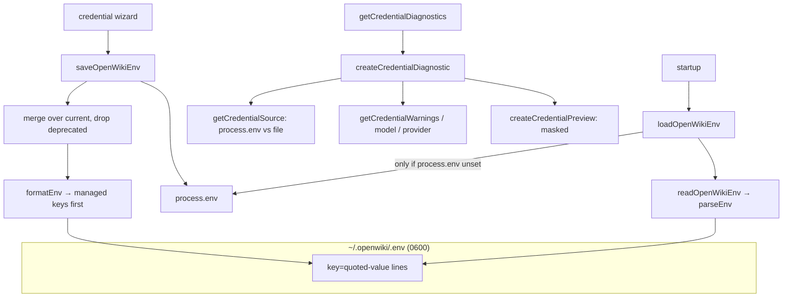

# Credential store — ~/.openwiki/.env load, save, and diagnose

## Overview
`env.ts` is OpenWiki's little home-directory secrets manager. It owns one file —
[`openWikiEnvPath`](../catalog/src/env.ts.md#openWikiEnvPath) (`~/.openwiki/.env`) — and three verbs over
it: **load** it into `process.env` at startup ([`loadOpenWikiEnv`](../catalog/src/env.ts.md#loadOpenWikiEnv)),
**save** provider/model/key updates back to it ([`saveOpenWikiEnv`](../catalog/src/env.ts.md#saveOpenWikiEnv)),
and **diagnose** what is currently configured and where each value came from
([`getCredentialDiagnostics`](../catalog/src/env.ts.md#getCredentialDiagnostics)). The whole module exists so
a user configures OpenWiki once (interactively) and every later run just works, while never printing a raw
secret. It handles only a fixed allow-list of keys ([`managedEnvKeys`](../catalog/src/env.ts.md#managedEnvKeys))
and applies restrictive file permissions.

## Diagram

## Design rationale (why it's built this way)
**File is a fallback, environment wins.** [`loadOpenWikiEnv`](../catalog/src/env.ts.md#loadOpenWikiEnv) only
sets a key from the file when `process.env[key]` is `undefined`, so an ambient/CI-injected variable always
overrides the saved file. The diagnostics make that precedence visible: `getCredentialSource` reports
`"process.env over ~/.openwiki/.env"` when both exist, which is invaluable when a stale saved key masks (or
is masked by) an exported one.

**Secrets are never rendered raw.** Diagnostics deliberately expose only a length and a masked
[`preview`](../catalog/src/env.ts.md#CredentialDiagnostic.typeLiteral6.preview) —
[`createCredentialPreview`](../catalog/src/env.ts.md#createCredentialPreview) shows `first6...last4` for long
values and all-asterisks for short ones — so the setup UI can confirm "a key is present and looks right"
without leaking it. Model id and provider are the only values shown verbatim, because they aren't secret.

**Warnings catch the paste-mistakes that actually happen.** [`getCredentialWarnings`](../catalog/src/env.ts.md#getCredentialWarnings)
flags leading/trailing whitespace, embedded newlines, quote characters, and bracketed suffixes — the exact
corruption you get from copying a key out of a web dashboard. Model and provider get their own semantic
checks ([`getModelWarnings`](../catalog/src/env.ts.md#getModelWarnings) reuses
[`isValidModelId`](../catalog/src/constants.ts.md#isValidModelId);
[`getProviderWarnings`](../catalog/src/env.ts.md#getProviderWarnings) reuses
[`normalizeProvider`](../catalog/src/constants.ts.md#normalizeProvider)).

**Restrictive permissions, atomic-ish write.** [`saveOpenWikiEnv`](../catalog/src/env.ts.md#saveOpenWikiEnv)
creates the dir `0700` and the file `0600` and `chmod`s them explicitly, so a home-directory secrets file is
not world-readable even if the umask is loose.

## Entry points
- [`loadOpenWikiEnv`](../catalog/src/env.ts.md#loadOpenWikiEnv) — invoked at process start and again inside
  the agent runtime before resolving the provider; hydrates `process.env` from the saved file.
- [`saveOpenWikiEnv`](../catalog/src/env.ts.md#saveOpenWikiEnv) — called by the TUI's provider/model pickers
  and the setup wizard whenever the user chooses a provider, model, or pastes a key.
- [`getCredentialDiagnostics`](../catalog/src/env.ts.md#getCredentialDiagnostics) — called by the TUI to show
  a credential panel when diagnostics are enabled or a run fails.

## Mechanism (step-by-step)
1. **Parse the dotenv-ish file.** [`readOpenWikiEnv`](../catalog/src/env.ts.md#readOpenWikiEnv) reads the file
   (returning `{}` if absent) and [`parseEnv`](../catalog/src/env.ts.md#parseEnv) splits lines, skips
   comments/blank lines, requires an uppercase `KEY` shape, and unescapes quoted values via
   [`parseEnvValue`](../catalog/src/env.ts.md#parseEnvValue) (handling `\n`, `\"`, `\\`).
2. **Load without clobbering.** For each parsed pair, [`loadOpenWikiEnv`](../catalog/src/env.ts.md#loadOpenWikiEnv)
   skips [`deprecatedEnvKeys`](../catalog/src/env.ts.md#deprecatedEnvKeys) and only assigns when the env var is
   currently unset.
3. **Merge and serialize on save.** [`saveOpenWikiEnv`](../catalog/src/env.ts.md#saveOpenWikiEnv) re-reads the
   current file, spreads the updates over it, drops deprecated keys, and rewrites via
   [`formatEnv`](../catalog/src/env.ts.md#formatEnv) — which orders [`managedEnvKeys`](../catalog/src/env.ts.md#managedEnvKeys)
   first (only those that are set) then any extras sorted, each value quoted/escaped by
   [`formatEnvValue`](../catalog/src/env.ts.md#formatEnvValue). It then mirrors the updates into `process.env`
   so the current run sees them immediately.
4. **Build diagnostics.** [`getCredentialDiagnostics`](../catalog/src/env.ts.md#getCredentialDiagnostics) calls
   [`createCredentialDiagnostic`](../catalog/src/env.ts.md#createCredentialDiagnostic) per key, which resolves
   the effective value (env over file), computes the source with
   [`getCredentialSource`](../catalog/src/env.ts.md#getCredentialSource), and attaches masked preview + warnings.

## Key data structures
- [`CredentialDiagnostic`](../catalog/src/env.ts.md#CredentialDiagnostic) — per-key report of
  [`source`](../catalog/src/env.ts.md#CredentialDiagnostic.typeLiteral6.source),
  [`length`](../catalog/src/env.ts.md#CredentialDiagnostic.typeLiteral6.length),
  [`preview`](../catalog/src/env.ts.md#CredentialDiagnostic.typeLiteral6.preview), and
  [`warnings`](../catalog/src/env.ts.md#CredentialDiagnostic.typeLiteral6.warnings). It is the value the TUI's
  credential panel renders.
- [`EnvMap`](../catalog/src/env.ts.md#EnvMap) — the plain `Record<string,string>` used for both the parsed file
  and the update payload.
- [`managedEnvKeys`](../catalog/src/env.ts.md#managedEnvKeys) — the allow-list (provider/model/all API keys plus
  LangSmith tracing keys) that defines what OpenWiki will write and diagnose; unrelated keys in the file are
  preserved but sorted after.

## Edge cases
- A missing file is not an error — [`readOpenWikiEnv`](../catalog/src/env.ts.md#readOpenWikiEnv) swallows ENOENT
  via [`isFileNotFoundError`](../catalog/src/env.ts.md#isFileNotFoundError) and returns `{}`.
- Deprecated OpenAI base-url/org/project keys are actively stripped on both load and save, so an old config
  cannot silently re-point the OpenAI client.
- Keys whose names don't match `^[A-Z_][A-Z0-9_]*$` are dropped by [`parseEnv`](../catalog/src/env.ts.md#parseEnv),
  protecting against malformed lines.

## Open questions
- The store is a flat single file with no profiles/namespaces, so one machine has exactly one OpenWiki
  credential set shared across all repos.

## See also
- [Provider & model catalog — multi-provider routing](openwiki-constants.ts.md)
- [Interactive credential setup wizard](openwiki-credentials.tsx.md)
- [Agent runtime — the deep-agent doc-writing loop](openwiki-agent-index.ts.md)
