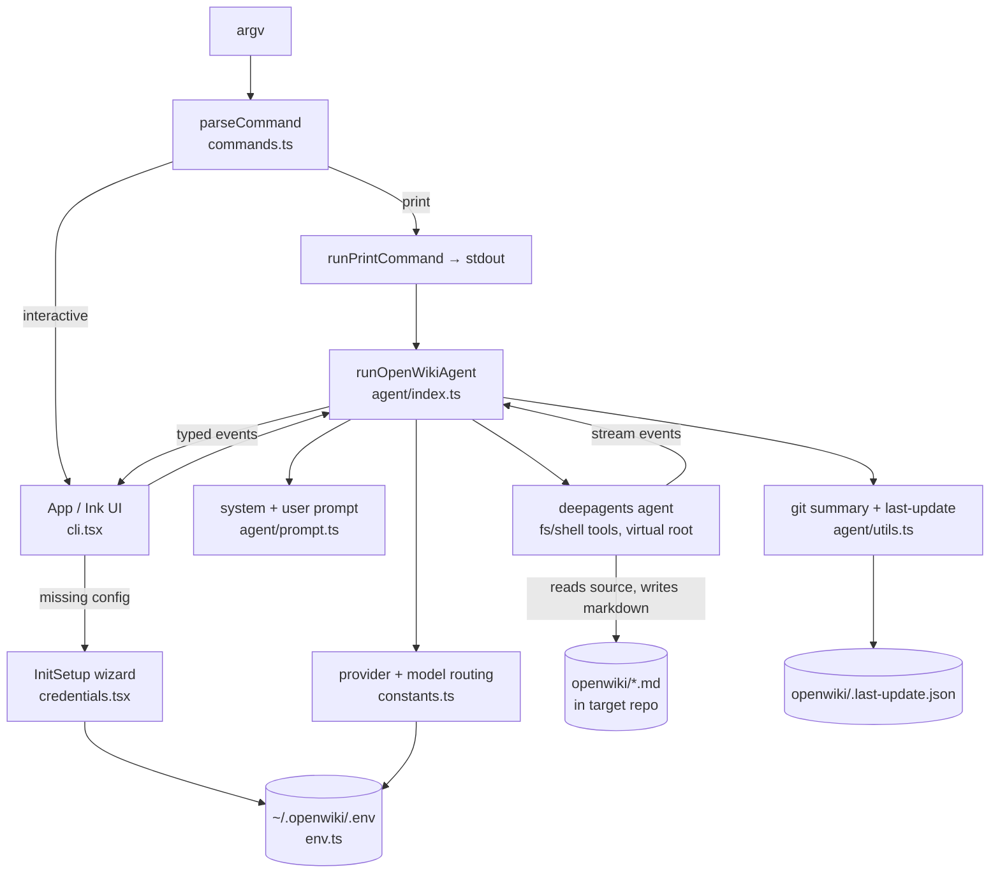

# openwiki — what it is and how it fits together

## In one paragraph
OpenWiki (by LangChain) is a CLI that writes and maintains a project's documentation **by turning an LLM
agent loose on the repository**. Where the other tools in this survey build a structured representation of
code first — a SCIP index, a symbol/call graph, AST extraction — OpenWiki has no code index at all: it
constructs a `deepagents` agent whose only tools are the built-in filesystem/shell toolset (`ls`,
`read_file`, `grep`, `write_file`, `edit_file`, `execute`), points it at the target repo through a virtual
filesystem root, and steers it entirely with a long system prompt to read source and write Markdown into an
`openwiki/` directory. "Grounding" is therefore a *prompt instruction* ("ground every important claim in
source files, docs, or git evidence") rather than a mechanical build gate. The engineering that surrounds
that idea is real, though: multi-provider model routing with fallback, a git-anchored incremental-update
mode, a defensive stream-event parser, a home-directory credential store, and an Ink terminal UI that
renders the agent's progress live. For the code-comprehension survey, OpenWiki is the "agent-native,
prompt-grounded" pole opposite the "index-and-graph, machine-grounded" pole of wikify-repo and graphify.

## Core architecture

The spine: **argv → parsed command → (print | Ink app) → agent run → deep-agent over the repo → Markdown +
metadata**. Configuration (provider, model, keys) flows in from `~/.openwiki/.env` and the interactive
wizard; the git-diff context and last-update metadata flow in to make `update` runs incremental.

## Main concepts
- **Agent runtime — the doc-writing loop.** The core: build a `deepagents` agent with a virtual-root shell
  backend and no custom tools, stream its output, and commit metadata only if the docs actually changed. This
  is where model routing, fallback/retry, and change detection live. See
  [Agent runtime](concepts/openwiki-agent-index.ts.md).
- **Prompt-as-grounding.** OpenWiki's "how it represents and grounds code" answer is a ~130-line system
  prompt: discovery discipline, subagent rules, git usage, security rules, and the requirement to ground
  claims in inspected source. There is no citation linter — the prompt *is* the contract. (Covered within the
  [Agent runtime](concepts/openwiki-agent-index.ts.md) page and its `createSystemPrompt`/`createUserPrompt`
  citations.)
- **Incremental reconcile (git-anchored, prose-shaped).** `update` mode records the last successful run's
  `gitHead` in `openwiki/.last-update.json`, feeds `git log <head>..HEAD` to the model, and uses a whole-tree
  content hash to decide whether the baseline advanced. Advisory (prompt-enforced), not mechanically gated —
  the survey contrast with symbol-diff reconcile. See [Agent runtime](concepts/openwiki-agent-index.ts.md)
  and the cross-repo [`incremental-reconcile`](../../concepts/incremental-reconcile.md).
- **The run contract.** Three commands (`chat`/`init`/`update`), a four-variant event union, run options, and
  update metadata — the small type surface that decouples the runtime from the UI. See
  [Run contract](concepts/openwiki-agent-types.ts.md).
- **Multi-provider model catalog.** One `PROVIDER_CONFIGS` table drives five providers (Anthropic, OpenAI,
  OpenRouter, Fireworks, Baseten) with BYO model ids; OpenRouter additionally gets a fallback route. The
  *inference backend* is the configurable axis. See [Provider & model catalog](concepts/openwiki-constants.ts.md).
- **Credential store + setup wizard.** A `0600` `~/.openwiki/.env` with env-over-file precedence, masked
  diagnostics, and paste-corruption warnings, configured by a resumable step-machine wizard that only asks for
  what's missing. See [Credential store](concepts/openwiki-env.ts.md) and
  [Credential setup wizard](concepts/openwiki-credentials.tsx.md).
- **TUI orchestration.** An Ink app that is a `RunState` machine (`idle→running→success|error`), folds the
  event stream into a grouped run log, and extracts secret-redacted error diagnostics from failed provider
  calls. See [TUI orchestration](concepts/openwiki-cli.tsx.md); CLI parsing is in
  [CLI command parsing](concepts/openwiki-commands.ts.md).

## How a request flows
`openwiki --update` → `parseCommand` yields a `run` command → the entry point loads `~/.openwiki/.env` and,
in a TTY without full config, mounts the credential wizard → `App` launches `runOpenWikiAgent` → the runtime
resolves provider/model/key, builds the git summary and pre-run content snapshot, constructs the deep-agent
with the mode-specific prompt, and streams → the agent reads changed files (per the `gitHead..HEAD` diff) and
edits the implicated `openwiki/` pages → on a real content change the runtime writes a new `.last-update.json`
→ the TUI renders the run log and (for a one-shot run) exits.

## Where OpenWiki sits in the survey
- **Representation:** the source itself, read on demand by an agent — no persistent code index, graph, or
  embeddings.
- **Grounding:** prompt-instructed, not verified. Nearest neighbor conceptually is "an agent with good
  discipline"; farthest from wikify-repo's "no SCIP symbol → no citation" gate.
- **Incrementality:** git-commit diff + content hash, model-driven surgical edits.
- **Breadth:** language-agnostic for free (no per-language indexer), at the cost of mechanical verifiability.

## Map of the wiki
- *"What actually runs when I type `openwiki --init`?"* → [Agent runtime](concepts/openwiki-agent-index.ts.md).
- *"How does it decide what to update?"* → [Agent runtime](concepts/openwiki-agent-index.ts.md) (Incremental
  reconcile section).
- *"What types cross the runtime/UI boundary?"* → [Run contract](concepts/openwiki-agent-types.ts.md).
- *"Which models/providers, and how is one chosen?"* → [Provider & model catalog](concepts/openwiki-constants.ts.md).
- *"Where are my keys stored and how safely?"* → [Credential store](concepts/openwiki-env.ts.md).
- *"What's the first-run setup flow?"* → [Credential setup wizard](concepts/openwiki-credentials.tsx.md).
- *"How is progress rendered / how do I read an error?"* → [TUI orchestration](concepts/openwiki-cli.tsx.md).
- *"What are the exact CLI flags?"* → [CLI command parsing](concepts/openwiki-commands.ts.md).
- Exhaustive per-module symbol index → [`catalog/`](catalog/); concept table → [`index.md`](index.md).
