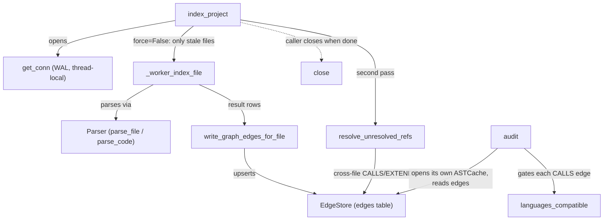

# AST Cache — the SQLite index everything else reads from

## Overview

[`ASTCache`](../catalog/tree_sitter_analyzer/ast_cache.md#ASTCache) is the one persisted index every other tree-sitter-analyzer
subsystem reads from: one SQLite database per project (`.ast-cache/index.db`) holding, per file,
its extracted symbols/imports/structure as JSON plus a `(mtime_ns, file_size, extractor_version)`
staleness fingerprint. Its author-stated intent — "re-analysis of unchanged files is a simple DB
lookup" — is literal: [`index_project`](../catalog/tree_sitter_analyzer/ast_cache.md#ASTCache.index_project) walks the whole project but only
feeds files whose fingerprint changed into the tree-sitter parse+extract path, so a warm re-index
over a large repo touches file *content* only for files that actually changed, and a `force=True`
run is a genuinely different code path — an explicit `DELETE FROM ast_index` followed by a full
repopulation, not a euphemism for "reindex everything through the same incremental check." Every
downstream reader — [`build`](../catalog/tree_sitter_analyzer/import_graph.md#ImportGraph.build) (import graph), [`build`](../catalog/tree_sitter_analyzer/knowledge_graph/builder.md#KnowledgeGraphBuilder.build) (knowledge-graph
projection), [`build`](../catalog/tree_sitter_analyzer/dependency_matrix.md#DependencyMatrix.build) (dependency matrix), [`analyze_dead_code`](../catalog/tree_sitter_analyzer/dead_code_analyzer.md#analyze_dead_code), and the
family-gating [`audit`](../catalog/tree_sitter_analyzer/miswire_audit.md#audit) — constructs its own `ASTCache` against the same on-disk path rather than
sharing a live process, so the SQLite file itself *is* the shared index; there is no cache server.

## Diagram

## Design rationale (why it's built this way)

**Two-tier staleness check, not one.** The bulk path (`index_project`'s per-file walk) compares only
the cheap triple `(mtime_ns, file_size, extractor_version)` against a fresh `os.stat()` — no file is
opened or hashed just to decide whether to *skip* it. Reading the source shows a second, stricter
check exists on the single-file `index_file` path: if the cheap triple looks stale, it still reads
the file and compares a SHA-256 content hash before committing to a re-parse, updating just the
stat columns when the hash matches. That means a bulk `index_project()` run trusts mtime+size as
sufficient — a git checkout that resets every file's mtime without changing a byte will make the
*bulk* path reparse everything, even though the *single-file* path would have caught the false
positive. This is a genuine, deliberate asymmetry: the bulk path optimizes for "don't touch disk
content on the common case of nothing changed," the single-file path (used by watch/incremental
callers) optimizes for "never redundantly reparse," and they pay different costs to get there.

**A version integer, not a schema migration, forces re-extraction.** `index_project`'s own inline
comment history (v3 through v14) shows that whenever the *extraction logic* changes shape — a new
symbol kind, a corrected walker depth cap, a corrected complexity number — the extractor-version
integer bumps, and every row whose stored version is lower than the new one is treated as stale on
the next walk, without a DB migration or wiping the cache. The staleness check in [`index_project`](../catalog/tree_sitter_analyzer/ast_cache.md#ASTCache.index_project)
is therefore not just "did the file change" but "did the file change *or* did the code that reads
the file change" — both dimensions of incrementality collapse into the same three-column compare.

**A full rebuild is guarded by a persisted marker, not just a lock.** The `force=True` branch inside
[`index_project`](../catalog/tree_sitter_analyzer/ast_cache.md#ASTCache.index_project) marks a build-in-progress flag and clears the call-graph-built flag *before*
issuing the `DELETE FROM ast_index`, and both the mark and the delete live inside the same `try` so
the `finally` clears the marker even if the delete itself raises (e.g. `SQLITE_FULL`). Without that
ordering, a failed rebuild would leave the marker stuck until its TTL expires, and concurrent
readers on other connections or processes would have no signal that the table they're reading is
mid-rebuild.

## Entry points

- [`index_project`](../catalog/tree_sitter_analyzer/ast_cache.md#ASTCache.index_project) — the workhorse: walks every source file under the project root and,
  per the staleness fingerprint above, dispatches only the changed subset to `Parser`/extraction;
  `resolve_only=True` skips parsing entirely and only re-runs cross-file resolution over what's
  already indexed, which is how a caller re-converges edges after an unrelated change elsewhere.
- [`get_conn`](../catalog/tree_sitter_analyzer/ast_cache.md#ASTCache.get_conn) / [`_get_conn`](../catalog/tree_sitter_analyzer/ast_cache.md#ASTCache._get_conn) — control reaches here on the first SQL operation any thread performs;
  each thread lazily opens its own WAL-mode connection, so `ASTCache` is safe to share across
  threads but never hands out one connection object to more than one thread.
- [`audit`](../catalog/tree_sitter_analyzer/miswire_audit.md#audit) — control reaches this when a caller wants to *validate* the family-gating claim
  itself: it opens (and, by default, reindexes) an `ASTCache` for `project_root`, then reads the
  same persisted `edges` rows the call graph reads, cross-checking each one with
  [`languages_compatible`](../catalog/tree_sitter_analyzer/_language_family.md#languages_compatible) — the audit and the call graph are not two separate analyses of two
  separate indexes, they are two readers of one cache.
- [`_ensure_ast_cache`](../catalog/tree_sitter_analyzer/mcp/tools/utils/change_impact_analysis.md#_ensure_ast_cache) — the guard MCP tools call instead of managing an `ASTCache` lifecycle
  themselves: "auto-indexing if the cache is empty or stale" means an agent-facing tool never has
  to know whether a project has been indexed before it asks a structural question.
- [`close`](../catalog/tree_sitter_analyzer/ast_cache.md#ASTCache.close) — every one of the `build`/`analyze_dead_code`/`audit`-style consumers above reaches
  this once it's done reading, releasing the thread-local connection it opened; because each
  consumer constructs its own `ASTCache`, this is called far more often, and by far more call sites,
  than `index_project` itself.

## Mechanism (step-by-step)

1. [`index_project`](../catalog/tree_sitter_analyzer/ast_cache.md#ASTCache.index_project) first decides its own mode: `resolve_only=True` short-circuits straight to
   re-resolving cross-file references over the existing index (no parsing at all); `force=True`
   enters the full-rebuild branch described above; the default (`force=False`) walks the project and
   partitions files into "fingerprint unchanged, skip" versus "changed or new, reparse" using the
   triple described in Design rationale — this partition is what makes a warm re-index over an
   otherwise-unchanged 20,000-file project resolve in a handful of `stat()` calls rather than
   20,000 re-parses.
2. Each candidate file is hashed for language via [`_language_from_ext`](../catalog/tree_sitter_analyzer/project_graph.md#_language_from_ext), then handed to
   [`_worker_index_file`](../catalog/tree_sitter_analyzer/_ast_extraction.md#_worker_index_file), the picklable, module-level function `index_project` dispatches
   to a spawn process pool when there are enough candidates to make parallelism worth it. It matters
   that this function is module-level and picklable: [`Parser`](../catalog/tree_sitter_analyzer/core/parser.md#Parser)'s [`tree`](../catalog/tree_sitter_analyzer/core/parser.md#ParseResult.tree) is a live tree-sitter C
   object that cannot cross a process boundary, so the worker discards it as soon as it has pulled
   symbols/imports/call-edges out via [`parse_file`](../catalog/tree_sitter_analyzer/core/parser.md#Parser.parse_file)/[`parse_code`](../catalog/tree_sitter_analyzer/core/parser.md#Parser.parse_code) and only ships back
   JSON-serializable results.
3. [`write_graph_edges_for_file`](../catalog/tree_sitter_analyzer/_ast_cache_write.md#write_graph_edges_for_file) refreshes the unified `edges` table for that one file from
   whatever was just extracted, keyed through [`symbol_node`](../catalog/tree_sitter_analyzer/graph/edge_store.md#symbol_node)'s stable file-scoped ids and typed by
   [`EdgeKind`](../catalog/tree_sitter_analyzer/graph/edge_store.md#EdgeKind) (a CALLS edge, for instance, uses the [`CALLS`](../catalog/tree_sitter_analyzer/graph/edge_store.md#EdgeKind.CALLS) member). A `preserve_calls`
   flag lets a caller rebuild only the structural edges (EXTENDS/CONTAINS/IMPORTS) while leaving
   existing CALLS rows — and their already-resolved cross-file target column — untouched; this is
   the difference between "this file was reparsed, its edges are fresh" and "this file's cached
   symbols are being re-projected into edges without a reparse."
4. Because a single file's call edges can reference a symbol defined in *another* file that hasn't
   been visited yet, [`resolve_unresolved_refs`](../catalog/tree_sitter_analyzer/_ast_cache_unresolved.md#resolve_unresolved_refs) runs as a second pass after the per-file writes:
   it iterates the persisted index in file order, recomputes each file's still-pending references,
   and upserts each one into a resolved `EXTENDS` edge or updates a `CALLS` edge's resolution
   columns — [`test_resolve_only_does_not_reparse`](../catalog/tests/unit/test_unresolved_refs.md#test_resolve_only_does_not_reparse)'s own docstring states the invariant
   this exists to guarantee: "a warm cache resolves pending cross-file refs without re-parsing."
5. [`audit`](../catalog/tree_sitter_analyzer/miswire_audit.md#audit) is the mechanism that makes the survey's family-gating claim checkable rather
   than asserted: it reads every `calls`-kind edge the steps above wrote, and for each one whose
   callee resolved to a concrete file, asks [`languages_compatible`](../catalog/tree_sitter_analyzer/_language_family.md#languages_compatible) whether the caller's
   language may legitimately bind to the resolved file's language — a "mis-wire" is counted only
   when the *actual persisted resolution*, not a hypothetical, crossed an incompatible language
   boundary. Because `audit` reads from the same `ASTCache` the rest of the system populates, this
   is a check against ground truth, not a separate simulation.

## Key data structures

- **`ast_index` table** (columns visible through `index_project`/`_worker_index_file`'s writes):
  one row per file — `file_path`, `content_hash`, `language`, `mtime_ns`, `file_size`,
  `extractor_version`, and the three JSON blobs (symbols/imports/structure) plus an `indexed_at`
  timestamp. This row *is* the staleness fingerprint described above; nothing else needs to be read
  to decide whether a file needs reparsing.
- **`edges` table**, exposed through [`EdgeStore`](../catalog/tree_sitter_analyzer/graph/edge_store.md#EdgeStore) and populated by `write_graph_edges_for_file`:
  each row is an [`Edge`](../catalog/tree_sitter_analyzer/graph/edge_store.md#Edge) — "one directed relationship between two indexed code nodes" — typed
  by [`EdgeKind`](../catalog/tree_sitter_analyzer/graph/edge_store.md#EdgeKind) (`calls`/`contains`/`extends`/`imports`) and addressed at each end by
  [`symbol_node`](../catalog/tree_sitter_analyzer/graph/edge_store.md#symbol_node)'s stable, file-scoped node id. This table, not the per-file JSON blobs, is what
  `audit`, the call graph, and the dependency matrix actually query.
- **The thread-local connection** returned by [`get_conn`](../catalog/tree_sitter_analyzer/ast_cache.md#ASTCache.get_conn): WAL journal mode plus
  `synchronous=NORMAL` and a `Row` row factory, created lazily per thread. `ASTCache` itself holds
  no shared cursor or transaction state across threads — every reader/writer path re-derives its
  connection from `self._local`.

## Dynamics (design intent)

Parallel indexing is a multiprocessing *spawn* pool over [`_worker_index_file`](../catalog/tree_sitter_analyzer/_ast_extraction.md#_worker_index_file), not
threads — the natural consequence of [`Parser`](../catalog/tree_sitter_analyzer/core/parser.md#Parser)'s [`tree`](../catalog/tree_sitter_analyzer/core/parser.md#ParseResult.tree) being an unpicklable C object: sharing
parse state across threads inside one process was never on the table, so the design instead
partitions files across processes and lets each worker parse independently, returning only
plain-data results. `index_project` only takes this path once there are enough stale candidates to
be worth the process-pool startup cost; a small incremental delta runs in-process, single-threaded.

> [!inferred] The exact worker-count heuristic (an environment-variable override, then an
> auto-detected default tied to file count and CPU count) is visible in the surrounding module but
> its specific thresholds live in a helper outside this packet's cited subgraph — treat the
> parallel/serial split as real but the exact cutover point as unconfirmed here.

[`test_candidate_cache_collapses_duplicate_selects`](../catalog/tests/unit/test_unresolved_refs_cache_parity.md#test_candidate_cache_collapses_duplicate_selects)'s own docstring — "the cache must
issue far fewer candidate SELECTs than the uncached path" — and
[`test_cached_candidate_lookup_matches_uncached_byte_for_byte`](../catalog/tests/unit/test_unresolved_refs_cache_parity.md#test_cached_candidate_lookup_matches_uncached_byte_for_byte)'s — "cached pass ==
uncached pass: identical edge snapshot + identical stats" — together state the invariant the whole
incremental design has to satisfy: caching is only allowed to change *how fast* resolution
converges, never *what* it converges to. [`test_index_project_resolves_cross_file_extends_and_calls`](../catalog/tests/unit/test_unresolved_refs.md#test_index_project_resolves_cross_file_extends_and_calls)
exercises the end-to-end path this page describes: index, then confirm cross-file EXTENDS/CALLS
edges landed.

## Edge cases

- **Deletions are not reconciled by the incremental path.** Reading `audit`'s own source turns up
  an explicit note (tagged as a prior Codex review comment) that an incremental reindex does *not*
  purge `ast_index` rows for files deleted since the last index — so the cache can carry stale
  definitions and edges for files that no longer exist on disk. `audit` works around this locally by
  filtering to files it can confirm still exist before counting mis-wires; nothing in the packet's
  subgraph shows a general-purpose garbage-collection pass for deleted files, so any other reader
  of `ast_index`/`edges` inherits the same staleness risk unless it does the same filtering.
- **The bulk incremental path has no content-hash fallback.** As described above, only the
  single-file path absorbs a mtime-only change; a project-wide `index_project()` run after a
  mtime-resetting operation (e.g. certain checkout/deploy flows) reparses every file even though
  nothing changed byte-for-byte — "incremental" here means "keyed off file identity + fingerprint,"
  not "immune to false-positive staleness."
- **A schema/extraction-logic upgrade silently forces a full re-walk** the next time `index_project`
  runs, because every existing row's `extractor_version` now compares as stale — this is intentional
  (Design rationale above) but means a version bump and a "nothing in my repo changed" re-index can
  look identical in cost to the caller.

## Open questions

- The exact TTL after which a stuck build-in-progress marker is treated as abandoned is referenced
  by the source's own comments but the marker-management functions themselves sit outside this
  packet's cited subgraph, so the concrete duration isn't verifiable from what's cited here.
- Whether any consumer besides `audit` performs its own deleted-file filtering, or whether stale
  rows for deleted files persist indefinitely in the general call-graph/dependency-matrix read
  paths, isn't settled by the symbols available to this page.

## See also

- [`tree_sitter_analyzer-call_graph`](tree_sitter_analyzer-call_graph.md) — the primary consumer of
  the `edges` table this cache writes.
- [`tree_sitter_analyzer-core-parser`](tree_sitter_analyzer-core-parser.md) — the `Parser`/`ParseResult`
  machinery `_worker_index_file` drives.
- [`tree_sitter_analyzer-plugins-manager`](tree_sitter_analyzer-plugins-manager.md) — per-language
  plugin dispatch that determines what gets extracted once a file is deemed stale.
- [`tree_sitter_analyzer-ast_diff`](tree_sitter_analyzer-ast_diff.md) — a sibling mechanism that
  compares two parses directly rather than reading from this persisted index.
