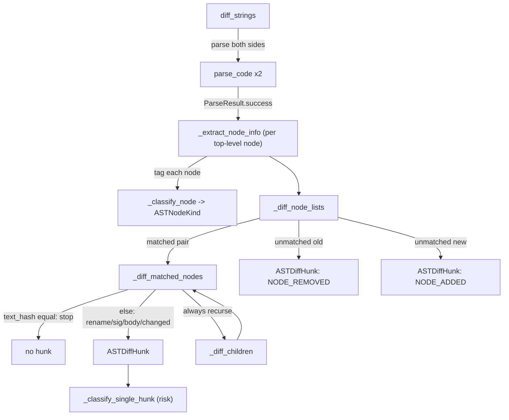

# AST Diff — structural, language-agnostic change detection

## Overview

`ASTDiffer` compares two versions of source through the same tree-sitter grammars the rest of the
project uses, producing a change description at the *node* level instead of the *line* level: a
signature change, a body change, a rename, an add, or a remove, each independently tagged rather
than a blob of `+`/`-` lines. The key idea is a small, language-agnostic vocabulary —
[`ASTNodeKind`](../catalog/tree_sitter_analyzer/ast_diff.md#ASTNodeKind) — that every one of tree-sitter-analyzer's 13 grammars' node types gets
collapsed into, so the *matching* and *classification* logic downstream never has to know whether
it's looking at a Python `function_definition`, a Rust `function_item`, or a Java
`method_declaration`. Old and new top-level nodes are matched primarily by `(kind, name)` identity —
content-addressed, not positional — with a structural fallback for renamed functions/classes/methods,
and the result feeds a separate risk classifier that turns "body changed" vs "signature changed"
into "safe refactor" vs "breaking API change."

## Diagram

## Design rationale (why it's built this way)

**One small enum absorbs 13 grammars' worth of node-type strings.** [`_classify_node`](../catalog/tree_sitter_analyzer/ast_diff.md#_classify_node)
maps dozens of grammar-specific node type strings — Python's `function_definition`, Rust's
`function_item`, Java-family `method_declaration`/`constructor_declaration`, JavaScript's
`arrow_function`, and so on — into the handful of [`ASTNodeKind`](../catalog/tree_sitter_analyzer/ast_diff.md#ASTNodeKind) members (with
[`FUNCTION`](../catalog/tree_sitter_analyzer/ast_diff.md#ASTNodeKind.FUNCTION) as the seed case). This is the diff engine's version of the same
grounding-substrate tradeoff the whole repo makes: tree-sitter gives 13 different concrete
grammars, never one canonical schema, so every cross-language mechanism in this codebase —
family-gated call resolution, and here, diff classification — has to build its own small
normalization layer rather than relying on a shared AST standard the way a single-language tool
could.

**Matching is by identity, not position — because the diff scope is intentionally shallow.**
[`diff_strings`](../catalog/tree_sitter_analyzer/ast_diff.md#ASTDiffer.diff_strings) only extracts *top-level* nodes from each parse before diffing (it does
not walk the whole file as one flat sequence), so a naive positional comparison would report
"everything after the inserted function changed." Matching old and new top-level lists by
`(`[`kind`](../catalog/tree_sitter_analyzer/ast_diff.md#ASTNodeInfo.kind)`, `[`name`](../catalog/tree_sitter_analyzer/ast_diff.md#ASTNodeInfo.name)`)` first sidesteps that: a symbol keeps its identity across an
insertion or reorder elsewhere in the file. The remaining, harder case — a function/class/method
that changed *name* along with its body — falls back to a structural match scored by how many of
its own children's names overlap between the old and new candidate, so a rename with an otherwise
untouched body is still recognized as one matched pair (and reported as `NODE_RENAMED` inside
[`_diff_matched_nodes`](../catalog/tree_sitter_analyzer/ast_diff.md#_diff_matched_nodes)) rather than one deletion plus one unrelated addition.

**A content hash, not a byte range, is the equality fast path.** Because the old and new trees come
from two entirely separate parses, there is no guarantee a node's byte offsets mean anything across
them; [`_diff_matched_nodes`](../catalog/tree_sitter_analyzer/ast_diff.md#_diff_matched_nodes) short-circuits the instant a matched pair's text hash is
identical, skipping both the signature/body comparison *and* the recursive descent into children —
an unchanged subtree costs one hash comparison, never a walk.

**Signature vs. body is a two-question test, not a diff of the raw text.** [`_extract_signature`](../catalog/tree_sitter_analyzer/ast_diff.md#_extract_signature)
reads a node's own already-classified children — the child whose `kind` is `PARAMETER`, any
children whose `kind` is `DECORATOR` — and hashes just those; a separate body-hash check reads the
`BLOCK`-kind child. This is what lets a downstream reader tell "the public contract changed" apart
from "the implementation changed" without re-deriving either from scratch: the split is computed
once, here, from the same classified node tree the matcher already built. `semantic_change_classifier.py`'s
own module docstring states its reason for existing directly against the survey's comparison point:
"This is a NEW capability beyond what CodeGraph offers — it doesn't just detect changes, it
understands what KIND of change they are" — a claim only possible because `ast_diff` hands it a
signature/body split, not a text diff.

## Entry points

- [`diff_strings`](../catalog/tree_sitter_analyzer/ast_diff.md#ASTDiffer.diff_strings) — the core engine, reached whenever a caller already has both
  versions of the source in memory (a PR diff hunk, an in-editor buffer); parses both sides via
  [`parse_code`](../catalog/tree_sitter_analyzer/core/parser.md#Parser.parse_code) and always returns a well-formed result, even when both parses fail.
- [`diff_files`](../catalog/tree_sitter_analyzer/ast_diff.md#ASTDiffer.diff_files) — the file-path entry point: infers language from the *new* file's
  extension first, falling back to the old file's, so a same-content rename with an extension
  change is still classified using the language the file is becoming, not the one it was.
- [`execute`](../catalog/tree_sitter_analyzer/mcp/tools/codegraph_pr_review_tool.md#CodeGraphPRReviewTool.execute) (`CodeGraphPRReviewTool`) — control reaches [`diff_strings`](../catalog/tree_sitter_analyzer/ast_diff.md#ASTDiffer.diff_strings) here
  once a GitHub PR URL or a local diff is resolved into a list of changed files; the tool validates
  `mode=pr` requires a real URL up front specifically so a misconfigured call fails loudly instead of
  silently reporting "no changed files."
- [`execute`](../catalog/tree_sitter_analyzer/mcp/tools/semantic_classify_tool.md#SemanticClassifyTool.execute) (`SemanticClassifyTool`) and [`_classify_changed_files`](../catalog/tree_sitter_analyzer/mcp/tools/utils/change_impact_analysis.md#_classify_changed_files) — a second MCP
  consumer that runs [`diff_strings`](../catalog/tree_sitter_analyzer/ast_diff.md#ASTDiffer.diff_strings) over a changed-file list purely to produce a risk
  classification, best-effort per file so one unparseable file doesn't abort the batch.
- [`execute`](../catalog/tree_sitter_analyzer/mcp/tools/ast_diff_tool.md#ASTDiffTool.execute) (`ASTDiffTool`) — the direct MCP surface exposing [`diff_files`](../catalog/tree_sitter_analyzer/ast_diff.md#ASTDiffer.diff_files)/
  [`diff_strings`](../catalog/tree_sitter_analyzer/ast_diff.md#ASTDiffer.diff_strings) without the semantic-classification layer built on top.

## Mechanism (step-by-step)

1. [`diff_strings`](../catalog/tree_sitter_analyzer/ast_diff.md#ASTDiffer.diff_strings) parses both sources independently through [`parse_code`](../catalog/tree_sitter_analyzer/core/parser.md#Parser.parse_code), which
   never raises: an unsupported or uninstalled grammar, or any parser-construction failure, comes
   back as a [`ParseResult`](../catalog/tree_sitter_analyzer/core/parser.md#ParseResult) with [`success`](../catalog/tree_sitter_analyzer/core/parser.md#ParseResult.success)`=False` and a human-readable
   [`error_message`](../catalog/tree_sitter_analyzer/core/parser.md#ParseResult.error_message). If *both* sides fail, `diff_strings` still returns one
   synthetic "both sources failed to parse" hunk rather than propagating an exception — a caller
   like the PR-review tool always gets a hunk list to reason about, even for a file tree-sitter
   cannot parse at all.
2. Each successful parse's top-level nodes go through [`_extract_node_info`](../catalog/tree_sitter_analyzer/ast_diff.md#_extract_node_info), which recurses
   into every child up to a hard depth cap, classifying each one via [`_classify_node`](../catalog/tree_sitter_analyzer/ast_diff.md#_classify_node) and
   recording its [`kind`](../catalog/tree_sitter_analyzer/ast_diff.md#ASTNodeInfo.kind) and [`name`](../catalog/tree_sitter_analyzer/ast_diff.md#ASTNodeInfo.name) (falling back to any bare identifier child when the
   grammar has no dedicated name field) — this is the one place a raw [`tree`](../catalog/tree_sitter_analyzer/core/parser.md#ParseResult.tree) gets turned into
   the kind/name-addressable shape everything downstream matches on.
3. [`_diff_node_lists`](../catalog/tree_sitter_analyzer/ast_diff.md#ASTDiffer._diff_node_lists) matches the old and new top-level lists (identity first, structural
   fallback second, as described above) and hands every matched pair to
   [`_diff_matched_nodes`](../catalog/tree_sitter_analyzer/ast_diff.md#_diff_matched_nodes); anything left unmatched on either side becomes a
   [`ASTDiffHunk`](../catalog/tree_sitter_analyzer/ast_diff.md#ASTDiffHunk) carrying only [`old_node`](../catalog/tree_sitter_analyzer/ast_diff.md#ASTDiffHunk.old_node) or only [`new_node`](../catalog/tree_sitter_analyzer/ast_diff.md#ASTDiffHunk.new_node) — the two fields
   are independently optional specifically so a hunk can represent "this side doesn't exist" without
   a separate boolean flag.
4. [`_diff_matched_nodes`](../catalog/tree_sitter_analyzer/ast_diff.md#_diff_matched_nodes) decides the *kind* of change for a matched pair: an identical text
   hash returns immediately with no hunk and no recursion; otherwise it compares the pair's
   recovered signatures ([`_extract_signature`](../catalog/tree_sitter_analyzer/ast_diff.md#_extract_signature)) and body hashes to pick exactly one of
   rename / signature-changed / signature+body-changed / body-changed / generic-changed, emits a
   single [`ASTDiffHunk`](../catalog/tree_sitter_analyzer/ast_diff.md#ASTDiffHunk) tagged with [`diff_kind`](../catalog/tree_sitter_analyzer/ast_diff.md#ASTDiffHunk.diff_kind) and [`node_kind`](../catalog/tree_sitter_analyzer/ast_diff.md#ASTDiffHunk.node_kind) — and then,
   regardless of which branch fired, *always* recurses into [`_diff_children`](../catalog/tree_sitter_analyzer/ast_diff.md#_diff_children). A single
   top-level function edit can therefore surface as one parent hunk plus however many nested hunks
   correspond to the specific parameter, decorator, or nested block that actually changed.
5. [`_diff_children`](../catalog/tree_sitter_analyzer/ast_diff.md#_diff_children) repeats the same match-then-diff step one level down, calling back
   into [`_diff_matched_nodes`](../catalog/tree_sitter_analyzer/ast_diff.md#_diff_matched_nodes) for each newly matched child pair — this mutual recursion is
   what makes the result a genuine tree diff rather than a two-level (file → top-level-symbol) one:
   a change three levels deep still bottoms out at its own hunk with the correct [`node_kind`](../catalog/tree_sitter_analyzer/ast_diff.md#ASTDiffHunk.node_kind),
   not a blanket "the enclosing class changed."
6. Downstream, [`_classify_single_hunk`](../catalog/tree_sitter_analyzer/semantic_change_classifier.md#_classify_single_hunk) (reached from both [`execute`](../catalog/tree_sitter_analyzer/mcp/tools/semantic_classify_tool.md#SemanticClassifyTool.execute) and
   [`execute`](../catalog/tree_sitter_analyzer/mcp/tools/codegraph_pr_review_tool.md#CodeGraphPRReviewTool.execute) via [`diff_strings`](../catalog/tree_sitter_analyzer/ast_diff.md#ASTDiffer.diff_strings)) re-reads exactly the fields the steps above
   produced — an [`ASTNodeKind`](../catalog/tree_sitter_analyzer/ast_diff.md#ASTNodeKind) of `IMPORT` short-circuits to an import-change category, a
   `SIGNATURE_CHANGED` [`diff_kind`](../catalog/tree_sitter_analyzer/ast_diff.md#ASTDiffHunk.diff_kind) plus a public-looking name becomes an API-change
   candidate — meaning the risk classifier's entire signal is this page's structural output, never
   the raw text diff.

## Key data structures

- [`ASTNodeInfo`](../catalog/tree_sitter_analyzer/ast_diff.md#ASTNodeInfo) — one classified tree-sitter node: its grammar-specific `node_type`,
  normalized [`kind`](../catalog/tree_sitter_analyzer/ast_diff.md#ASTNodeInfo.kind), recovered [`name`](../catalog/tree_sitter_analyzer/ast_diff.md#ASTNodeInfo.name), position, a content hash of its own
  source slice, and its already-classified children — this is the shape both the matcher and the
  classifier operate on, never the raw tree-sitter node.
- [`ASTDiffHunk`](../catalog/tree_sitter_analyzer/ast_diff.md#ASTDiffHunk) — one reported change: a [`diff_kind`](../catalog/tree_sitter_analyzer/ast_diff.md#ASTDiffHunk.diff_kind) (from [`DiffKind`](../catalog/tree_sitter_analyzer/ast_diff.md#DiffKind)), the
  [`node_kind`](../catalog/tree_sitter_analyzer/ast_diff.md#ASTDiffHunk.node_kind) it occurred at, and independently-optional [`old_node`](../catalog/tree_sitter_analyzer/ast_diff.md#ASTDiffHunk.old_node)/[`new_node`](../catalog/tree_sitter_analyzer/ast_diff.md#ASTDiffHunk.new_node)
  references plus a free-form `details` dict used for the signature diff.
- [`ASTNodeKind`](../catalog/tree_sitter_analyzer/ast_diff.md#ASTNodeKind) / [`DiffKind`](../catalog/tree_sitter_analyzer/ast_diff.md#DiffKind) — the two closed vocabularies everything above is expressed
  in; every grammar-specific node type or change shape gets forced into one of these members before
  it can be reported.

## Dynamics (design intent)

There is no persistent state here — no cache, no database, no cross-call memory. Each call to
[`diff_strings`](../catalog/tree_sitter_analyzer/ast_diff.md#ASTDiffer.diff_strings)/[`diff_files`](../catalog/tree_sitter_analyzer/ast_diff.md#ASTDiffer.diff_files) parses both sides from scratch through its own
parser instance; it is safe to run concurrently across independent differ instances precisely
because nothing is shared. This is a deliberate contrast with the persisted AST cache described on
its own sibling page (below): this module trades any possibility of incremental reuse for
simplicity and correctness — every diff is computed fresh from the two texts handed to it, with
none of the staleness bookkeeping a persisted index would need.

## Edge cases

- [`DiffKind`](../catalog/tree_sitter_analyzer/ast_diff.md#DiffKind) declares `NODE_MOVED` and `UNCHANGED` members, but nothing in this
  packet's cited mechanism ever assigns them: a node that moved position but is otherwise identical
  either matches by name and short-circuits silently (no hunk at all, since matching is
  identity-based, not positional), or — if unmatched for some other reason — is reported as a
  `NODE_REMOVED` plus a separate `NODE_ADDED` rather than a single `NODE_MOVED`. Move-detection reads
  as reserved vocabulary for a feature that isn't implemented yet, not a bug in what's implemented.
- The recursive descent in [`_diff_matched_nodes`](../catalog/tree_sitter_analyzer/ast_diff.md#_diff_matched_nodes) always walks into
  [`_diff_children`](../catalog/tree_sitter_analyzer/ast_diff.md#_diff_children) once a parent hunk has been emitted for *any* reason — including a
  pure rename with an otherwise byte-identical body. Because children are themselves matched and
  hash-checked, an unchanged child still short-circuits with no extra hunk, but it means a rename
  alone is not guaranteed to be the *only* hunk reported if anything nested happens to not match
  cleanly.
- Depth is capped (`_extract_node_info`, called from step 2 above) — an extremely deeply nested
  expression will stop being classified past that cap rather than being walked indefinitely; nodes
  beyond the cap are simply absent from the diff rather than causing an error.

## Open questions

- The precise depth cap and its rationale are visible in the source read for this page but the
  constant itself isn't a cited subgraph symbol, so its exact value is not asserted here.
- Whether any caller ever requests `include_children`/`with_child_count` output in a way that
  surfaces the capped-depth truncation to an end user isn't settled by the symbols available to this
  page.

## See also

- [`tree_sitter_analyzer-ast_cache`](tree_sitter_analyzer-ast_cache.md) — the persisted-index
  counterpart to this stateless, two-parse-at-a-time mechanism.
- [`tree_sitter_analyzer-core-parser`](tree_sitter_analyzer-core-parser.md) — the `Parser`/`ParseResult`
  machinery both `ast_diff` and `ast_cache` build on.
