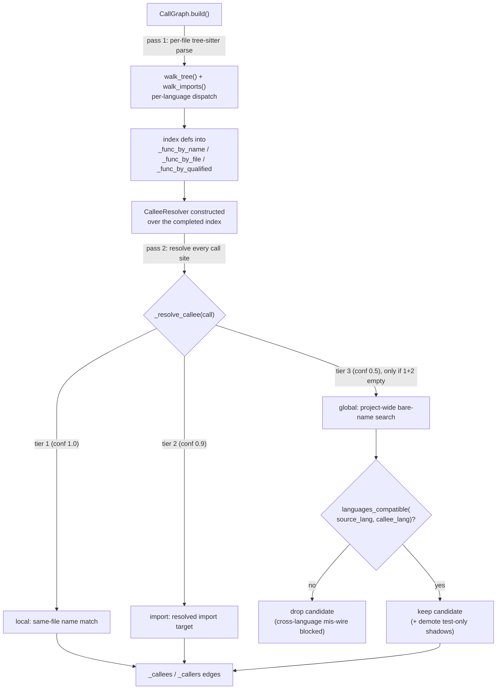

# Call graph — tree-sitter extraction with family-gated cross-language resolution

## Overview
[`CallGraph`](../catalog/tree_sitter_analyzer/call_graph.md#CallGraph) is TSA's project-level call
graph: nodes are [`FunctionRef`](../catalog/tree_sitter_analyzer/call_graph.md#FunctionRef) (a
`file_path` + `name` + `receiver` + `language` tuple), edges are `A calls B`. What makes it worth a
dedicated page for this survey is not the graph shape — every tool here builds one — but *how edges
get resolved*: TSA parses every language with tree-sitter (no compiler, no SCIP index) and then must
decide, purely from syntax, whether a bare-name call site really means the function it looks like it
means. The answer is a resolution cascade in
[`CalleeResolver`](../catalog/tree_sitter_analyzer/callee_resolution.md#CalleeResolver) that only
widens its search radius when a narrower, unambiguous match fails — and the widest tier (a
project-wide name search) is **language-family-gated** so a bare `sorted()` in a Python file can never
silently bind to a Swift `func sorted`.

## Diagram

## Design rationale (why it's built this way)
**Gate only the tier that needs it.** The local and import tiers are already scope-constrained — a
same-file match or a resolved import target cannot cross a language boundary by construction (an
`import` statement that pulls in a Python name from a Python file stays Python). Only
[`CalleeResolver`](../catalog/tree_sitter_analyzer/callee_resolution.md#CalleeResolver)'s private
tier-3 global-fallback branch is an unscoped bare-name search across *every* file in the project, so
it is the only tier that can accidentally bind `config.get(...)` in Python to an unrelated JavaScript
`get`. The
resolver's own comment on this path is explicit: gating it to the caller file's language is what
"produced cross-language false callees (and inlined foreign-language bodies into the response, both
wrong and token-bloat)" before the fix — i.e. this was a real bug class, not a hypothetical.

**Family, not identity.** The gate is
[`languages_compatible`](../catalog/tree_sitter_analyzer/_language_family.md#languages_compatible),
not `caller_lang == callee_lang`, because two dialect pairs legitimately cross-resolve: JavaScript and
TypeScript (`.js`/`.ts`/`.jsx`/`.tsx`) are a **symmetric** family — gradual-migration projects
cross-import freely — while C/C++/Objective-C are a **directional** family (a `.cpp` caller may
resolve a `.h` header indexed as `c`, but a pure-C caller must never bind to a `.cpp` definition, since
that would be a foreign, non-existent-in-C binding). Baking this into one small pure function
(`tree_sitter_analyzer/_language_family.py`) rather than scattering `if lang == "javascript" or lang
== "typescript"` checks across every resolution path is what let the same rule be reused verbatim in
the PR-review impact tool below.

**Empty/unknown language is treated as compatible, deliberately.** `languages_compatible` returns
`True` when either tag is empty — the gate only *blocks a known mismatch*, it never blocks on
ignorance. This is a conservative-recall choice: an unresolvable language tag must not silently start
rejecting legitimate same-language edges.

**Test-shadow demotion is a second, orthogonal gate on the same tier.** Beyond the language gate,
tier 3 also drops test-file definitions from the candidate set for a non-test caller (unless no
non-test definition exists) — a production call must not bind to a test mock/fixture just because it
happened to be indexed first.

> [!inferred]
> The repo's README claims this design yields **~390× fewer cross-language call-graph mis-wires**
> than a name-only resolver (measured against "CodeGraph"/FalkorDB-style tooling): 6 cross-language
> edges out of ~57,000 resolved, vs. 745 out of 38,103 for the comparator, with the flagship example
> being 299 Python `sorted()` callers a name-only index binds to a single Swift `func sorted` (TSA
> binds 0). This is a self-reported benchmark number from the project's own `README.md` and
> `benchmarks/codegraph_compare/` — not a claim this packet's subgraph can verify — but the *mechanism*
> that would produce that gap (gate only the unscoped tier, gate on family not identity) is the one
> documented above and is directly inspectable in `_language_family.py` and `callee_resolution.py`.

## Entry points
- [`CallGraph.build`](../catalog/tree_sitter_analyzer/call_graph.md#CallGraph.build) — the
  two-pass indexer; every other query method calls this first (it's idempotent via `_built`).
- [`CachedCallGraph.build`](../catalog/tree_sitter_analyzer/call_graph.md#CachedCallGraph.build) —
  the pre-indexed variant MCP tools reach for; falls back to `CallGraph.build` when the cache
  can't serve.
- [`CallGraph.callers_of`](../catalog/tree_sitter_analyzer/call_graph.md#CallGraph.callers_of) /
  [`callees_of`](../catalog/tree_sitter_analyzer/call_graph.md#CallGraph.callees_of) — the
  bidirectional query surface every MCP tool (`codegraph_impact_tool`, `call_graph_tool`,
  `codegraph_navigate_tool`) is built on.
- [`_analyze_call_graph_impact`](../catalog/tree_sitter_analyzer/mcp/tools/codegraph_pr_review_tool.md#CodeGraphPRReviewTool._analyze_call_graph_impact) —
  a second, independent application of the same family gate at the PR-review layer.

## Mechanism (step-by-step)
1. **Two-pass build, not one.** [`build`](../catalog/tree_sitter_analyzer/call_graph.md#CallGraph.build)
   walks every source file matching a fixed extension set (`.py .js .ts .jsx .tsx .java .go .c .cpp
   .cc .cxx`) through [`Parser.parse_file`](../catalog/tree_sitter_analyzer/core/parser.md#Parser.parse_file),
   extracts definitions and call sites with
   [`walk_tree`](../catalog/tree_sitter_analyzer/function_extraction.md#walk_tree) and imports with
   [`walk_imports`](../catalog/tree_sitter_analyzer/import_extractors/__init__.md#walk_imports), and
   populates every file's [`FunctionRef`](../catalog/tree_sitter_analyzer/call_graph.md#FunctionRef)
   into `_func_by_name`/`_func_by_file`/`_func_by_qualified` — **before resolving a single call**. Only
   after every file's definitions exist does pass 2 walk the saved call sites and resolve callees. The
   source comment is blunt about why this split exists: the def-add and call-resolve used to run in
   the same loop body, so a file iterated before the file defining its callee would silently drop that
   edge — an order-dependent bug that macOS APFS happened not to trigger in test fixtures (it iterates
   `main.py` last) while Linux ext4 and Windows did (tracked as PR #133).
2. **The resolver is built once, over the completed index**, then reused for every call site:
   `self._callee_resolver = CalleeResolver(functions_by_name=self._func_by_name,
   functions_by_file=self._func_by_file, name_to_source=self._imported_names)`. Each call is resolved
   via [`_resolve_callee`](../catalog/tree_sitter_analyzer/call_graph.md#CallGraph._resolve_callee),
   which delegates to `CalleeResolver.resolve_items` and only keeps confident matches (dropping the
   raw file-only fallback tier).
3. **The three-tier cascade, confidence-scored.** Tier 1 (confidence 1.0): a same-file name match —
   cheapest and safest, no cross-language risk by construction. Tier 2 (confidence 0.9): the callee
   name is looked up against `_imported_names[source_file]`, built by
   [`walk_imports`](../catalog/tree_sitter_analyzer/import_extractors/__init__.md#walk_imports)'s
   per-language import dispatch (`_extract_python_imports`, `_extract_js_imports`, `_extract_go_imports`,
   … one branch per language), then matched inside the *resolved target file* — still scoped, still
   safe. Tier 3 (confidence 0.5) only runs **if tiers 1–2 return nothing**: a bare project-wide name
   search over `_functions_by_name`, which is exactly the search that needs the language-family gate
   because it has no file-scoping to protect it.
4. **The gate itself.** Tier 3 filters every same-named candidate with
   [`languages_compatible`](../catalog/tree_sitter_analyzer/_language_family.md#languages_compatible)`(source_lang,
   _item_language(func))`; `source_lang` is resolved from an already-indexed function in that file, or
   — if the file defines no functions at all (a pure module-level call site) — falls back to a
   path-extension guess (the same extension-mapping idea this subgraph's
   [`_language_from_ext`](../catalog/tree_sitter_analyzer/project_graph.md#_language_from_ext) uses
   for the call graph's own file-language detection), so even function-less files still get gated. A
   candidate whose language is *known* and *incompatible* is dropped; unknown/empty language is not
   gated (recall-preserving).
5. **A second, independent instance of the same gate lives at the PR-review layer.**
   [`_analyze_call_graph_impact`](../catalog/tree_sitter_analyzer/mcp/tools/codegraph_pr_review_tool.md#CodeGraphPRReviewTool._analyze_call_graph_impact)
   re-derives each changed file's language with `language_from_path`, then drops any raw call-graph
   edge whose language is incompatible with the changed file's language — plus a second, orthogonal
   **ambiguity gate** that drops edges whose bare callee name is defined in more than a threshold
   number of distinct files project-wide (a generic name like `get_node_text` recurring across
   swift/cpp/kotlin is exactly the kind of same-name phantom the raw graph would otherwise surface as
   a PR-review "affected function"). This shows the family gate is a reusable primitive, not a
   one-off patch buried in the resolver.
6. **Dynamic dispatch is recovered separately, as a `(virtual)` edge.** The Subgraph marks
   `CallGraph → `[`CachedCallGraph`](../catalog/tree_sitter_analyzer/call_graph.md#CachedCallGraph)
   and `CachedCallGraph → CachedCallGraph` as `(virtual)` — a base-class/override relationship
   class-hierarchy analysis adds on top of the static call edges, the same "virtual edge" concept
   this survey's [symbol-graph](../../../concepts/symbol-graph.md) page tracks for wikify-repo.
7. **`CachedCallGraph` swaps the source, not the query API.**
   [`CachedCallGraph`](../catalog/tree_sitter_analyzer/call_graph.md#CachedCallGraph) subclasses
   `CallGraph` and overrides only `build()`: it reads pre-extracted functions/edges/imports out of a
   SQLite-backed AST cache via `_build_from_cache`, and only falls back to the full tree-sitter
   re-parse (`super().build()`) when the cache is empty or the fast path raised. The class's own
   docstring calls out the intent directly: *"CodeGraph parity: like CodeGraph's pre-indexed call
   graph, queries are instant after initial indexing."* Every downstream query method
   (`callers_of`, `callees_of`, `call_chain`, `summary`, …) is inherited unchanged — the caching layer
   is invisible above `build()`.

## Key data structures
- **`FunctionRef`** — `__slots__`-based value type: `file_path, name, start_line, end_line, language,
  receiver`. Equality/hash are keyed on `(file_path, name, start_line)`, so two same-named methods in
  different classes or files are distinct nodes even before `receiver` is consulted.
  [`qualified_name`](../catalog/tree_sitter_analyzer/call_graph.md#FunctionRef.qualified_name) renders
  `file:receiver.name` or `file:name` — the string key used throughout the graph's dicts.
- **`CallGraph._func_by_name` / `_func_by_file` / `_func_by_qualified`** — the three indices
  `CalleeResolver` searches, one per resolution tier's scope (global / per-file / exact).
- **`CallGraph._imported_names`** — per-file `{local_name: resolved_target_file}` map built by
  `_collect_import_map`, consulted by tier 2.
- **`_callees` / `_callers`** — `dict[FunctionRef, list[FunctionRef]]` adjacency built in pass 2; the
  actual graph edges `callers_of`/`callees_of` read from.
- **`CalleeResolution`** — a frozen dataclass `(file, confidence, item)` — the resolver's internal
  currency; only `resolve_items` unwraps it back to bare `FunctionRef`s for the call graph.

## Dynamics (design intent)
`build()` is guarded by `self._built` and is a no-op on a second call — callers (every query method
calls `self.build()` first) don't need to reason about build-once-vs-every-call; the graph memoizes
itself per `CallGraph` instance. There is no locking or concurrency story here — the class is built
and queried within a single tool invocation's synchronous flow (the async `execute()` methods on MCP
tools await the tool layer, not the graph build itself, which is plain synchronous Python).

## Edge cases
- **A file with no functions still needs gating.** `_source_language` falls back to
  `language_from_path` precisely so a module-level call site (no enclosing function, hence no indexed
  `FunctionRef.language` to read) doesn't silently reopen the ungated tier-3 fallback.
- **Ambiguous overloads within one class.** `_find_enclosing_func` picks the *tightest*-span function
  containing a call's line — needed because same-named methods in different classes both get indexed,
  and the tightest span (not "nearest preceding") avoids misattributing a call to the wrong function
  (issue #648, per the source comment).
- **Test-only shadows.** A production caller is blocked from binding to a test-file-only definition of
  the same bare name in tier 3, but a test caller is exempt from that filter — it may legitimately call
  a test helper.
- **C-family compatibility is directional, not symmetric** — getting this backwards (allowing a
  pure-C caller to bind a C++ definition) would reintroduce exactly the kind of foreign binding the
  gate exists to prevent.

## Open questions
- The packet's subgraph does not include the more elaborate `synapse_resolver` package referenced
  elsewhere in the repo (a separate, richer cross-file resolution cascade with per-language stdlib
  tiers) — how it relates to (or supersedes) this `CalleeResolver` tier-3 path is outside this
  packet's citable symbols.
- The exact `_AMBIGUOUS_NAME_FILE_THRESHOLD` value used by the PR-review ambiguity gate is not in this
  subgraph.

## See also
- [`tree_sitter_analyzer-core-parser`](tree_sitter_analyzer-core-parser.md) — the tree-sitter
  `Parser`/`ParseResult` layer `CallGraph.build` parses every file through.
- [`tree_sitter_analyzer-plugins-manager`](tree_sitter_analyzer-plugins-manager.md) — the per-language
  plugin registry that gives each of the 13 languages its own extraction path.
- Cross-repo: [symbol-graph](../../../concepts/symbol-graph.md),
  [multi-language-extraction](../../../concepts/multi-language-extraction.md).
