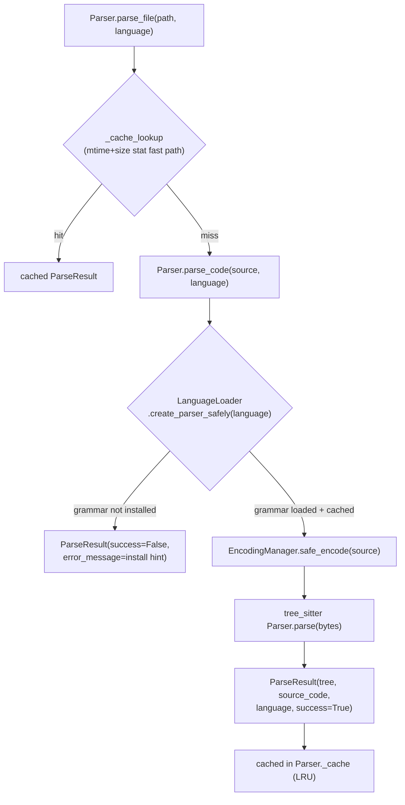

# The Parser — tree-sitter as the grounding substrate

## Overview
[`Parser`](../catalog/tree_sitter_analyzer/core/parser.md#Parser) is the single seam through which
*every* other subsystem in TSA touches source code — the call graph, the UML exporter, the AST diff,
the dead-code analyzer, the query service. There is no separate compiler front-end and no SCIP index
sitting between TSA and the code: a `tree-sitter` grammar package per language *is* the grounding
substrate, loaded on demand by [`LanguageLoader`](../catalog/tree_sitter_analyzer/language_loader.md#LanguageLoader),
and every result flows back as a [`ParseResult`](../catalog/tree_sitter_analyzer/core/parser.md#ParseResult)
— a plain `NamedTuple` wrapping the parsed `Tree` plus enough metadata (`success`, `error_message`,
`language`) that a caller never has to distinguish "parsed but empty" from "failed to parse" by
digging into the tree itself.

## Diagram

## Design rationale (why it's built this way)
**Tree-sitter, not a compiler front-end or SCIP.** Every language TSA supports is a separate,
independently-installable `tree-sitter-<lang>` grammar package looked up in
[`LanguageLoader`](../catalog/tree_sitter_analyzer/language_loader.md#LanguageLoader)'s
`LANGUAGE_MODULES` table (java, javascript, typescript/tsx, python, c, cpp, rust, go, csharp, php,
ruby, kotlin, swift, scala, plus markup/config grammars like markdown/json/yaml/html/css/sql/bash).
This is the fork in the road that separates TSA from both ends of this survey's grounding-substrate
axis: wikify-repo runs a real compiler-grade **SCIP** indexer (`scip-python`/`scip-clang`) as ground
truth, and the graph-DB tools (codegraphcontext / CodeGraph-lineage) build a **persisted graph
database** from an indexer's output. TSA has neither a compiler nor a database in the loop — a
`Tree` object produced directly from source text, per file, per call, is the entire grounding layer.
The tradeoff is explicit in the code: no semantic/type information a compiler would give you (hence
the [call-graph](tree_sitter_analyzer-call_graph.md) resolver has to *infer* cross-file bindings from
names and imports rather than read them off a linker), but also no indexer process, no build step,
and no language the project's own build system has to support first — any language with a published
tree-sitter grammar is addressable the moment its Python package is `pip install`-able.

**Grammars are optional, not vendored.** `is_language_available` probes with
`importlib.import_module` and remembers failures in `_unavailable_languages`/`_availability_cache` so
a missing grammar is a one-time, cheap negative lookup rather than a repeated import attempt. A
missing grammar degrades to a clear, actionable `ParseResult(success=False, error_message=...)` (the
source names a companion `grammar_install_hint`/`is_grammar_installed` pair, not in this packet's
subgraph, that turns "unsupported language" into a concrete `pip install "tree-sitter-analyzer[swift]"`
instruction) rather than a crash or a silent skip — every one of the 13+ languages is additive, never
load-bearing for the others.

**Two independent caches, not one.** `Parser._cache` is a class-level `LRUCache` keyed by a content
hash; `Parser._stat_cache` is a *separate*, cheaper `{file_path: (mtime_ns, size, language,
cache_key)}` map that lets a warm re-scan skip computing the SHA-256 content hash entirely when a
file's mtime and size are unchanged — the comment in the source is explicit that this "stat-only fast
path" exists specifically so a hot warm pass doesn't pay a hashing cost per file. This two-tier
design (skip re-parse; skip even re-hashing) is what makes repeated whole-project scans — which
[`CallGraph.build`](tree_sitter_analyzer-call_graph.md) triggers once per file on every full graph
build — tractable on a warm cache.

**`ParseResult` as a `NamedTuple`, not an exception.** Parse failure (bad syntax, missing grammar,
missing file, encoding failure) is a *value* — `success=False` plus a human-readable
`error_message` — not a raised exception. Every one of the dozen call sites cited below
(`analyze_file_complexity`, `detect_structural_clones`, `find_unused_imports`, the UML/AST-diff/dead-
code analyzers) can therefore treat "this one file didn't parse" as data to skip or report, without a
`try/except` wrapping every parse call — a whole-project batch analysis keeps going past one bad file.

## Entry points
- [`Parser.parse_file`](../catalog/tree_sitter_analyzer/core/parser.md#Parser.parse_file) — the
  file-based entry every analyzer (call graph, dead-code, complexity, UML) calls first.
- [`Parser.parse_code`](../catalog/tree_sitter_analyzer/core/parser.md#Parser.parse_code) — the
  string-based entry (used when source is already in memory, e.g.
  [`diff_strings`](../catalog/tree_sitter_analyzer/ast_diff.md#ASTDiffer.diff_strings) diffing two
  in-memory revisions, or [`execute_query`](../catalog/tree_sitter_analyzer/core/query_service.md#QueryService.execute_query)
  running a tree-sitter query against fetched file content).
- [`LanguageLoader.create_parser_safely`](../catalog/tree_sitter_analyzer/language_loader.md#LanguageLoader.create_parser_safely) —
  where a language name turns into a live tree-sitter `Parser` object (or a clean `None`).

## Mechanism (step-by-step)
1. **`parse_file` is cache-first.** [`Parser.parse_file`](../catalog/tree_sitter_analyzer/core/parser.md#Parser.parse_file)
   checks the file exists, then calls
   [`_cache_lookup`](../catalog/tree_sitter_analyzer/core/parser.md#Parser._cache_lookup) — the
   stat-fast-path described above — before reading or parsing anything. Only a cache miss reads the
   file's bytes (with encoding fallback) and calls
   [`parse_code`](../catalog/tree_sitter_analyzer/core/parser.md#Parser.parse_code).
2. **`parse_code` is a three-gate pipeline.** It first checks `is_language_supported` (grammar
   available at all); then calls
   [`create_parser_safely`](../catalog/tree_sitter_analyzer/language_loader.md#LanguageLoader.create_parser_safely),
   which itself checks
   [`load_language`](../catalog/tree_sitter_analyzer/language_loader.md#LanguageLoader.load_language)
   (which in turn checks
   [`is_language_available`](../catalog/tree_sitter_analyzer/language_loader.md#LanguageLoader.is_language_available));
   only if both gates pass does it encode the source via
   [`EncodingManager.safe_encode`](../catalog/tree_sitter_analyzer/encoding_utils.md#EncodingManager.safe_encode)
   and hand bytes to the real tree-sitter `parser.parse(...)` call. Each gate returns a distinct,
   already-populated `ParseResult(success=False, error_message=...)` on failure rather than letting an
   exception propagate from a lower layer.
3. **Language resolution is per-call, not global.**
   [`parse_code`](../catalog/tree_sitter_analyzer/core/parser.md#Parser.parse_code) and
   [`parse_file`](../catalog/tree_sitter_analyzer/core/parser.md#Parser.parse_file) both take an
   explicit `language: str` argument rather than inferring it internally — callers resolve the
   language from a file extension themselves before calling in, which keeps the `Parser` itself
   extension-agnostic and reusable for in-memory string parsing where there is no file path to infer
   from.
4. **[`LanguageLoader`](../catalog/tree_sitter_analyzer/language_loader.md#LanguageLoader) caches at
   three levels**: `_loaded_languages` (the tree-sitter `Language` object, expensive to construct),
   `_loaded_modules` (the imported grammar Python module), and `_parser_cache` (a ready-to-use
   tree-sitter `Parser` bound to that language, returned by
   [`create_parser_safely`](../catalog/tree_sitter_analyzer/language_loader.md#LanguageLoader.create_parser_safely)
   via [`load_language`](../catalog/tree_sitter_analyzer/language_loader.md#LanguageLoader.load_language)) —
   so a hot path never repeats the `importlib.import_module` + language-object construction once a
   language has been seen once in the process.
5. **[`execute_query`](../catalog/tree_sitter_analyzer/core/query_service.md#QueryService.execute_query)**
   shows the same `Parser` reused for a different purpose than call-graph extraction: it parses a file
   via `parse_code`, then runs a tree-sitter *query* (`.scm`-style capture pattern) against the
   resulting `tree`, and optionally post-filters the captures — the same grounding layer serves both
   structural extraction (defs/calls/imports) and ad hoc pattern queries.

## Key data structures
- **`ParseResult`** (`NamedTuple`): `tree: Tree | None`, `source_code: str`, `language: str`,
  `file_path: str | None`, `success: bool`, `error_message: str | None`. The uniform return type of
  every parse in the codebase — every downstream consumer branches on `.success` first.
- **`Parser._cache`** — class-level `LRUCache`, shared across *all* `Parser()` instances (not
  per-instance), sized for medium projects.
- **`Parser._stat_cache`** — `{file_path: (mtime_ns, size, language, cache_key)}`, the stat-only
  fast-path index that skips the SHA-256 content hash on an unchanged file.
- **`LanguageLoader.LANGUAGE_MODULES`** — the language-name → pip-package-module-name table that is
  the actual source of truth for "what languages does this installation support right now" (a
  strict superset of any language actually installed, since each entry is probed lazily).

## Dynamics (design intent)
Nothing here is concurrent by design — `Parser` and `LanguageLoader` caches are plain dicts/LRUCache
without locks, and the packet's subgraph shows no async parse path (only `execute_query` is `async`,
and that's for I/O — the parse call itself, `self.parser.parse_code(...)`, is synchronous). The
caching strategy is instead optimized for the *repeated whole-project rescan* pattern: `CallGraph`
and `ASTCache`-style callers construct one `Parser()` and call `parse_file` per file in a loop, so the
class-level (not instance-level) `_cache`/`_stat_cache` persist and pay off across that entire loop
and across separate `Parser()` instances created by unrelated callers in the same process.

## Edge cases
- **A grammar package present in `LANGUAGE_MODULES` but not `pip install`-ed** is a normal, expected
  state — `is_language_available` treats it as a plain "not available" rather than an error, and
  memoizes the negative result in `_unavailable_languages` so later `is_language_supported` checks for
  the same language short-circuit.
- **Cache invalidation is explicit, not automatic** — `Parser.cache_clear()` exists for tests and for
  callers that know the filesystem changed in a way the mtime-based fast path can't detect (e.g. a
  git checkout that doesn't touch mtimes in the way a filesystem watcher would expect).
- **A file that fails to parse doesn't halt anything else** — the `ParseResult.success=False`
  contract means a batch consumer (dead-code analysis, complexity scan, clone detection) can log or
  skip a single bad file and keep processing the rest of the project.

## Open questions
- The precise conditions under which `create_parser_safely`'s constructor-fallback branch
  (`_bind_parser_language`, mentioned in a source comment as a dogfood-driven extraction) triggers are
  not in this packet's subgraph.
- How `is_language_supported` (called by `parse_code` but not itself in this subgraph) differs from
  `is_language_available` is not resolvable from this packet alone.

## See also
- [`tree_sitter_analyzer-call_graph`](tree_sitter_analyzer-call_graph.md) — the call graph's
  two-pass build is a loop of `Parser.parse_file` calls whose defs/calls feed the family-gated
  resolver.
- [`tree_sitter_analyzer-plugins-manager`](tree_sitter_analyzer-plugins-manager.md) — the per-language
  plugin layer built on top of the same tree-sitter grounding.
- Cross-repo: [multi-language-extraction](../../../concepts/multi-language-extraction.md),
  [scip-grounding](../../../concepts/scip-grounding.md) (the substrate TSA deliberately does not use).
