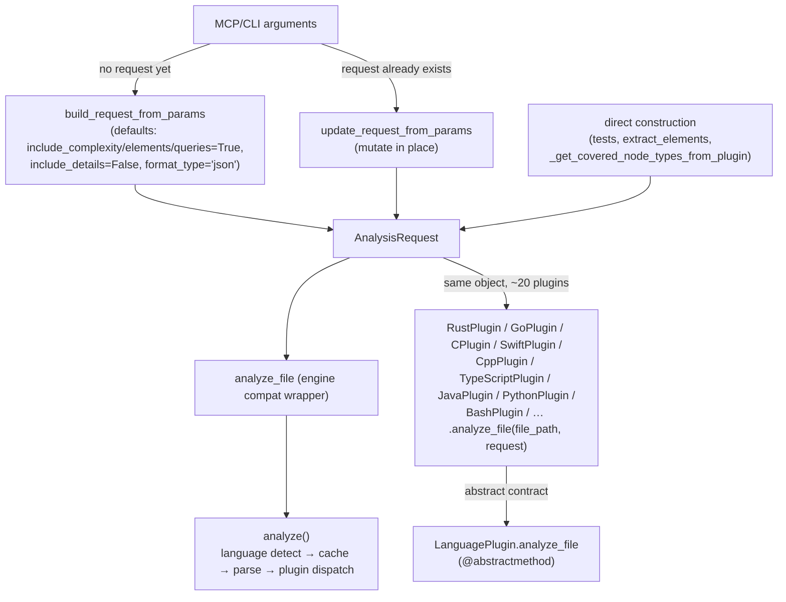

# AnalysisRequest — the thin, mutable config object every language plugin shares

## Overview
[`AnalysisRequest`](../catalog/tree_sitter_analyzer/core/request.md#AnalysisRequest) is a small, mutable
(`frozen=False`) dataclass — [`file_path`](../catalog/tree_sitter_analyzer/core/request.md#AnalysisRequest.file_path),
an optional [`language`](../catalog/tree_sitter_analyzer/core/request.md#AnalysisRequest.language), and a
handful of `include_*` booleans plus a format string — that is the *one* parameter object every one of
this repo's 13(+)-language plugin `analyze_file(file_path, request)` implementations accepts. What makes
it worth its own page, next to the parser and plugin-manager pages, is what it does *not* carry: no
compiler flags, no build-system context, no per-language configuration — because tree-sitter parsing
needs none of that. Reading a dozen of the concrete `analyze_file` overrides directly shows that almost
all of them touch only `request`'s presence as a type signature; the actual work reads `file_path` off
the separate positional argument and constructs a fresh `tree_sitter.Parser` from scratch every call. The
request's real job is narrower than its name suggests: it is the compatibility surface between
MCP-argument dicts, CLI parameters, and the engine's async `analyze()` entrypoint — not a rich per-language
configuration channel.

## Diagram

## Design rationale (why it's built this way)
**Mutable by design, so an existing request can be patched in place instead of always rebuilt.** The
dataclass is declared `@dataclass(frozen=False)` — an explicit, non-default choice (the more common
Python convention for a "request" value object would be frozen). Reading
[`analyze_file`](../catalog/tree_sitter_analyzer/core/_analysis_engine_file_mixin.md#UnifiedAnalysisEngineFileMixin.analyze_file)
(the engine's compatibility wrapper) shows why: when a caller already has an
[`AnalysisRequest`](../catalog/tree_sitter_analyzer/core/request.md#AnalysisRequest) and wants to tweak a
few fields for a repeat call, it goes through
[`update_request_from_params`](../catalog/tree_sitter_analyzer/core/request_builder.md#update_request_from_params),
which mutates the same object's fields conditionally (`if language: request.language = language`, …)
rather than constructing a new one — only when `request is None` does the wrapper fall back to
[`build_request_from_params`](../catalog/tree_sitter_analyzer/core/request_builder.md#build_request_from_params)
to build a fresh one from scratch.

**One field is required; everything else defaults to "do the full analysis."** `file_path` has no
default; [`language`](../catalog/tree_sitter_analyzer/core/request.md#AnalysisRequest.language),
[`include_complexity`](../catalog/tree_sitter_analyzer/core/request.md#AnalysisRequest.include_complexity),
and the rest all default to values that request maximal output (`include_elements`/`include_queries`/
`include_complexity=True`, `include_details=False`, `format_type="json"`). This is why the overwhelming
majority of Evidence call sites construct `AnalysisRequest(file_path=..., language=...)` with nothing
else — the defaults already mean "analyze fully."

**Independent boolean toggles, not one "detail level" — because some callers want less than the
default.**
[`_get_covered_node_types_from_plugin`](../catalog/tree_sitter_analyzer/grammar_coverage/validator.md#_get_covered_node_types_from_plugin)
constructs a probe request with `include_complexity=False, include_details=True` — the inverse of the
dataclass default — specifically to keep a grammar-coverage probe cheap while still getting structural
detail. A single combined "verbosity" enum could not express that particular combination as naturally as
four independent flags can.

**`from_mcp_arguments` centralizes the MCP-dict → request translation exactly once.** The classmethod
(visible in the packet's own Source excerpt of
[`AnalysisRequest`](../catalog/tree_sitter_analyzer/core/request.md#AnalysisRequest)) bakes in its own
defaults (`arguments.get("include_complexity", True)`, …) independently of
[`build_request_from_params`](../catalog/tree_sitter_analyzer/core/request_builder.md#build_request_from_params)'s
— the two default-filling paths are not the same code, though they happen to agree on every field checked
here; a future change to one without the other would silently diverge MCP-path defaults from CLI-path
defaults.

## Entry points
- [`AnalysisRequest`](../catalog/tree_sitter_analyzer/core/request.md#AnalysisRequest) — the dataclass
  itself, constructed directly by most callers in the Evidence table (tests, `extract_elements`,
  `_get_covered_node_types_from_plugin`) whenever the caller already knows every field it wants.
- [`build_request_from_params`](../catalog/tree_sitter_analyzer/core/request_builder.md#build_request_from_params) —
  the from-scratch builder used by
  [`analyze_file`](../catalog/tree_sitter_analyzer/core/_analysis_engine_file_mixin.md#UnifiedAnalysisEngineFileMixin.analyze_file)
  when no request object was supplied yet.
- [`update_request_from_params`](../catalog/tree_sitter_analyzer/core/request_builder.md#update_request_from_params) —
  the in-place mutator used by the same wrapper when a request object already exists.
- [`analyze`](../catalog/tree_sitter_analyzer/core/_analysis_engine_analysis_mixin.md#UnifiedAnalysisEngineAnalysisMixin.analyze) —
  the actual async entrypoint every `AnalysisRequest`, however it was built, is eventually passed into.

## Mechanism (step-by-step)
1. **A request is either built once or patched in place, depending on whether one already exists.** The
   engine's compatibility
   [`analyze_file`](../catalog/tree_sitter_analyzer/core/_analysis_engine_file_mixin.md#UnifiedAnalysisEngineFileMixin.analyze_file)
   wrapper is the clearest illustration: `if request is None:` call
   [`build_request_from_params`](../catalog/tree_sitter_analyzer/core/request_builder.md#build_request_from_params)
   to construct one with every unset field defaulted; `else:` call
   [`update_request_from_params`](../catalog/tree_sitter_analyzer/core/request_builder.md#update_request_from_params)
   to mutate only the fields the caller actually passed, leaving the rest of the existing request
   untouched — then in both branches delegates to
   [`analyze`](../catalog/tree_sitter_analyzer/core/_analysis_engine_analysis_mixin.md#UnifiedAnalysisEngineAnalysisMixin.analyze).
2. **`analyze()` is where the request actually gets consumed by the engine**, not by the plugins directly:
   it resolves the language, computes a cache key from the request's fields, checks a result cache keyed
   on that, confirms
   [`file_path`](../catalog/tree_sitter_analyzer/core/request.md#AnalysisRequest.file_path) exists on
   disk, parses the file, resolves the language plugin, and only then hands the same request object down
   into that plugin's own `analyze_file`. Everything upstream of the plugin dispatch is engine-level
   bookkeeping the request merely carries the parameters for.
3. **Every language plugin's `analyze_file` receives the identical object, but most read almost nothing off
   it.** Reading the plugin implementations directly —
   [`analyze_file`](../catalog/tree_sitter_analyzer/languages/rust_plugin.md#RustPlugin.analyze_file) (Rust),
   [`analyze_file`](../catalog/tree_sitter_analyzer/languages/go_plugin.md#GoPlugin.analyze_file) (Go),
   [`analyze_file`](../catalog/tree_sitter_analyzer/languages/c_plugin.md#CPlugin.analyze_file) (C),
   [`analyze_file`](../catalog/tree_sitter_analyzer/languages/swift_plugin.md#SwiftPlugin.analyze_file) (Swift),
   [`analyze_file`](../catalog/tree_sitter_analyzer/languages/cpp_plugin.md#CppPlugin.analyze_file) (C++) —
   each one reconstructs its own `tree_sitter.Parser`, binds the language, parses the file content it read
   itself via `read_file_safe`, and extracts elements through its own extractor. None of these bodies
   branch on `request.include_complexity` or `request.include_details` at all; the `request` parameter's
   only observed use across this sample is as a type-annotated positional slot the abstract base's
   signature requires — the *engine* is what actually reads those flags, upstream in step 2, not the
   plugins.
4. **The abstract contract is fixed once, at the base class.**
   [`analyze_file`](../catalog/tree_sitter_analyzer/plugins/base.md#LanguagePlugin.analyze_file) on
   `LanguagePlugin` is declared `@abstractmethod`, taking `(file_path: str, request: AnalysisRequest)` and
   returning an `AnalysisResult` — this is the signature every one of the (virtual, per the subgraph)
   overrides must match, and
   [`analyze_file`](../catalog/tree_sitter_analyzer/plugins/base.md#DefaultLanguagePlugin.analyze_file) on
   `DefaultLanguagePlugin` is the fallback body used by any language without a bespoke extractor.
5. **Two call sites deliberately bypass the engine's `analyze()` for a cheaper, narrower answer.**
   [`extract_elements`](../catalog/tree_sitter_analyzer/mcp/tools/utils/element_extractor.md#extract_elements)
   builds its own `AnalysisRequest(file_path=..., language=..., include_elements=True,
   include_complexity=True)` and calls a synchronous engine method directly rather than the async
   `analyze()` path, for callers that just want structured elements without touching the async surface;
   [`_get_covered_node_types_from_plugin`](../catalog/tree_sitter_analyzer/grammar_coverage/validator.md#_get_covered_node_types_from_plugin)
   builds a request with `include_complexity=False, include_details=True` specifically to keep a
   grammar-coverage probe over a corpus file cheap while still getting per-element structural detail, then
   calls the resolved plugin's `analyze_file` directly rather than going through the shared engine
   dispatch at all.

## Key data structures
- **Fields**: `file_path: str` (required), `language: str | None`, `queries: list[str] | None`,
  `include_elements: bool = True`, `include_queries: bool = True`,
  [`include_complexity: bool = True`](../catalog/tree_sitter_analyzer/core/request.md#AnalysisRequest.include_complexity),
  `include_details: bool = False`, `format_type: str = "json"`.
- **Mutability**: `@dataclass(frozen=False)` — the load-bearing property that lets
  [`update_request_from_params`](../catalog/tree_sitter_analyzer/core/request_builder.md#update_request_from_params)
  patch fields on an existing instance rather than requiring a fresh object per call.

## Dynamics (design intent)
> [!inferred]
> Nothing in this packet's subgraph documents thread-safety or concurrent-mutation guarantees for a
> shared `AnalysisRequest` instance. Because the dataclass is mutable, two concurrent callers holding a
> reference to the *same* instance and calling
> [`update_request_from_params`](../catalog/tree_sitter_analyzer/core/request_builder.md#update_request_from_params)
> independently would race on its fields; the subgraph gives no evidence either way of whether any caller
> actually shares one instance across concurrent calls, only that the type permits it.

## Edge cases
- **An unresolvable tree-sitter language degrades to an empty result, not an exception**, in the plugins
  read directly: [`analyze_file`](../catalog/tree_sitter_analyzer/languages/rust_plugin.md#RustPlugin.analyze_file)
  and [`analyze_file`](../catalog/tree_sitter_analyzer/languages/go_plugin.md#GoPlugin.analyze_file) both
  check `if language is None:` (from `get_tree_sitter_language()`, not from the request) and return an
  `AnalysisResult` with empty `elements` and the correct `line_count`/`source_code` still populated, rather
  than raising — a request whose language can't be bound to a grammar still gets a structurally valid,
  just-empty response.
- **Three distinct `analyze_file` methods share the same name across different layers in this subgraph**:
  the abstract per-plugin contract
  ([`LanguagePlugin.analyze_file`](../catalog/tree_sitter_analyzer/plugins/base.md#LanguagePlugin.analyze_file)),
  a test double
  ([`MockLanguagePlugin.analyze_file`](../catalog/tree_sitter_analyzer/core/analysis_engine.md#MockLanguagePlugin.analyze_file)),
  and the engine-level compatibility wrapper
  ([`UnifiedAnalysisEngineFileMixin.analyze_file`](../catalog/tree_sitter_analyzer/core/_analysis_engine_file_mixin.md#UnifiedAnalysisEngineFileMixin.analyze_file))
  — a reader grepping for "`analyze_file`" alone, without tracking which `self` a given call site binds
  to, will conflate three different methods with different jobs.
- **`include_complexity`'s default agrees across the two builder paths but is not read from one shared
  constant**: the dataclass default, `from_mcp_arguments`'s fallback, and
  [`build_request_from_params`](../catalog/tree_sitter_analyzer/core/request_builder.md#build_request_from_params)'s
  fallback are three separately written `True` literals that currently happen to match — a future edit to
  any one of them would silently create three different "default" answers depending on construction path.

## Open questions
- The exact query-execution step `analyze()` performs when `request.queries and request.include_queries`
  is truthy is not itself in this subgraph (only the gating condition is visible from the `analyze` method
  body read directly) — the query-runner it delegates to is out of scope here.
- Whether any in-subgraph MCP tool calls `AnalysisRequest.from_mcp_arguments` directly (versus going
  through [`build_request_from_params`](../catalog/tree_sitter_analyzer/core/request_builder.md#build_request_from_params))
  is not shown by this packet's Evidence table.

## See also
- [`tree_sitter_analyzer-core-parser`](tree_sitter_analyzer-core-parser.md) — the tree-sitter `Parser`
  layer every plugin's `analyze_file` invokes independently, downstream of this request object.
- [`tree_sitter_analyzer-plugins-manager`](tree_sitter_analyzer-plugins-manager.md) — the registry that
  resolves `request.language` to the concrete plugin whose `analyze_file` gets called.
- [`tree_sitter_analyzer-mcp-server`](tree_sitter_analyzer-mcp-server.md) — the server whose tools
  ultimately construct or route the arguments this request is built from.
- Cross-repo: [multi-language-extraction](../../../concepts/multi-language-extraction.md).
