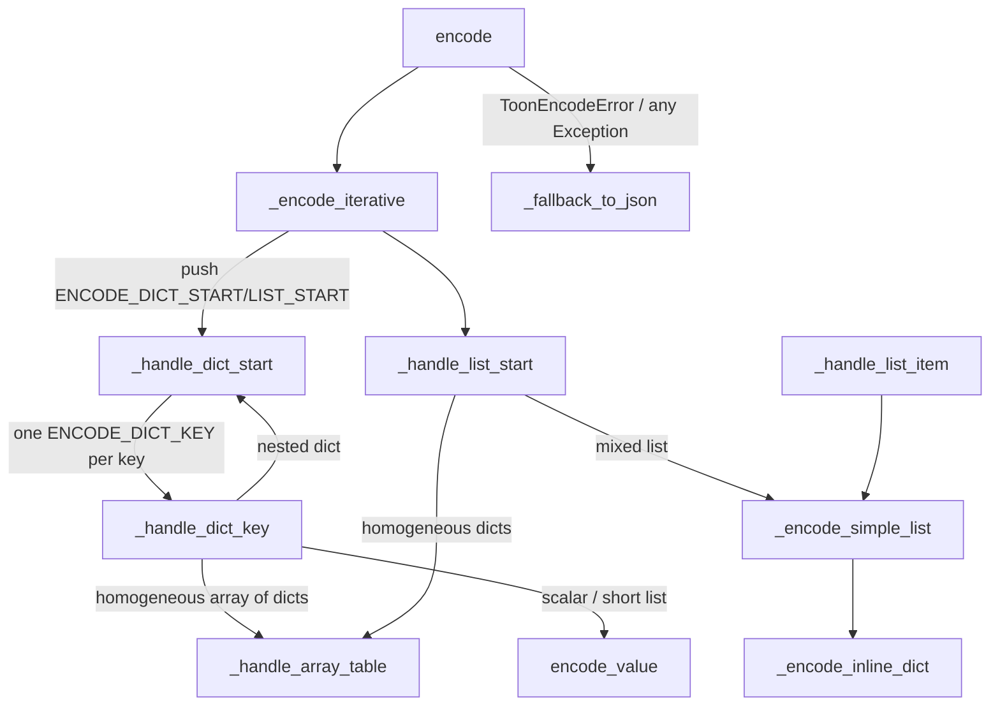

# TOON Encoder

## Overview

[`ToonEncoder`](../catalog/tree_sitter_analyzer/formatters/toon_encoder.md#ToonEncoder) is the low-level serializer behind TOON — this repo's own compact text encoding for the exact JSON-shaped dicts/lists every analysis tool already produces. Its own docstring frames the design goal plainly: it "uses iterative approach with explicit stack for safety. This prevents Python stack overflow on deeply nested structures." The encoder itself knows nothing about MCP, AnalysisResult objects, or which tool called it — [`format_analysis_result`](../catalog/tree_sitter_analyzer/formatters/toon_formatter.md#ToonFormatter.format_analysis_result) and [`_format_internal`](../catalog/tree_sitter_analyzer/formatters/toon_formatter.md#ToonFormatter._format_internal) are the layer above that adapts a real result object into the dict/list shape this class actually walks. Two ideas define the mechanism: first, the tree walk is never recursive — the entire traversal state lives in an explicit `list[_Task]` stack drained by a `while` loop, so a pathologically deep or self-referential structure can't blow Python's call stack; second, encoding failure is never fatal to the caller — [`encode`](../catalog/tree_sitter_analyzer/formatters/toon_encoder.md#ToonEncoder.encode) and [`encode_safe`](../catalog/tree_sitter_analyzer/formatters/toon_encoder.md#ToonEncoder.encode_safe) both degrade to a JSON re-encode (via [`_fallback_to_json`](../catalog/tree_sitter_analyzer/formatters/toon_encoder.md#ToonEncoder._fallback_to_json)) on any error rather than propagating one, so a bug in the compact-encoding path can cost token savings on that single response but never breaks the MCP tool call itself.

## Diagram

## Design rationale (why it's built this way)

**Iterative, not recursive, on purpose.** The class docstring on [`ToonEncoder`](../catalog/tree_sitter_analyzer/formatters/toon_encoder.md#ToonEncoder) states the trade directly: an explicit stack "prevents Python stack overflow on deeply nested structures." [`_encode_iterative`](../catalog/tree_sitter_analyzer/formatters/toon_encoder.md#ToonEncoder._encode_iterative) is the loop that owns this guarantee — it checks `task.indent > self.max_depth` once per popped task, which is also the *only* place the depth limit is enforced; individual handlers never check it themselves. That single-checkpoint design means adding a new task type later can't accidentally create an unguarded recursion path — it becomes an unguarded *loop* instead, and the depth check still catches it.

**Schema-by-union, not schema-by-first-row.** [`_handle_dict_key`](../catalog/tree_sitter_analyzer/formatters/toon_encoder.md#ToonEncoder._handle_dict_key) and [`_handle_array_table`](../catalog/tree_sitter_analyzer/formatters/toon_encoder.md#ToonEncoder._handle_array_table) both carry inline comments citing issue #637: an earlier version inferred a homogeneous array's table schema from the first row's keys alone, which silently dropped any field a *later* row carried but the first didn't. The fix — reading `_handle_array_table`'s source — computes the schema as the union of every row's keys before rendering, so a field that only appears on row 5 of 100 still gets a column instead of vanishing.

**Long flat string lists get demoted to a table, not kept inline.** Still inside [`_handle_dict_key`](../catalog/tree_sitter_analyzer/formatters/toon_encoder.md#ToonEncoder._handle_dict_key), a list of more than five plain strings (the module's `_FLAT_STR_LIST_THRESHOLD` constant) is rendered as a single-column `[N]{column}:` array-table with one item per line, instead of the usual inline `[a,b,c,...]` form. The module comment names the reason directly: round-14b bug M9 — downstream tooling truncated a long inline list mid-value because it looked like one long string; one row per line truncates cleanly at row boundaries instead.

**Path normalization is a measured, cited saving — not a guess.** [`_encode_string`](../catalog/tree_sitter_analyzer/formatters/toon_encoder.md#ToonEncoder._encode_string)'s own docstring states: "When `normalize_paths` is enabled, Windows-style backslash paths are converted to forward slashes to reduce token consumption (~10% savings)." That is a specific, author-stated number attached directly to a cited method — a rare case in this packet where a concrete efficiency claim is grounded in the symbol itself rather than surrounding prose.

> [!inferred]
> The broader "TOON is more token-efficient than JSON" motivation — and any specific percentage beyond the ~10% path-normalization figure above — lives in `ToonFormatter`'s class docstring and this repo's project-level design notes, not in any symbol cited by this packet's subgraph (`ToonFormatter` itself, as a class, isn't a cited symbol here — only its `format_analysis_result`/`_format_internal`/`encoder` members are). Whatever headline reduction ratio is claimed elsewhere in the repo should be treated as a belief until traced to an executable measurement, not assumed from this page alone.

**Failure degrades to JSON, never to a crash.** [`encode`](../catalog/tree_sitter_analyzer/formatters/toon_encoder.md#ToonEncoder.encode) catches both `ToonEncodeError` and any other `Exception` from [`_encode_iterative`](../catalog/tree_sitter_analyzer/formatters/toon_encoder.md#ToonEncoder._encode_iterative) and, when `fallback_to_json` is true (the constructor default), re-encodes via [`_fallback_to_json`](../catalog/tree_sitter_analyzer/formatters/toon_encoder.md#ToonEncoder._fallback_to_json) instead of propagating. [`encode_safe`](../catalog/tree_sitter_analyzer/formatters/toon_encoder.md#ToonEncoder.encode_safe) goes one step further and never raises at all, returning an inline `# ToonEncodeError: ...` comment string in the no-fallback case — a formatting layer is exactly the kind of code path that should never be the reason an MCP tool call fails outright.

**Circular references degrade to a placeholder, not an infinite loop or a hard failure.** [`_handle_dict_start`](../catalog/tree_sitter_analyzer/formatters/toon_encoder.md#ToonEncoder._handle_dict_start)'s inline comment is explicit: "degrade gracefully so the encoder still produces a valid (truncated) TOON string instead of raising and taking down the whole response." A `seen_ids` set of `id()`s threaded through the whole walk is what makes this cheap to detect — see Key data structures.

## Entry points

- [`encode`](../catalog/tree_sitter_analyzer/formatters/toon_encoder.md#ToonEncoder.encode) — the primary programmatic entry: any caller with an arbitrary dict/list/primitive reaches the encoder here, and this is also where the JSON-fallback safety net (described above) lives.
- [`format_analysis_result`](../catalog/tree_sitter_analyzer/formatters/toon_formatter.md#ToonFormatter.format_analysis_result) and [`_format_internal`](../catalog/tree_sitter_analyzer/formatters/toon_formatter.md#ToonFormatter._format_internal) — the bridge from a real `AnalysisResult`/MCP-response dict to this encoder; control reaches `encoder.encode(...)` through here whenever a higher-level formatter needs TOON output for a specific analysis result rather than an arbitrary value.
- [`encode_safe`](../catalog/tree_sitter_analyzer/formatters/toon_encoder.md#ToonEncoder.encode_safe) — the exception-proof variant for call sites that cannot themselves handle a raised error, guaranteeing a string result no matter what.

## Mechanism (step-by-step)

1. [`encode`](../catalog/tree_sitter_analyzer/formatters/toon_encoder.md#ToonEncoder.encode) calls [`_encode_iterative`](../catalog/tree_sitter_analyzer/formatters/toon_encoder.md#ToonEncoder._encode_iterative) inside a try/except; a `ToonEncodeError` or any other exception falls through to [`_fallback_to_json`](../catalog/tree_sitter_analyzer/formatters/toon_encoder.md#ToonEncoder._fallback_to_json) when `fallback_to_json` is set, otherwise it re-raises (wrapping bare exceptions in `ToonEncodeError` first so callers always see the encoder's own error type).

2. [`_encode_iterative`](../catalog/tree_sitter_analyzer/formatters/toon_encoder.md#ToonEncoder._encode_iterative) seeds a `list[_Task]` stack with a single `ENCODE_DICT_START` or `ENCODE_LIST_START` task (or, for a bare scalar, returns [`encode_value`](../catalog/tree_sitter_analyzer/formatters/toon_encoder.md#ToonEncoder.encode_value) immediately) and then drains the stack in a `while` loop — popping one task, checking its `indent` against `max_depth`, and dispatching to a per-task-type handler. This loop is the entire "recursion, made iterative" trick: the call stack that a naive recursive encoder would build up is instead an explicit, poppable list living on the heap.

3. [`_handle_dict_start`](../catalog/tree_sitter_analyzer/formatters/toon_encoder.md#ToonEncoder._handle_dict_start) pushes an `ENCODE_DICT_END` task first, then one `ENCODE_DICT_KEY` task per key *in reverse order* — since the stack is LIFO, pushing in reverse is what makes keys pop, and therefore render, in their original forward order. It also checks the dict's `id()` against `seen_ids` first and emits a `"[...]"` placeholder instead of pushing anything, for the circular-reference case described above.

4. [`_handle_dict_key`](../catalog/tree_sitter_analyzer/formatters/toon_encoder.md#ToonEncoder._handle_dict_key) is the real branch point: a nested dict value pushes another `ENCODE_DICT_START`; a list of dicts sharing no particular schema pushes an `ENCODE_ARRAY_TABLE` task (schema resolved later, by union); a long flat list of strings is rendered immediately as a one-column table (the M9 fix above); anything else — scalars and short/non-string lists — is rendered inline right away through [`encode_value`](../catalog/tree_sitter_analyzer/formatters/toon_encoder.md#ToonEncoder.encode_value).

5. [`_handle_array_table`](../catalog/tree_sitter_analyzer/formatters/toon_encoder.md#ToonEncoder._handle_array_table) (and its public counterpart, [`encode_array_table`](../catalog/tree_sitter_analyzer/formatters/toon_encoder.md#ToonEncoder.encode_array_table), for callers with an explicit schema in hand) is where the actual token saving materializes: a homogeneous array of dicts renders as one `[N]{col1,col2,...}:` header followed by one delimiter-joined row per item — field names appear exactly once for the whole array instead of once per object, which is the structural difference from JSON's per-object `{"col1": ..., "col2": ...}` repetition.

6. Whatever reaches a leaf — a non-dict/non-list list item via [`_handle_list_item`](../catalog/tree_sitter_analyzer/formatters/toon_encoder.md#ToonEncoder._handle_list_item), or any bare value via [`encode_value`](../catalog/tree_sitter_analyzer/formatters/toon_encoder.md#ToonEncoder.encode_value) — is stringified: booleans/None/numbers get literal tokens, strings pass through [`_encode_string`](../catalog/tree_sitter_analyzer/formatters/toon_encoder.md#ToonEncoder._encode_string) (which is also where path normalization and delimiter-aware quoting happen), and stray dicts/lists nested inside an inline list recurse through [`_encode_inline_dict`](../catalog/tree_sitter_analyzer/formatters/toon_encoder.md#ToonEncoder._encode_inline_dict) / [`_encode_simple_list`](../catalog/tree_sitter_analyzer/formatters/toon_encoder.md#ToonEncoder._encode_simple_list) rather than going back through the task stack — a second, separate (and genuinely recursive) mini-encoder reserved for values that are known-shallow enough not to need the stack machinery.

## Key data structures

- [`_Task`](../catalog/tree_sitter_analyzer/formatters/toon_encoder.md#_Task) / `_TaskType` — the reified call frame: a dataclass carrying `task_type`, `data`, `indent`, and an optional dict `key`, tagged by an eight-value enum saying which handler should consume it. This *is* the recursion-to-iteration conversion, made explicit as data instead of implicit in the language's call stack.
- **`seen_ids: set[int]`** — a set of Python object `id()`s threaded through every handler call, used purely for circular-reference detection. Because the walk only ever reads `data` (never mutates it), comparing object identity is suffient and cheap — no deep-equality or visited-path tracking is needed.
- [`delimiter`](../catalog/tree_sitter_analyzer/formatters/toon_encoder.md#ToonEncoder.delimiter) / [`fallback_to_json`](../catalog/tree_sitter_analyzer/formatters/toon_encoder.md#ToonEncoder.fallback_to_json) / `max_depth` / `normalize_paths` — the four constructor-time knobs (comma vs. tab delimiter, JSON-fallback on/off, depth ceiling, path normalization on/off) that every encode call obeys for the lifetime of one `ToonEncoder` instance; there is no per-call override for any of them.
- [`logger`](../catalog/tree_sitter_analyzer/formatters/toon_encoder.md#logger) — a module-level `logging.Logger` used to record every fallback-to-JSON and depth/circular-reference event, so a degraded (JSON) response is at least observable in logs even though the caller sees no exception.

## Dynamics (design intent)

No concurrency: one `ToonEncoder` instance walks one `data` argument synchronously to completion (or to a caught failure). The iterative design exists specifically because the structures this encoder is asked to serialize — nested class/method/field trees from an `AnalysisResult`, potentially self-referential import graphs — are exactly the shape that occasionally goes deeper than a fixed recursion budget would tolerate; this is exercised directly by [`test_max_depth_exceeded`](../catalog/tests/integration/cli/test_toon_error_handling.md#TestMaxDepthLimit.test_max_depth_exceeded) and [`test_custom_max_depth`](../catalog/tests/integration/cli/test_toon_error_handling.md#TestMaxDepthLimit.test_custom_max_depth), which construct a 150-level and a 10-level nested dict respectively to confirm the depth ceiling is a real, enforced boundary rather than a theoretical one.

## Edge cases

- Structures deeper than `max_depth` (100 by default) raise `ToonEncodeError` unless `fallback_to_json` swallows it into a JSON re-encode instead — see [`test_max_depth_exceeded`](../catalog/tests/integration/cli/test_toon_error_handling.md#TestMaxDepthLimit.test_max_depth_exceeded) and [`test_encode_max_depth_exceeded`](../catalog/tests/unit/formatters/test_toon_encoder.md#TestToonEncoderEdgeCases.test_encode_max_depth_exceeded).
- Self-referential dicts and lists never infinite-loop or raise — they degrade to a `"[...]"` placeholder, exercised by [`test_detect_circular_reference_with_list`](../catalog/tests/integration/cli/test_toon_coverage_boost.md#TestToonEncoderEdgeCases.test_detect_circular_reference_with_list), [`test_handle_list_start_circular_reference`](../catalog/tests/integration/cli/test_toon_coverage_boost.md#TestToonEncoderEdgeCases.test_handle_list_start_circular_reference), and [`test_handle_array_table_circular_reference`](../catalog/tests/integration/cli/test_toon_coverage_boost.md#TestToonEncoderEdgeCases.test_handle_array_table_circular_reference).
- A list of dicts with *different* key sets (e.g. `[{"a": 1}, {"b": 2}]`) is never table-compacted at the top-level/list-nested path — only homogeneous (identical-keys) dict arrays get the table treatment; mixed-key lists keep the lossless inline form instead of forcing a lossy or sparse table.
- Objects that can't even be represented in JSON (the fallback format) still can't crash the caller: [`test_partial_encoding_on_error`](../catalog/tests/integration/cli/test_toon_error_handling.md#TestErrorRecovery.test_partial_encoding_on_error) only asserts the result "is a string," acknowledging that the contract here is "never raise," not "always produce a semantically complete encoding."

## Open questions

> [!inferred]
> Which call sites, if any, construct a `ToonEncoder` with `fallback_to_json=False` in production (as opposed to tests exercising the strict-error path) isn't visible from this packet's subgraph — [`format_analysis_result`](../catalog/tree_sitter_analyzer/formatters/toon_formatter.md#ToonFormatter.format_analysis_result)'s owning `ToonFormatter` always passes its own `fallback_to_json` default (`True`) straight through, so whether the MCP surface ever runs in strict mode is unresolved here.
>
> The overall claimed token-reduction ratio for TOON vs. JSON (beyond the specific, cited ~10% path-normalization figure) has no executable invariant inside this packet's subgraph — it should be treated as an unverified design belief from this page's grounding alone, not a settled fact.

## See also

- [Legacy Table Formatter](tree_sitter_analyzer-legacy_table_formatter.md) — the CLI-facing counterpart: the same kind of `structure_data` payload, rendered for human/markdown readability instead of token cost.
- [UML Export](tree_sitter_analyzer-uml_export.md) — another MCP-facing output surface, whose `UMLDiagram.to_dict()` result is exactly the kind of dict this encoder is asked to compress.
