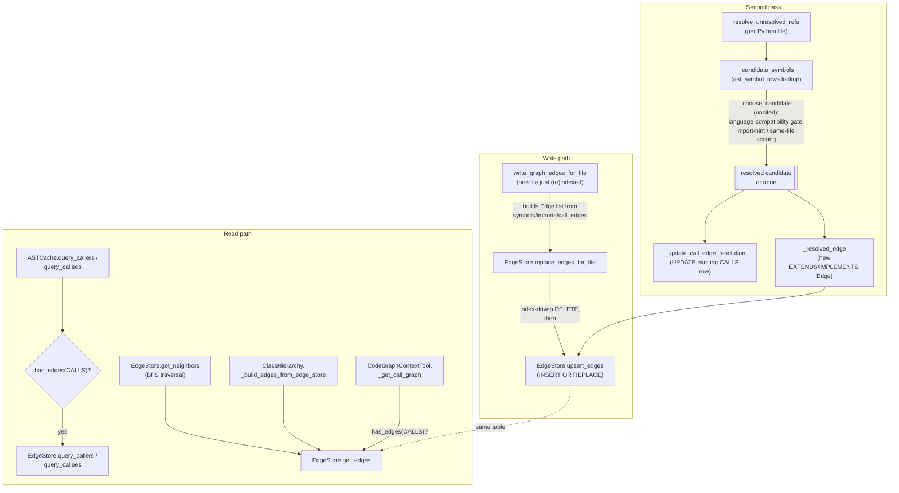

# EdgeStore — a unified SQLite table standing in for a graph database

## Overview
[`EdgeStore`](../catalog/tree_sitter_analyzer/graph/edge_store.md#EdgeStore) is tree-sitter-analyzer's
entire answer to "how do you persist a code graph without a graph database": one SQLite table called
`edges`, one [`Edge`](../catalog/tree_sitter_analyzer/graph/edge_store.md#Edge) dataclass describing a
directed typed relationship between two string node ids, and one
[`EdgeKind`](../catalog/tree_sitter_analyzer/graph/edge_store.md#EdgeKind) enum naming eleven relationship
kinds (`calls`, `imports`, `extends`, `implements`, `references`, `contains`, `overrides`, `type_of`,
`returns`, `instantiates`, `decorates`). This is the concrete grounding substrate the survey compares
against wikify-repo's SCIP symbol index and codegraphcontext's FalkorDB graph database: there is no
separate graph engine here, just a denormalized SQL table shaped so that the hot call-graph queries
(who calls X, what does Y call) can be answered by an indexed `WHERE` clause instead of a graph
traversal engine. The other half of the design — how a *reference* becomes a resolved *edge* across
file and language boundaries — is the family-gated resolution pass in
[`resolve_unresolved_refs`](../catalog/tree_sitter_analyzer/_ast_cache_unresolved.md#resolve_unresolved_refs),
which is where the repo's cross-language accuracy claim actually lives.

## Diagram

## Design rationale (why it's built this way)
**Resolution scalars are promoted out of the JSON blob into real columns, on purpose.** Every `Edge`
carries a free-form `metadata` dict, but
[`upsert_edges`](../catalog/tree_sitter_analyzer/graph/edge_store.md#EdgeStore.upsert_edges) also writes
`caller_name`, `callee_name`, `file_path`, and the resolution scalars as first-class columns via
[`_edge_real_columns`](../catalog/tree_sitter_analyzer/graph/edge_store.md#_edge_real_columns), whose own
docstring says the point plainly: this lets "synapse / unresolved second-pass resolution... UPDATE them
in place without a separate `ast_call_edges` table." Reading `metadata` back out of JSON per row to
filter by callee name would make every call-graph query an O(n) Python-side scan; the promoted columns
turn it into an indexed SQL predicate instead. `query_callers`/`query_callees` querying is the direct
payoff of this decision.

**The three-statement delete in `replace_edges_for_file` is a documented perf fix, not stylistic
preference.** [`replace_edges_for_file`](../catalog/tree_sitter_analyzer/graph/edge_store.md#EdgeStore.replace_edges_for_file)'s
own docstring walks through why: a single `file_path = ? OR source_node_id = ? OR source_node_id LIKE ?`
predicate forces SQLite into a full table scan because the trailing `LIKE` can't use an index and the
`OR` poisons index selection for the *entire* clause — measured at "~1.8s per file" on a 1900-file/160k-edge
cache, meaning a resolve-only refresh that calls this once per file took "~55 minutes and read as a
hang." Splitting the same logical delete into three separate index-backed statements (an equality lookup
on the real `file_path` column, an equality lookup on the synthetic `file:` node id, and a half-open
range scan standing in for the prefix `LIKE`) deletes the identical row set in milliseconds. This is the
kind of decision that only shows up by reading the comment — the code alone looks like unnecessary
repetition.

**`preserve_calls` exists because there is no longer a place to rebuild CALLS from.** After an earlier
migration dropped the `ast_call_edges` table (referenced in the docstrings as "B1.3"), the structural-edge
refresh path has no independent source to reconstruct call edges from if it deletes them — so
`replace_edges_for_file(..., preserve_calls=True)` deletes only non-`calls` rows for the file
(`kind != 'calls' AND ...` prepended to every delete clause) and
[`write_graph_edges_for_file`](../catalog/tree_sitter_analyzer/_ast_cache_write.md#write_graph_edges_for_file)
forwards the same flag, leaving previously-resolved CALLS rows (and their resolution columns) untouched
across a structural-only re-derive.

> [!inferred]
> The family-gating mechanism the survey's lens calls out — restricting cross-file symbol resolution to
> language-compatible candidates — lives in a `_choose_candidate` helper in the same module as
> `resolve_unresolved_refs` and `_candidate_symbols`, but `_choose_candidate` itself is not part of this
> packet's cited subgraph, so it is described here from direct source reading rather than a citation
> link. Reading `tree_sitter_analyzer/_ast_cache_unresolved.py` directly: once
> [`_candidate_symbols`](../catalog/tree_sitter_analyzer/_ast_cache_unresolved.md#_candidate_symbols) has
> gathered every same-named `ast_symbol_rows` candidate across the whole (multi-language) project, the
> picking step drops any candidate whose `language` fails a `languages_compatible(source_lang, candidate_lang)`
> check before ranking the rest by import-hint match, same-file, same-directory, and non-test-preferred
> heuristics. Concretely: a Python file's unresolved call to `config.get(...)` cannot bind to a
> same-named `get` method extracted from a JavaScript or Swift file just because that row sorts first
> alphabetically — the *language family* gates candidacy before any scoring runs. This is the mechanism
> that makes the "13-language call graph" claim mean something more than "we can parse the syntax of 13
> languages": cross-language name collisions are foreclosed at the resolution step, not left to chance
> ordering.

## Entry points
- [`write_graph_edges_for_file`](../catalog/tree_sitter_analyzer/_ast_cache_write.md#write_graph_edges_for_file) —
  called once per file immediately after that file is (re)parsed; turns the plugin extractor's raw
  `symbols`/`imports`/`call_edges` dicts into typed `Edge` rows (CALLS from `call_edges`, IMPORTS via
  `synapse_resolver.parse_imports`, CONTAINS for methods/functions with a `class`, EXTENDS for class
  parents) and hands them to `EdgeStore.replace_edges_for_file`.
- [`resolve_unresolved_refs`](../catalog/tree_sitter_analyzer/_ast_cache_unresolved.md#resolve_unresolved_refs) —
  the second-pass entry point run after a batch of files is indexed; walks every Python file's pending
  EXTENDS/CALLS references and either upserts a new resolved edge or updates an existing CALLS row's
  resolution columns in place.
- [`EdgeStore.get_neighbors`](../catalog/tree_sitter_analyzer/graph/edge_store.md#EdgeStore.get_neighbors) /
  [`get_edges`](../catalog/tree_sitter_analyzer/graph/edge_store.md#EdgeStore.get_edges) — the general
  read API; reached from [`_build_edges_from_edge_store`](../catalog/tree_sitter_analyzer/class_hierarchy.md#ClassHierarchy._build_edges_from_edge_store)
  (class-hierarchy traversal) and from [`_get_call_graph`](../catalog/tree_sitter_analyzer/mcp/tools/codegraph_context_tool.md#CodeGraphContextTool._get_call_graph)/[`_get_edge_store`](../catalog/tree_sitter_analyzer/mcp/tools/codegraph_context_tool.md#CodeGraphContextTool._get_edge_store)
  (the MCP `codegraph_context` tool).
- [`ASTCache.query_callers`](../catalog/tree_sitter_analyzer/ast_cache.md#ASTCache.query_callers) /
  [`query_callees`](../catalog/tree_sitter_analyzer/ast_cache.md#ASTCache.query_callees) — the call-graph
  query surface every "who calls this" / "what does this call" caller ultimately goes through.
- [`_add_file_and_symbols`](../catalog/tree_sitter_analyzer/knowledge_graph/builder.md#KnowledgeGraphBuilder._add_file_and_symbols) —
  the knowledge-graph builder's own consumer of the same `symbol_node` id scheme, building a parallel
  `KnowledgeNode`/`KnowledgeEdge` view for markdown/doc-linking rather than call-graph queries.

## Mechanism (step-by-step)
1. **A node id is a string, not a surrogate key.**
   [`symbol_node`](../catalog/tree_sitter_analyzer/graph/edge_store.md#symbol_node) builds ids like
   `path/to/file.py:MyClass.method:42` (or without a line number, `path:name`), and file/module/class
   nodes get their own `file:`/`module:`/`class:` prefixes. Every producer (extractors, the second-pass
   resolver, the knowledge-graph builder) builds ids independently from the same deterministic scheme,
   so two edges about the same symbol collide onto the same node id without ever sharing an in-memory
   object — the string *is* the join key.
2. **Writing a file's edges is a full replace, not a diff.**
   [`write_graph_edges_for_file`](../catalog/tree_sitter_analyzer/_ast_cache_write.md#write_graph_edges_for_file)
   rebuilds the *entire* edge list for one file from that file's freshly-extracted symbols/imports/calls
   and hands it to
   [`replace_edges_for_file`](../catalog/tree_sitter_analyzer/graph/edge_store.md#EdgeStore.replace_edges_for_file),
   which deletes every existing row scoped to that file (via three index-backed statements, see Design
   rationale) before calling [`upsert_edges`](../catalog/tree_sitter_analyzer/graph/edge_store.md#EdgeStore.upsert_edges).
   Re-indexing a file is therefore always correct by construction — stale edges cannot linger — at the
   cost of recomputing structural edges for that file every time, which is why `preserve_calls` exists as
   a narrower "don't touch CALLS" variant of the same replace.
3. **[`upsert_edges`](../catalog/tree_sitter_analyzer/graph/edge_store.md#EdgeStore.upsert_edges) is
   `INSERT OR REPLACE` keyed on a composite unique constraint**
   (`source_node_id, target_node_id, kind, line`), so calling it twice with the same logical edge is a
   no-op rewrite rather than a duplicate row — the whole write path is idempotent at the row level, which
   is what makes "just replace everything for this file" a safe strategy rather than an edge-count time
   bomb.
4. **The second pass resolves references the first pass could only record as pending.**
   [`resolve_unresolved_refs`](../catalog/tree_sitter_analyzer/_ast_cache_unresolved.md#resolve_unresolved_refs)
   recomputes, per Python file, the set of EXTENDS parents and unresolved CALLS targets that still need a
   cross-file home, gathers every candidate definition with the same name via
   [`_candidate_symbols`](../catalog/tree_sitter_analyzer/_ast_cache_unresolved.md#_candidate_symbols)
   (itself backed by a per-run `(name, kind)` cache so a hot name like `get` or `run` triggers one SQL
   query for the whole pass, not one per reference), and then — after the language-family gate described
   in Design rationale — either upserts a brand-new resolved edge via
   [`_resolved_edge`](../catalog/tree_sitter_analyzer/_ast_cache_unresolved.md#_resolved_edge) (for
   EXTENDS/IMPLEMENTS, since there was no prior edge to point at the right target) or calls
   [`_update_call_edge_resolution`](../catalog/tree_sitter_analyzer/_ast_cache_unresolved.md#_update_call_edge_resolution)
   to `UPDATE` the resolution columns on the *existing* CALLS row in place (there is already an edge —
   just an under-specified one).
5. **Reads prefer the unified store, with a documented legacy fallback.**
   [`ASTCache.query_callers`](../catalog/tree_sitter_analyzer/ast_cache.md#ASTCache.query_callers) and
   [`query_callees`](../catalog/tree_sitter_analyzer/ast_cache.md#ASTCache.query_callees) each first check
   [`has_edges`](../catalog/tree_sitter_analyzer/graph/edge_store.md#EdgeStore.has_edges) for `CALLS` rows
   and, if present, query the unified `edges` table directly via
   [`get_edges`](../catalog/tree_sitter_analyzer/graph/edge_store.md#EdgeStore.get_edges) instead of
   re-deriving anything from a parse; only a cache with no unified CALLS data at all falls through to a
   separate legacy BFS implementation.
   The same "prefer EdgeStore, else build fresh" shape appears again at
   [`_get_call_graph`](../catalog/tree_sitter_analyzer/mcp/tools/codegraph_context_tool.md#CodeGraphContextTool._get_call_graph),
   which returns the `EdgeStore` itself when it already has CALLS edges and only falls back to
   constructing a `CachedCallGraph` from scratch when it doesn't — avoiding a redundant parse when the
   persisted graph is already there.
6. **Traversal (`get_neighbors`) is a plain outgoing BFS over `get_edges`, with edge-level
   deduplication.** [`get_neighbors`](../catalog/tree_sitter_analyzer/graph/edge_store.md#EdgeStore.get_neighbors)
   queues `(node, depth)` pairs, calls [`get_edges`](../catalog/tree_sitter_analyzer/graph/edge_store.md#EdgeStore.get_edges)
   for each frontier node, and de-duplicates on the tuple `(source, target, kind, line)` rather than just
   `(source, target)` — because two structurally distinct edges (e.g. two different call sites) can share
   endpoints and kind but not line, and the store deliberately keeps both.
7. **Inheritance queries reuse the same table rather than a dedicated class-hierarchy store.**
   [`_build_edges_from_edge_store`](../catalog/tree_sitter_analyzer/class_hierarchy.md#ClassHierarchy._build_edges_from_edge_store)
   selects `EdgeKind.EXTENDS`/`EdgeKind.IMPLEMENTS` rows directly and rebuilds a parent→children map from
   them (falling back to `False`/legacy parsing if the table is empty or the query fails), which means
   `EdgeStore` is genuinely the *only* persisted graph in the codebase — class hierarchy, call graph, and
   the knowledge-graph builder ([`_add_file_and_symbols`](../catalog/tree_sitter_analyzer/knowledge_graph/builder.md#KnowledgeGraphBuilder._add_file_and_symbols)
   builds its own `file_id`/`symbol_node` ids on top of the identical id scheme) are all views over one
   `edges` table, not three separate subsystems that happen to agree.

## Key data structures
- **`edges` table** — the entire persisted graph: `source_node_id`, `target_node_id`, `kind`, `line`,
  `provenance`, a JSON `metadata` blob, and the promoted real columns (`caller_name`, `callee_name`,
  `file_path`, `caller_line`, `callee_full`, `callee_line`, `language`, `callee_resolution`,
  `callee_resolved_file`, `callee_symbol_id`) that exist purely so hot queries can use
  `idx_edges_callee_name`/`idx_edges_caller_name`/`idx_edges_file_path` instead of scanning `metadata`.
- **[`Edge`](../catalog/tree_sitter_analyzer/graph/edge_store.md#Edge)** — the frozen in-memory
  representation of one row; `normalized_kind()` collapses the `EdgeKind | str` union so callers never
  have to care whether a kind arrived as the enum or a raw string.
- **[`EdgeKind`](../catalog/tree_sitter_analyzer/graph/edge_store.md#EdgeKind)** — the fixed vocabulary of
  relationship types; a `str, Enum` so it serializes to plain text in SQL without a conversion step.
- **Node id scheme** (`symbol_node`/`file_node`/`module_node`/`class_node`, decoded by `parse_node_id`
  into a `NodeRef`) — the only "join key" in the system; every subsystem that wants to talk about the same
  symbol must reconstruct the identical string.
- **`Subgraph`** — the `{nodes, edges}` pair `get_neighbors` returns; a snapshot, not a live view.

## Dynamics (design intent)
Everything here is synchronous, single-threaded SQL — there is no async or worker-pool path in this
module. Whether `EdgeStore` commits after a write depends on who owns the connection:
`__init__(conn_or_db_path=<path string>)` opens and *owns* the connection, so `upsert_edges`/`ensure_schema`
call `_commit_if_owned` and persist immediately; but when an existing `sqlite3.Connection` is passed in
(the common case, since `ASTCache` already has one open), the store does not own it and leaves the
transaction to the caller —
[`test_edge_store_reuses_external_transaction`](../catalog/tests/unit/test_edge_store.md#test_edge_store_reuses_external_transaction)
pins exactly this behavior. This matters for the write path: `write_graph_edges_for_file` and the
second-pass resolver both run inside `ASTCache`'s already-open connection, so a whole file's (or a whole
resolve pass's) edge writes land in one transaction rather than committing row by row.

## Edge cases
- **A query against a cache with zero CALLS edges silently degrades rather than erroring** —
  `query_callers`/`query_callees` gate on [`has_edges`](../catalog/tree_sitter_analyzer/graph/edge_store.md#EdgeStore.has_edges)
  and fall through to a separate legacy implementation when the unified store has nothing, so a caller
  never sees an exception just because a project hasn't been (re)indexed since the unified schema
  landed.
- **`replace_edges_for_file` with `preserve_calls=True` still deletes non-CALLS rows unconditionally** —
  it is not a merge; every structural edge for that file is thrown away and rebuilt even if nothing about
  the file's classes/imports actually changed, so a `preserve_calls` refresh is cheaper than a full
  refresh only because it skips the CALLS half of the work, not because it diffs anything.
- **`get_edges`/`get_neighbors` direction filtering has three modes** (`outgoing`, `incoming`, `both`) and
  an invalid value raises `ValueError` rather than silently defaulting — a caller that mistypes a
  direction fails loudly at the SQL-building step, before any query runs.
- **Malformed `metadata` JSON degrades to `{}` rather than raising** —
  [`_edge_from_row`](../catalog/tree_sitter_analyzer/graph/edge_store.md#_edge_from_row) catches
  `json.JSONDecodeError`/`TypeError` so a hand-corrupted or partially-written metadata blob (see
  `test_edge_store_query_directions_filters_and_fallbacks`, which inserts a row with literal `"{broken"`
  metadata) still returns a usable `Edge` with empty metadata instead of blowing up the whole query.

## Open questions
- The precise scoring order `_choose_candidate` uses after the language gate (import-hint match,
  same-file, same-directory, test-file demotion, exact-name match) is visible from direct source reading
  but is not itself a citable symbol in this packet's subgraph, so its exact tie-breaking guarantees are
  described here only informally.
- Whether non-Python languages ever get a second-pass resolution equivalent to `resolve_unresolved_refs`,
  or whether cross-file resolution for those languages happens entirely inside each plugin's extractor
  before edges are ever written, is not settled by this packet's subgraph alone.

## See also
- [`tree_sitter_analyzer-call_graph`](tree_sitter_analyzer-call_graph.md) — the higher-level call-graph
  abstraction that `_get_call_graph` falls back to building when `EdgeStore` has no CALLS edges yet.
- [`tree_sitter_analyzer-plugins-manager`](tree_sitter_analyzer-plugins-manager.md) — the per-language
  plugin registry whose extractors are the ultimate source of the `symbols`/`imports`/`call_edges` this
  store persists.
- Cross-repo: [symbol-graph](../../../concepts/symbol-graph.md),
  [incremental-reconcile](../../../concepts/incremental-reconcile.md).
