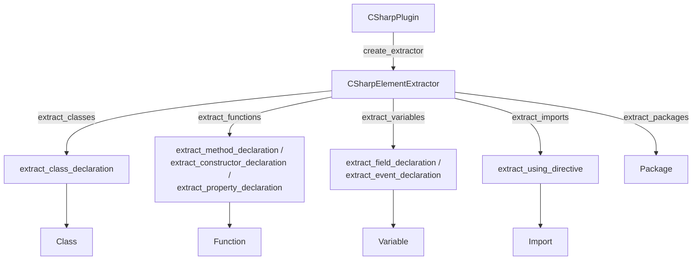

# CSharpPlugin — filling the LanguagePlugin contract for C#

## Overview
[`CSharpPlugin`](../catalog/tree_sitter_analyzer/languages/csharp_plugin.md#CSharpPlugin) is the
concrete answer, for C#, to the question every plugin in this codebase must answer: given a
tree-sitter parse tree and nothing else (no SCIP index, no graph DB), how do you turn C#-specific
grammar nodes into the same generic `Class`/`Function`/`Variable`/`Import`/`Package` shapes every
other language also produces? Its own docstring frames the scope plainly — support for "modern C#
features like records, nullable reference types, and async/await patterns." The plugin class itself
is thin (naming, extension mapping, grammar loading); nearly all of the real work — walking the tree,
recognizing C#'s five class-like declaration kinds, correcting for C#-specific visibility rules,
handling multi-declarator statements — lives in a sibling `CSharpElementExtractor` and a pile of
free functions in `csharp_helpers.py` that the extractor calls as callbacks. Reading this plugin is
reading one concrete data point for the survey's grounding-substrate axis: there is no symbol
database here, only a tree walk plus pattern-matching on `node.type` strings.

## Diagram

## Design rationale (why it's built this way)
**Thin plugin, fat extractor, pure-function helpers — three layers, not two.** The plugin class
only implements the [`LanguagePlugin`](../catalog/tree_sitter_analyzer/plugins/base.md#LanguagePlugin)
contract's naming/loading surface; `CSharpElementExtractor`
([`ElementExtractor`](../catalog/tree_sitter_analyzer/plugins/base.md#ElementExtractor)) owns
per-file mutable state and caching; the actual per-grammar-node-type decisions
([`extract_class_declaration`](../catalog/tree_sitter_analyzer/languages/csharp_helpers.md#extract_class_declaration),
[`extract_method_declaration`](../catalog/tree_sitter_analyzer/languages/csharp_helpers.md#extract_method_declaration),
[`extract_field_declaration`](../catalog/tree_sitter_analyzer/languages/csharp_helpers.md#extract_field_declaration),
etc.) are free functions in a separate module, taking the extractor's own methods in as `Callable`
parameters rather than being methods themselves. That inversion means each helper can be unit-tested
with bare callback stubs instead of a live tree, and the extractor's own per-file caches never leak
into the helper logic being tested.

**The `extractor` attribute is a decoy — every real path builds a fresh one.**
[`CSharpPlugin.__init__`](../catalog/tree_sitter_analyzer/languages/csharp_plugin.md#CSharpPlugin)
assigns `self.`[`extractor`](../catalog/tree_sitter_analyzer/languages/csharp_plugin.md#CSharpPlugin.extractor),
but neither `create_extractor()` nor `extract_elements()` nor `analyze_file()` ever reads it back —
each calls `CSharpElementExtractor()` (or `self.create_extractor()`, which does the same) to get a
brand-new instance. Practically this means every analysis of a file starts with empty
`_node_text_cache`/`_processed_nodes`/`_element_cache`/`_attribute_cache`; the `extractor` field set
in `__init__` exists but is not on the path any of the five `extract_*` entry points actually use.

**Namespace attribution has two mechanisms, and the older one is now vestigial.**
[`extract_classes`](../catalog/tree_sitter_analyzer/languages/csharp_plugin.md#CSharpElementExtractor.extract_classes)
calls an internal `_extract_namespace` pass that walks down from the root and stops at the *first*
`namespace_declaration`/`file_scoped_namespace_declaration` it finds anywhere in the file, storing it
in `self.current_namespace`. But `_extract_class_declaration` doesn't pass that field into
[`extract_class_declaration`](../catalog/tree_sitter_analyzer/languages/csharp_helpers.md#extract_class_declaration)
— it passes the result of a *different*, per-node helper (`_enclosing_namespace`) that walks **up**
from each class node collecting every ancestor namespace name and joins them outermost-first. The
source comment explains why this second mechanism exists: it "attributes each class to its OWN
namespace (bug #977) rather than the first namespace found in the file," which matters the moment a
file has two sibling `namespace A { class X {} }` / `namespace B { class Y {} }` blocks — the older,
first-found `current_namespace` would have stamped both with `"A"`. The fix superseded the old field
without removing it, so `current_namespace` is computed on every call but no longer consulted for
class or function extraction.

**Interfaces get visibility corrected after the fact, because the grammar can't tell you.**
C#'s tree-sitter `modifier` nodes never encode an implicit access level, so the generic
`determine_visibility` helper defaults every unmodified member to `"private"` — correct for a class
member, wrong for an interface member (`T GetById(int id);` inside an interface is public by language
rule even with zero modifiers). `extract_method_declaration`, `extract_property_declaration`, and
`extract_event_declaration` each apply a post-hoc correction that checks the node's grandparent for
`interface_declaration` before trusting the modifier-derived
[`visibility`](../catalog/tree_sitter_analyzer/models/base.md#Function.visibility) — a C#-grammar
quirk with no analog in languages where interface members carry explicit modifiers.

**Extraction never aborts a whole file over one bad declaration.** Every helper in
`csharp_helpers.py` wraps its work in `try/except Exception`, calling
[`log_error`](../catalog/tree_sitter_analyzer/utils/logging.md#log_error) and returning `None` (or an
empty list for field/event extraction) rather than propagating — one malformed or grammar-edge-case
node degrades to "this one element is missing," not "this file failed to analyze."

> [!inferred]
> The extracted [`Function`](../catalog/tree_sitter_analyzer/models/base.md#Function)'s
> `receiver_type` field (set via a `find_owning_class_name` walk-up, not itself in this packet's
> subgraph) is exactly the signal a same-file `this.`/`base.` member-call resolution tier would need
> to bind a call to the right class without crossing into another language's symbols of the same
> name — the C#-specific resolver module (`synapse_resolver/languages/csharp.py`, outside this
> packet) documents exactly that family-gated, same-language-only binding policy. This extractor does
> not do that resolution itself; it only produces the receiver-attributed `Function` objects the
> resolver later consumes. I read that resolver file directly to confirm the connection, but it is
> not part of this page's cited subgraph.

## Entry points
- [`CSharpPlugin`](../catalog/tree_sitter_analyzer/languages/csharp_plugin.md#CSharpPlugin) — the
  concrete [`LanguagePlugin`](../catalog/tree_sitter_analyzer/plugins/base.md#LanguagePlugin) a
  registry hands out for the `"csharp"` language / `.cs` extension; every other entry point below is
  reached through it or through the extractor it creates.
- [`extractor`](../catalog/tree_sitter_analyzer/languages/csharp_plugin.md#CSharpPlugin.extractor) —
  set once in `__init__` but not, per the rationale above, the instance any real extraction path
  reads from — a reader tracing "what extractor handles this file" must follow `create_extractor()`
  instead.
- [`extract_classes`](../catalog/tree_sitter_analyzer/languages/csharp_plugin.md#CSharpElementExtractor.extract_classes) —
  called once per file per analysis pass; the point where namespace resolution and class-like-node
  filtering both happen before any other extraction runs.
- [`extract_class_declaration`](../catalog/tree_sitter_analyzer/languages/csharp_helpers.md#extract_class_declaration),
  [`extract_method_declaration`](../catalog/tree_sitter_analyzer/languages/csharp_helpers.md#extract_method_declaration),
  [`extract_field_declaration`](../catalog/tree_sitter_analyzer/languages/csharp_helpers.md#extract_field_declaration),
  [`extract_using_directive`](../catalog/tree_sitter_analyzer/languages/csharp_helpers.md#extract_using_directive) —
  the per-grammar-node-type helpers that do the actual model construction; these are where a
  C#-grammar quirk (interface implicit-public, multi-declarator statements, using aliases) gets
  handled or silently missed.

## Mechanism (step-by-step)
1. **Classes, interfaces, records, enums, and structs all collapse into one `Class` model.**
   [`extract_classes`](../catalog/tree_sitter_analyzer/languages/csharp_plugin.md#CSharpElementExtractor.extract_classes)
   filters the tree for five distinct grammar node types (`class_declaration`,
   `interface_declaration`, `record_declaration`, `enum_declaration`, `struct_declaration`) and routes
   all five through the same
   [`extract_class_declaration`](../catalog/tree_sitter_analyzer/languages/csharp_helpers.md#extract_class_declaration)
   helper, which stamps a `class_type` field (`"class"`, `"interface"`, `"record"`, `"enum"`, or
   `"struct"`) onto an otherwise-identical [`Class`](../catalog/tree_sitter_analyzer/models/base.md#Class)
   object. Modern C# record types get no special model treatment at all — they are a `Class` with
   `class_type="record"`, distinguishable only by that one field.
2. **Namespace attribution happens per-class, not once per file**, via the ancestor-walking mechanism
   described in the rationale above; each [`Class`](../catalog/tree_sitter_analyzer/models/base.md#Class)'s
   `full_qualified_name` is built by joining every enclosing `namespace_declaration` name outermost-first,
   falling back to a file-scoped namespace only when no block namespace encloses the node — a class in
   its own nested `namespace` block never inherits another sibling block's name.
3. **Methods, constructors, and properties all become `Function` objects, and each gets stamped with
   its owning type after the fact.** `extract_functions` matches `method_declaration`,
   `constructor_declaration`, and `property_declaration` nodes and dispatches to
   [`extract_method_declaration`](../catalog/tree_sitter_analyzer/languages/csharp_helpers.md#extract_method_declaration),
   the constructor helper, or
   [`extract_property_declaration`](../catalog/tree_sitter_analyzer/languages/csharp_helpers.md#extract_property_declaration)
   respectively — C# properties are modeled as functions (`is_property=True`, zero
   [`parameters`](../catalog/tree_sitter_analyzer/models/base.md#Function.parameters)), not as
   variables, even though syntactically `public int Age { get; set; }` reads more like a field. Every
   resulting [`Function`](../catalog/tree_sitter_analyzer/models/base.md#Function) then has its owning
   class/interface/struct/record/enum name attached by walking up the tree — the signal that later
   lets a same-file member call resolve to the right type (see the inferred note above).
4. **Fields and events both extract through the same multi-declarator path.** `extract_variables`
   matches `field_declaration` and `event_field_declaration` and calls
   [`extract_field_declaration`](../catalog/tree_sitter_analyzer/languages/csharp_helpers.md#extract_field_declaration)
   or [`extract_event_declaration`](../catalog/tree_sitter_analyzer/languages/csharp_helpers.md#extract_event_declaration).
   C# allows one statement to declare several names at once (`private int x, y, z;`); both helpers
   walk every `variable_declarator` child of the nested `variable_declaration` node and emit one
   [`Variable`](../catalog/tree_sitter_analyzer/models/base.md#Variable) per declarator, all sharing
   the modifiers, [`variable_type`](../catalog/tree_sitter_analyzer/models/base.md#Variable.variable_type),
   and source span of the enclosing statement rather than a per-name span.
5. **Using directives become `Import` objects through one generic name-node search**, via
   [`extract_using_directive`](../catalog/tree_sitter_analyzer/languages/csharp_helpers.md#extract_using_directive).
   The same code path handles plain `using X.Y;`, `using static X.Y;` (detected by scanning children
   for a literal `"static"` token/keyword), and alias directives `using Foo = X.Y;` — the alias form
   is matched only because the search also accepts a `name_equals` child type alongside
   `qualified_name`/`identifier`, not because alias and target are parsed separately.
6. **Namespace declarations become `Package` elements independently of class extraction** — a
   separate traversal collects every `namespace_declaration`/`file_scoped_namespace_declaration` node
   and builds one [`Package`](../catalog/tree_sitter_analyzer/models/base.md#Package) per block, using
   only that block's own name text (no ancestor joining), which is a genuinely different namespace
   answer than the dotted `full_qualified_name` classes get in step 2 for the same file.
7. **Grammar loading is lazy and cached, and shields two tree-sitter binding generations.**
   `CSharpPlugin.get_tree_sitter_language` imports `tree_sitter_c_sharp` only on first call, caches
   the result on the instance, and detects whether the returned object is already a wrapped
   `Language` or needs wrapping — logging success via
   [`log_debug`](../catalog/tree_sitter_analyzer/utils/logging.md#log_debug) or failure via
   [`log_error`](../catalog/tree_sitter_analyzer/utils/logging.md#log_error). `analyze_file` applies
   the same generation-straddling logic to the `Parser` object itself (`set_language` vs. the newer
   `.language` property vs. a constructor argument), so one plugin body works across incompatible
   `tree_sitter` package versions.
8. **All node text goes through one caching, byte-safe accessor.** Every helper receives
   `_get_node_text_optimized` as its `get_node_text` callback, which keys a cache by
   `(start_byte, end_byte)` (deterministic across repeated traversals, unlike caching by Python object
   id) and delegates the actual slice to
   [`get_node_text_safe`](../catalog/tree_sitter_analyzer/utils/tree_sitter_compat.md#get_node_text_safe) —
   necessary because tree-sitter byte offsets must be sliced against the UTF-8 encoded source, not the
   decoded Python string, to stay aligned on any non-ASCII identifier or comment.

## Key data structures
- **`CSharpElementExtractor`'s four caches** (`_node_text_cache`, `_processed_nodes`,
  `_element_cache`, `_attribute_cache`) — all keyed by byte-position tuples rather than node identity,
  scoped to one file's extraction (cleared by `_reset_caches` at the top of every `extract_*` call
  that starts a fresh pass).
- **`current_namespace`** — set once per `extract_classes`/`extract_functions` call but, per the
  rationale above, not read by the class-attribution path that actually matters; effectively dead
  state kept alive by the newer per-node `_enclosing_namespace` mechanism.
- **The five generic model dataclasses** —
  [`Class`](../catalog/tree_sitter_analyzer/models/base.md#Class),
  [`Function`](../catalog/tree_sitter_analyzer/models/base.md#Function),
  [`Variable`](../catalog/tree_sitter_analyzer/models/base.md#Variable),
  [`Import`](../catalog/tree_sitter_analyzer/models/base.md#Import),
  [`Package`](../catalog/tree_sitter_analyzer/models/base.md#Package) — C# claims no dataclass fields
  of its own; it fills in fields other languages introduced (`is_constructor`, commented `# Java`;
  `receiver_type`, commented `# Go`) alongside the fully generic ones
  ([`visibility`](../catalog/tree_sitter_analyzer/models/base.md#Function.visibility),
  `modifiers`, `annotations` for attributes,
  [`complexity_score`](../catalog/tree_sitter_analyzer/models/base.md#Function.complexity_score),
  `is_async`, `is_property`). This is a small but real signal that the unified model was designed
  generically enough that adding C# required zero model changes, only extractor logic.

## Dynamics (design intent)
Extraction itself is single-threaded and synchronous — a manual stack-based iterative tree walk
(`_traverse_iterative`), not tree-sitter's built-in cursor API, feeding `if node.type in [...]`
dispatch. The only async boundary in the whole plugin is `analyze_file` (required by the
[`LanguagePlugin`](../catalog/tree_sitter_analyzer/plugins/base.md#LanguagePlugin) contract), and even
there the five `extract_*` calls inside it run sequentially in the same coroutine — there is no
parallelism across element kinds. Every extraction method explicitly re-sorts its result list by
`start_line` before returning, which is a deliberate determinism guarantee independent of whatever
order the manual traversal happens to visit nodes in — output order is always source-position order,
never traversal order.

## Edge cases
- **Using-alias directives fold the alias into the name text.** `using Foo = Bar.Baz;` is matched by
  the same fallback search that accepts a `name_equals` child, so
  [`extract_using_directive`](../catalog/tree_sitter_analyzer/languages/csharp_helpers.md#extract_using_directive)
  extracts the whole `"Foo = Bar.Baz"` text as the [`Import`](../catalog/tree_sitter_analyzer/models/base.md#Import)'s
  name/module — the model has a dedicated `alias` field, but this path never populates it separately.
- **Multi-declarator fields/events share one source span.** `private int a, b, c;` produces three
  [`Variable`](../catalog/tree_sitter_analyzer/models/base.md#Variable) objects with identical
  `start_line`/`end_line`/`raw_text` — there is no per-declarator position, only the enclosing
  statement's.
- **Two different, non-equivalent answers to "what namespace is this in."** A class's
  `full_qualified_name` is a dotted join across every ancestor namespace block; a `Package` element
  for that same block carries only that one block's own (non-dotted) name — nested namespace blocks
  produce sibling `Package` objects, never a nested or joined one.
- **Interface implicit-public correction covers methods, properties, and events, but not constructors
  or fields** — a narrower fix than it might look like, though not a bug in practice: C# interfaces
  cannot declare instance constructors or instance fields, so the missing correction path is never
  exercised on valid C# source.
- **Attributes are captured as a name plus raw text, not parsed argument-by-argument** —
  `extract_attributes` records `{"name": ..., "line": ..., "text": ...}` for each `attribute` node
  under a leading `attribute_list`; an attribute's constructor arguments (e.g. the route string in
  `[Route("api/x")]`) live only inside the opaque `text` field.

> [!inferred]
> Grepping both `csharp_plugin.py` and `csharp_helpers.py` for any handling of the `partial` modifier
> turns up nothing beyond `extract_modifiers` capturing it as an ordinary string alongside `public`,
> `static`, etc. There is no code anywhere in this plugin that merges multiple `partial class Foo { }`
> fragments — each occurrence becomes its own independent
> [`Class`](../catalog/tree_sitter_analyzer/models/base.md#Class) with the same name but distinct
> `start_line`/`end_line`/members. I infer from this absence (not from an explicit statement) that
> partial-type reconciliation, if it happens at all, happens somewhere downstream of this extractor,
> not here.

## Open questions
- Generic type parameters on a type's own declaration (`class Foo<T>`) aren't visibly extracted as
  structured data anywhere in this file or in `csharp_helpers.py` — `generic_name` only appears as a
  valid node type for *base-list* entries (superclass/interface references), not for the declaring
  type's own name. Whether arity/constraints are captured elsewhere, or simply absorbed into
  whatever text the grammar's "name" field happens to return, isn't settled by what I read.
- Whether partial-class fragments are ever reconciled into one logical type further downstream
  (formatter, call-graph, symbol table) is outside this plugin/helpers file and unresolved here.
- The precedence or interaction between the vestigial `current_namespace` field and the newer
  `_enclosing_namespace` mechanism isn't documented anywhere in-line beyond the bug-#977 comment — it
  is plausible `current_namespace` is retained only because some other code path (not visible in this
  packet) still reads it, rather than being pure leftover.

## See also
- [`tree_sitter_analyzer-plugins-base.md`](tree_sitter_analyzer-plugins-base.md) — the abstract
  `LanguagePlugin`/`ElementExtractor` contract this plugin fills in.
- [`tree_sitter_analyzer-plugins-manager.md`](tree_sitter_analyzer-plugins-manager.md) — the registry
  that discovers and lazily instantiates `CSharpPlugin` alongside every other language plugin.
- [`tree_sitter_analyzer-languages-scala_plugin.md`](tree_sitter_analyzer-languages-scala_plugin.md) —
  a sibling concrete plugin instantiating the same abstract contract for a different, JVM-hosted
  language, useful for contrasting which grammar quirks are language-specific versus shared.
- Cross-repo: [multi-language-extraction](../../../concepts/multi-language-extraction.md) — the
  shared concept this page instantiates: one extractor per language, all converging on the same
  generic element model.
