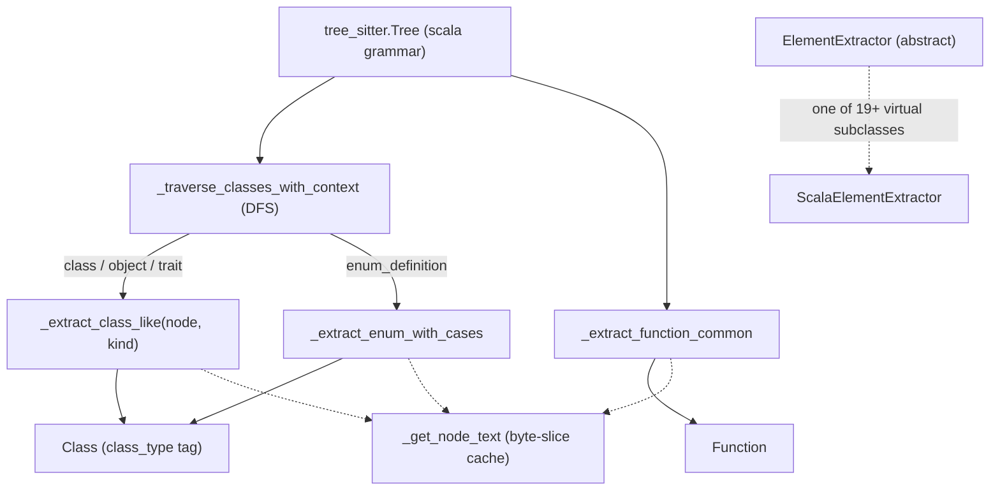

# The Scala plugin — six `class`-shaped constructs behind one `Class` dataclass

## Overview
[`ScalaElementExtractor`](../catalog/tree_sitter_analyzer/languages/scala_plugin.md#ScalaElementExtractor)
is the Scala-specific fulfillment of the [`ElementExtractor`](../catalog/tree_sitter_analyzer/plugins/base.md#ElementExtractor)
contract: it walks a tree-sitter parse tree for Scala source and flattens whatever it finds into the
project's generic [`Function`](../catalog/tree_sitter_analyzer/models/base.md#Function) /
[`Class`](../catalog/tree_sitter_analyzer/models/base.md#Class) /
[`Variable`](../catalog/tree_sitter_analyzer/models/base.md#Variable) shapes — the same shapes every
other language's extractor produces. The interesting part isn't the plumbing (every plugin has that);
it's the *fan-in*. Scala's grammar hands this extractor six semantically distinct "this-is-a-type-of-
thing" constructs — class, object, trait, enum (with inline case values), `given`, and `extension` —
plus type aliases, and the extractor's whole job is collapsing all of them into the same `Class`
dataclass via a `class_type` tag, the way [`_extract_class_like`](../catalog/tree_sitter_analyzer/languages/scala_plugin.md#ScalaElementExtractor._extract_class_like)
and [`_extract_enum_with_cases`](../catalog/tree_sitter_analyzer/languages/scala_plugin.md#ScalaElementExtractor._extract_enum_with_cases)
do. This is `multi-language-extraction` in miniature: identical output shape, wildly different input
grammar underneath — and Scala is the stress case, because "wildly different" here means an
OO/functional hybrid with far more first-class surface syntax than a conventional class-based language.

## Diagram

## Design rationale (why it's built this way)
**One generic method absorbs three constructs, on purpose.** `_extract_class_like`'s own docstring
says it plainly: *"Generic extraction for class/object/trait."* Scala's `class_definition`,
`object_definition`, and `trait_definition` nodes differ in grammar keyword only — visibility,
modifiers, `extends`/`with` clauses, and docstrings all parse identically across the three — so the
extractor takes a `kind: str` parameter instead of writing the same ~40 lines three times. This is the
opposite move from `_extract_enum_with_cases`, which gets its *own* method because Scala 3 enums are
genuinely structurally different: the case values live *inside* the same `enum_definition` node
(`enum_body → enum_case_definitions → simple_enum_case`/`full_enum_case`), not as sibling top-level
declarations the way Java enum constants are. The method's docstring spells out the exact shape it
has to walk, down to the detail that *"each `enum_case_definitions` may contain multiple
`simple_enum_case` children separated by commas (`case North, South, East, West`)"* — a single AST
node can yield an arbitrary number of `Class` records, not a 1:1 node-to-element mapping.

**Return-type inference is deliberately incomplete, and says so.** Scala lets a `def` omit its
result type entirely when the body is a single expression (`def get(key: String) = "legacy"`).
Defaulting every such def to `"Unit"` (as a block-bodied def with no annotation legitimately would be)
is simply wrong here — issue #594 is cited in the source specifically for this. The fix is not real
type inference; it pins a handful of trivial literal bodies (string/int/float/bool) to their obvious
type and honestly reports `""` (unknown) for everything else, because, in the method's own words,
*"Full inference is a non-goal; pin trivial literals, otherwise emit "" (unknown, matching the Go
plugin's absent-return-type convention)."* That's a real, considered scope boundary, not a shortcut
nobody noticed.

**Qualified-access modifiers force a prefix match, not a set lookup.** `private[somepackage]` and
`protected[this]` are exactly the kind of Scala-only visibility refinement a Java/Kotlin-shaped
extractor wouldn't need to think about at all — and the grammar emits the whole bracketed qualifier as
one literal modifier token, so a visibility check written as `"private" in modifiers` silently
misclassifies `private[pkg] class Secret` as public. The fix has to match on `m.startswith("private[")`
in addition to the bare keyword.

**Three grammar shapes for one semantic idea ("the supertype name").** The `extends_clause` handling
in [`_extract_class_like`](../catalog/tree_sitter_analyzer/languages/scala_plugin.md#ScalaElementExtractor._extract_class_like)
accepts `type_identifier`, `generic_type`, and `stable_type_identifier` as equally valid spellings of a
super-type or mixed-in trait name (`Base`, `Base[String]`, and `pkg.Base` respectively), stripping any
`[...]` type arguments from the generic form. The comment traces this to a Codex review finding
(#585) — the original version only recognized `type_identifier`, so anything extending a generic or
package-qualified type silently reported no superclass at all.

> [!inferred]
> This file is roughly 2x the size of the project's C# plugin (1508 vs. 760 lines) despite both
> targeting statically-typed, JVM-or-CLR-adjacent OO languages. Reading the source, the gap tracks
> directly to Scala's larger set of first-class top-level constructs that a Java/C#-shaped extractor
> simply doesn't have to model: singleton `object`s and companion-object semantics distinct from
> `class`, `trait` mixin composition via `with` (as opposed to single-interface `implements`), `given`/
> `extension` (Scala 3's redesign of implicits — see `_extract_given` and `_extract_extension`),
> algebraic-data-type `enum`s with inline case values, expression-bodied defs whose return type must
> sometimes be inferred rather than read off an annotation, and qualified-access modifiers. Each is a
> distinct grammar production requiring its own extraction path; the line count is a fairly direct
> proxy for how much of Scala's OO/functional-hybrid surface syntax actually reaches the AST as
> distinguishable node types.

## Entry points
- [`ScalaElementExtractor`](../catalog/tree_sitter_analyzer/languages/scala_plugin.md#ScalaElementExtractor) —
  constructed once per file (a fresh instance, never reused across files — see Edge cases) to fulfill
  the abstract [`ElementExtractor`](../catalog/tree_sitter_analyzer/plugins/base.md#ElementExtractor)
  contract; its `extract_classes`/`extract_functions`/etc. methods are the outermost entry points a
  caller reaches.
- [`_traverse_classes_with_context`](../catalog/tree_sitter_analyzer/languages/scala_plugin.md#ScalaElementExtractor._traverse_classes_with_context) —
  reached from `extract_classes`; the single DFS that dispatches every class-like node type
  (`class_definition`, `object_definition`, `trait_definition`, `enum_definition`, `given_definition`,
  `extension_definition`, `type_definition`) to its specific handler while threading the enclosing
  scope's name down as `parent_class`.
- [`_extract_function_common`](../catalog/tree_sitter_analyzer/languages/scala_plugin.md#ScalaElementExtractor._extract_function_common) —
  reached for both `function_definition` (has a body) and `function_declaration` (abstract, no body)
  nodes; both funnel into the same [`Function`](../catalog/tree_sitter_analyzer/models/base.md#Function)-building
  logic.
- [`_get_node_text`](../catalog/tree_sitter_analyzer/languages/scala_plugin.md#ScalaElementExtractor._get_node_text) —
  reached from essentially every extraction path that needs source text for a node; it is the one
  chokepoint all the class/function/enum extractors share.

## Mechanism (step-by-step)
1. A caller obtains a fresh [`ScalaElementExtractor`](../catalog/tree_sitter_analyzer/languages/scala_plugin.md#ScalaElementExtractor)
   (conforming to the abstract [`ElementExtractor`](../catalog/tree_sitter_analyzer/plugins/base.md#ElementExtractor)
   contract) and calls `extract_classes(tree, source_code)`. The method stashes the source, rebuilds
   [`content_lines`](../catalog/tree_sitter_analyzer/languages/scala_plugin.md#ScalaElementExtractor.content_lines)
   by splitting on `"\n"`, extracts the package name first (so every `Class` built afterward can carry
   its `package_name`), and only then starts the real traversal.
2. [`_traverse_classes_with_context`](../catalog/tree_sitter_analyzer/languages/scala_plugin.md#ScalaElementExtractor._traverse_classes_with_context)
   is an explicit-stack DFS (not recursive — stack-safe on pathologically deep trees) that dispatches
   on `node.type`. For `class_definition`/`object_definition`/`trait_definition` it calls
   [`_extract_class_like`](../catalog/tree_sitter_analyzer/languages/scala_plugin.md#ScalaElementExtractor._extract_class_like)
   with the corresponding `kind` string, then pushes that class's own name as the new `parent_class`
   for everything nested inside it — the mechanism that lets a `given`/`type`/enum-case nested inside
   an `object` correctly record its owner rather than defaulting to the file-level scope. Children are
   pushed in `reversed()` order specifically so the LIFO stack pops them back out in left-to-right
   source order, keeping the emitted `Class` list in document order despite the iterative traversal.
3. `enum_definition` nodes are routed to [`_extract_enum_with_cases`](../catalog/tree_sitter_analyzer/languages/scala_plugin.md#ScalaElementExtractor._extract_enum_with_cases)
   instead, because a Scala 3 enum's case values are children of the *same* definition node rather
   than separate top-level declarations. The method emits the enum itself as one
   [`Class`](../catalog/tree_sitter_analyzer/models/base.md#Class) (with
   [`class_type`](../catalog/tree_sitter_analyzer/models/base.md#Class.class_type) `"enum"`), then walks
   two more levels into `enum_body → enum_case_definitions` and emits each `simple_enum_case`/
   `full_enum_case` as its *own* synthetic `Class` (`class_type="enum_member"`) with `parent_class` set
   to the enum's name and its own
   [`superclass`](../catalog/tree_sitter_analyzer/models/base.md#Class.superclass)/
   [`interfaces`](../catalog/tree_sitter_analyzer/models/base.md#Class.interfaces) read from any
   per-case `extends` clause (`case Mercury extends Planet(...)`).
4. On the function side, both `function_definition` and `function_declaration` nodes funnel into
   [`_extract_function_common`](../catalog/tree_sitter_analyzer/languages/scala_plugin.md#ScalaElementExtractor._extract_function_common),
   which resolves the name (with an identifier-scan fallback), walks parameter children to build the
   [`parameters`](../catalog/tree_sitter_analyzer/models/base.md#Function.parameters) list, computes
   [`return_type`](../catalog/tree_sitter_analyzer/models/base.md#Function.return_type) and
   [`visibility`](../catalog/tree_sitter_analyzer/models/base.md#Function.visibility), and stamps
   [`is_constructor`](../catalog/tree_sitter_analyzer/models/base.md#Function.is_constructor) by
   literally checking whether the resolved name is `"this"` (Scala's constructor-overload keyword).
   The distinction between "has a body" and "abstract declaration" that the grammar draws is invisible
   to the rest of the pipeline — both produce an identically-shaped `Function`.
5. Every text lookup — class name, extends-clause identifier, parameter type, raw source span — passes
   through [`_get_node_text`](../catalog/tree_sitter_analyzer/languages/scala_plugin.md#ScalaElementExtractor._get_node_text),
   which keys a cache on the node's `(start_byte, end_byte)` pair rather than decoding the same span
   repeatedly, and defers the actual byte slicing to the project's shared encoding helpers
   (`extract_text_slice`/`safe_encode` via [`EncodingManager`](../catalog/tree_sitter_analyzer/encoding_utils.md#EncodingManager)) —
   the one piece of this file that is *not* Scala-specific.
6. Each `_extract_*` method wraps its body in a `try`/`except` and reports failures through
   [`log_error`](../catalog/tree_sitter_analyzer/utils/logging.md#log_error) rather than letting an
   exception propagate — one malformed or unexpected construct becomes a missing element in the
   returned list, not a failed file. Successful top-level calls report their yield via
   [`log_debug`](../catalog/tree_sitter_analyzer/utils/logging.md#log_debug) (e.g. "Extracted N Scala
   classes/objects/traits").

## Key data structures
- **`content_lines`** — the source split into lines, rebuilt at the top of *every* `extract_*` call
  ([`content_lines`](../catalog/tree_sitter_analyzer/languages/scala_plugin.md#ScalaElementExtractor.content_lines));
  it feeds `_get_node_text`'s byte-slicing path.
- **`_node_text_cache`** — a `dict[(start_byte, end_byte), str]` keyed on byte offsets, cleared at the
  start of each `extract_*` call; the perf reason `_get_node_text` exists as a chokepoint at all.
- **`current_package`** — accumulated once by `_extract_package` (called only from `extract_classes`)
  and then read by every subsequently-built [`Class`](../catalog/tree_sitter_analyzer/models/base.md#Class)'s
  `package_name` field for the rest of that file's extraction.
- **`Class.class_type`** ([cite](../catalog/tree_sitter_analyzer/models/base.md#Class.class_type)) —
  the single string tag (`"class"` / `"object"` / `"trait"` / `"enum"` / `"enum_member"` / `"given"` /
  `"extension"` / `"type_alias"` / `"type_member"`) that is the *entire* mechanism by which six-plus
  distinct Scala grammar constructs collapse into one dataclass shape.
- **`Function.complexity_score`** ([cite](../catalog/tree_sitter_analyzer/models/base.md#Function.complexity_score)) —
  populated by the module-level `calculate_scala_complexity`, which counts `if`/`match`/`for`/`while`/
  `catch`/`guard` constructs plus `&&`/`||` tokens as decision points, and is careful *not* to
  double-count a `case_clause` under a `match`/`catch` it already counted once — while still counting a
  standalone partial-function `{ case ... }` literal (no enclosing match/catch) as its own branch.

## Dynamics (design intent)
There is no concurrency inside this extractor: every traversal (`_traverse_classes_with_context`,
`_traverse_functions_with_context`, and the generic `_traverse_and_extract`) is an explicit-stack,
single-threaded DFS over one file's tree, chosen for stack-safety on deep ASTs rather than for
parallelism — [`ElementExtractor`](../catalog/tree_sitter_analyzer/plugins/base.md#ElementExtractor)'s
own abstract methods are plain synchronous calls, not `async`. The project's tests
([`_classes`](../catalog/tests/unit/languages/test_scala_fixes.md#_classes) constructs a brand-new
`ScalaElementExtractor()` per parsed source) confirm the intended usage pattern: one extractor
instance, one file, one pass — the mutable `content_lines`/`current_package`/`_node_text_cache` state
is not designed to survive across files.

## Edge cases
- **Comma-joined enum cases are one AST node, many results.** `case North, South, East, West` parses
  as a single `enum_case_definitions` node containing four `simple_enum_case` children —
  `_extract_enum_with_cases` must loop over all of them, not assume one case per definitions node.
- **Qualified visibility modifiers are single opaque tokens.** `private[pkg]` is not "private" plus a
  qualifier node; the grammar emits it as one literal string, so any check against it must be a prefix
  match, not equality.
- **Expression-body return types are inferred only for a few literal shapes.** `def f = "x"` reports
  `String`; `def f = someHelper()` reports `""` (unknown) rather than a guess — a real detail, not a
  gap, since the source explicitly documents this as a non-goal for full inference.
- **`val`/`var` pattern bindings only surface the first name.** A destructuring `val (a, b) = pair`
  is parsed via a `pattern_list`, and the extractor's name resolution takes only the first identifier
  found inside it — a second bound name in the same declaration is not separately represented as its
  own `Variable`.
- **The same source gets re-split into lines up to seven times per file.** `ScalaPlugin.extract_elements`
  calls `extract_functions`, `extract_classes`, `extract_variables`, `extract_imports`,
  `extract_packages`, `extract_comments`, and `extract_annotations` in sequence on the same extractor
  instance, and each one independently reassigns
  [`content_lines`](../catalog/tree_sitter_analyzer/languages/scala_plugin.md#ScalaElementExtractor.content_lines)
  from `source_code.split("\n")` — a real, visible piece of repeated work for a large file, not just a
  theoretical inefficiency.

## Open questions
- `_extract_enum_with_cases` is invoked directly from the enum branch of
  `_traverse_classes_with_context`, but is also listed as calling itself in the packet's subgraph — the
  packet doesn't resolve whether this is a genuine (rare) recursive path or an artifact of how the
  call-graph analysis counted the enum-case sub-loop.
- Whether the return-type inference's `""` (unknown) sentinel is treated specially by any downstream
  consumer (e.g. the family-gated call-graph resolver), or is simply indistinguishable from a real
  empty-string type, isn't visible from this file alone.
- The pattern-list name-resolution gap (only the first bound identifier is captured) reads like an
  intentional scope limit given how carefully-commented the rest of the file's edge cases are, but
  nothing in the source explicitly says so.

## See also
- [`tree_sitter_analyzer-plugins-base`](tree_sitter_analyzer-plugins-base.md) — the abstract
  `LanguagePlugin`/`ElementExtractor` contract this plugin fulfills.
- [`tree_sitter_analyzer-plugins-manager`](tree_sitter_analyzer-plugins-manager.md) — the registry that
  discovers and lazily loads `ScalaPlugin` alongside every other per-language plugin.
- [`tree_sitter_analyzer-languages-csharp_plugin`](tree_sitter_analyzer-languages-csharp_plugin.md) —
  a sibling concrete plugin for a syntactically narrower statically-typed OO language, useful for
  contrasting how much of this file's size is Scala-specific grammar breadth versus generic
  extractor boilerplate.
- [`tree_sitter_analyzer-call_graph`](tree_sitter_analyzer-call_graph.md) — the downstream, family-gated
  resolution mechanism that consumes the `Function`/`Class`/`Import` inventory this extractor produces;
  this page only covers how that inventory is built for Scala, not how it gets resolved into edges.
- Cross-repo: [multi-language-extraction](../../../concepts/multi-language-extraction.md).
