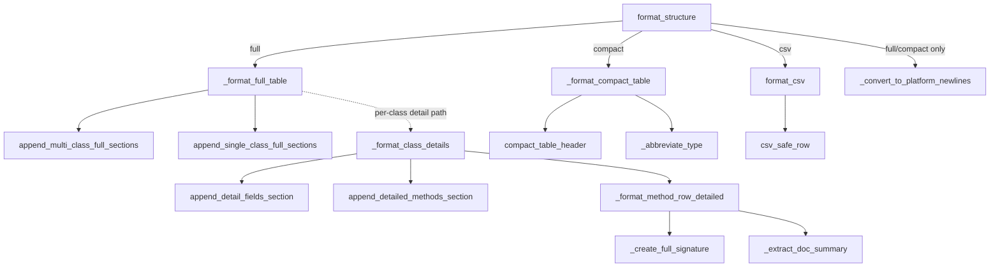

# Legacy Table Formatter

## Overview

[`LegacyTableFormatter`](../catalog/tree_sitter_analyzer/legacy_table_formatter.md#LegacyTableFormatter) is tree-sitter-analyzer's oldest structure-rendering surface: it turns the same language-agnostic `structure_data` dict every language plugin produces into one of three text tables — full, compact, csv — reproducing the wire format of the project's v1.6.1.4 release byte-for-byte. Its own docstring is unusually candid about its status: "kept for backward compatibility... new code should use `DefaultTableFormatter` instead." That makes it a useful counterpoint to the [TOON encoder](tree_sitter_analyzer-formatters-toon_encoder.md) documented alongside it in this wiki: both take the exact same `structure_data` shape and render it as text for an external consumer, but this formatter optimizes for historical byte-compatibility and human/markdown readability — this is the CLI-facing table, not the MCP-facing payload — while TOON optimizes the same payload for LLM token cost. The class itself is deliberately thin: almost every private method is a `staticmethod` binding to a pure function living in one of five sibling `_legacy_table_formatter_*` modules split by format (common/full/compact/detail/csv), so each format's rendering logic can be read, tested, and changed independently of the others.

## Diagram

## Design rationale (why it's built this way)

**Thin coordinator, fat helpers.** The class body of [`LegacyTableFormatter`](../catalog/tree_sitter_analyzer/legacy_table_formatter.md#LegacyTableFormatter) binds ten of its own methods — [`_get_class_fields`](../catalog/tree_sitter_analyzer/legacy_table_formatter.md#LegacyTableFormatter._get_class_fields), [`_get_class_methods`](../catalog/tree_sitter_analyzer/legacy_table_formatter.md#LegacyTableFormatter._get_class_methods), [`_get_visibility_symbol`](../catalog/tree_sitter_analyzer/legacy_table_formatter.md#LegacyTableFormatter._get_visibility_symbol), [`_create_full_signature`](../catalog/tree_sitter_analyzer/legacy_table_formatter.md#LegacyTableFormatter._create_full_signature), [`_shorten_type`](../catalog/tree_sitter_analyzer/legacy_table_formatter.md#LegacyTableFormatter._shorten_type), [`_convert_visibility`](../catalog/tree_sitter_analyzer/legacy_table_formatter.md#LegacyTableFormatter._convert_visibility), [`_extract_doc_summary`](../catalog/tree_sitter_analyzer/legacy_table_formatter.md#LegacyTableFormatter._extract_doc_summary) among them — to plain functions imported from sibling modules, as `staticmethod(...)` class-body assignments rather than `def` bodies. Only the format-specific orchestration ([`_format_full_table`](../catalog/tree_sitter_analyzer/legacy_table_formatter.md#LegacyTableFormatter._format_full_table), [`_format_compact_table`](../catalog/tree_sitter_analyzer/legacy_table_formatter.md#LegacyTableFormatter._format_compact_table), [`_format_class_details`](../catalog/tree_sitter_analyzer/legacy_table_formatter.md#LegacyTableFormatter._format_class_details), [`_format_method_row_detailed`](../catalog/tree_sitter_analyzer/legacy_table_formatter.md#LegacyTableFormatter._format_method_row_detailed)) is written directly on the class. This means the "same data, three renderings" problem is solved by keeping each rendering's logic in its own small module rather than one large conditional file — a full-table change can't accidentally perturb the compact or csv path because they don't share code beyond the common helpers.

**Nested-class scoping is real, not incidental.** [`_get_class_fields`](../catalog/tree_sitter_analyzer/legacy_table_formatter.md#LegacyTableFormatter._get_class_fields) and [`_get_class_methods`](../catalog/tree_sitter_analyzer/legacy_table_formatter.md#LegacyTableFormatter._get_class_methods) don't just filter by line range — reading the helper they delegate to shows a second pass that excludes any element whose line falls inside a *nested* class's range, so an inner class's methods never leak into the outer class's method table. Without this, any language with nested/inner classes would double-count members in the "per class" rendering.

**CSV keeps its own newline discipline.** [`format_structure`](../catalog/tree_sitter_analyzer/legacy_table_formatter.md#LegacyTableFormatter.format_structure) calls [`_convert_to_platform_newlines`](../catalog/tree_sitter_analyzer/legacy_table_formatter.md#LegacyTableFormatter._convert_to_platform_newlines) for full/compact output but explicitly skips it for csv. Reading [`format_csv`](../catalog/tree_sitter_analyzer/_legacy_table_formatter_csv.md#format_csv), the reason is visible in the source: the `csv.writer` is constructed with `lineterminator="\n"` and the function normalizes any stray `\r\n`/`\r` back to `\n` before returning — csv output is deliberately kept LF-only regardless of platform, while the markdown-table formats get the platform's native newline. Two different consumers (a CSV parser vs. a terminal/editor) have different expectations, so the formatter treats them differently on purpose instead of applying one newline policy everywhere.

**CSV safety encodes a real Python-version bug, not a style preference.** [`csv_safe_row`](../catalog/tree_sitter_analyzer/formatters/_csv_safety.md#csv_safe_row)'s own module docstring documents that Python 3.10's `csv.writer` raises on control characters it can't quote (needing an `escapechar` that would double every literal backslash in ordinary Windows paths), while 3.11+ doesn't have the problem — so the fix strips C0/DEL control characters instead of touching the dialect, keeping backslashes and quoting untouched across both Python versions.

**Malformed input degrades gracefully, not crashes.** [`test_classes_is_none`](../catalog/tests/unit/formatters/test_legacy_table_coverage_format_utils.md#TestCompactTableEdgeCases.test_classes_is_none)'s own docstring references "Bug #778 fixed: `classes=None` must not yield '# Unknown'" — [`_format_compact_table`](../catalog/tree_sitter_analyzer/legacy_table_formatter.md#LegacyTableFormatter._format_compact_table) and [`_format_full_table`](../catalog/tree_sitter_analyzer/legacy_table_formatter.md#LegacyTableFormatter._format_full_table) both coerce a `None` classes list to `[]` before use, rather than trusting the upstream analysis dict to always supply a list — a small defensive habit that matters because `structure_data` is produced by 13 independent language plugins, any of which could emit `None` for an absent field.

> [!inferred]
> Beyond this packet's subgraph, the surrounding codebase (`tree_sitter_analyzer/formatters/table_formatter.py`, `tree_sitter_analyzer/default_table_formatter.py`, `tree_sitter_analyzer/formatters/formatter_registry.py`) shows a naming trap worth knowing about even though none of those symbols are cited here: the "canonical public" re-export named `TableFormatter` is bound to *this* `LegacyTableFormatter`, while the formatter registry that actually wires up per-language output construction imports `DefaultTableFormatter` (a near-identical sibling class with the same ten staticmethod-bound helpers) directly. Three names, two implementations, and the "canonical" one points at the deprecated one — a reader following imports by name alone can easily end up documenting or patching the wrong copy.

## Entry points

- [`LegacyTableFormatter`](../catalog/tree_sitter_analyzer/legacy_table_formatter.md#LegacyTableFormatter) — constructed with `format_type` ("full"/"compact"/"csv"), a `language` string used for import-block syntax highlighting, and `include_javadoc`; every rendering decision downstream is driven by these three constructor arguments, stored as plain instance attributes (see [`format_type`](../catalog/tree_sitter_analyzer/legacy_table_formatter.md#LegacyTableFormatter.format_type)).
- [`format_structure`](../catalog/tree_sitter_analyzer/legacy_table_formatter.md#LegacyTableFormatter.format_structure) — the single public method callers invoke once the formatter is constructed; control reaches it whenever something needs the current `structure_data` dict rendered in the format chosen at construction time, and it is the only method that raises (`ValueError`) for an unsupported `format_type`.

## Mechanism (step-by-step)

1. [`format_structure`](../catalog/tree_sitter_analyzer/legacy_table_formatter.md#LegacyTableFormatter.format_structure) dispatches on `self.format_type` to exactly one of [`_format_full_table`](../catalog/tree_sitter_analyzer/legacy_table_formatter.md#LegacyTableFormatter._format_full_table), [`_format_compact_table`](../catalog/tree_sitter_analyzer/legacy_table_formatter.md#LegacyTableFormatter._format_compact_table), or [`format_csv`](../catalog/tree_sitter_analyzer/_legacy_table_formatter_csv.md#format_csv) (via the bound `_format_csv` staticmethod), then routes the result through [`_convert_to_platform_newlines`](../catalog/tree_sitter_analyzer/legacy_table_formatter.md#LegacyTableFormatter._convert_to_platform_newlines) for every format except csv, as covered above.

2. [`_format_full_table`](../catalog/tree_sitter_analyzer/legacy_table_formatter.md#LegacyTableFormatter._format_full_table) builds a header and package/imports/class-info sections, then forks on how many classes the file contains: more than one class routes to [`append_multi_class_full_sections`](../catalog/tree_sitter_analyzer/_legacy_table_formatter_full.md#append_multi_class_full_sections) (a "Classes Overview" summary table plus one subsection per class), while zero or one class routes to [`append_single_class_full_sections`](../catalog/tree_sitter_analyzer/_legacy_table_formatter_full.md#append_single_class_full_sections) (flat "## Methods" / "## Fields" tables with no per-class grouping). Both paths call [`_get_class_methods`](../catalog/tree_sitter_analyzer/legacy_table_formatter.md#LegacyTableFormatter._get_class_methods) / [`_get_class_fields`](../catalog/tree_sitter_analyzer/legacy_table_formatter.md#LegacyTableFormatter._get_class_fields) to scope members to a class's line range.

3. [`_format_class_details`](../catalog/tree_sitter_analyzer/legacy_table_formatter.md#LegacyTableFormatter._format_class_details) assembles a richer, per-class view — a "## ClassName (start-end)" header followed by a Fields section (via [`append_detail_fields_section`](../catalog/tree_sitter_analyzer/_legacy_table_formatter_detail.md#append_detail_fields_section)) and separate Constructors/Public/Protected/Package/Private method sections (via [`append_detailed_methods_section`](../catalog/tree_sitter_analyzer/_legacy_table_formatter_detail.md#append_detailed_methods_section), grouped by visibility). Each method row is rendered by [`_format_method_row_detailed`](../catalog/tree_sitter_analyzer/legacy_table_formatter.md#LegacyTableFormatter._format_method_row_detailed), which composes a full parameter-typed signature via [`_create_full_signature`](../catalog/tree_sitter_analyzer/legacy_table_formatter.md#LegacyTableFormatter._create_full_signature) and a one-line doc summary via [`_extract_doc_summary`](../catalog/tree_sitter_analyzer/legacy_table_formatter.md#LegacyTableFormatter._extract_doc_summary) when `include_javadoc` is set.

4. [`_format_compact_table`](../catalog/tree_sitter_analyzer/legacy_table_formatter.md#LegacyTableFormatter._format_compact_table) builds a terser header via [`compact_table_header`](../catalog/tree_sitter_analyzer/_legacy_table_formatter_compact.md#compact_table_header) — which, notably, falls back to a filename-derived label instead of a placeholder "Unknown" string when a file has no classes at all (Bash/Go-style scripts) — and abbreviates every type through [`_abbreviate_type`](../catalog/tree_sitter_analyzer/legacy_table_formatter.md#LegacyTableFormatter._abbreviate_type) (`String`→`S`, `boolean`→`b`, generics and arrays recursed into their component types) so the whole table fits in far fewer characters than the full format.

5. The csv path ([`format_csv`](../catalog/tree_sitter_analyzer/_legacy_table_formatter_csv.md#format_csv)) writes one row per class/method/field through Python's `csv.writer`, sanitizing every cell through [`csv_safe_row`](../catalog/tree_sitter_analyzer/formatters/_csv_safety.md#csv_safe_row) first — this is the only format path that touches the shared `formatters._csv_safety` module rather than a `_legacy_table_formatter_*` sibling, because CSV-safety is a concern shared with the modern (non-legacy) formatters too.

## Key data structures

- **`structure_data` dict** — the common input every method operates on: `classes`, `methods`, `fields`, `imports`, `package`, `file_path`, each a plain list-of-dicts or dict produced upstream by a language plugin. Nothing in this formatter parses source itself; it only re-shapes already-extracted structure.
- **`format_type`** — the three-way string switch (`"full"`/`"compact"`/`"csv"`) captured once at construction (see [`format_type`](../catalog/tree_sitter_analyzer/legacy_table_formatter.md#LegacyTableFormatter.format_type)) that every subsequent `format_structure` call obeys; there is no per-call override.
- **`line_range` dicts** (`{"start": int, "end": int}`) — the scoping key used throughout: class membership, nested-class exclusion, and per-row line numbers are all derived from comparing `line_range` boundaries rather than any structural (AST) relationship.

## Dynamics (design intent)

Purely synchronous and side-effect-free: every method is a function of its input dict plus the formatter's three constructor attributes. There is no caching, no I/O, and no concurrency — each `format_structure` call fully re-renders from scratch, which is appropriate because the class exists to reproduce an exact historical text output, not to optimize repeated rendering.

## Edge cases

- A `None` or missing `classes` list is coerced to `[]` rather than producing a placeholder "Unknown" class — see [`test_classes_is_none`](../catalog/tests/unit/formatters/test_legacy_table_coverage_format_utils.md#TestCompactTableEdgeCases.test_classes_is_none) (Bug #778).
- Method parameters that are neither a `dict` nor a bare `str` (a malformed plugin output) fall back to `str(param)` rather than raising — exercised by [`test_fallback_parameter_non_dict_non_string`](../catalog/tests/unit/formatters/test_legacy_table_coverage_platform_header.md#TestFullTableMultiClassParamTypes.test_fallback_parameter_non_dict_non_string) for the full-table multi-class path and by [`test_fallback_parameter`](../catalog/tests/unit/formatters/test_legacy_table_coverage_format_utils.md#TestCreateFullSignature.test_fallback_parameter) for signature generation directly.
- CSV cells containing embedded newlines, quotes, dashes, or extra whitespace all normalize predictably rather than corrupting the CSV — see the `TestCleanCsvText` group, e.g. [`test_text_with_quotes`](../catalog/tests/unit/formatters/test_legacy_table_coverage_format_utils.md#TestCleanCsvText.test_text_with_quotes) (quotes doubled) and [`test_dash_text`](../catalog/tests/unit/formatters/test_legacy_table_coverage_format_utils.md#TestCleanCsvText.test_dash_text) (a literal "-" is preserved as the "no value" sentinel, not stripped).
- Full/compact newline conversion is skipped entirely for csv, as covered in Design rationale — a formatter-level branch, not a per-call option.

## Open questions

> [!inferred]
> [`_format_class_details`](../catalog/tree_sitter_analyzer/legacy_table_formatter.md#LegacyTableFormatter._format_class_details) and [`_format_method_row_detailed`](../catalog/tree_sitter_analyzer/legacy_table_formatter.md#LegacyTableFormatter._format_method_row_detailed) build a fuller per-class "### Fields" / "### Constructors" / "### Public Methods" rendering, but the full-table dispatch tree in [`_format_full_table`](../catalog/tree_sitter_analyzer/legacy_table_formatter.md#LegacyTableFormatter._format_full_table) routes through [`append_multi_class_full_sections`](../catalog/tree_sitter_analyzer/_legacy_table_formatter_full.md#append_multi_class_full_sections) / [`append_single_class_full_sections`](../catalog/tree_sitter_analyzer/_legacy_table_formatter_full.md#append_single_class_full_sections) instead — simpler summary tables, not the detailed per-class view. Whether `_format_class_details` is reachable from any public entry point at all, or is retained purely as directly-tested surface for external callers outside this packet's subgraph, isn't settled by what's in scope here.
>
> Why a class whose own docstring says "renamed to `DefaultTableFormatter`" continues to ship as a fully independent, separately-tested implementation (rather than, say, a thin subclass or import alias of the newer class) also isn't answered within this subgraph — see the naming-trap note in Design rationale.

## See also

- [TOON Encoder](tree_sitter_analyzer-formatters-toon_encoder.md) — the MCP-facing counterpart: same `structure_data`-shaped payloads, optimized for token cost instead of human/CSV readability.
- [UML Export](tree_sitter_analyzer-uml_export.md) — another way tree-sitter-analyzer's already-computed project intelligence is exposed to an agent, this time as Mermaid diagrams rather than tables.
