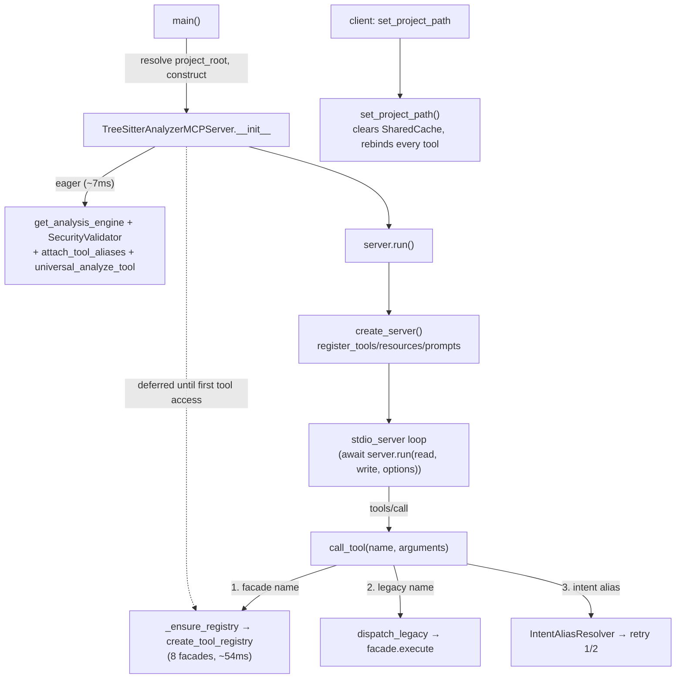

# The MCP server — deferred tool registry and facade dispatch

## Overview
[`TreeSitterAnalyzerMCPServer`](../catalog/tree_sitter_analyzer/mcp/server.md#TreeSitterAnalyzerMCPServer)
is the process-level object [`main`](../catalog/tree_sitter_analyzer/mcp/server.md#main) constructs and
[`run`](../catalog/tree_sitter_analyzer/mcp/server.md#TreeSitterAnalyzerMCPServer.run) drives over stdio —
the single seam through which an agent's MCP client reaches every analysis capability this survey cares
about (call-graph queries, structure extraction, search). What makes this page worth writing rather than
skimming is a startup-latency fix baked into the constructor: building the tool surface is deliberately
split into a cheap eager half (the analysis engine, the security validator) and an expensive, *deferred*
half (the 8-facade tool registry), because building the whole thing eagerly was intermittently starving
the MCP handshake of its connect window. The tool hierarchy itself is also a small, self-referential
demonstration of the dynamic-dispatch resolution this survey's cross-repo lens cares about: every concrete
tool subclasses one abstract base, and the override edges are exactly the kind of `(virtual)` dispatch a
class-hierarchy-aware call graph — like this repo's own — has to recover, not something it can read off a
static call site.

## Diagram

## Design rationale (why it's built this way)
**Deferring the registry is a measured fix for a real handshake failure, not premature optimization.**
The constructor's own docstring is explicit about the incident:
> "the tool registry (`_create_tool_registry` + `attach_tool_aliases` + `init_universal_tool`) costs
> ~54ms and is NOT needed to answer the MCP `initialize` handshake ... Building it eagerly here pushed
> spawn→initialize to the edge of the client's connect window, so a loaded machine intermittently saw
> the server stuck at `status: pending`."

The fix is a guard flag (`_registry_built`) checked by `_ensure_registry`, triggered lazily the first
time anything touches the `tools` / `tool_instances` properties — which
[`set_project_path`](../catalog/tree_sitter_analyzer/mcp/server.md#TreeSitterAnalyzerMCPServer.set_project_path)
and [`create_server`](../catalog/tree_sitter_analyzer/mcp/server.md#TreeSitterAnalyzerMCPServer.create_server)'s
`register_tools` call do internally, but the `initialize` response itself never does.

**Two-tier tool surface, kept alive across a breaking change.** `create_tool_registry` builds only 8
domain facades (search / nav / structure / health / edit / project / index / viz) — the source comment
calls this a "hard cut" from an earlier 63-discrete-tool surface. The 63 old names are not gone; they are
kept reachable through a legacy shim (`dispatch_legacy`) that
[`call_tool`](../catalog/tree_sitter_analyzer/mcp/server.md#TreeSitterAnalyzerMCPServer) tries as its
second resolution tier, and a third tier resolves "intent alias" names (e.g. a natural-language-ish tool
name) back to a facade or legacy name before retrying. This three-tier fallback exists purely so old
MCP clients don't break the day the facade surface shipped — a deprecation window, not a permanent
design.

**`attach_tool_aliases` runs before the registry exists, deliberately.** The eager-vs-deferred split only
works because [`attach_tool_aliases`](../catalog/tree_sitter_analyzer/mcp/_server_helpers.md#attach_tool_aliases)
(which builds direct-access attributes like `analyze_scale_tool`,
`query_tool`, `read_partial_tool` for legacy test/consumer code and the bespoke
`_handle_extract_code_section` path) does not read the facade registry at all — it constructs its own
tool instances independently, so it is safe to run inside `__init__` even though the 8-facade registry it
sits next to is not built yet.

## Entry points
- [`main`](../catalog/tree_sitter_analyzer/mcp/server.md#main) — the process entrypoint: resolves the
  project root, constructs the server, and awaits `run()`. This is what a client actually launches
  (via `main_sync`/`__main__`).
- [`TreeSitterAnalyzerMCPServer`](../catalog/tree_sitter_analyzer/mcp/server.md#TreeSitterAnalyzerMCPServer) —
  the server object itself; every MCP request after construction is a method call on this instance.
- [`run`](../catalog/tree_sitter_analyzer/mcp/server.md#TreeSitterAnalyzerMCPServer.run) — builds the
  `Server`, computes `InitializationOptions` from `version`, and enters the stdio read/write loop; control
  does not return until the client disconnects or the loop raises.
- [`set_project_path`](../catalog/tree_sitter_analyzer/mcp/server.md#TreeSitterAnalyzerMCPServer.set_project_path) —
  hit whenever a client rebinds the server to a different repository root; this is the one path that
  forces the deferred registry to materialize (it iterates `self.tools.values()`).
- [`_analyze_code_scale`](../catalog/tree_sitter_analyzer/mcp/server.md#TreeSitterAnalyzerMCPServer._analyze_code_scale) —
  a legacy-named method kept for backward compatibility; it is pure delegation, not where scale analysis
  actually lives.

## Mechanism (step-by-step)
1. **Construction splits eager from deferred work.**
   [`TreeSitterAnalyzerMCPServer`](../catalog/tree_sitter_analyzer/mcp/server.md#TreeSitterAnalyzerMCPServer)'s
   `__init__` eagerly calls
   [`get_analysis_engine`](../catalog/tree_sitter_analyzer/core/analysis_engine.md#get_analysis_engine)
   and constructs a [`SecurityValidator`](../catalog/tree_sitter_analyzer/security/validator.md#SecurityValidator)
   — both cheap, and both needed by legacy code-scale paths and the per-call security pre-check — but does
   *not* call `create_tool_registry` yet. The one expensive piece is deferred to first access.
2. **`run` assembles the protocol surface and blocks on stdio.**
   [`run`](../catalog/tree_sitter_analyzer/mcp/server.md#TreeSitterAnalyzerMCPServer.run) calls
   [`create_server`](../catalog/tree_sitter_analyzer/mcp/server.md#TreeSitterAnalyzerMCPServer.create_server),
   which wires tool/resource/prompt registration onto a fresh `mcp.server.Server` instance built with
   `self.name`, then hands off to the stdio read/write loop. The reported server
   [`version`](../catalog/tree_sitter_analyzer/mcp/server.md#TreeSitterAnalyzerMCPServer.version) string —
   annotated with a detected platform key at construction time — is what `InitializationOptions` reports
   back to the client during the handshake `run` performs.
3. **`set_project_path` is the one call that forces the registry to exist and then rebinds everything.**
   [`set_project_path`](../catalog/tree_sitter_analyzer/mcp/server.md#TreeSitterAnalyzerMCPServer.set_project_path)
   clears the process-wide [`get_shared_cache`](../catalog/tree_sitter_analyzer/_shared_cache.md#get_shared_cache)
   instance (stale security-validation and file-metric entries from the old root must not leak into the
   new one), stores the new path, iterates every built facade tool and rebinds it, separately rebinds the
   legacy alias tools, the [`universal_analyze_tool`](../catalog/tree_sitter_analyzer/mcp/server.md#TreeSitterAnalyzerMCPServer.universal_analyze_tool)
   and [`project_stats_resource`](../catalog/tree_sitter_analyzer/mcp/server.md#TreeSitterAnalyzerMCPServer.project_stats_resource),
   and finally reconstructs `analysis_engine`/`security_validator` against the new root — five distinct
   objects, all kept in sync by one call, because the server has no single "current root" indirection they
   all read through live.
4. **`BaseMCPTool` is the shared contract, and its subclasses are recovered as `(virtual)` edges, not
   static calls.** [`BaseMCPTool`](../catalog/tree_sitter_analyzer/mcp/tools/base_tool.md#BaseMCPTool)
   exposes a [`project_root`](../catalog/tree_sitter_analyzer/mcp/tools/base_tool.md#BaseMCPTool.project_root)
   property every concrete tool inherits, and the packet's own subgraph marks
   [`AnalyzeCodeStructureTool`](../catalog/tree_sitter_analyzer/mcp/tools/analyze_code_structure_tool.md#AnalyzeCodeStructureTool),
   [`QueryTool`](../catalog/tree_sitter_analyzer/mcp/tools/query_tool.md#QueryTool),
   [`FindAndGrepTool`](../catalog/tree_sitter_analyzer/mcp/tools/find_and_grep_tool.md#FindAndGrepTool),
   [`ReadPartialTool`](../catalog/tree_sitter_analyzer/mcp/tools/read_partial_tool.md#ReadPartialTool),
   [`ListFilesTool`](../catalog/tree_sitter_analyzer/mcp/tools/list_files_tool.md#ListFilesTool),
   [`SearchContentTool`](../catalog/tree_sitter_analyzer/mcp/tools/search_content_tool.md#SearchContentTool),
   [`AnalyzeScaleTool`](../catalog/tree_sitter_analyzer/mcp/tools/analyze_scale_tool.md#AnalyzeScaleTool),
   [`GetCodeOutlineTool`](../catalog/tree_sitter_analyzer/mcp/tools/get_code_outline_tool.md#GetCodeOutlineTool),
   [`FacadeTool`](../catalog/tree_sitter_analyzer/mcp/tools/facade_tool.md#FacadeTool),
   [`CodeGraphContextTool`](../catalog/tree_sitter_analyzer/mcp/tools/codegraph_context_tool.md#CodeGraphContextTool)
   and [`CodeGraphCallersTool`](../catalog/tree_sitter_analyzer/mcp/tools/callers_tool.md#CodeGraphCallersTool)
   as `analyze_file`-sibling `(virtual)` overrides of `BaseMCPTool` rather than direct callers — the same
   base→override recovery this codebase's own call-graph tooling performs project-wide is visible here
   in miniature, on its own tool surface.
5. **`_analyze_code_scale` is deliberately thin.**
   [`_analyze_code_scale`](../catalog/tree_sitter_analyzer/mcp/server.md#TreeSitterAnalyzerMCPServer._analyze_code_scale)'s
   own docstring calls it a "legacy method ... Delegates to code_scale_handler" — it exists only so a
   client still calling the pre-facade method name gets an answer, while the current facade path is what
   `create_tool_registry`/`attach_tool_aliases` builds.

## Key data structures
- **`TreeSitterAnalyzerMCPServer`** instance state: `analysis_engine`
  ([`UnifiedAnalysisEngine`](../catalog/tree_sitter_analyzer/core/analysis_engine.md#UnifiedAnalysisEngine)),
  `security_validator` ([`SecurityValidator`](../catalog/tree_sitter_analyzer/security/validator.md#SecurityValidator)),
  `project_stats_resource` ([`ProjectStatsResource`](../catalog/tree_sitter_analyzer/mcp/resources/project_stats_resource.md#ProjectStatsResource)),
  `universal_analyze_tool`, `name`/`version`, and the deferred-build pair `_tool_instances`/`_tools`
  guarded by `_registry_built`.
- **`SharedCache`** ([`SharedCache`](../catalog/tree_sitter_analyzer/_shared_cache.md#SharedCache), reached
  via [`get_shared_cache`](../catalog/tree_sitter_analyzer/_shared_cache.md#get_shared_cache)) — a
  process-wide singleton `set_project_path` clears on every root change so security-validation and
  file-metric results don't leak across projects.
- **The facade registry tuple** returned by
  [`create_tool_registry`](../catalog/tree_sitter_analyzer/mcp/_tool_registry.md#create_tool_registry):
  an ordered `[(name, instance), ...]` list plus the same data as a `dict` — the list governs the order
  the MCP `list_tools` response reports facades in.

## Dynamics (design intent)
> [!inferred]
> The stdio loop `run` enters is a single `asyncio` task reading/writing one client connection; nothing
> in the subgraph indicates multi-client concurrency within one server process. `_ensure_registry`'s guard
> (`if self._registry_built: return`) is a plain boolean check, not a lock — safe only because the stdio
> loop is single-threaded, so two "first" accesses can't interleave.

## Edge cases
- **Calling any handler before construction finishes raises, not hangs.**
  [`TreeSitterAnalyzerMCPServer`](../catalog/tree_sitter_analyzer/mcp/server.md#TreeSitterAnalyzerMCPServer)'s
  `_ensure_initialized` check (exercised via
  [`test_structure_boundary_classifies_as_language_unsupported`](../catalog/tests/unit/mcp/test_structure_unparseable_language.md#test_structure_boundary_classifies_as_language_unsupported)
  and the initialization tests) raises a `RuntimeError` with the literal message "Server not fully
  initialized..." — the specific string a downstream error-handling layer pattern-matches on to convert
  into a friendlier client-facing message (see the sibling `tree_sitter_analyzer-mcp-utils-error_handler`
  page).
- **`set_project_path` forces the deferred registry to build even for a client that never intended to list
  tools yet** — `self.tools.values()` inside it is a property access that triggers `_ensure_registry`, so
  the ~54ms cost the constructor deferred is paid here instead, on the first project-root change.
- **`_analyze_code_scale`'s test double,**
  [`test_server_initialization`](../catalog/tests/integration/mcp/test_integration.md#TestMCPServerIntegration.test_server_initialization),
  asserts on `project_stats_resource` and `version` directly rather than on tool registry contents —
  consistent with those two being eager, not deferred, state.

## Open questions
- The eight `build_*_facade` functions `create_tool_registry` imports (e.g. `build_search_facade`,
  `build_nav_facade`) are outside this packet's subgraph, so how each facade's `action` parameter maps to
  the underlying `BaseMCPTool` subclasses isn't grounded here.
- `attach_tool_aliases` and the intent-alias resolver (`IntentAliasResolver`, `dispatch_legacy`) referenced
  by `call_tool`'s fallback chain are not in this subgraph either; the three-tier resolution order is
  read from source, not citable symbol-by-symbol.

## See also
- [`tree_sitter_analyzer-mcp-utils-error_handler`](tree_sitter_analyzer-mcp-utils-error_handler.md) — what
  happens when a tool `execute()` raises past this server's dispatch layer.
- [`tree_sitter_analyzer-core-request`](tree_sitter_analyzer-core-request.md) — the request object every
  `analyze`/`analyze_file` call this server's tools eventually make is built from.
- [`tree_sitter_analyzer-call_graph`](tree_sitter_analyzer-call_graph.md) — the project-wide version of the
  same `(virtual)`-edge dynamic-dispatch recovery this page shows on the tool hierarchy alone.
