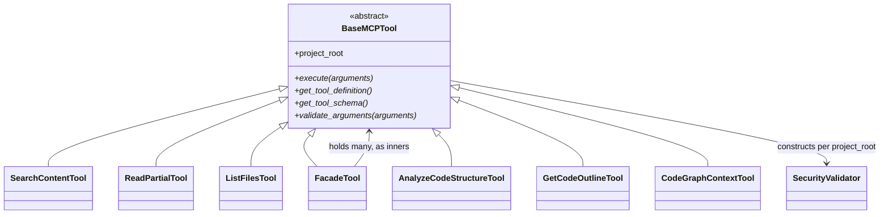

# BaseMCPTool — the shared contract every MCP tool inherits

## Overview
[`BaseMCPTool`](../catalog/tree_sitter_analyzer/mcp/tools/base_tool.md#BaseMCPTool) is the abstract
base every one of TSA's ~30+ MCP tools subclasses — from thin wrappers like
[`SearchContentTool`](../catalog/tree_sitter_analyzer/mcp/tools/search_content_tool.md#SearchContentTool)
and [`ListFilesTool`](../catalog/tree_sitter_analyzer/mcp/tools/list_files_tool.md#ListFilesTool) to the
composite [`FacadeTool`](../catalog/tree_sitter_analyzer/mcp/tools/facade_tool.md#FacadeTool). It is the
seam this survey's lens cares about: everything upstream of it (tree-sitter parsing, family-gated
call-graph resolution — see the sibling
[call-graph page](tree_sitter_analyzer-call_graph.md)) is TSA's own grounding substrate; everything at
and below `BaseMCPTool` is generic agent-tool plumbing that has nothing to do with tree-sitter at all —
project-root bookkeeping, path security, argument strictness, and one canonical response envelope. The
one design idea worth taking away: this class enforces its contract **without relying on subclass
authors to remember anything** — the strict-parameter guard, the project-root funnel, and the abstract
method set are wired in at class-*definition* time, not left as conventions a busy tool author could
skip.

## Diagram

## Design rationale (why it's built this way)
**The strict-parameter guard is applied by the type system, not by convention.** `__init_subclass__`
(a Python hook that fires once, at the moment a subclass is *defined*, not when it's instantiated) wraps
every subclass's `execute` in a check that re-fetches the tool's own `inputSchema` and rejects unknown
top-level parameters with a did-you-mean hint. The source comment is direct about why: this runs "once
per subclass" and is idempotent (a sentinel attribute stops a deeper subclass from double-wrapping an
already-wrapped inherited `execute`), so a tool author gets the guard whether or not they know it
exists — there is no opt-in step to forget. This is the mechanism that makes the abstract
[`execute`](../catalog/tree_sitter_analyzer/mcp/tools/base_tool.md#BaseMCPTool.execute) more than a
type-checked signature: every concrete override — from
[`SearchContentTool`](../catalog/tree_sitter_analyzer/mcp/tools/search_content_tool.md#SearchContentTool)'s
[`execute`](../catalog/tree_sitter_analyzer/mcp/tools/search_content_tool.md#SearchContentTool.execute)
to [`FacadeTool`](../catalog/tree_sitter_analyzer/mcp/tools/facade_tool.md#FacadeTool)'s own
[`execute`](../catalog/tree_sitter_analyzer/mcp/tools/facade_tool.md#FacadeTool.execute) — is
intercepted before the subclass body ever runs.

**`project_root` is a property with a single funnel, not a plain attribute, so every write path
converges.** The docstring is explicit: exposing it as a property means direct assignment
(`tool.project_root = "..."`) "takes the same code path as `__init__` / `set_project_path`" — rewiring
`SecurityValidator`, the path resolver, and firing a rebind hook. `set_project_path` is documented
"final-by-convention": subclasses must not override it, because the *only* supported customization point
for reacting to a rebind is the hook, not the setter itself. This matters because the MCP server rebinds
every live tool's project root when a client changes working directories — a single inconsistent write
path here would desynchronize which repo a tool thinks it's rooted at from which repo its security
validator actually protects.

**Every concrete tool converges on the same closing move, but that convergence is convention, not an
abstract-method requirement.** The abstract contract (`execute`, `get_tool_definition`, `get_tool_schema`,
`validate_arguments`) says nothing about output formatting — yet the dead-code tool's
[`execute`](../catalog/tree_sitter_analyzer/mcp/tools/dead_code_tool.md#CodeGraphDeadCodeTool.execute)
(which walks the call graph in terms of
[`FunctionRef`](../catalog/tree_sitter_analyzer/call_graph.md#FunctionRef) nodes), the change-impact
tool's
[`execute`](../catalog/tree_sitter_analyzer/mcp/tools/change_impact_tool.md#ChangeImpactTool.execute)
(which calls
[`_build_change_impact_result`](../catalog/tree_sitter_analyzer/mcp/tools/utils/change_impact_analysis.md#_build_change_impact_result)),
and the code-patterns tool's
[`execute`](../catalog/tree_sitter_analyzer/mcp/tools/code_patterns_tool.md#CodePatternsTool.execute)
(which calls [`detect_language_from_file`](../catalog/tree_sitter_analyzer/language_detector.md#detect_language_from_file))
all end by piping their result dict through
[`apply_toon_format_to_response`](../catalog/tree_sitter_analyzer/mcp/utils/format_helper.md#apply_toon_format_to_response)
themselves. `apply_toon_format_to_response` is the free function that does two independent things: format
the whole response as TOON when the caller asked for it, *and* inject a default `verdict="INFO"` on any
success response that forgot to set one — a safety net for a bug class (tools shipping
`summary_line=None` / missing `verdict`) the project's own dogfood process found repeatedly. Because
this happens by every tool calling the same free function rather than by inheriting a template method,
a new tool that forgets the call silently ships an unformatted, verdict-less response — nothing in
`BaseMCPTool`'s type contract would catch that omission (see Edge cases).

## Entry points
- [`BaseMCPTool.execute`](../catalog/tree_sitter_analyzer/mcp/tools/base_tool.md#BaseMCPTool.execute) —
  the abstract async entrypoint every MCP dispatch call eventually reaches; because
  `__init_subclass__` wraps it before the subclass body runs, control always passes through the
  strict-parameter guard first, even for direct `await tool.execute(args)` callers that bypass the MCP
  server entirely (tests, CLI bridges).
- [`BaseMCPTool.get_tool_definition`](../catalog/tree_sitter_analyzer/mcp/tools/base_tool.md#BaseMCPTool.get_tool_definition) —
  where the MCP server discovers a tool's name/description/`inputSchema`; the strict-parameter guard
  re-fetches this same definition at call time, so schema and runtime enforcement can never drift out
  of sync with each other.
- [`BaseMCPTool.project_root`](../catalog/tree_sitter_analyzer/mcp/tools/base_tool.md#BaseMCPTool.project_root) —
  read at the top of nearly every concrete `execute` before touching security validation or path
  resolution; the one piece of per-tool state every subclass depends on.
- [`FacadeTool`](../catalog/tree_sitter_analyzer/mcp/tools/facade_tool.md#FacadeTool)'s own
  [`execute`](../catalog/tree_sitter_analyzer/mcp/tools/facade_tool.md#FacadeTool.execute) — a second,
  composite entry point: `FacadeTool` is itself a `BaseMCPTool` subclass that holds many further
  `BaseMCPTool` instances, so the abstract contract this page documents applies recursively (see the
  sibling [facade_tool page](tree_sitter_analyzer-mcp-tools-facade_tool.md)).

## Mechanism (step-by-step)
1. **Virtual dispatch, not a switch statement.** The Subgraph's `(virtual)` edges out of
   [`BaseMCPTool`](../catalog/tree_sitter_analyzer/mcp/tools/base_tool.md#BaseMCPTool) enumerate roughly
   twenty concrete subclasses — [`SearchContentTool`](../catalog/tree_sitter_analyzer/mcp/tools/search_content_tool.md#SearchContentTool),
   [`ReadPartialTool`](../catalog/tree_sitter_analyzer/mcp/tools/read_partial_tool.md#ReadPartialTool),
   [`ListFilesTool`](../catalog/tree_sitter_analyzer/mcp/tools/list_files_tool.md#ListFilesTool),
   [`FacadeTool`](../catalog/tree_sitter_analyzer/mcp/tools/facade_tool.md#FacadeTool),
   [`AnalyzeCodeStructureTool`](../catalog/tree_sitter_analyzer/mcp/tools/analyze_code_structure_tool.md#AnalyzeCodeStructureTool),
   [`GetCodeOutlineTool`](../catalog/tree_sitter_analyzer/mcp/tools/get_code_outline_tool.md#GetCodeOutlineTool),
   [`CodeGraphContextTool`](../catalog/tree_sitter_analyzer/mcp/tools/codegraph_context_tool.md#CodeGraphContextTool),
   [`QueryTool`](../catalog/tree_sitter_analyzer/mcp/tools/query_tool.md#QueryTool),
   [`FindAndGrepTool`](../catalog/tree_sitter_analyzer/mcp/tools/find_and_grep_tool.md#FindAndGrepTool),
   [`AnalyzeScaleTool`](../catalog/tree_sitter_analyzer/mcp/tools/analyze_scale_tool.md#AnalyzeScaleTool)
   and [`UniversalAnalyzeTool`](../catalog/tree_sitter_analyzer/mcp/tools/universal_analyze_tool.md#UniversalAnalyzeTool)
   among them — every one of which recovered by class-hierarchy analysis, not a static call graph
   (there is no code path that calls all of these; it's polymorphism).
2. **`__init_subclass__` intercepts every override before it can run.** Because
   [`BaseMCPTool`](../catalog/tree_sitter_analyzer/mcp/tools/base_tool.md#BaseMCPTool) defines this hook,
   the moment Python finishes building e.g. `FacadeTool`'s class body, the hook inspects whether
   [`execute`](../catalog/tree_sitter_analyzer/mcp/tools/facade_tool.md#FacadeTool.execute) is a fresh
   async override (skipping it otherwise) and swaps in a wrapper that calls the strict-parameter guard
   first. A subclass that merely inherits `execute` unchanged isn't re-wrapped — the sentinel attribute
   on the already-wrapped callable prevents that — so multi-level inheritance can't accidentally stack
   the guard twice.
3. **`project_root` funnels every write through one internal path.** Reading
   [`project_root`](../catalog/tree_sitter_analyzer/mcp/tools/base_tool.md#BaseMCPTool.project_root)
   is a plain property read, but *writing* it (via the constructor, `set_project_path`, or direct
   attribute assignment once initialized) always ends up rebuilding the tool's `SecurityValidator` and
   path resolver and firing a subclass rebind hook — so a tool can never be left with a `project_root`
   value that its security validator or path resolver don't agree with.
4. **Security validation is per-tool, constructed fresh on every rebind.** Every concrete tool holds its
   own [`SecurityValidator`](../catalog/tree_sitter_analyzer/security/validator.md#SecurityValidator)
   instance, rebuilt whenever `project_root` changes — so validation rules always reflect the *current*
   root, never a stale one left over from construction.
5. **The response envelope is a convention every concrete `execute` opts into by calling the same free
   function, not an abstract method it's forced to implement.**
   [`CodeGraphDeadCodeTool.execute`](../catalog/tree_sitter_analyzer/mcp/tools/dead_code_tool.md#CodeGraphDeadCodeTool.execute),
   [`ChangeImpactTool.execute`](../catalog/tree_sitter_analyzer/mcp/tools/change_impact_tool.md#ChangeImpactTool.execute),
   and a dozen others each call
   [`apply_toon_format_to_response`](../catalog/tree_sitter_analyzer/mcp/utils/format_helper.md#apply_toon_format_to_response)
   themselves at the very end of their own bodies — the base class supplies the function, but nothing
   in the type system requires a subclass to call it.
6. **Below this seam sit the engines this survey's lens actually cares about — reachable from the MCP
   layer, but not through a direct call edge any single tool's `execute` shows in this packet.** The
   Subgraph pulls in
   [`AnalysisRequest`](../catalog/tree_sitter_analyzer/core/request.md#AnalysisRequest) (whose
   [`file_path`](../catalog/tree_sitter_analyzer/core/request.md#AnalysisRequest.file_path) field is the
   same string tools resolve via `project_root`),
   [`UnifiedAnalysisEngine`](../catalog/tree_sitter_analyzer/core/analysis_engine.md#UnifiedAnalysisEngine),
   [`PluginManager`](../catalog/tree_sitter_analyzer/plugins/manager.md#PluginManager) and
   [`LanguagePlugin`](../catalog/tree_sitter_analyzer/plugins/base.md#LanguagePlugin) (per-language
   extraction), [`Parser`](../catalog/tree_sitter_analyzer/core/parser.md#Parser) (the tree-sitter
   wrapper),
   [`AnalysisResult`](../catalog/tree_sitter_analyzer/models/result.md#AnalysisResult) with its
   [`elements`](../catalog/tree_sitter_analyzer/models/result.md#AnalysisResult.elements) list of
   `CodeElement`s (each with a
   [`name`](../catalog/tree_sitter_analyzer/models/base.md#CodeElement.name),
   [`start_line`](../catalog/tree_sitter_analyzer/models/base.md#CodeElement.start_line) and
   [`end_line`](../catalog/tree_sitter_analyzer/models/base.md#CodeElement.end_line)),
   [`ASTCache`](../catalog/tree_sitter_analyzer/ast_cache.md#ASTCache) (with
   [`index_project`](../catalog/tree_sitter_analyzer/ast_cache.md#ASTCache.index_project) and
   [`close`](../catalog/tree_sitter_analyzer/ast_cache.md#ASTCache.close)), and
   [`CallGraph`](../catalog/tree_sitter_analyzer/call_graph.md#CallGraph)'s
   [`build`](../catalog/tree_sitter_analyzer/call_graph.md#CallGraph.build), plus
   [`analyze_coverage_gaps`](../catalog/tree_sitter_analyzer/test_gap_analyzer.md#analyze_coverage_gaps).
   They appear here precisely *because* `BaseMCPTool` subclasses are the callers that reach them — this
   packet documents the seam, not the engines; see the call-graph and plugin-manager concept pages for
   how they actually work.

## Key data structures
- **`security_validator` / `path_resolver`** — per-instance attributes rebuilt on every `project_root`
  write (constructor or rebind); not shared across tool instances, unlike the process-wide shared cache
  a sibling page ([read_partial_tool](tree_sitter_analyzer-mcp-tools-read_partial_tool.md)) documents.
- **`_LEGAL_VERDICTS`** — a frozenset of the eight strings (`SAFE`, `CAUTION`, `REVIEW`, `UNSAFE`,
  `INFO`, `WARN`, `ERROR`, `NOT_FOUND`) every tool's `verdict` field must belong to, plus an alias table
  normalizing historical drift values (`"ok"` → `SAFE`, `"warning"` → `WARN`, `""`/`"n/a"` → `INFO`).
  Chosen as a flat frozenset over an `Enum` because tools already pass plain strings on the wire (JSON
  has no enum) and downstream agents branch on string equality.
- **[`AnalysisResult`](../catalog/tree_sitter_analyzer/models/result.md#AnalysisResult)** — the
  structural-analysis container most `analyze_*` tools eventually serialize; its
  [`elements`](../catalog/tree_sitter_analyzer/models/result.md#AnalysisResult.elements) list of
  `CodeElement` (`name` / `start_line` / `end_line`) is the shape every code-structure MCP response
  ultimately flattens into JSON or TOON.
- **[`AnalysisRequest`](../catalog/tree_sitter_analyzer/core/request.md#AnalysisRequest)** — the
  core-layer counterpart of an MCP tool's raw `arguments` dict; its
  [`file_path`](../catalog/tree_sitter_analyzer/core/request.md#AnalysisRequest.file_path) is the same
  string a tool resolves via `project_root` before handing it further down.

## Dynamics (design intent)
Everything here is synchronous and single-threaded per call: `__init_subclass__` runs once at class
*definition* time (import time), not per-instantiation, so its cost is paid once per process, not once
per tool call. `project_root` rebinds are synchronous state mutation with no locking — the codebase
assumes one MCP server process rebinding tool instances sequentially, not concurrent rebinds racing each
other. `execute` is `async` (awaited by the MCP dispatcher), but nothing below it — parsing, call-graph
building — is itself concurrent; the `async` signature exists for the MCP transport, not for parallel
analysis.

## Edge cases
- **A subclass whose `execute` isn't `async` is silently left unguarded at the direct-call level.**
  `__init_subclass__` checks `inspect.iscoroutinefunction` and returns early if it's false — the MCP
  server's own dispatch fallback still enforces strictness for MCP-routed calls, but a test or CLI
  bridge calling a non-async `execute` directly bypasses the guard entirely.
- **The strict-parameter guard fails open, not closed.** If `get_tool_definition()` itself raises while
  the guard re-fetches it, the exception is swallowed and enforcement is skipped for that call — a
  broken schema never blocks execution, it just silently stops checking.
- **Rebinding `project_root` on any one tool clears a *process-wide* shared cache**, not a per-tool one —
  every other live tool sharing that cache pays a full invalidation, a cost the constructor path
  deliberately avoids paying (it only invalidates on rebind, never on first `__init__`).
- **Calling `apply_toon_format_to_response` is opt-in per tool, not enforced.** A new tool that forgets
  the call ships a response that silently ignores `output_format="toon"` and never gets the
  `verdict="INFO"` safety net — nothing in the abstract contract would catch this at review time short
  of a dedicated test.

## Open questions
- The strict-parameter guard (`_guard_strict_parameters`), the project-root funnel
  (`_apply_project_root`), the rebind hook (`_on_project_root_changed`), and the verdict-canonicalization
  helpers live in `base_tool.py` and were read directly from source for this page, but none of them are
  citable symbols in this packet's Subgraph — so the mechanism above is source-grounded, not
  subgraph-linkable, for those specific internals.
- Whether any tool besides the ones shown here (`dead_code_tool`, `change_impact_tool`,
  `code_patterns_tool`) ever *skips* the `apply_toon_format_to_response` convention is not verifiable
  from this packet alone.

## See also
- [`tree_sitter_analyzer-mcp-tools-facade_tool`](tree_sitter_analyzer-mcp-tools-facade_tool.md) — the
  composite `BaseMCPTool` subclass that fans one call out to many inner `BaseMCPTool` instances.
- [`tree_sitter_analyzer-mcp-tools-read_partial_tool`](tree_sitter_analyzer-mcp-tools-read_partial_tool.md) —
  a concrete `BaseMCPTool` subclass exercising the shared-cache path resolution this page only sketches.
- [`tree_sitter_analyzer-call_graph`](tree_sitter_analyzer-call_graph.md) — the family-gated resolution
  mechanism several concrete tools (`dead_code_tool`, `change_impact_tool`) sit on top of.
- [`tree_sitter_analyzer-plugins-manager`](tree_sitter_analyzer-plugins-manager.md) — the per-language
  plugin registry `PluginManager`/`LanguagePlugin` reference above.
