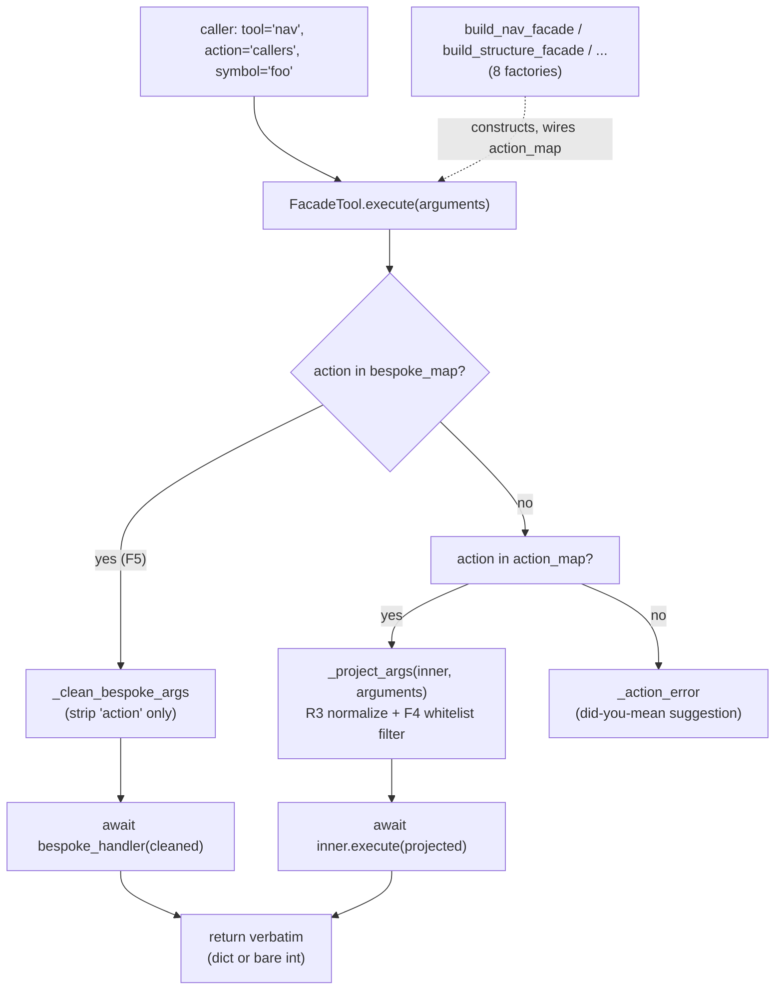

# FacadeTool — the many-tools-behind-one-action dispatcher

## Overview
[`FacadeTool`](../catalog/tree_sitter_analyzer/mcp/tools/facade_tool.md#FacadeTool) is a single MCP tool
that fans an `action` argument out to many *inner* tools without changing their logic, output, or verdict
envelope. It exists because exposing 55+ fine-grained tools directly to an LLM's tool-selection context
is itself a cost: eight concrete facades — `nav`, `structure`, `search`, `health`, `edit`, `project`,
`viz`, `index`, one per functional area — each built by a module-level `build_*_facade` factory, are what
an MCP client actually sees. The one idea worth understanding is that `FacadeTool` is a pure *routing*
layer: it never re-implements what an inner tool does, it only decides which inner gets the call and what
subset of the caller's arguments that inner is allowed to see.

## Diagram

## Design rationale (why it's built this way)
**F4 — arg projection exists because the strict-parameter guard would otherwise reject every routed
call.** [`BaseMCPTool`](../catalog/tree_sitter_analyzer/mcp/tools/base_tool.md#BaseMCPTool)'s
`__init_subclass__` wraps every subclass's `execute` — including every inner tool's — with a guard that
rejects unknown top-level parameters. If `FacadeTool.execute` forwarded the caller's merged dict verbatim,
every inner call would raise on the `action` key alone. `_project_args` calls the inner's own
[`get_tool_definition`](../catalog/tree_sitter_analyzer/mcp/tools/base_tool.md#BaseMCPTool.get_tool_definition)
to fetch its real `inputSchema.properties`, then filters the caller's args down to that whitelist —
dropping the facade's control keys and any sibling-action parameter the inner never declared. Doing this
against the inner's *real* schema (not the facade's own public schema) is what lets the facade's public
surface stay slim without silently mis-projecting an inner-specific parameter.

**F5 — three production routes need a `bespoke_map` escape hatch because their `execute` signature or arg
handling can't be expressed as a plain schema projection.**
[`SearchContentTool.execute`](../catalog/tree_sitter_analyzer/mcp/tools/search_content_tool.md#SearchContentTool.execute)
and
[`FindAndGrepTool.execute`](../catalog/tree_sitter_analyzer/mcp/tools/find_and_grep_tool.md#FindAndGrepTool.execute)
both return `dict[str, Any] | int` — a bare `int` exit code when `suppress_output=True` — which a
schema-projected inner-tool dispatch has no special case for; `analyze_code_structure` and
`extract_code_section` route to bespoke batch-reshaping callables entirely outside the registry. Bespoke
routes get only `_clean_bespoke_args` (control-key stripping, no whitelist), so the handler owns its own
argument validation completely.

**R3 — the `symbol` → `function_name` copy happens *before* the whitelist filter, not after**, precisely
because the whitelist filter would otherwise drop the caller's canonical `symbol` key before it could be
copied anywhere. The same ordering trick extends `class_name` for hierarchy-style inners. The `nav`
facade's own bespoke context route (built by
[`build_nav_facade`](../catalog/tree_sitter_analyzer/mcp/tools/nav_facade.md#build_nav_facade), wired
around
[`CodeGraphContextTool`](../catalog/tree_sitter_analyzer/mcp/tools/codegraph_context_tool.md#CodeGraphContextTool))
applies the identical idea one level deeper: it normalizes `symbol`/`query` into the `task` string
`CodeGraphContextTool` actually requires, again before delegating.

**G3 — rebind propagation goes through the inherited hook, never through an override of
`set_project_path`,** because a project test (`test_no_mcp_tool_overrides_set_project_path`) forbids
exactly that override. `FacadeTool` instead overrides `_on_project_root_changed` — the same
subclass-hook [`BaseMCPTool`](../catalog/tree_sitter_analyzer/mcp/tools/base_tool.md#BaseMCPTool)
exposes for this purpose — and fans the new
[`project_root`](../catalog/tree_sitter_analyzer/mcp/tools/base_tool.md#BaseMCPTool.project_root) out to
every inner instance it holds, including bespoke-only inners registered via `register_bespoke_inner` that
never appear in `action_map` at all.

**Wave D — the public schema deliberately does not union every inner tool's parameters.** The module
docstring records why: unioning ~50 ripgrep flags into the `search` facade alone only reached a
-56.6% token reduction against an ~84% target. Instead the facade declares a small curated core param set
(`scope`, `mode`, `file_path`, `symbol`, `function_name`, `query`, `language`, `limit`,
`output_format`) plus `additionalProperties: True`, and pushes per-action parameter discovery into the
facade's `description` text. `output_format` sitting in that core set as `"toon|json"` is the same
MCP-defaults-to-TOON convention documented at the `apply_toon_format_to_response` layer — a facade
inherits it by simply forwarding the caller's `output_format` down to whichever inner ends up handling
the call.

## Entry points
- [`FacadeTool.execute`](../catalog/tree_sitter_analyzer/mcp/tools/facade_tool.md#FacadeTool.execute) —
  reads `arguments['action']` and routes it; this is the single MCP-facing entrypoint for every action
  a facade exposes, so this one method carries the entire dispatch decision.
- [`action_map`](../catalog/tree_sitter_analyzer/mcp/tools/facade_tool.md#FacadeTool.action_map) — the
  live `{action_name: inner BaseMCPTool instance}` wiring a factory builds once at facade-construction
  time; this is what an MCP client's `action` string is actually resolved against.
- [`bespoke_map`](../catalog/tree_sitter_analyzer/mcp/tools/facade_tool.md#FacadeTool.bespoke_map) — the
  escape hatch for routes (F5) whose inner call can't be expressed as a simple schema-projected
  dispatch; checked *before* `action_map` in `execute`.
- The eight `build_*_facade` factories —
  [`build_nav_facade`](../catalog/tree_sitter_analyzer/mcp/tools/nav_facade.md#build_nav_facade),
  [`build_structure_facade`](../catalog/tree_sitter_analyzer/mcp/tools/structure_facade.md#build_structure_facade),
  [`build_search_facade`](../catalog/tree_sitter_analyzer/mcp/tools/search_facade.md#build_search_facade),
  [`build_health_facade`](../catalog/tree_sitter_analyzer/mcp/tools/health_facade.md#build_health_facade),
  [`build_edit_facade`](../catalog/tree_sitter_analyzer/mcp/tools/edit_facade.md#build_edit_facade),
  [`build_project_facade`](../catalog/tree_sitter_analyzer/mcp/tools/project_facade.md#build_project_facade),
  [`build_viz_facade`](../catalog/tree_sitter_analyzer/mcp/tools/viz_facade.md#build_viz_facade), and
  [`build_index_facade`](../catalog/tree_sitter_analyzer/mcp/tools/index_facade.md#build_index_facade) —
  are where a live `FacadeTool` instance actually comes into being; each constructs its own inner tool
  instances and its own `action_map`/`bespoke_map` before the MCP server ever sees a call.

## Mechanism (step-by-step)
1. **Bespoke takes precedence over the registry.** [`execute`](../catalog/tree_sitter_analyzer/mcp/tools/facade_tool.md#FacadeTool.execute)
   checks [`bespoke_map`](../catalog/tree_sitter_analyzer/mcp/tools/facade_tool.md#FacadeTool.bespoke_map)
   before [`action_map`](../catalog/tree_sitter_analyzer/mcp/tools/facade_tool.md#FacadeTool.action_map) —
   a route registered in both would always resolve to its bespoke handler, though in practice the two
   maps are disjoint by construction.
2. **Bespoke routes skip schema projection entirely.** When the action matches
   [`bespoke_map`](../catalog/tree_sitter_analyzer/mcp/tools/facade_tool.md#FacadeTool.bespoke_map), the
   facade strips only its own control keys and calls the handler directly — this is the path
   [`SearchContentTool.execute`](../catalog/tree_sitter_analyzer/mcp/tools/search_content_tool.md#SearchContentTool.execute)
   and
   [`FindAndGrepTool.execute`](../catalog/tree_sitter_analyzer/mcp/tools/find_and_grep_tool.md#FindAndGrepTool.execute)
   travel, since their `dict | int` return type and `suppress_output` exit-code convention don't fit the
   normal inner-tool contract.
3. **Registry routes get whitelist-projected against the inner's *own* schema**, fetched fresh via
   [`get_tool_definition`](../catalog/tree_sitter_analyzer/mcp/tools/base_tool.md#BaseMCPTool.get_tool_definition) —
   never against the facade's own public schema — so slimming the public surface (Wave D, above) can
   never cause a mis-projection: the projection logic reads the ground truth every time.
4. **`symbol`/`query` normalize into whatever the target inner actually requires, before the whitelist
   strips them.** The `nav` facade's bespoke context route (built inside
   [`build_nav_facade`](../catalog/tree_sitter_analyzer/mcp/tools/nav_facade.md#build_nav_facade), wired
   around [`CodeGraphContextTool`](../catalog/tree_sitter_analyzer/mcp/tools/codegraph_context_tool.md#CodeGraphContextTool))
   is the same pattern one layer further in: `task` is required, but callers pass `symbol` or `query`
   because that's how they think about the request.
5. **The facade forwards the inner's response verbatim — it never re-wraps the verdict envelope.**
   Every inner this packet's Subgraph shows —
   [`CodeGraphCallersTool.execute`](../catalog/tree_sitter_analyzer/mcp/tools/callers_tool.md#CodeGraphCallersTool.execute),
   [`GetCodeOutlineTool.execute`](../catalog/tree_sitter_analyzer/mcp/tools/get_code_outline_tool.md#GetCodeOutlineTool.execute),
   [`CodeGraphQueryTool.execute`](../catalog/tree_sitter_analyzer/mcp/tools/codegraph_query_tool.md#CodeGraphQueryTool.execute),
   [`CodeGraphDeadCodeTool.execute`](../catalog/tree_sitter_analyzer/mcp/tools/dead_code_tool.md#CodeGraphDeadCodeTool.execute),
   [`SymbolLineageTool.execute`](../catalog/tree_sitter_analyzer/mcp/tools/symbol_lineage_tool.md#SymbolLineageTool.execute) —
   already calls
   [`apply_toon_format_to_response`](../catalog/tree_sitter_analyzer/mcp/utils/format_helper.md#apply_toon_format_to_response)
   itself before returning, so the facade forwarding that dict unchanged is what keeps
   `base_tool.py`'s envelope the single source of truth instead of a second copy living in the facade.
6. **Rebinds fan out through the inherited hook, reaching every inner including bespoke-only ones.**
   Because [`BaseMCPTool`](../catalog/tree_sitter_analyzer/mcp/tools/base_tool.md#BaseMCPTool) forbids
   overriding `set_project_path`, `FacadeTool` propagates a new
   [`project_root`](../catalog/tree_sitter_analyzer/mcp/tools/base_tool.md#BaseMCPTool.project_root) by
   calling `set_project_path` on every held inner from its own `_on_project_root_changed` override —
   this is how a facade with a dozen live inner instances stays consistent after a client changes
   working directory mid-session.
7. **Eight facades, one factory each, is the whole 62→6 (now 8) consolidation.**
   [`build_structure_facade`](../catalog/tree_sitter_analyzer/mcp/tools/structure_facade.md#build_structure_facade)
   wires [`AnalyzeCodeStructureTool`](../catalog/tree_sitter_analyzer/mcp/tools/analyze_code_structure_tool.md#AnalyzeCodeStructureTool),
   [`GetCodeOutlineTool`](../catalog/tree_sitter_analyzer/mcp/tools/get_code_outline_tool.md#GetCodeOutlineTool)
   and [`ReadPartialTool`](../catalog/tree_sitter_analyzer/mcp/tools/read_partial_tool.md#ReadPartialTool);
   [`build_search_facade`](../catalog/tree_sitter_analyzer/mcp/tools/search_facade.md#build_search_facade)
   wires [`FindAndGrepTool`](../catalog/tree_sitter_analyzer/mcp/tools/find_and_grep_tool.md#FindAndGrepTool),
   [`QueryTool`](../catalog/tree_sitter_analyzer/mcp/tools/query_tool.md#QueryTool) and
   [`SearchContentTool`](../catalog/tree_sitter_analyzer/mcp/tools/search_content_tool.md#SearchContentTool);
   [`build_health_facade`](../catalog/tree_sitter_analyzer/mcp/tools/health_facade.md#build_health_facade)
   wires [`AnalyzeScaleTool`](../catalog/tree_sitter_analyzer/mcp/tools/analyze_scale_tool.md#AnalyzeScaleTool);
   [`build_project_facade`](../catalog/tree_sitter_analyzer/mcp/tools/project_facade.md#build_project_facade)
   wires [`ListFilesTool`](../catalog/tree_sitter_analyzer/mcp/tools/list_files_tool.md#ListFilesTool);
   [`build_edit_facade`](../catalog/tree_sitter_analyzer/mcp/tools/edit_facade.md#build_edit_facade) and
   [`build_viz_facade`](../catalog/tree_sitter_analyzer/mcp/tools/viz_facade.md#build_viz_facade) and
   [`build_index_facade`](../catalog/tree_sitter_analyzer/mcp/tools/index_facade.md#build_index_facade)
   each construct their own `FacadeTool` around a distinct functional slice — each factory is the actual
   composition root; `FacadeTool` itself has no opinion about which inners exist, only about how to route
   to whichever it's handed.

## Key data structures
- **`action_map: dict[str, BaseMCPTool]`** — the live inner-tool registry; built once per facade instance
  by its factory, mutated only through the constructor (no runtime registration API).
- **`bespoke_map: dict[str, BespokeHandler]`** — async-callable routes bypassing the registry; disjoint
  from `action_map` by construction, checked first in `execute`.
- **`_bespoke_inners`** — inner `BaseMCPTool` instances reachable only from inside a bespoke closure
  (never placed in `action_map`), tracked separately purely so rebind propagation (G3) still reaches
  them.
- **`_FACADE_CONTROL_KEYS = frozenset({"action"})`** and **`_CORE_FACADE_PARAMS`** — the small set of
  keys stripped before projection and the curated cross-action params surfaced on every facade's public
  schema (Wave D token diet), respectively.
- Three symbols in this packet's Subgraph —
  [`ProjectIndexManager`](../catalog/tree_sitter_analyzer/mcp/utils/project_index/_manager.md#ProjectIndexManager),
  [`activity_diagram`](../catalog/tree_sitter_analyzer/uml_export.md#UMLExporter.activity_diagram), and
  [`ELEMENT_TYPE_CLASS`](../catalog/tree_sitter_analyzer/constants.md#ELEMENT_TYPE_CLASS) — sit in the
  domains of the `index` and `viz` facades respectively, but no `build_index_facade` /
  `build_viz_facade` call edge to them survives in this packet, so their exact wiring isn't traceable
  here (see Open questions).

## Dynamics (design intent)
Facade construction is synchronous and happens once per MCP server process (or per test fixture): a
factory builds every inner instance, wires `action_map`/`bespoke_map`, and calls
`register_bespoke_inner` for any inner reachable only through a closure — `action_map` and
`_bespoke_inners` are assigned *before* `super().__init__()` runs in `FacadeTool.__init__`, specifically
so they already exist by the time the init-time `_on_project_root_changed` hook fires. Dispatch itself
(`execute`) is a single `await` with no fan-out or concurrency — one MCP call resolves to exactly one
inner call (or one bespoke call), never both.

## Edge cases
- **A bespoke handler may return a bare `int`, not a `dict`**, mirroring
  [`SearchContentTool.execute`](../catalog/tree_sitter_analyzer/mcp/tools/search_content_tool.md#SearchContentTool.execute) /
  [`FindAndGrepTool.execute`](../catalog/tree_sitter_analyzer/mcp/tools/find_and_grep_tool.md#FindAndGrepTool.execute) —
  the facade forwards it untouched, so a caller dispatching through a facade action mapped to one of
  these must handle both response shapes, exactly as if it had called the inner tool directly.
- **An unknown action gets a typo-correction suggestion**, not just a bare error — the closest registered
  action name is proposed via a similarity match over the combined `action_map`/`bespoke_map` keys, so a
  near-miss self-heals in-band instead of costing the caller a wasted discovery round-trip.
- **A facade spanning both read and mutating actions cannot honestly declare one `readOnlyHint`** in its
  MCP annotations — callers must pass the accurate (usually non-read-only) set explicitly, or omit
  annotations altogether.
- **`extra_public_params` is meant for one high-value, facade-specific parameter at a time**, not a
  per-inner union — reusing it to reintroduce every inner's parameters would undo the Wave D token diet
  this whole design exists for.

## Open questions
- The bespoke `extract_code_section` batch-reshaping callable (`handle_extract_code_section`, named only
  in the module docstring) is not itself a citable symbol in this packet's Subgraph.
- [`ProjectIndexManager`](../catalog/tree_sitter_analyzer/mcp/utils/project_index/_manager.md#ProjectIndexManager),
  [`activity_diagram`](../catalog/tree_sitter_analyzer/uml_export.md#UMLExporter.activity_diagram), and
  [`ELEMENT_TYPE_CLASS`](../catalog/tree_sitter_analyzer/constants.md#ELEMENT_TYPE_CLASS) appear in this
  packet without a direct call edge from `build_index_facade` / `build_viz_facade` — their exact role in
  those two facades isn't traceable from this packet alone.
- The full action inventory of the `nav`, `edit`, `viz`, and `index` facades beyond what a handful of
  `calls/refs` edges reveal here is out of this packet's citable scope.

## See also
- [`tree_sitter_analyzer-mcp-tools-base_tool`](tree_sitter_analyzer-mcp-tools-base_tool.md) — the
  abstract contract (`__init_subclass__` strict-parameter guard, `project_root` funnel) every inner tool
  and every facade itself must satisfy.
- [`tree_sitter_analyzer-mcp-tools-read_partial_tool`](tree_sitter_analyzer-mcp-tools-read_partial_tool.md) —
  one of the three inners `build_structure_facade` wires into the `structure` facade's `action_map`.
