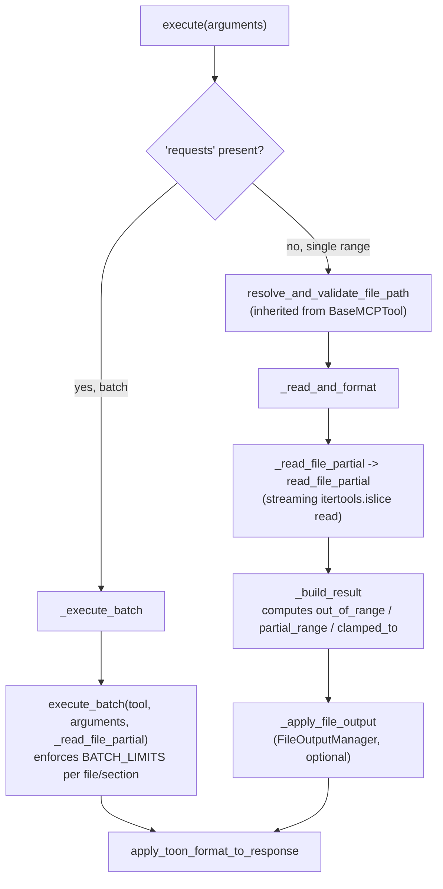

# ReadPartialTool — exact-range extraction as the token-budget complement to outline tools

## Overview
[`ReadPartialTool`](../catalog/tree_sitter_analyzer/mcp/tools/read_partial_tool.md#ReadPartialTool) —
registered on the wire as `extract_code_section` — is how an agent turns "I know the interesting lines
are 120–180" into the actual text, without reading the whole file to get there. It's the deliberate
complement to the structure/outline tools this repo also exposes: those answer *where*; this tool
answers *give me exactly that*, in either a single range or a batch of many non-contiguous ranges across
one or many files in one MCP round trip. The one thing worth understanding going in: every layer of this
tool — the streaming read, the range-status flags, the batch limits — exists to make good on that
token-saving promise; a naive implementation of any one of them (loading whole files, treating any empty
read as a hard failure, an unbounded batch) would quietly undo it.

## Diagram

## Design rationale (why it's built this way)
**Batch mode is a first-class mode, not an afterthought bolted onto single-range reads.** The tool's own
description is explicit about the motivation: "Supports a `requests` array so you can pull many
non-contiguous slices — even from different files — in ONE call rather than one Read per slice." Because
that's the whole point, batch mode gets its own bounded execution path —
[`_execute_batch`](../catalog/tree_sitter_analyzer/mcp/tools/read_partial_tool.md#ReadPartialTool._execute_batch)
delegates to
[`execute_batch`](../catalog/tree_sitter_analyzer/mcp/tools/batch_executor.md#execute_batch), which
enforces `max_files=20`, `max_sections_per_file=50`, `max_sections_total=200`, `max_total_bytes=1 MiB`,
and `max_total_lines=5000` with explicit `allow_truncate`/`fail_fast` semantics — so one call that tries
to pull "everything" can't return an unbounded response and defeat the very token budget the batch
feature exists to protect.

**The underlying read is streaming, because loading whole files would silently defeat the tool's purpose.**
[`read_file_partial`](../catalog/tree_sitter_analyzer/file_handler.md#read_file_partial)'s own docstring
claims a "150x speedup on large files" from using `itertools.islice` to walk just the requested line
range rather than materializing the entire file in memory first. This isn't a generic perf nicety — it's
the specific property that lets this tool be the "read a slice, not the whole file" alternative to a raw
file read; if the implementation loaded the full file anyway, the token savings promised at the MCP
surface would be an illusion one layer down.

**`out_of_range` and `partial_range` are separate, structured flags — not a single generic failure —
because they call for different recovery.** `_read_and_format` computes both from the *actual* returned
content length against the file's real line count, replacing an older `end_line - start_line + 1` formula
that lied whenever the requested range ran past EOF (content empty, but `lines_extracted` still claimed a
positive count). The intent, stated directly in the surrounding comments: "agents read these flags and
recover with a valid range" — `out_of_range=True` means the *start* itself was past EOF (nothing useful
came back), while `partial_range=True` plus a `clamped_to=[start_line, file_lines]` means the caller's
request was honored up to the file boundary and the agent knows exactly how far it got.

**Path resolution and security validation are not reimplemented here — they're the inherited base-class
funnel, reused as-is.** [`ReadPartialTool`](../catalog/tree_sitter_analyzer/mcp/tools/read_partial_tool.md#ReadPartialTool)
calls
[`resolve_and_validate_file_path`](../catalog/tree_sitter_analyzer/mcp/tools/base_tool.md#BaseMCPTool.resolve_and_validate_file_path)
exactly like every other file-taking tool does; that method's own cache lookups mean a file this tool
already validated in the current session (say, because `get_code_outline` resolved it first) skips
redundant [`validate_file_path`](../catalog/tree_sitter_analyzer/security/validator.md#SecurityValidator.validate_file_path)
/ [`resolve`](../catalog/tree_sitter_analyzer/mcp/utils/path_resolver.md#PathResolver.resolve) work — the
cost of "figure out what this path means and whether it's safe" is paid once per file per session, not
once per tool.

## Entry points
- [`ReadPartialTool.execute`](../catalog/tree_sitter_analyzer/mcp/tools/read_partial_tool.md#ReadPartialTool.execute) —
  the single MCP-facing entrypoint; the presence of a `requests` key is the entire branch between single
  and batch mode.
- [`ReadPartialTool.validate_arguments`](../catalog/tree_sitter_analyzer/mcp/tools/read_partial_tool.md#ReadPartialTool.validate_arguments) —
  enforces the batch/single mutual exclusivity and every single-mode field's type/range constraints
  before any file touches disk.
- [`ReadPartialTool._execute_batch`](../catalog/tree_sitter_analyzer/mcp/tools/read_partial_tool.md#ReadPartialTool._execute_batch) —
  where a `requests`-bearing call actually leaves the single-range code path.
- [`resolve_and_validate_file_path`](../catalog/tree_sitter_analyzer/mcp/tools/base_tool.md#BaseMCPTool.resolve_and_validate_file_path) —
  inherited from `BaseMCPTool`; both the single-range path and (per-file, inside the batch loop) the
  batch path funnel every `file_path` through this one method before reading anything.

## Mechanism (step-by-step)
1. **Mode dispatch happens on key presence, not a flag.** [`execute`](../catalog/tree_sitter_analyzer/mcp/tools/read_partial_tool.md#ReadPartialTool.execute)
   checks whether `arguments["requests"]` is present and non-`None`; if so it hands off entirely to
   [`_execute_batch`](../catalog/tree_sitter_analyzer/mcp/tools/read_partial_tool.md#ReadPartialTool._execute_batch) —
   the two modes never partially overlap in one call.
2. **Validation happens before resolution, and resolution before reading.**
   [`validate_arguments`](../catalog/tree_sitter_analyzer/mcp/tools/read_partial_tool.md#ReadPartialTool.validate_arguments)
   rejects mixed batch/single keys and bad single-mode types/ranges; only after that does
   [`execute`](../catalog/tree_sitter_analyzer/mcp/tools/read_partial_tool.md#ReadPartialTool.execute)
   call
   [`resolve_and_validate_file_path`](../catalog/tree_sitter_analyzer/mcp/tools/base_tool.md#BaseMCPTool.resolve_and_validate_file_path),
   which itself chains
   [`path_resolver`](../catalog/tree_sitter_analyzer/mcp/tools/base_tool.md#BaseMCPTool.path_resolver) →
   [`resolve`](../catalog/tree_sitter_analyzer/mcp/utils/path_resolver.md#PathResolver.resolve) and the
   security layer's
   [`validate_file_path`](../catalog/tree_sitter_analyzer/security/validator.md#SecurityValidator.validate_file_path),
   both gated on the tool's current
   [`project_root`](../catalog/tree_sitter_analyzer/mcp/tools/base_tool.md#BaseMCPTool.project_root).
3. **The actual read is a streaming slice, not a full-file load.**
   [`_read_and_format`](../catalog/tree_sitter_analyzer/mcp/tools/read_partial_tool.md#ReadPartialTool._read_and_format)
   delegates to the module's `_read_file_partial` wrapper, which calls
   [`read_file_partial`](../catalog/tree_sitter_analyzer/file_handler.md#read_file_partial) — the
   function that opens the file once and walks only the requested 1-indexed line range via
   `itertools.islice`, applying column clipping only to the first/last selected line.
4. **Range status is computed from the real content, not the requested bounds.**
   [`_read_and_format`](../catalog/tree_sitter_analyzer/mcp/tools/read_partial_tool.md#ReadPartialTool._read_and_format)
   compares the actual returned line count against the file's real line count to decide
   `out_of_range` / `partial_range` / `clamped_to` — this is the fix for the earlier formula that
   reported a plausible-looking `lines_extracted` even when the range was entirely past EOF.
5. **Batch mode enforces its own bounded loop, independent of the single-range path.**
   [`_execute_batch`](../catalog/tree_sitter_analyzer/mcp/tools/read_partial_tool.md#ReadPartialTool._execute_batch)
   calls [`execute_batch`](../catalog/tree_sitter_analyzer/mcp/tools/batch_executor.md#execute_batch),
   which walks every file request and every section within it against `BATCH_LIMITS`, raising or
   truncating depending on `fail_fast`/`allow_truncate` — a single malformed request in a 20-file batch
   either aborts the whole call (`fail_fast=True`) or gets recorded as a per-file error while the rest of
   the batch still completes.
6. **Both paths converge on the same output boundary.** Single-range results pass through
   [`_read_and_format`](../catalog/tree_sitter_analyzer/mcp/tools/read_partial_tool.md#ReadPartialTool._read_and_format)'s
   final call to
   [`apply_toon_format_to_response`](../catalog/tree_sitter_analyzer/mcp/utils/format_helper.md#apply_toon_format_to_response);
   batch results converge on the identical function inside `_build_batch_response`. Whatever actually
   renders the TOON string on a `toon` request is
   [`ToonFormatter`](../catalog/tree_sitter_analyzer/formatters/toon_formatter.md#ToonFormatter) — the
   single formatter both code paths share.
7. **Writing a copy to disk is a separate concern from formatting the response.** The single-range path's
   `_apply_file_output` step hands off to
   [`FileOutputManager`](../catalog/tree_sitter_analyzer/mcp/utils/file_output_manager.md#FileOutputManager)
   for `output_file` handling with automatic extension detection — batch mode explicitly rejects
   `output_file`/`suppress_output` altogether (see Edge cases), so this step only exists on the
   single-range path.

## Key data structures
- **`BATCH_LIMITS`** — the five-key ceiling dict (`max_files`, `max_sections_per_file`,
  `max_sections_total`, `max_total_bytes`, `max_total_lines`) that bounds every batch call; echoed
  verbatim into the response so a caller can see what limits were in effect.
- **`_BatchAccumulator`** — a small dataclass of running counters (`total_bytes`, `total_lines`,
  `ok_sections`, `sections_seen_total`, `error_count`, `truncated`) threaded through the batch loop
  instead of five separate mutable locals.
- **The `range` sub-dict** (`start_line`, `end_line`, `start_column`, `end_column`) — the response's
  echo of exactly what was requested, independent of what was actually extracted.
- **[`PathResolver`](../catalog/tree_sitter_analyzer/mcp/utils/path_resolver.md#PathResolver)'s internal
  cache** — a size-capped dict keyed by raw `file_path` string, consulted by
  [`resolve`](../catalog/tree_sitter_analyzer/mcp/utils/path_resolver.md#PathResolver.resolve) before
  doing any OS-level path resolution.
- **[`SharedCache`](../catalog/tree_sitter_analyzer/_shared_cache.md#SharedCache)** — the process-wide
  singleton `resolve_and_validate_file_path` consults for both the security-validation result and the
  resolved path, shared across every tool in the process, not just `ReadPartialTool`.

## Dynamics (design intent)
The batch loop in [`execute_batch`](../catalog/tree_sitter_analyzer/mcp/tools/batch_executor.md#execute_batch)
is strictly sequential — one file request at a time, one section at a time within it — with no
concurrent reads. A consequence worth noting: because
[`read_file_partial`](../catalog/tree_sitter_analyzer/file_handler.md#read_file_partial) opens its own
streaming context per call, requesting five sections from the *same* file in one batch reopens and
re-streams that file five times rather than reusing one open handle — the streaming optimization applies
within a single call, not across the sections of a batch. `fail_fast` and `allow_truncate` are the two
knobs that decide whether a limit breach raises immediately (aborting the whole batch) or degrades
gracefully (recording an error/truncation and continuing) — the default is graceful degradation,
`fail_fast=False`.

## Edge cases
- **A `None` result from the read path means a genuine failure; an empty string with `out_of_range=True`
  means a structurally valid response that simply found nothing in range.** `_read_and_format` treats
  these as distinct envelopes — a caller that only checks "was `content` falsy" would conflate a real IO
  error with a legitimate past-EOF request.
- **Batch mode explicitly forbids `output_file` and `suppress_output`.** `_validate_batch_top_level`
  raises before any file is touched if either key appears alongside `requests` — file-output semantics
  are single-range-only.
- **`requests` and any single-mode key (`file_path`, `start_line`, `end_line`, `start_column`,
  `end_column`) are mutually exclusive at validation time**, not silently merged — mixing them is a
  `ValueError` before resolution, not a best-effort interpretation.
- **`allow_truncate=False` (the default) turns any limit breach into a hard error for the whole batch**,
  not a partial result — a caller that wants "best effort within limits" must opt in explicitly.

## Open questions
- The actual content-formatting helpers this tool imports and delegates to —
  `format_partial_content`, `format_partial_content_as_json_lines`, `build_agent_summary_for_result`,
  `prepare_partial_save_content` (all in `read_partial_helpers.py`) — are not citable symbols in this
  packet's Subgraph, so the exact `text`/`json`/`raw` rendering logic is source-read but not
  subgraph-groundable here.
- Why [`apply_toon_format_to_response`](../catalog/tree_sitter_analyzer/mcp/utils/format_helper.md#apply_toon_format_to_response)'s
  `compact_only` (RFC-0012 phase-1 control-surface reduction) parameter is never passed by this tool —
  always the two-argument form — isn't explained within this packet.

## See also
- [`tree_sitter_analyzer-mcp-tools-base_tool`](tree_sitter_analyzer-mcp-tools-base_tool.md) — the
  `resolve_and_validate_file_path` / `project_root` / `SecurityValidator` machinery this tool reuses
  rather than reimplementing.
- [`tree_sitter_analyzer-mcp-tools-facade_tool`](tree_sitter_analyzer-mcp-tools-facade_tool.md) —
  `build_structure_facade` wires this tool into the `structure` facade's `action_map` alongside
  `AnalyzeCodeStructureTool` and `GetCodeOutlineTool`.
