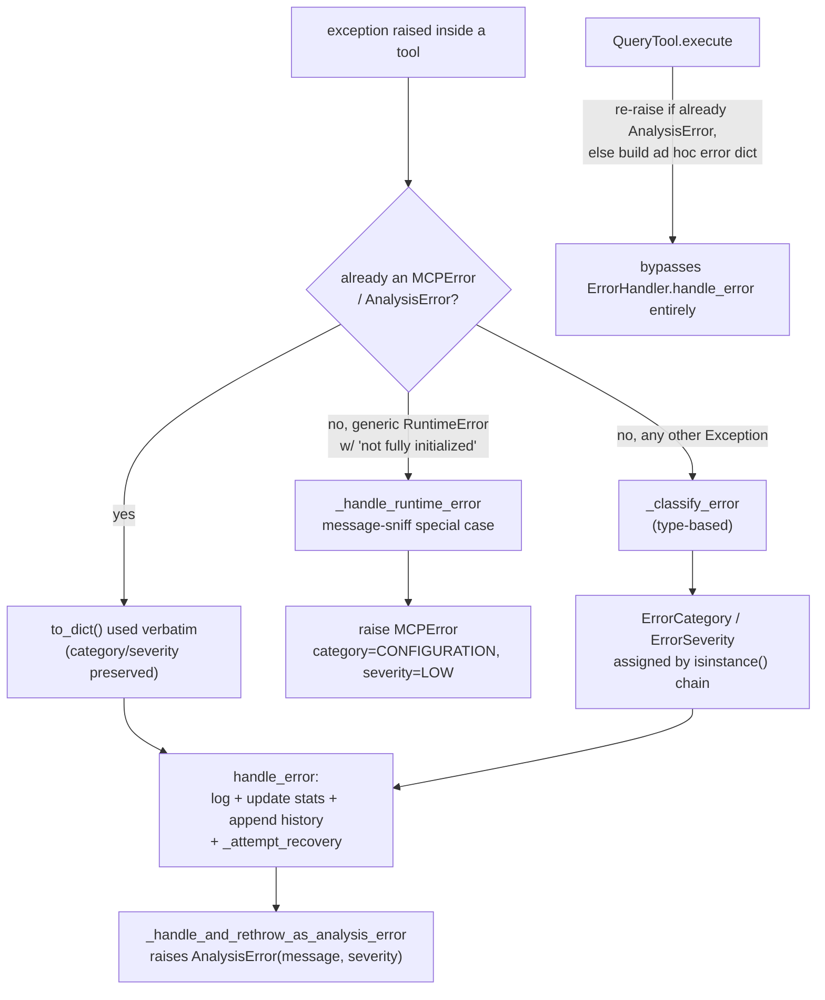

# MCP error handling — classification, recovery, and two divergent boundary strategies

## Overview
[`ErrorHandler`](../catalog/tree_sitter_analyzer/mcp/utils/error_handler.md#ErrorHandler) is a
process-wide singleton (reached via
[`get_error_handler`](../catalog/tree_sitter_analyzer/mcp/utils/error_handler.md#get_error_handler)) that
classifies any exception surfacing at the MCP boundary into an
[`ErrorCategory`](../catalog/tree_sitter_analyzer/mcp/utils/error_handler.md#ErrorCategory) /
[`ErrorSeverity`](../catalog/tree_sitter_analyzer/mcp/utils/error_handler.md#ErrorSeverity) pair, logs it,
tracks running statistics and a bounded history, and attempts a registered recovery strategy before
handing back a plain dict.
[`AnalysisError`](../catalog/tree_sitter_analyzer/mcp/utils/error_handler.md#AnalysisError) (a subclass of
[`MCPError`](../catalog/tree_sitter_analyzer/mcp/utils/error_handler.md#MCPError)) is the typed exception
most tool code is expected to raise or convert into. The subtler point this page exists to make: reading
the actual call sites in the subgraph shows the module is **not** applied uniformly — one entrypoint
([`handle_error`](../catalog/tree_sitter_analyzer/mcp/utils/error_handler.md#ErrorHandler.handle_error))
routes every non-`MCPError` exception through generic type-based classification, while a second
entrypoint (a not-fully-initialized `RuntimeError`, handled in the async decorator layer) is special-cased
by string-matching the exception's *message* before it ever reaches that classifier — two different
answers for what looks like the same kind of failure, depending only on which path the exception took to
get here.

## Diagram

## Design rationale (why it's built this way)
**An already-typed error is authoritative; `handle_error` never re-derives it.**
[`handle_error`](../catalog/tree_sitter_analyzer/mcp/utils/error_handler.md#ErrorHandler.handle_error)'s
first branch is `isinstance(error, MCPError)` → use `error.to_dict()` directly. The rationale is implicit
in the code rather than stated in a docstring, but it follows from
[`AnalysisError`](../catalog/tree_sitter_analyzer/mcp/utils/error_handler.md#AnalysisError)'s own
constructor: it hard-codes `category=ErrorCategory.ANALYSIS` and lets the *raiser* choose severity —
re-running that through generic classification would discard a category the calling code deliberately
chose.

**The "still initializing" special case lives at the decorator layer, not the classifier.** A plain
`RuntimeError("Server not fully initialized...")` routed through
[`_classify_error`](../catalog/tree_sitter_analyzer/mcp/utils/error_handler.md#ErrorHandler._classify_error)
falls into the generic `RuntimeError | AttributeError` branch and is tagged `ErrorCategory.ANALYSIS` /
`ErrorSeverity.MEDIUM`. But the exact same exception, when it surfaces inside the async wrapper the
`handle_mcp_errors` decorator installs, is intercepted earlier by
[`_handle_runtime_error`](../catalog/tree_sitter_analyzer/mcp/utils/error_handler.md#_handle_runtime_error),
which checks the literal substring `"not fully initialized"` in the message and raises a *different*
`MCPError` — `category=CONFIGURATION`, `severity=LOW`, message "Server is still initializing. Please wait
a moment and try again." — before `_classify_error` ever sees it. The docstring is candid that this is a
recent, deliberate flattening: *"r37e4 (dogfood): lifted out of `handle_mcp_errors` to flatten nesting 6 →
3."* The two paths giving different answers for the same root cause is a real, observable consequence of
where the message-sniff lives, not a bug this page is inferring.

**Non-`MCPError` exceptions get wrapped, never passed through raw.**
[`_handle_and_rethrow_as_analysis_error`](../catalog/tree_sitter_analyzer/mcp/utils/error_handler.md#_handle_and_rethrow_as_analysis_error)
always calls [`get_error_handler`](../catalog/tree_sitter_analyzer/mcp/utils/error_handler.md#get_error_handler)`().`[`handle_error`](../catalog/tree_sitter_analyzer/mcp/utils/error_handler.md#ErrorHandler.handle_error)
first (so the failure is logged and counted regardless of what happens next), and only re-raises as
[`AnalysisError`](../catalog/tree_sitter_analyzer/mcp/utils/error_handler.md#AnalysisError) if the original
was not already an `MCPError` — the classified severity is threaded through
(`severity=ErrorSeverity(error_info["severity"])`), so the wrapped error still carries a meaningful
severity even though its category is now uniformly `ANALYSIS`.

**Recovery strategies resolve exact-type-first, then by inheritance.** `ErrorHandler`'s
`recovery_strategies` dict is keyed by exception type; a lookup tries the exact `type(error)` key first
and only falls back to scanning registered types with `isinstance` if no exact match exists — so a strategy
registered for `RuntimeError` wins over one registered for `Exception` even though both would match, per
[`test_exact_type_match_takes_precedence`](../catalog/tests/unit/mcp/test_utils/test_error_handler.md#TestErrorHandler.test_exact_type_match_takes_precedence).
A failing recovery strategy is swallowed and logged rather than propagated, so a buggy custom recovery
function can never itself crash the error path it was registered into.

## Entry points
- [`handle_error`](../catalog/tree_sitter_analyzer/mcp/utils/error_handler.md#ErrorHandler.handle_error) —
  the central handling entrypoint every non-decorator error path funnels through: classify, log, update
  stats, append to history, attempt recovery.
- [`execute`](../catalog/tree_sitter_analyzer/mcp/tools/query_tool.md#QueryTool.execute) — a concrete tool
  boundary that does **not** call `handle_error` at all: it re-raises an already-`AnalysisError`
  unchanged, and otherwise logs and builds its own ad hoc error response — a second, independent strategy
  living side by side with the `ErrorHandler`-based one.
- [`get_error_handler`](../catalog/tree_sitter_analyzer/mcp/utils/error_handler.md#get_error_handler) — the
  module-level singleton accessor; a single `ErrorHandler` instance backs statistics/history for the whole
  process, not per request.
- [`AnalysisError`](../catalog/tree_sitter_analyzer/mcp/utils/error_handler.md#AnalysisError) — the typed
  exception most tool-boundary failures are ultimately converted into or expected to already be.

## Mechanism (step-by-step)
1. **Classification branches on whether the exception is already typed.** Inside
   [`handle_error`](../catalog/tree_sitter_analyzer/mcp/utils/error_handler.md#ErrorHandler.handle_error),
   an [`MCPError`](../catalog/tree_sitter_analyzer/mcp/utils/error_handler.md#MCPError) (which
   [`AnalysisError`](../catalog/tree_sitter_analyzer/mcp/utils/error_handler.md#AnalysisError) subclasses)
   short-circuits straight to its own `to_dict()`; anything else is handed to
   [`_classify_error`](../catalog/tree_sitter_analyzer/mcp/utils/error_handler.md#ErrorHandler._classify_error),
   which walks an `isinstance` chain assigning one of the eight
   [`ErrorCategory`](../catalog/tree_sitter_analyzer/mcp/utils/error_handler.md#ErrorCategory) values and
   an [`ErrorSeverity`](../catalog/tree_sitter_analyzer/mcp/utils/error_handler.md#ErrorSeverity) — e.g.
   `PermissionError` → `FILE_ACCESS`/`HIGH`/non-recoverable, `MemoryError` → `RESOURCE`/`CRITICAL`
   /non-recoverable, everything unmatched falls through to the dataclass default
   ([`MEDIUM`](../catalog/tree_sitter_analyzer/mcp/utils/error_handler.md#ErrorSeverity.MEDIUM) /
   `UNKNOWN`).
2. **Every classified error is logged, counted, and archived before recovery is attempted.**
   `handle_error` logs at a level derived from the assigned severity, increments three parallel counters
   (by type / category / severity) in
   [`error_counts`](../catalog/tree_sitter_analyzer/mcp/utils/error_handler.md#ErrorHandler.error_counts),
   and appends a merged record to
   [`error_history`](../catalog/tree_sitter_analyzer/mcp/utils/error_handler.md#ErrorHandler.error_history) —
   truncated to the last 1000 entries whenever it grows past that cap, per
   [`test_history_size_limit`](../catalog/tests/unit/mcp/test_utils/test_error_handler.md#TestErrorHandler.test_history_size_limit).
   This bookkeeping happens whether or not recovery ultimately succeeds.
3. **Recovery is attempted last and is best-effort.** `handle_error` looks up
   [`recovery_strategies`](../catalog/tree_sitter_analyzer/mcp/utils/error_handler.md#ErrorHandler.recovery_strategies)
   by exact exception type first, then by `isinstance` scan over registered types; a matching strategy's
   return value is merged into the error info dict, and a strategy that itself raises is caught and logged
   rather than allowed to replace the original error.
4. **The decorator layer intercepts a specific `RuntimeError` message before generic classification runs
   at all.** [`_handle_runtime_error`](../catalog/tree_sitter_analyzer/mcp/utils/error_handler.md#_handle_runtime_error)
   checks for the literal substring `"not fully initialized"` and, if present, raises a fresh
   `CONFIGURATION`/`LOW` [`MCPError`](../catalog/tree_sitter_analyzer/mcp/utils/error_handler.md#MCPError)
   directly — bypassing `handle_error`'s classification entirely for this one message shape. Any other
   `RuntimeError` falls through to
   [`get_error_handler`](../catalog/tree_sitter_analyzer/mcp/utils/error_handler.md#get_error_handler)`().`[`handle_error`](../catalog/tree_sitter_analyzer/mcp/utils/error_handler.md#ErrorHandler.handle_error)
   like any other generic exception.
5. **Non-`MCPError` exceptions elsewhere in the decorator layer are logged, then always re-raised as
   `AnalysisError`.**
   [`_handle_and_rethrow_as_analysis_error`](../catalog/tree_sitter_analyzer/mcp/utils/error_handler.md#_handle_and_rethrow_as_analysis_error)
   calls `handle_error` for its logging/stats/history side effects, and — only if the original exception
   was not already an `MCPError` — raises
   [`AnalysisError`](../catalog/tree_sitter_analyzer/mcp/utils/error_handler.md#AnalysisError)`("Operation
   failed: " + message, operation=..., severity=<the classified severity>)` chained (`from e`) onto the
   original.
6. **Not every tool boundary goes through any of the above.**
   [`QueryTool.execute`](../catalog/tree_sitter_analyzer/mcp/tools/query_tool.md#QueryTool.execute)'s own
   `try/except` re-raises an already-[`AnalysisError`](../catalog/tree_sitter_analyzer/mcp/utils/error_handler.md#AnalysisError)
   unchanged, but for any other exception it logs and returns an ad hoc error response dict built by a
   query-specific helper outside this subgraph — never touching
   [`handle_error`](../catalog/tree_sitter_analyzer/mcp/utils/error_handler.md#ErrorHandler.handle_error)'s
   stats/history bookkeeping at all. The shared vocabulary (`AnalysisError`, `ErrorCategory`) is reused,
   but the accounting side effects are not.

## Key data structures
- **`ErrorCategory`** — eight-value enum (`FILE_ACCESS`, `PARSING`, `ANALYSIS`, `NETWORK`, `VALIDATION`,
  `RESOURCE`, `CONFIGURATION`, `UNKNOWN`); **`ErrorSeverity`** — four-value enum
  (`LOW`/[`MEDIUM`](../catalog/tree_sitter_analyzer/mcp/utils/error_handler.md#ErrorSeverity.MEDIUM)/`HIGH`/`CRITICAL`).
  These are the only vocabulary `_classify_error` and every `MCPError` subclass constructor draws from.
- **`ErrorHandler.error_counts`** — a flat `dict[str, int]` keyed by three prefixed families
  (`type:...`, `category:...`, `severity:...`) rather than three separate dicts, so `get_error_stats`'s
  `total_errors` count divides the summed values by 3 to undo the triple-counting.
- **`ErrorHandler.error_history`** — a list of merged `{**error_info, context, operation}` records, capped
  at `max_history_size` (1000), truncated from the front once exceeded.
- **`ErrorHandler.recovery_strategies`** — `dict[type, Callable]`; pre-seeded with
  `FileNotFoundError`/`PermissionError`/`ValueError` handlers at construction, extensible via
  `register_recovery_strategy`.

## Dynamics (design intent)
> [!inferred]
> [`get_error_handler`](../catalog/tree_sitter_analyzer/mcp/utils/error_handler.md#get_error_handler)
> returns one module-level `ErrorHandler` instance shared by every MCP tool invocation in the process —
> statistics and history are process-global, not per-request or per-tool. Nothing in the subgraph
> indicates any locking around the shared `error_counts`/`error_history` mutation, so concurrent tool
> executions updating the same singleton rely on the single-threaded `asyncio` event loop rather than
> explicit synchronization (consistent with the stdio server loop's single-connection design on the
> sibling `tree_sitter_analyzer-mcp-server` page).

## Edge cases
- **A recovery strategy that raises is swallowed, not propagated** —
  [`test_recovery_strategy_failure_handling`](../catalog/tests/unit/mcp/test_utils/test_error_handler.md#TestErrorHandler.test_recovery_strategy_failure_handling)
  confirms `handle_error` still returns a normal result even when the matched strategy itself throws.
- **A recovery strategy returning `None` or `{}` is treated as "ran, nothing to merge," not "no recovery
  found"** — both cases still produce a non-`None` result from `handle_error`.
- **The same `RuntimeError` message classifies differently depending on entry path**: routed through the
  decorator's [`_handle_runtime_error`](../catalog/tree_sitter_analyzer/mcp/utils/error_handler.md#_handle_runtime_error)
  it becomes `CONFIGURATION`/`LOW`; routed directly into
  [`handle_error`](../catalog/tree_sitter_analyzer/mcp/utils/error_handler.md#ErrorHandler.handle_error)
  (bypassing the decorator) it falls into the generic `RuntimeError | AttributeError` branch of
  [`_classify_error`](../catalog/tree_sitter_analyzer/mcp/utils/error_handler.md#ErrorHandler._classify_error)
  and becomes `ANALYSIS`/`MEDIUM` instead.
- **Exact-type recovery strategies shadow parent-type ones registered earlier or later** — order of
  registration does not matter; specificity does, per
  [`test_exact_type_match_takes_precedence`](../catalog/tests/unit/mcp/test_utils/test_error_handler.md#TestErrorHandler.test_exact_type_match_takes_precedence).
- **Path-sensitive error messages are exercised for information leakage**, not just classification —
  [`assert_stack_trace_filtering`](../catalog/tests/unit/security/_test_mcp_security_helpers.md#assert_stack_trace_filtering)
  calls the query tool's
  [`execute`](../catalog/tree_sitter_analyzer/mcp/tools/query_tool.md#QueryTool.execute) with an absolute
  secret path and asserts the resulting error/exception never echoes that path back — a security property
  layered on top of, not inside, this module's classification logic.

## Open questions
- The `handle_mcp_errors` decorator itself (which wraps `_handle_runtime_error` and
  `_handle_and_rethrow_as_analysis_error` into sync/async wrappers) is not in this packet's subgraph —
  only its two internal helpers are — so whether it is applied consistently across every MCP tool, or only
  some (given `QueryTool.execute`'s independent ad hoc handling), can't be settled from this subgraph
  alone.
- The query-specific error-response builder `QueryTool.execute` falls back to is outside this subgraph, so
  its exact response shape (and whether it duplicates any of `AnalysisError.to_dict()`'s fields) is not
  grounded here.

## See also
- [`tree_sitter_analyzer-mcp-server`](tree_sitter_analyzer-mcp-server.md) — the server whose
  not-fully-initialized `RuntimeError` this module's decorator layer special-cases.
- [`tree_sitter_analyzer-core-request`](tree_sitter_analyzer-core-request.md) — the request object whose
  malformed/missing `file_path` is one of the most common `AnalysisError` triggers seen across the tests
  in this packet's Evidence table.
