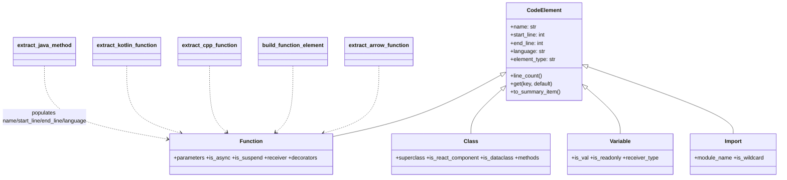

# CodeElement — the one struct 13 languages write into

## Overview
`CodeElement` is TSA's answer to a problem every multi-language tool has to solve once: Java has methods with `throws`, Go has
receivers, Kotlin has `suspend`, Python has decorators and comprehensions — so what type does
"a function" have when the caller doesn't know or care which language it came from? TSA's answer is
not a type per language. It is one shared dataclass family — `CodeElement` plus its four core
subclasses `Function`, `Class`, `Variable`, `Import` — where every language-specific concept becomes
an optional field with a sensible default, defined once and reused by all thirteen-plus language
extractors. The four fields at the root of this page's subgraph — [`name`](../catalog/tree_sitter_analyzer/models/base.md#CodeElement.name),
[`start_line`](../catalog/tree_sitter_analyzer/models/base.md#CodeElement.start_line),
[`end_line`](../catalog/tree_sitter_analyzer/models/base.md#CodeElement.end_line), and
[`language`](../catalog/tree_sitter_analyzer/models/base.md#CodeElement.language) — are exactly the
four values every one of those extractors, from Rust to Ruby to C#, is obligated to fill in.

## Diagram

## Design rationale (why it's built this way)
**A flat superset schema instead of a subclass per language.** The obvious OO design would be
`JavaFunction`, `KotlinFunction`, `PythonFunction`, … each with its own fields. TSA rejected that:
`Function` in `base.py` carries `is_suspend` (Kotlin), `receiver`/`receiver_type` (Go),
`is_constructor` (Java), `is_generator`/`is_arrow`/`parent_class` (JavaScript),
`is_property`/`is_classmethod`/`decorator_start_line` (Python), and `decorators` (TypeScript) *all on
the same dataclass*, each defaulted to `None`/`False`/`[]`. The tradeoff is explicit and visible just
by reading the field list: a `Function` instance built by
[`extract_kotlin_function`](../catalog/tree_sitter_analyzer/languages/kotlin_helpers.md#extract_kotlin_function)
carries unused `receiver_type`/`is_constructor` fields it will never set, in exchange for every
formatter, CLI command, and MCP tool downstream needing to know only one type. Given that the whole
point of the project is a *uniform* structure/query surface across 13 languages (the comparison this
survey's lens cares about against a compiler-grade SCIP graph or a graph-DB schema), duplicating the
type once per language would have meant duplicating every consumer once per language too.

**`element_type` is a string tag, not `type()`.** Every subclass overrides the inherited
`element_type: str = "unknown"` default with its own literal (`"function"`, `"class"`, `"variable"`,
`"import"`) rather than relying on `isinstance` checks at every call site. Combined with
`CodeElement.get` (not in this packet's subgraph, but visible in the full source as a
`getattr`-based dict-style accessor), this
lets formatters written once treat a `CodeElement` object and a plain `dict` interchangeably —
`element.get('element_type')` works on both. That duck-typing is what lets the same formatting code
run whether an element arrived as a live dataclass from a fresh parse or as a rehydrated dict from a
cached/serialized `AnalysisResult`.

> [!inferred]
> The base class also defines `to_summary_item()` returning a generic `{name, type, lines}` shape,
> which `SQLElement` and `MarkupElement` (siblings documented on the
> [`AnalysisResult`](tree_sitter_analyzer-models-result.md) and
> [markup](tree_sitter_analyzer-models-markup_models.md) pages) override with domain-specific
> summaries — a small, explicit polymorphism seam rather than one giant serialization `if/elif` chain.
> This override pattern isn't itself in this packet's subgraph, but the base method it overrides is.

## Entry points
- [`build_function_element`](../catalog/tree_sitter_analyzer/languages/python_plugin/_element_builders.md#build_function_element) —
  the Python plugin's constructor for a `Function`; representative of the "builder function" pattern
  several language plugins use to keep field-population logic out of the extractor's tree-walking
  code.
- [`extract_java_method`](../catalog/tree_sitter_analyzer/languages/_java_element_helpers.md#extract_java_method) —
  Java's method extractor, which takes a much longer parameter list (annotation finder, visibility
  resolver, Javadoc extractor) than the Python builder above, because Java's grammar surfaces more
  structure per method — yet both converge on setting the same `name`/`start_line`/`end_line`/`language`
  quartet on the same `Function` type.
- [`extract_kotlin_function`](../catalog/tree_sitter_analyzer/languages/kotlin_helpers.md#extract_kotlin_function),
  [`extract_cpp_function`](../catalog/tree_sitter_analyzer/languages/_cpp_element_helpers.md#extract_cpp_function),
  [`extract_c_function`](../catalog/tree_sitter_analyzer/languages/_c_function_helpers.md#extract_c_function),
  and [`_extract_function`](../catalog/tree_sitter_analyzer/languages/rust_plugin.md#RustElementExtractor._extract_function) —
  four more per-language entry points into the same `Function` constructor, each reached from that
  language's own tree-sitter node-walk, none aware of the others.
- [`extract_class_declaration`](../catalog/tree_sitter_analyzer/languages/csharp_helpers.md#extract_class_declaration)
  and [`extract_classes`](../catalog/tree_sitter_analyzer/languages/csharp_plugin.md#CSharpElementExtractor.extract_classes) —
  the C# path into `Class`, reached once per `class`/`interface`/`record`/`struct`/`enum` node.

## Mechanism (step-by-step)
1. **Every language extractor ends at the same four writes.** Whether the caller is
   [`extract_arrow_function`](../catalog/tree_sitter_analyzer/languages/typescript_plugin/_function_helpers.md#extract_arrow_function)
   parsing a TypeScript arrow function or
   [`extract_prototype_method`](../catalog/tree_sitter_analyzer/languages/javascript_plugin/_function_helpers.md#extract_prototype_method)
   parsing a JavaScript `X.prototype.m = function(){}` assignment, both hand
   [`start_line`](../catalog/tree_sitter_analyzer/models/base.md#CodeElement.start_line) and
   [`end_line`](../catalog/tree_sitter_analyzer/models/base.md#CodeElement.end_line) values derived from
   tree-sitter's own byte/point ranges to the same dataclass field — this is the seam where 13
   independent grammars' node-position conventions get normalized into one 1-indexed line-range
   convention that every catalog page, formatter, and CLI `--partial-read` can rely on without
   knowing which grammar produced it.
2. **Builders vs. inline construction is a per-plugin choice, not a rule.** Python factors field
   population into standalone functions —
   [`build_class_element`](../catalog/tree_sitter_analyzer/languages/python_plugin/_element_builders.md#build_class_element)
   and [`build_detailed_function_element`](../catalog/tree_sitter_analyzer/languages/python_plugin/_element_builders.md#build_detailed_function_element)
   both take a single `*BuildInput` dataclass argument and return a fully-formed `Class`/`Function` —
   while other plugins (Scala's
   [`_extract_class_like`](../catalog/tree_sitter_analyzer/languages/scala_plugin.md#ScalaElementExtractor._extract_class_like),
   [`_extract_function_common`](../catalog/tree_sitter_analyzer/languages/scala_plugin.md#ScalaElementExtractor._extract_function_common))
   construct the dataclass directly inside the extraction method. The shared type is what makes this
   inconsistency harmless: no consumer downstream cares which construction style produced the
   instance it received.
3. **Enum-like structural roles get their own record, not a subtype.** A Scala `enum` needs both the
   enum itself and each of its cases represented as elements;
   [`_extract_enum_with_cases`](../catalog/tree_sitter_analyzer/languages/scala_plugin.md#ScalaElementExtractor._extract_enum_with_cases)
   emits both as plain `Class` instances differentiated only by `class_type`/name, rather than
   introducing an `EnumCase` type — one more instance of the project preferring field-tagging over
   type proliferation.
4. **Fallback analyzers hold to the same contract as real parses.**
   [`_analyze_html_fallback`](../catalog/tree_sitter_analyzer/languages/html_plugin.md#_analyze_html_fallback)
   and [`_analyze_css_fallback`](../catalog/tree_sitter_analyzer/languages/css_plugin.md#_analyze_css_fallback)
   (used when the `tree-sitter-html`/`tree-sitter-css` grammar package isn't installed) still populate
   `name`/`start_line`/`end_line`/`language` on a synthetic element — a caller cannot distinguish "a
   real per-node parse" from "a degraded single-element placeholder" by field shape, only by content.

## Key data structures
- **`CodeElement`** — `name: str`, `start_line: int`, `end_line: int`, `raw_text: str`,
  `language: str = "unknown"`, `docstring: str | None`, `element_type: str = "unknown"`, `node_type:
  str | None` (the tree-sitter node type, used for grammar-coverage tracking, not by ordinary
  consumers). `line_count` is a computed `@property` (`end_line - start_line + 1`), not a stored
  field — it can never drift out of sync with the two line numbers it derives from.
- **`Function` / `Class` / `Variable` / `Import`** — each roughly triples `CodeElement`'s field count
  with per-language optional fields (see Design rationale). None of the extra fields are required by
  the dataclass machinery; every one has a default, which is what makes the "one type serves 13
  languages" design mechanically possible in Python's dataclass system.
- **`Package`** — the thinnest subclass, adding only `element_type: str = "package"` and nothing
  else; a placeholder identity for a package/namespace declaration rather than a rich model.

## Dynamics (design intent)
> [!inferred]
> Everything on this page is a plain, mutable (`frozen=False`) dataclass with no locking, no async
> methods, and no shared mutable state between instances — construction happens once per AST node
> during a single-threaded tree-walk, and instances are read-only from that point on for any
> consumer this packet's subgraph shows. There is nothing in the subgraph suggesting concurrent
> mutation is a concern the design accounts for.

## Edge cases
- **A `Function`/`Class` instance from one language carries dead fields for every other language.**
  This is a deliberate cost of the shared-schema design (see Design rationale), not an oversight — a
  consumer must not assume a non-default value in, say, `is_suspend` implies the source was Kotlin;
  it implies only that *something* set it, and every other language's extractor defaults it to
  `None`.
- **`node_type` is optional and only some extractors populate it.** Code that depends on grammar
  coverage tracking (matching an element back to the exact tree-sitter node type it came from) needs
  to check for `None` rather than assume it is always set.

## Open questions
- The `get()` dict-style accessor and `to_summary_item()`/`element_type` dispatch machinery
  (`get_element_type`, `is_element_of_type`, `LEGACY_CLASS_MAPPING` in `constants.py`) clearly exist
  to support this base-model design, but none of those functions are in this packet's subgraph, so
  their exact fallback behavior isn't citable here — see the
  [`AnalysisResult`](tree_sitter_analyzer-models-result.md) page for how the sibling `elements` list
  gets partitioned by type at serialization time.
- Why `Lambda`, `Comprehension`, and `Expression` (Python-only expression-level element kinds visible
  in the full source but not seeded into this packet) exist as separate types rather than more
  `Expression`-family fields is not resolvable from this subgraph alone.

## See also
- [`tree_sitter_analyzer-models-result`](tree_sitter_analyzer-models-result.md) — the container that
  holds a `list[CodeElement]` per analyzed file and is what every language plugin's `analyze_file`
  actually returns.
- [`tree_sitter_analyzer-models-sql_models`](tree_sitter_analyzer-models-sql_models.md) and
  [`tree_sitter_analyzer-models-markup_models`](tree_sitter_analyzer-models-markup_models.md) — two
  domain-specific families (SQL, HTML/CSS) that subclass `CodeElement` directly rather than reusing
  `Function`/`Class`/`Variable`, because their structural vocabulary (tables/columns, tags/selectors)
  doesn't map onto "function or class" at all.
