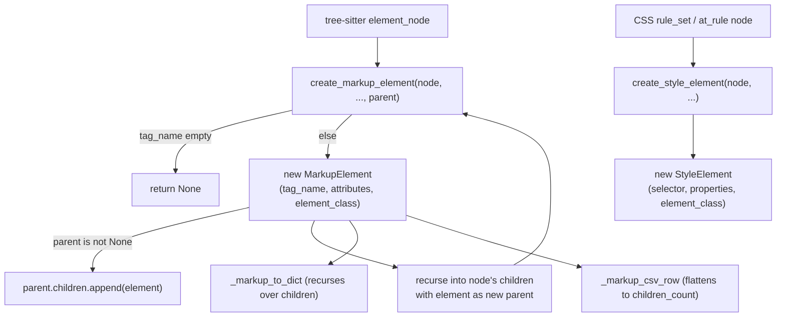

# MarkupElement / StyleElement — the one CodeElement that is a tree

## Overview
Every other `CodeElement` subtype in TSA — `Function`, `Class`, `SQLTable`, and the rest — is a flat
record: it knows its own name and line range, nothing about its siblings or its structural parent.
[`MarkupElement`](../catalog/tree_sitter_analyzer/models/markup_models.md#MarkupElement) breaks that
pattern on purpose, because HTML is the one language in this survey where "structure" *means* nesting:
a `MarkupElement` carries a [`parent`](../catalog/tree_sitter_analyzer/models/markup_models.md#MarkupElement.parent)
back-reference and a [`children`](../catalog/tree_sitter_analyzer/models/markup_models.md#MarkupElement.children)
list of more `MarkupElement`s, making it a genuine self-referential tree rather than a flat list that
happens to represent nested tags.
[`StyleElement`](../catalog/tree_sitter_analyzer/models/markup_models.md#StyleElement), its CSS
sibling in the same file, deliberately does *not* get the same treatment — a CSS rule is a flat
selector/properties pair with no parent-child slot at all, because TSA's CSS model doesn't represent
rule nesting (`@media` blocks containing other rules) the way its HTML model represents DOM nesting.

## Diagram

## Design rationale (why it's built this way)
**The tree lives in the data model, not just in the tree-sitter AST.** TSA could have kept
`MarkupElement` flat (like everything else) and let consumers reconstruct nesting from line ranges —
"element B is inside element A if B's lines fall within A's lines." Instead
[`children`](../catalog/tree_sitter_analyzer/models/markup_models.md#MarkupElement.children) and
[`parent`](../catalog/tree_sitter_analyzer/models/markup_models.md#MarkupElement.parent) are real
dataclass fields, wired up at construction time by
[`create_markup_element`](../catalog/tree_sitter_analyzer/languages/html_helpers.md#create_markup_element):
`if parent: parent.children.append(element)`. This means the DOM hierarchy survives past the parse —
a JSON formatter can emit a genuinely nested document, and a CSV formatter can still ask "how many
children does this element have" — without either one re-deriving nesting from line-range arithmetic.
The cost is a self-referential structure that can't trivially round-trip through anything that doesn't
understand cycles (see Edge cases).

**Classification is a separate concern from structure, computed once, stored flat.**
[`element_class`](../catalog/tree_sitter_analyzer/models/markup_models.md#MarkupElement.element_class)
holds a coarse category (`'structure'`, `'media'`, `'form'`, …) distinct from
[`tag_name`](../catalog/tree_sitter_analyzer/models/markup_models.md#MarkupElement.tag_name) — the
literal HTML tag — and distinct from the parent/child structure entirely. It exists purely so
formatters can group elements without re-deriving "what kind of thing is a `<nav>`" from a hardcoded
tag list at render time; the classification is computed once at construction
(inside [`create_markup_element`](../catalog/tree_sitter_analyzer/languages/html_helpers.md#create_markup_element)/[`create_style_element`](../catalog/tree_sitter_analyzer/languages/css_helpers.md#create_style_element),
not shown fully in this packet) and then just read as a plain string field by every consumer —
[`_append_compact_markup_element`](../catalog/tree_sitter_analyzer/formatters/_html_compact_formatter_helpers.md#_append_compact_markup_element)
buckets elements into a `CompactMarkupGroups` purely by branching on `element.element_class`, with no
knowledge of what tags map to what category.

**`StyleElement` shares the base but not the tree.** Both
[`MarkupElement`](../catalog/tree_sitter_analyzer/models/markup_models.md#MarkupElement) and
[`StyleElement`](../catalog/tree_sitter_analyzer/models/markup_models.md#StyleElement) extend
[`CodeElement`](../catalog/tree_sitter_analyzer/models/base.md#CodeElement) directly and both carry an
`element_class` field for the same classification purpose (CSS's is `'layout'`/`'typography'`/`'color'`
rather than HTML's `'structure'`/`'media'`/`'form'`), but only `MarkupElement` got `parent`/`children`.
This is a real asymmetry in the model, not an oversight visible in this packet: a `<style>` block's
individual rules are siblings in TSA's model with no representation of one rule being scoped inside an
`@media` block containing it, even though CSS nesting is a real, parseable construct.

## Entry points
- [`create_markup_element`](../catalog/tree_sitter_analyzer/languages/html_helpers.md#create_markup_element) —
  the single constructor for every `MarkupElement` in the tree; called once per element node during
  the HTML plugin's recursive descent, with the caller's own in-progress `MarkupElement` passed in as
  `parent` so the tree assembles itself as the traversal proceeds, not in a second linking pass.
- [`create_style_element`](../catalog/tree_sitter_analyzer/languages/css_helpers.md#create_style_element) —
  the CSS-side constructor, reached once per `rule_set`/at-rule node; unlike its HTML counterpart it
  takes no `parent` argument at all, because `StyleElement` has nowhere to put one.
- [`_analyze_html_fallback`](../catalog/tree_sitter_analyzer/languages/html_plugin.md#_analyze_html_fallback)
  and [`_analyze_css_fallback`](../catalog/tree_sitter_analyzer/languages/css_plugin.md#_analyze_css_fallback) —
  the degraded entry points reached when the `tree-sitter-html`/`tree-sitter-css` grammar package
  isn't installed; both still construct a real `MarkupElement`/`StyleElement` (with `element_class`
  hard-coded to `"structure"`/`"other"`), not an error object, so callers get *something* structurally
  valid instead of an empty result.

## Mechanism (step-by-step)
1. **The tree is built bottom-up during a single traversal, not linked afterward.**
   [`create_markup_element`](../catalog/tree_sitter_analyzer/languages/html_helpers.md#create_markup_element)
   takes the caller's current `parent` `MarkupElement | None`, builds the new element with
   [`children`](../catalog/tree_sitter_analyzer/models/markup_models.md#MarkupElement.children)
   starting empty, and — only if a parent was passed — appends itself to that parent's
   [`children`](../catalog/tree_sitter_analyzer/models/markup_models.md#MarkupElement.children) list
   before returning. Whoever calls this function next, one level deeper in the DOM, passes the element
   just created back in as *its* `parent` argument — the tree grows exactly as fast as the tree-sitter
   traversal does, with no separate "attach children" step afterward.
2. **A missing tag name aborts the whole subtree, silently.** If
   [`create_markup_element`](../catalog/tree_sitter_analyzer/languages/html_helpers.md#create_markup_element)
   can't extract a tag name for a node, it returns `None` rather than a placeholder element — the
   caller's own traversal logic (not in this packet's subgraph) has to check for `None` before
   recursing into that node's children, meaning a node whose tag name extraction fails effectively
   prunes everything beneath it out of the tree, not just itself.
3. **CSS rules stay flat regardless of source nesting.**
   [`create_style_element`](../catalog/tree_sitter_analyzer/languages/css_helpers.md#create_style_element)
   builds a [`StyleElement`](../catalog/tree_sitter_analyzer/models/markup_models.md#StyleElement) from
   a `rule_set` or at-rule node with `selector`/`properties`/`element_class` but never a reference to
   an enclosing rule — an `@media` block's inner rules and the `@media` block itself both become
   independent, sibling `StyleElement`s in the output list.
4. **Serialization has to choose between preserving the tree and flattening it.**
   [`_markup_to_dict`](../catalog/tree_sitter_analyzer/formatters/html_formatter.md#HtmlJsonFormatter._markup_to_dict)
   recurses explicitly over [`children`](../catalog/tree_sitter_analyzer/models/markup_models.md#MarkupElement.children)
   (`[self._markup_to_dict(child) for child in element.children]`), reproducing the full nested
   structure in JSON, while
   [`_markup_csv_row`](../catalog/tree_sitter_analyzer/formatters/_html_csv_formatter_helpers.md#_markup_csv_row)
   — a row-oriented format that has no way to express nesting — records only `len(element.children)` as
   a bare count. The same tree produces genuinely different information depending on which formatter
   reads it, not because of a missing feature but because CSV cannot represent what JSON can.
5. **Compact formatting groups by `element_class`, ignoring the tree entirely.**
   [`_append_compact_markup_element`](../catalog/tree_sitter_analyzer/formatters/_html_compact_formatter_helpers.md#_append_compact_markup_element)
   and [`_compact_summary_lines`](../catalog/tree_sitter_analyzer/formatters/_html_compact_formatter_helpers.md#_compact_summary_lines)
   bucket a flat list of elements by
   [`element_class`](../catalog/tree_sitter_analyzer/models/markup_models.md#MarkupElement.element_class)
   into named groups (`structure_elements`, `heading_elements`, `form_elements`, …) for a summary
   table — the compact view is a classification-driven rollup, not a structural one, and never touches
   [`parent`](../catalog/tree_sitter_analyzer/models/markup_models.md#MarkupElement.parent)/[`children`](../catalog/tree_sitter_analyzer/models/markup_models.md#MarkupElement.children)
   at all.

## Key data structures
- **`MarkupElement`** — `tag_name: str`, `attributes: dict[str, str]`, `parent: "MarkupElement | None"`,
  `children: list["MarkupElement"]`, `element_class: str`, `element_type: str = "html_element"`. The
  forward-referenced `"MarkupElement | None"`/`list["MarkupElement"]` type strings are necessary
  because a dataclass field can't reference its own not-yet-fully-defined class by bare name at
  class-definition time.
- **`StyleElement`** — `selector: str`, `properties: dict[str, str]`, `element_class: str`,
  `element_type: str = "css_rule"`. No structural fields at all — a strictly flat record even though
  its subject matter (CSS at-rules) can nest in principle.
- **`tag_name`/`element_class` (`MarkupElement`)** — both default to the empty string, so a
  freshly-constructed element with neither set is syntactically valid but semantically meaningless;
  every real constructor in this packet's subgraph sets both.

## Dynamics (design intent)
> [!inferred]
> Tree construction is single-threaded and strictly top-down: a `MarkupElement` never appears in its
> own `children` list transitively (nothing in the cited constructors permits back-edges other than the
> one intentional `parent` reference), and nothing in this packet's subgraph shows the tree being
> mutated after the initial traversal completes — every downstream consumer (`_markup_to_dict`,
> `_markup_csv_row`, the compact formatter's grouping) only reads `children`, never appends to it.

## Edge cases
- **The `parent`/`children` back-reference makes a `MarkupElement` subtree a genuine object graph with
  cycles (parent points back to a node that points forward to it), not a plain tree that would
  round-trip cleanly through naive `dataclasses.asdict()` or JSON serialization.**
  [`_markup_to_dict`](../catalog/tree_sitter_analyzer/formatters/html_formatter.md#HtmlJsonFormatter._markup_to_dict)
  works around this by recursing only through `children` and never emitting `parent` in its output
  dict at all — the cycle is real in memory but never serialized.
- **A degraded fallback parse produces a *single* `MarkupElement`/`StyleElement` with no children,
  not a partial tree.** [`_analyze_html_fallback`](../catalog/tree_sitter_analyzer/languages/html_plugin.md#_analyze_html_fallback)
  emits one synthetic `"html"`-tagged element spanning the whole document (`element_class="structure"`,
  `children=[]`); a consumer that expects a real DOM tree and instead walks `children` on this result
  will see a leaf, not an error — the degradation is invisible unless the caller checks `success` or
  compares the element count against the file's actual complexity.
- **CSV's `_markup_csv_row` and JSON's `_markup_to_dict` disagree about what a `MarkupElement` even
  *is*** — one produces a recursive document, the other a single flat row per element with only a
  child *count* — so code comparing "the same element" across the two output formats is comparing
  genuinely different projections of the same underlying tree, not two encodings of one shape.

## Open questions
- The tag-classification logic that assigns `element_class` (which HTML tags map to `'structure'` vs.
  `'form'` vs. `'media'`, and which CSS properties map to `'layout'` vs. `'typography'`) is not itself
  in this packet's subgraph, so the exact category boundaries aren't citable here.
- Whether any consumer in the codebase actually walks the `parent` back-reference (as opposed to only
  ever walking forward through `children`) isn't resolvable from this packet's subgraph — every cited
  consumer here reads `children`, none read `parent`.

## See also
- [`tree_sitter_analyzer-models-base`](tree_sitter_analyzer-models-base.md) — the `CodeElement` base
  both `MarkupElement` and `StyleElement` extend, and the flat-record convention this page's tree
  structure deliberately departs from.
- [`tree_sitter_analyzer-models-sql_models`](tree_sitter_analyzer-models-sql_models.md) — the other
  domain-specific element family, which handles an unreliable grammar with a regex-recovery pass
  rather than this page's "degrade to one synthetic element" strategy.
- [`tree_sitter_analyzer-models-result`](tree_sitter_analyzer-models-result.md) — the generic container
  whose `elements` list holds `MarkupElement`/`StyleElement` instances alongside every other language's
  output.
