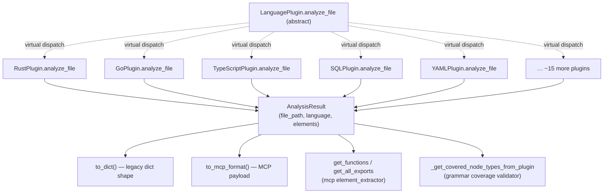

# AnalysisResult — where 20 language plugins converge on one shape

## Overview
[`AnalysisResult`](../catalog/tree_sitter_analyzer/models/result.md#AnalysisResult) is the neutral
wire format every one of TSA's language plugins hands back after parsing a file — regardless of
whether the source was Rust, Go, Swift, C, C++, TypeScript, Markdown, Kotlin, C#, Ruby, PHP, SQL,
YAML, JSON, Bash, JavaScript, Java, Python, or a degraded HTML/CSS fallback. This is the actual point
where TSA's "one substrate, many languages" claim becomes concrete: the abstract
[`LanguagePlugin.analyze_file`](../catalog/tree_sitter_analyzer/plugins/base.md#LanguagePlugin.analyze_file)
method has roughly twenty overriding implementations — every one of them constructs and returns this
same dataclass, with the same [`file_path`](../catalog/tree_sitter_analyzer/models/result.md#AnalysisResult.file_path),
[`language`](../catalog/tree_sitter_analyzer/models/result.md#AnalysisResult.language), and
[`elements`](../catalog/tree_sitter_analyzer/models/result.md#AnalysisResult.elements) fields
populated. Everything downstream — CLI output, MCP tool responses, grammar-coverage validation, TOON
formatting — reads from this one container instead of twenty language-specific result types.

## Diagram

## Design rationale (why it's built this way)
**One result type instead of twenty is the whole point of the exercise.** The
[`analyze_file`](../catalog/tree_sitter_analyzer/plugins/base.md#LanguagePlugin.analyze_file) abstract
method's `called by` edges in this packet's subgraph list eighteen distinct `(virtual)` overrides —
[`RustPlugin`](../catalog/tree_sitter_analyzer/languages/rust_plugin.md#RustPlugin.analyze_file),
[`GoPlugin`](../catalog/tree_sitter_analyzer/languages/go_plugin.md#GoPlugin.analyze_file),
[`CPlugin`](../catalog/tree_sitter_analyzer/languages/c_plugin.md#CPlugin.analyze_file),
[`CppPlugin`](../catalog/tree_sitter_analyzer/languages/cpp_plugin.md#CppPlugin.analyze_file),
[`SwiftPlugin`](../catalog/tree_sitter_analyzer/languages/swift_plugin.md#SwiftPlugin.analyze_file),
[`TypeScriptPlugin`](../catalog/tree_sitter_analyzer/languages/typescript_plugin/plugin.md#TypeScriptPlugin.analyze_file),
[`JavaScriptPlugin`](../catalog/tree_sitter_analyzer/languages/javascript_plugin/plugin.md#JavaScriptPlugin.analyze_file),
[`JavaPlugin`](../catalog/tree_sitter_analyzer/languages/java_plugin.md#JavaPlugin.analyze_file),
[`PythonPlugin`](../catalog/tree_sitter_analyzer/languages/python_plugin/plugin.md#PythonPlugin.analyze_file),
[`KotlinPlugin`](../catalog/tree_sitter_analyzer/languages/kotlin_plugin.md#KotlinPlugin.analyze_file),
[`CSharpPlugin`](../catalog/tree_sitter_analyzer/languages/csharp_plugin.md#CSharpPlugin.analyze_file),
[`RubyPlugin`](../catalog/tree_sitter_analyzer/languages/ruby_plugin.md#RubyPlugin.analyze_file),
[`PHPPlugin`](../catalog/tree_sitter_analyzer/languages/php_plugin.md#PHPPlugin.analyze_file),
[`SQLPlugin`](../catalog/tree_sitter_analyzer/languages/sql_plugin/plugin.md#SQLPlugin.analyze_file),
[`YAMLPlugin`](../catalog/tree_sitter_analyzer/languages/yaml_plugin.md#YAMLPlugin.analyze_file),
[`JSONPlugin`](../catalog/tree_sitter_analyzer/languages/json_plugin.md#JSONPlugin.analyze_file),
[`MarkdownPlugin`](../catalog/tree_sitter_analyzer/languages/markdown_plugin/plugin.md#MarkdownPlugin.analyze_file),
and [`BashPlugin`](../catalog/tree_sitter_analyzer/languages/bash_plugin.md#BashPlugin.analyze_file) —
and every single one returns `AnalysisResult`, not a per-language subclass. This is the mechanism
behind the survey's grounding-substrate comparison: where a graph-DB tool would normalize parses into
persisted graph nodes and a SCIP-based tool normalizes into a compiler's own symbol table,
TSA normalizes at the *language-plugin boundary* — one dataclass every plugin author must fill in,
checked by nothing more than Python's own type system.

**The dataclass still carries fields from a pre-unification design.** The comment `# Legacy fields
removed - use elements list instead` sits directly above three commented-out list fields
(`imports`, `classes`, `methods` — visible in the full source), which is the fossil record of an
earlier design where `AnalysisResult` held one typed list per element kind. That migration is
complete for *structural* elements — everything now lives in the single
[`elements`](../catalog/tree_sitter_analyzer/models/result.md#AnalysisResult.elements) sequence — but
per-language *scalar* metadata (`is_suspend` for Kotlin, `receiver`/`receiver_type` for Go,
`is_constructor` for Java, plus `modules`/`impls`/`goroutines`/`channels`/`defers`) still lives as
optional top-level fields directly on `AnalysisResult` rather than on the elements themselves — the
unification is thorough for "what did we find" but incomplete for "what dialect-specific facts came
with it."

**Two serialization shapes exist because two audiences exist.** `AnalysisResult` exposes both
[`to_dict`](../catalog/tree_sitter_analyzer/models/result.md#AnalysisResult.to_dict) (a legacy,
CLI/test-oriented shape — the docstring notes a recent refactor from "78 lines" to "~20 lines of
phase dispatch") and [`to_mcp_format`](../catalog/tree_sitter_analyzer/models/result.md#AnalysisResult.to_mcp_format)
(a `structure`/`metadata`-keyed shape for MCP tool responses). Both walk the same
[`elements`](../catalog/tree_sitter_analyzer/models/result.md#AnalysisResult.elements) sequence and
partition it by element type — the two are not thin wrappers around one shared representation but two
independent groupings over the same source list, because their consumers (a human CLI user vs. an
agent parsing structured MCP output) want different keys for the same underlying facts.

## Entry points
- [`LanguagePlugin.analyze_file`](../catalog/tree_sitter_analyzer/plugins/base.md#LanguagePlugin.analyze_file) —
  the abstract contract every plugin implements; this is the seam a new language plugin has to honor,
  and the only method whose return type this whole page's mechanism depends on.
- [`extract_elements`](../catalog/tree_sitter_analyzer/mcp/tools/utils/element_extractor.md#extract_elements) —
  the MCP-side entry point that runs a fresh analysis and hands back an `AnalysisResult | None`
  directly, used by MCP tools that need element data without going through a CLI command.
- [`BaseCommand.analyze_file`](../catalog/tree_sitter_analyzer/cli/commands/base_command.md#BaseCommand.analyze_file) —
  the CLI-side entry point wrapping the same unified analysis engine, reached whenever a `tree-sitter-analyzer`
  invocation asks for structure, summary, or statistics output for a file.
- [`_get_covered_node_types_from_plugin`](../catalog/tree_sitter_analyzer/grammar_coverage/validator.md#_get_covered_node_types_from_plugin) —
  not a normal consumer but a meta one: it calls a plugin's `analyze_file` and inspects the returned
  `AnalysisResult.elements` to check which tree-sitter node types the plugin *actually* captured,
  making `AnalysisResult` the object grammar-coverage testing itself is built on top of.

## Mechanism (step-by-step)
1. **Every plugin's `analyze_file` builds the same four fields regardless of what it parsed.**
   [`RustPlugin.analyze_file`](../catalog/tree_sitter_analyzer/languages/rust_plugin.md#RustPlugin.analyze_file),
   [`GoPlugin.analyze_file`](../catalog/tree_sitter_analyzer/languages/go_plugin.md#GoPlugin.analyze_file),
   and [`SQLPlugin.analyze_file`](../catalog/tree_sitter_analyzer/languages/sql_plugin/plugin.md#SQLPlugin.analyze_file)
   have almost nothing in common in *how* they walk their respective grammars, but each ends by
   constructing an `AnalysisResult` with the file's
   [`file_path`](../catalog/tree_sitter_analyzer/models/result.md#AnalysisResult.file_path),
   [`language`](../catalog/tree_sitter_analyzer/models/result.md#AnalysisResult.language) tag, and its
   list of extracted [`Function`](../catalog/tree_sitter_analyzer/models/base.md#Function) /
   [`Class`](../catalog/tree_sitter_analyzer/models/base.md#Class) /
   [`Variable`](../catalog/tree_sitter_analyzer/models/base.md#Variable) instances packed into
   [`elements`](../catalog/tree_sitter_analyzer/models/result.md#AnalysisResult.elements).
2. **`elements` is where the heterogeneity actually lives.** The field is typed `Sequence[CodeElement]`
   but the concrete objects inside it vary by domain, not just by language: a Python or Java plugin
   fills it with [`Function`](../catalog/tree_sitter_analyzer/models/base.md#Function)/[`Class`](../catalog/tree_sitter_analyzer/models/base.md#Class),
   while [`HtmlPlugin._analyze_with_tree_sitter`](../catalog/tree_sitter_analyzer/languages/html_plugin.md#HtmlPlugin._analyze_with_tree_sitter)
   (and its degraded twin [`_analyze_html_fallback`](../catalog/tree_sitter_analyzer/languages/html_plugin.md#_analyze_html_fallback))
   fills it with [`MarkupElement`](../catalog/tree_sitter_analyzer/models/markup_models.md#MarkupElement)
   instances, [`CssPlugin._analyze_with_tree_sitter`](../catalog/tree_sitter_analyzer/languages/css_plugin.md#CssPlugin._analyze_with_tree_sitter)
   (and [`_analyze_css_fallback`](../catalog/tree_sitter_analyzer/languages/css_plugin.md#_analyze_css_fallback))
   fills it with [`StyleElement`](../catalog/tree_sitter_analyzer/models/markup_models.md#StyleElement),
   and [`SQLPlugin.analyze_file`](../catalog/tree_sitter_analyzer/languages/sql_plugin/plugin.md#SQLPlugin.analyze_file)
   fills it with [`SQLElement`](../catalog/tree_sitter_analyzer/models/sql_models.md#SQLElement)/[`SQLTable`](../catalog/tree_sitter_analyzer/models/sql_models.md#SQLTable)
   subtypes. There is no `element_kind` dispatch at the `AnalysisResult` level — every consumer that
   cares about the difference has to check the concrete type or the `element_type` string tag itself.
3. **Two independent groupings turn the flat list back into structure.**
   [`to_dict`](../catalog/tree_sitter_analyzer/models/result.md#AnalysisResult.to_dict) and
   [`to_mcp_format`](../catalog/tree_sitter_analyzer/models/result.md#AnalysisResult.to_mcp_format)
   both re-derive `imports`/`classes`/`methods`/`fields` from the same
   [`elements`](../catalog/tree_sitter_analyzer/models/result.md#AnalysisResult.elements) sequence on
   every call — nothing is cached or precomputed at construction time, so the cost of "what kind of
   element is this" is paid at serialization time, not at parse time.
4. **Downstream tools query `elements` directly rather than re-parsing.**
   [`get_functions`](../catalog/tree_sitter_analyzer/mcp/tools/utils/element_extractor.md#get_functions)
   and [`get_all_exports`](../catalog/tree_sitter_analyzer/mcp/tools/utils/element_extractor.md#get_all_exports)
   both take an already-built `AnalysisResult` and filter its
   [`elements`](../catalog/tree_sitter_analyzer/models/result.md#AnalysisResult.elements), and the CLI's
   [`AdvancedCommand._output_statistics`](../catalog/tree_sitter_analyzer/cli/commands/advanced_command.md#AdvancedCommand._output_statistics)/[`_output_full_analysis`](../catalog/tree_sitter_analyzer/cli/commands/advanced_command.md#AdvancedCommand._output_full_analysis)
   do the same for human-readable output — `AnalysisResult` is reused as the query surface, not just
   the parse output, so a single parse can answer several different questions without re-invoking the
   plugin.
5. **The TOON formatter treats the whole result as one formattable unit.**
   [`ToonFormatter.format_analysis_result`](../catalog/tree_sitter_analyzer/formatters/toon_formatter.md#ToonFormatter.format_analysis_result)
   takes an `AnalysisResult` (typed loosely as `Any` to also accept dict-shaped input) and a
   `table_type` and renders TSA's token-efficient MCP output format directly from
   [`file_path`](../catalog/tree_sitter_analyzer/models/result.md#AnalysisResult.file_path)/[`language`](../catalog/tree_sitter_analyzer/models/result.md#AnalysisResult.language)/[`elements`](../catalog/tree_sitter_analyzer/models/result.md#AnalysisResult.elements)
   — a third serialization path alongside `to_dict`/`to_mcp_format`, confirming the container's job is
   to be read many different ways, not to dictate one.

## Key data structures
- **`AnalysisResult`** — `file_path: str`, `language: str = "unknown"`, `line_count: int`,
  `elements: Sequence[CodeElement]`, `node_count: int`, `query_results: dict`, `source_code: str`,
  `package: JavaPackage | None`, `analysis_time: float`, `success: bool`, `error_message: str | None`,
  plus the per-language scalar fields discussed in Design rationale. `success`/`error_message` let a
  failed parse still be a valid, inspectable `AnalysisResult` (an empty `elements` list plus
  `success=False`) rather than a raised exception.
- **`elements: Sequence[CodeElement]`** — the one field every consumer this page discusses actually
  reads; a `Sequence` rather than a concrete `list`, so callers cannot assume mutability but can always
  iterate and filter.

## Dynamics (design intent)
> [!inferred]
> Nothing in this packet's subgraph shows concurrent construction or mutation of an `AnalysisResult`
> — a plugin's `analyze_file` builds one instance per call and returns it; several `analyze_file`
> implementations are declared `async def` (visible in their signatures), but that reflects I/O or
> cooperative scheduling around the *parse*, not any concurrency in how the resulting dataclass itself
> is read afterward. Serialization methods (`to_dict`, `to_mcp_format`) recompute their groupings from
> `elements` fresh on every call rather than caching, which is simple but means calling both on a
> large result pays the grouping cost twice.

## Edge cases
- **`elements` mixes types the field's own annotation doesn't reveal.** `Sequence[CodeElement]` is
  the declared type, but a caller cannot tell from the type alone whether a given file's list holds
  `Function`/`Class` (code), `MarkupElement`/`StyleElement` (markup), or `SQLElement` subtypes (SQL) —
  that's determined entirely by which plugin produced the result, which the
  [`language`](../catalog/tree_sitter_analyzer/models/result.md#AnalysisResult.language) field records
  but nothing enforces at the type level.
- **A degraded fallback parse (`_analyze_html_fallback`, `_analyze_css_fallback`) is indistinguishable
  from a full grammar-backed parse by shape.** Both return a normal, `success=True`
  [`AnalysisResult`](../catalog/tree_sitter_analyzer/models/result.md#AnalysisResult) with a populated
  [`elements`](../catalog/tree_sitter_analyzer/models/result.md#AnalysisResult.elements) list — the
  fallback's list just holds one synthetic element instead of a full per-node tree. A consumer that
  assumes "elements present means the grammar really parsed this" will be wrong for degraded HTML/CSS
  files.
- **`test_mixed_elements_in_analysis_result` and `test_element_serialization_compatibility` (visible in
  this packet's subgraph) exist specifically because `elements` is heterogeneous** — the tests
  construct an `AnalysisResult` whose `elements` list mixes `Function`, `MarkupElement`, and
  `StyleElement` in one file, confirming this mixed-type list is an intended state, not an accident of
  a particular plugin's output.

## Open questions
- The full grouping logic behind `to_dict`/`to_mcp_format` (the private helper functions that
  partition `elements` by type) is not in this packet's subgraph, so exactly how an unrecognized
  `element_type` is handled during grouping isn't citable here.
- Why `AnalysisResult` retains a `package: JavaPackage | None` field specifically typed to Java's
  package model, rather than a generic `Package` element living in `elements` like every other
  structural fact, is not resolvable from this subgraph.

## See also
- [`tree_sitter_analyzer-models-base`](tree_sitter_analyzer-models-base.md) — the `CodeElement`
  family that populates `elements`.
- [`tree_sitter_analyzer-models-sql_models`](tree_sitter_analyzer-models-sql_models.md) and
  [`tree_sitter_analyzer-models-markup_models`](tree_sitter_analyzer-models-markup_models.md) — the
  two non-code element families that also end up inside the same `elements` sequence.
