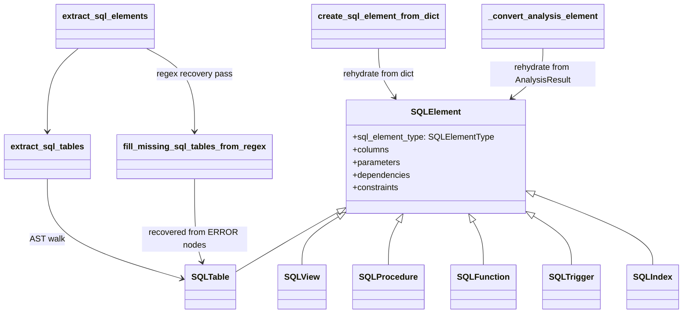

# SQL models — a domain family, and a data model built to distrust its own parser

## Overview
SQL doesn't decompose into "functions and classes" the way most of TSA's other thirteen languages
do — its structural vocabulary is tables, views, procedures, functions, triggers, and indexes. Rather
than force those into the generic `Function`/`Class`/`Variable` family, TSA gives SQL its own parallel
subtype tree rooted at [`SQLElement`](../catalog/tree_sitter_analyzer/models/sql_models.md#SQLElement),
tagged with a proper [`SQLElementType`](../catalog/tree_sitter_analyzer/models/sql_models.md#SQLElementType)
enum instead of a bare string. What makes this packet's mechanism more than "one more subclass
family," though, is what the extraction path does with it: SQL's tree-sitter grammar is known to
absorb entire statements into unrecoverable `ERROR` nodes under specific ambiguous syntax, so the
model is built to be populated from *two* independent sources — a real AST walk and a text-level
regex fallback — that both have to converge on the exact same dataclasses.

## Diagram

## Design rationale (why it's built this way)
**A separate subtype tree, not more fields on `Function`/`Class`.** `SQLElement` extends
[`CodeElement`](../catalog/tree_sitter_analyzer/models/base.md#CodeElement) directly rather than
[`Function`](../catalog/tree_sitter_analyzer/models/base.md#Function) or
[`Class`](../catalog/tree_sitter_analyzer/models/base.md#Class), adding `columns`, `parameters`,
`dependencies`, and `constraints` — concepts with no equivalent in the generic model. Six leaf types —
[`SQLTable`](../catalog/tree_sitter_analyzer/models/sql_models.md#SQLTable),
[`SQLView`](../catalog/tree_sitter_analyzer/models/sql_models.md#SQLView),
[`SQLProcedure`](../catalog/tree_sitter_analyzer/models/sql_models.md#SQLProcedure),
[`SQLFunction`](../catalog/tree_sitter_analyzer/models/sql_models.md#SQLFunction),
[`SQLTrigger`](../catalog/tree_sitter_analyzer/models/sql_models.md#SQLTrigger),
[`SQLIndex`](../catalog/tree_sitter_analyzer/models/sql_models.md#SQLIndex) — each just re-pin
`sql_element_type`'s default to their own [`SQLElementType`](../catalog/tree_sitter_analyzer/models/sql_models.md#SQLElementType)
member and add one or two fields of their own (`SQLView` gets `source_tables`/`view_definition`,
`SQLFunction` gets `is_deterministic`/`reads_sql_data`, `SQLIndex` gets `indexed_columns`/`is_unique`).
This mirrors the "flat superset schema" pattern used for `Function`/`Class` on the base-model page,
but scoped to one domain instead of one language — SQL earns its own family because its concepts
(a trigger's timing/event, a table's primary/foreign keys) don't generalize across the other twelve
languages the way `is_async`/`visibility` do.

**`SQLElementType` is a real enum where `CodeElement.element_type` is a bare string.** Every other
element kind in TSA tags itself with a plain `str` default (`"function"`, `"class"`, …); SQL instead
gets a proper `Enum` with six named members. The dataclass fields still carry *both*: `sql_element_type:
SQLElementType` for exhaustive matching, and `element_type: str` for the duck-typed `get_element_type`
convention every other formatter relies on — `SQLTable` sets both `sql_element_type =
SQLElementType.TABLE` and `element_type = "table"` to the same fact, redundantly, so that neither the
SQL-specific formatters nor the generic cross-language ones have to special-case which tag SQL uses.

**The extractor treats its own grammar's output as necessarily incomplete.** The docstring on
[`fill_missing_sql_tables_from_regex`](../catalog/tree_sitter_analyzer/languages/sql_plugin/table_extractor.md#fill_missing_sql_tables_from_regex)
names the exact failure mode: a `CREATE TABLE` statement with a multi-line `FOREIGN KEY` clause
containing `ON DELETE`/`ON UPDATE` can trigger grammar ambiguity that makes tree-sitter's parse
recovery swallow the whole statement into an `ERROR` node, silently dropping the table. Rather than
treat that as an unfixable grammar limitation, the extractor runs a second, independent pass over the
*raw source text* with a regex, and merges anything the AST pass missed — the model's job isn't just
to represent what tree-sitter found, it's to represent what's really in the file even when tree-sitter
itself couldn't see it. The de-duplication key is `(schema_name, table_name)` rather than name alone
specifically so `tenant_a.users` and `tenant_b.users` don't collapse into one recovered row, and the
regex is skipped inside SQL comments so a commented-out `CREATE TABLE` doesn't get resurrected as a
phantom table.

> [!inferred]
> `RecoverViewsFromErrorsRule.generate_elements` (in `platform_compat/adapter.py`, not itself in this
> packet's subgraph but reachable from the cited
> [`generate_elements`](../catalog/tree_sitter_analyzer/platform_compat/adapter.md#RecoverViewsFromErrorsRule.generate_elements)
> entry) applies the identical idea — a regex scan for `CREATE VIEW` statements missed by the AST pass
> — but as a separate, pluggable "compatibility rule" rather than being wired directly into
> [`extract_sql_elements`](../catalog/tree_sitter_analyzer/languages/sql_plugin/extractor.md#SQLElementExtractor.extract_sql_elements)'s
> own sequence the way the table regex fallback is. Two independent regex-recovery mechanisms for two
> different statement kinds, living in two different modules, is a structural inconsistency the source
> doesn't explain — plausibly because the view-recovery rule was added later as part of a general
> "adapt/generate" plugin system rather than being retrofitted into the table path's already-working
> design.

## Entry points
- [`extract_sql_elements`](../catalog/tree_sitter_analyzer/languages/sql_plugin/extractor.md#SQLElementExtractor.extract_sql_elements) —
  the SQL plugin's main AST-walk entry point; it calls per-kind extraction methods, then
  unconditionally runs the regex recovery pass, so every `list[SQLElement]` it returns has already
  been patched before any caller sees it.
- [`create_sql_element_from_dict`](../catalog/tree_sitter_analyzer/formatters/_sql_formatter_wrapper_helpers.md#create_sql_element_from_dict) —
  the entry point used when SQL elements arrive as plain dicts rather than live dataclass instances
  (e.g. rehydrated from a cached or serialized payload); its docstring commits to "preserving
  soft-failure behavior" — malformed input degrades rather than raises.
- [`_convert_analysis_element`](../catalog/tree_sitter_analyzer/formatters/_sql_formatter_wrapper_helpers.md#_convert_analysis_element) —
  the third construction path: takes a generic, duck-typed element (as it would appear inside a plain
  [`AnalysisResult`](tree_sitter_analyzer-models-result.md)`.elements` list) and promotes it into a
  properly-typed `SQLElement` subtype using formatter-supplied metadata extractors.
- [`generate_elements`](../catalog/tree_sitter_analyzer/platform_compat/adapter.md#RecoverViewsFromErrorsRule.generate_elements) —
  a fourth, rule-based entry point that manufactures brand-new `SQLElement` instances (views) directly
  from source text rather than from any tree-sitter node at all.

## Mechanism (step-by-step)
1. **AST extraction runs first, per SQL statement kind.**
   [`extract_sql_elements`](../catalog/tree_sitter_analyzer/languages/sql_plugin/extractor.md#SQLElementExtractor.extract_sql_elements)
   walks the tree-sitter tree once per element kind (tables, views, procedures, functions, triggers,
   indexes), each populating its own [`SQLElement`](../catalog/tree_sitter_analyzer/models/sql_models.md#SQLElement)
   subtype straight from AST node positions.
2. **The regex fallback runs immediately after, unconditionally, on every file.**
   [`fill_missing_sql_tables_from_regex`](../catalog/tree_sitter_analyzer/languages/sql_plugin/table_extractor.md#fill_missing_sql_tables_from_regex)
   is called regardless of whether the AST pass found tables that "look complete" — it has no way to
   know it's needed except by re-scanning, so it always re-scans, then merges in whatever
   [`SQLTable`](../catalog/tree_sitter_analyzer/models/sql_models.md#SQLTable) rows it recovers that the
   AST pass's de-dup key didn't already produce. This ordering (AST, then always-on regex patch) is
   what makes issue #808 not a regression risk: the regex only *adds*, it never removes what the AST
   pass already found.
3. **Formatters must dispatch across all six leaf types by hand.**
   [`_format_element_details`](../catalog/tree_sitter_analyzer/formatters/sql_formatters.md#SQLFullFormatter._format_element_details)
   and [`format_sql_compact_details`](../catalog/tree_sitter_analyzer/formatters/_sql_formatters_helpers.md#format_sql_compact_details)
   both branch across [`SQLFunction`](../catalog/tree_sitter_analyzer/models/sql_models.md#SQLFunction),
   [`SQLIndex`](../catalog/tree_sitter_analyzer/models/sql_models.md#SQLIndex),
   [`SQLProcedure`](../catalog/tree_sitter_analyzer/models/sql_models.md#SQLProcedure),
   [`SQLTable`](../catalog/tree_sitter_analyzer/models/sql_models.md#SQLTable),
   [`SQLTrigger`](../catalog/tree_sitter_analyzer/models/sql_models.md#SQLTrigger), and
   [`SQLView`](../catalog/tree_sitter_analyzer/models/sql_models.md#SQLView) explicitly rather than
   relying on a shared field — the higher-fidelity `SQLElementType` enum buys exhaustiveness checking
   at the cost of every formatter needing its own dispatch table over the same six names.
   [`format_elements`](../catalog/tree_sitter_analyzer/formatters/sql_formatters.md#SQLFormatterBase.format_elements)
   is the shared entry point both full and compact formatters build on.
4. **Dict-shaped input reconstructs the same types via dedicated per-kind converters.**
   [`_sql_table_from_dict`](../catalog/tree_sitter_analyzer/formatters/_sql_formatter_wrapper_helpers.md#_sql_table_from_dict)
   and [`_sql_function_from_dict`](../catalog/tree_sitter_analyzer/formatters/_sql_formatter_wrapper_helpers.md#_sql_function_from_dict)
   sit behind [`create_sql_element_from_dict`](../catalog/tree_sitter_analyzer/formatters/_sql_formatter_wrapper_helpers.md#create_sql_element_from_dict) —
   this is the path a formatter takes when it's handed a dict (not a live dataclass) and still needs a
   real `SQLElement` subtype to dispatch on; the "soft-failure" the docstring promises means a
   partially-shaped dict still produces *some* element rather than raising.
5. **`AnalysisResult`-shaped input goes through a third, richer conversion.**
   [`_convert_analysis_element`](../catalog/tree_sitter_analyzer/formatters/_sql_formatter_wrapper_helpers.md#_convert_analysis_element)
   and its per-kind helpers [`_sql_function_from_analysis`](../catalog/tree_sitter_analyzer/formatters/_sql_formatter_wrapper_helpers.md#_sql_function_from_analysis)/[`_sql_table_from_analysis`](../catalog/tree_sitter_analyzer/formatters/_sql_formatter_wrapper_helpers.md#_sql_table_from_analysis)
   take a generic element (as it would sit inside a plain
   [`AnalysisResult`](tree_sitter_analyzer-models-result.md)`.elements` list) plus a set of
   formatter-supplied `InfoExtractor` callables, and promote it into the richer, typed `SQLElement`
   subtype — a third construction path that exists specifically because the SQL formatters are also
   used to render elements that arrived through the generic multi-language pipeline, not only through
   the SQL plugin's own dedicated extractor.

## Key data structures
- **`SQLElementType`** (`Enum`): `TABLE`, `VIEW`, `PROCEDURE`, `FUNCTION`, `TRIGGER`, `INDEX` — the
  exhaustive tag every `SQLElement` carries in addition to the generic `element_type` string.
- **`SQLElement`** — adds `sql_element_type`, `columns: list[SQLColumn]`, `parameters:
  list[SQLParameter]`, `dependencies: list[str]`, `constraints: list[SQLConstraint]`, plus scalar
  fields shared unevenly across leaf types (`schema_name`, `table_name`, `return_type`,
  `trigger_timing`, `trigger_event`, `index_type`) — most leaf types only use a fraction of these,
  the rest sitting at their defaults.
- **`SQLTable`** — the richest leaf: `get_primary_key_columns()`/`get_foreign_key_columns()` derive
  their answer by filtering `self.columns` on each column's own `is_primary_key`/`is_foreign_key`
  flags at call time rather than storing a separate key list, so the two views can never drift out of
  sync with the underlying column list.
- **`SQLTrigger`** — redeclares `table_name`, `trigger_timing`, `trigger_event` even though
  `SQLElement` already defines all three; the redeclaration exists purely to change nothing (same
  defaults) but keeps the trigger-specific fields visibly grouped on the subclass rather than implicit
  in the parent.

## Dynamics (design intent)
> [!inferred]
> The two-pass extraction (AST, then unconditional regex) inside
> [`extract_sql_elements`](../catalog/tree_sitter_analyzer/languages/sql_plugin/extractor.md#SQLElementExtractor.extract_sql_elements)
> is sequential and synchronous, not concurrent — the regex pass depends on already having the AST
> pass's `SQLTable` results in hand (to compute its de-dup key), so there's no parallelism to extract
> even in principle. Nothing in this packet's subgraph shows async construction of any `SQLElement`.

## Edge cases
- **A `SQLElementType` enum member and an `element_type` string can, in principle, disagree** — they're
  two independently-settable fields on the same dataclass. Every constructor in this packet's subgraph
  sets both consistently, but nothing in the type system enforces that a caller can't set one without
  the other.
- **Regex-recovered tables ([`fill_missing_sql_tables_from_regex`](../catalog/tree_sitter_analyzer/languages/sql_plugin/table_extractor.md#fill_missing_sql_tables_from_regex))
  have weaker position info than AST-extracted ones** — a table recovered from an `ERROR` node gets its
  line number from a regex match position in the raw text, not from a tree-sitter node's precise
  start/end points, so its `start_line`/`end_line` accuracy depends on the regex, not the grammar.
- **Quoted vs. bare SQL identifiers fold case differently in the regex fallback** — the table
  extractor's de-dup key lower-cases bare identifiers (SQL's default case-insensitivity) but preserves
  the case of quoted (`"..."`/`` `...` ``/`[...]`) identifiers, matching real SQL semantics rather than
  treating all recovered names uniformly.
- **[`test_cross_platform_equivalence`](../catalog/tests/integration/platform/test_equivalence_properties.md#TestEquivalenceProperties.test_cross_platform_equivalence)**,
  built on [`get_linux_elements`](../catalog/tests/integration/platform/test_equivalence_properties.md#TestEquivalenceProperties.get_linux_elements)/[`get_macos_elements`](../catalog/tests/integration/platform/test_equivalence_properties.md#TestEquivalenceProperties.get_macos_elements)/[`get_windows_elements`](../catalog/tests/integration/platform/test_equivalence_properties.md#TestEquivalenceProperties.get_windows_elements),
  asserts that the same SQL source produces identical `SQLElement` data regardless of host OS — a
  reminder that these are plain, portable dataclasses with nothing platform-dependent baked in, which
  is precisely the property a regex-based recovery pass (sensitive to line-ending and encoding
  quirks) would be the first thing to break if it weren't careful.

## Open questions
- Why [`RecoverViewsFromErrorsRule.generate_elements`](../catalog/tree_sitter_analyzer/platform_compat/adapter.md#RecoverViewsFromErrorsRule.generate_elements)
  lives in a separate "compatibility adapter rule" system rather than being called directly from
  [`extract_sql_elements`](../catalog/tree_sitter_analyzer/languages/sql_plugin/extractor.md#SQLElementExtractor.extract_sql_elements)
  the way the table regex fallback is isn't resolvable from this packet's subgraph alone.
- The exact validation/adaptation steps `extract_sql_elements` runs after extraction (mentioned in the
  full source as `_adapt_sql_elements`/`_validate_and_fix_elements`) aren't in this packet's subgraph,
  so what they specifically check or fix beyond the cited regex recovery isn't citable here.

## See also
- [`tree_sitter_analyzer-models-base`](tree_sitter_analyzer-models-base.md) — the `CodeElement` base
  this whole family extends, and the sibling `Function`/`Class` family it deliberately does not reuse.
- [`tree_sitter_analyzer-models-result`](tree_sitter_analyzer-models-result.md) — the generic container
  whose `elements` list `SQLElement` instances end up inside for non-SQL-specific consumers.
- [`tree_sitter_analyzer-models-markup_models`](tree_sitter_analyzer-models-markup_models.md) — the
  other domain-specific `CodeElement` family (HTML/CSS), which reaches for the same "fallback when the
  real parse can't be trusted" idea via a single synthetic element instead of a regex patch.
