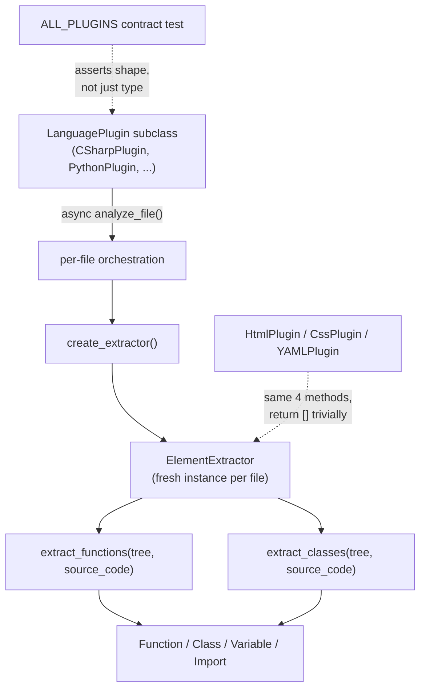

# LanguagePlugin & ElementExtractor — the four-method contract every language plugin implements

## Overview
[`LanguagePlugin`](../catalog/tree_sitter_analyzer/plugins/base.md#LanguagePlugin) and
[`ElementExtractor`](../catalog/tree_sitter_analyzer/plugins/base.md#ElementExtractor) are the two
abstract base classes that every one of TSA's 21+ concrete language implementations subclasses, and
they are deliberately narrow: four abstract methods total split across the two classes. `LanguagePlugin`
is the per-language *identity and factory* — one long-lived instance per language, handed out by
[`get_plugin`](../catalog/tree_sitter_analyzer/plugins/manager.md#PluginManager.get_plugin)
(see the sibling page) — while `ElementExtractor` is the per-*file* workhorse it manufactures fresh via
[`create_extractor`](../catalog/tree_sitter_analyzer/plugins/base.md#LanguagePlugin.create_extractor),
responsible for walking one already-parsed tree and returning
[`Function`](../catalog/tree_sitter_analyzer/models/base.md#Function)/
[`Class`](../catalog/tree_sitter_analyzer/models/base.md#Class)/
[`Variable`](../catalog/tree_sitter_analyzer/models/base.md#Variable)/
[`Import`](../catalog/tree_sitter_analyzer/models/base.md#Import) objects. Because the contract is this
small, a plugin that has almost no traditional "functions and classes" — [`HtmlPlugin`](../catalog/tree_sitter_analyzer/languages/html_plugin.md#HtmlPlugin),
[`CssPlugin`](../catalog/tree_sitter_analyzer/languages/css_plugin.md#CssPlugin),
[`YAMLPlugin`](../catalog/tree_sitter_analyzer/languages/yaml_plugin.md#YAMLPlugin) — can still satisfy
it trivially, which is the concrete mechanism behind TSA's "one grounding substrate, many languages"
claim: the substrate is tree-sitter parse trees plus this narrow hand-written extraction seam, not a
shared resolver or symbol database.

## Diagram

## Design rationale (why it's built this way)

**Two ABCs split by lifetime, not by responsibility alone.** A plugin instance is cheap and long-lived
(one [`CSharpPlugin`](../catalog/tree_sitter_analyzer/languages/csharp_plugin.md#CSharpPlugin) per
process, reused by every file in that language), but an extractor has to hold *per-file* mutable state —
reading `ElementExtractor`'s own `__init__` shows it stashes `current_file` and `platform_info` on every
instance. If `LanguagePlugin` itself carried that state instead of manufacturing a fresh
`ElementExtractor` per call, two files analyzed back-to-back (or concurrently — see Dynamics) would
clobber each other's `current_file`. Splitting the ABCs is what lets `PluginManager` cache one
`LanguagePlugin` per language forever while still giving every file an isolated extractor.

**The floor is exactly four methods, deliberately smaller than what most languages need.**
[`extract_functions`](../catalog/tree_sitter_analyzer/plugins/base.md#ElementExtractor.extract_functions)
and [`extract_classes`](../catalog/tree_sitter_analyzer/plugins/base.md#ElementExtractor.extract_classes)
are `@abstractmethod`, alongside `extract_variables` and `extract_imports` (same file, same shape, not
independently indexed in this packet). Everything else a real extractor might need —
`extract_packages`, `extract_annotations`, `extract_expressions`, `extract_exports`,
`extract_html_elements`, `extract_css_rules` — is a concrete method on `ElementExtractor` that just
`return[]`s by default. The four that are mandatory are exactly the four concepts common enough across
programming languages that *not* implementing them would be a bug; everything else is opt-in because
it's genuinely language-family-specific (packages exist for Java/Rust/Kotlin, not Python; HTML/CSS
elements exist only for markup).

**Markup and structural formats satisfy the same four methods by returning `[]`.**
[`HtmlPlugin`](../catalog/tree_sitter_analyzer/languages/html_plugin.md#HtmlPlugin) and
[`CssPlugin`](../catalog/tree_sitter_analyzer/languages/css_plugin.md#CssPlugin) don't relax
`extract_functions`/`extract_classes` — their extractors still define both, each simply returning an
empty list (confirmed by reading `html_plugin.py`'s extractor: "HTML doesn't have functions, return
empty list"). Their real content flows through the optional `extract_html_elements`/`extract_css_rules`
hooks instead. This is the load-bearing consequence of making the abstract floor *uniform* rather than
per-language-family: a caller holding any `ElementExtractor` can call all four core methods without a
`hasattr` check, at the cost of every markup plugin carrying a few no-op overrides.

**`analyze_file` is the one `async` seam, and every plugin re-implements its body independently.**
Unlike `create_extractor`'s optional siblings, `LanguagePlugin` gives `analyze_file` no default body at
all — every concrete plugin (compare
[`analyze_file`](../catalog/tree_sitter_analyzer/languages/csharp_plugin.md#CSharpPlugin.analyze_file),
[`analyze_file`](../catalog/tree_sitter_analyzer/languages/rust_plugin.md#RustPlugin.analyze_file),
and [`analyze_file`](../catalog/tree_sitter_analyzer/languages/typescript_plugin/plugin.md#TypeScriptPlugin.analyze_file))
writes its own "call `create_extractor`, call the four `extract_*` methods, wrap into an
`AnalysisResult`, catch and log any failure" sequence from scratch rather than inheriting a template
method.
> [!inferred]
> Making only this one method `async` — while `create_extractor` and every `extract_*` method stay
> synchronous — matches an I/O-bound-outer / CPU-bound-inner split: `analyze_file` is the boundary where
> a caller can run many files concurrently (TSA's MCP tools batch multiple files with
> `asyncio.gather`/`asyncio.Semaphore` elsewhere in the codebase), while walking a single already-parsed
> `tree_sitter.Tree` is pure recursive computation that gains nothing from `await` points and would only
> pay their overhead.

**One `Function`/`Class`/`Variable`/`Import` dataclass, not 21 per-language subtypes.** Reading
[`Function`](../catalog/tree_sitter_analyzer/models/base.md#Function) directly shows fields like
`is_suspend` (`# Kotlin`), `receiver`/`receiver_type` (`# Go`), and `is_constructor` (`# Java`) all living
on the *same* dataclass alongside generic fields like
[`return_type`](../catalog/tree_sitter_analyzer/models/base.md#Function.return_type) and
[`complexity_score`](../catalog/tree_sitter_analyzer/models/base.md#Function.complexity_score) — every
`extract_functions` override across every language, however it organizes its own internals (a single
class for [`RustElementExtractor`](../catalog/tree_sitter_analyzer/languages/rust_plugin.md#RustElementExtractor)
and [`JavaElementExtractor`](../catalog/tree_sitter_analyzer/languages/java_plugin.md#JavaElementExtractor);
composed mixins for [`PythonElementExtractor`](../catalog/tree_sitter_analyzer/languages/python_plugin/extractor.md#PythonElementExtractor)
and [`MarkdownElementExtractor`](../catalog/tree_sitter_analyzer/languages/markdown_plugin/extractor.md#MarkdownElementExtractor))
must funnel its results into this one wide, sparse shape rather than a per-language subtype. That is
what lets any downstream consumer (formatter, MCP tool, complexity heatmap) pattern-match on `Function`
once instead of dispatching on 21 language-specific types — the price is a dataclass where most fields
are `None`/default for any given language.

**The ABC enforces *shape*, a parametrized test enforces *value*.** Python's `abstractmethod` only
guarantees a subclass overrides a method — it says nothing about what a sane `get_language_name()` or
`create_extractor()` has to return. That behavioral half of the contract lives in the
[`ALL_PLUGINS`](../catalog/tests/unit/languages/test_plugin_base_contract.md#ALL_PLUGINS.ALL_PLUGINS)
parametrized suite (its own module docstring: "Covers every non-abstract method of `LanguagePlugin` (10
contracts × 21 plugins = 210 cases)") — it is what actually asserts `create_extractor()` returns
something `isinstance`-checked against `ElementExtractor`, that `get_language_name()` isn't blank, and
that every extension starts with `.`. Reading `LanguagePlugin`'s ABC alone would not tell you these
invariants hold; the test suite is the second half of the contract.

**Soft dependencies are guarded per module, not centrally.** Three independent
`TREE_SITTER_AVAILABLE` flags appear in this packet's subgraph —
[one in the TypeScript extractor](../catalog/tree_sitter_analyzer/languages/typescript_plugin/extractor.md#TREE_SITTER_AVAILABLE),
[one in the SQL extractor](../catalog/tree_sitter_analyzer/languages/sql_plugin/extractor.md#TREE_SITTER_AVAILABLE),
[one in the C# plugin](../catalog/tree_sitter_analyzer/languages/csharp_plugin.md#TREE_SITTER_AVAILABLE)
— each set by its own module's `try: import tree_sitter / except ImportError` rather than one shared
flag. That redundancy is the point: it lets each of the 21 plugin modules be imported and its
`TREE_SITTER_AVAILABLE` patched independently in tests, without one language's missing native grammar
binding taking down every other plugin module's importability.

## Entry points
- [`LanguagePlugin`](../catalog/tree_sitter_analyzer/plugins/base.md#LanguagePlugin) — the abstract type
  every caller (CLI, MCP tools, `PluginManager`) actually holds a reference to; concrete instances like
  [`CSharpPlugin`](../catalog/tree_sitter_analyzer/languages/csharp_plugin.md#CSharpPlugin) are what
  `get_plugin` hands back.
- [`create_extractor`](../catalog/tree_sitter_analyzer/plugins/base.md#LanguagePlugin.create_extractor) —
  the one call every plugin's `analyze_file` makes to obtain a fresh, file-scoped
  [`ElementExtractor`](../catalog/tree_sitter_analyzer/plugins/base.md#ElementExtractor); overridden
  concretely by, e.g.,
  [`create_extractor`](../catalog/tree_sitter_analyzer/languages/html_plugin.md#HtmlPlugin.create_extractor)
  and [`create_extractor`](../catalog/tree_sitter_analyzer/languages/ruby_plugin.md#RubyPlugin.create_extractor).
- [`extract_functions`](../catalog/tree_sitter_analyzer/plugins/base.md#ElementExtractor.extract_functions) /
  [`extract_classes`](../catalog/tree_sitter_analyzer/plugins/base.md#ElementExtractor.extract_classes) —
  called against a `tree_sitter.Tree` once one exists; overridden e.g. by
  [`extract_functions`](../catalog/tree_sitter_analyzer/languages/csharp_plugin.md#CSharpElementExtractor.extract_functions)
  and [`extract_classes`](../catalog/tree_sitter_analyzer/languages/csharp_plugin.md#CSharpElementExtractor.extract_classes).
- [`analyze_file`](../catalog/tree_sitter_analyzer/languages/rust_plugin.md#RustPlugin.analyze_file) —
  one concrete instance of the abstract, `async`, no-default-body `analyze_file` every plugin
  independently implements (see the parallel overrides cited in Mechanism step 5).

## Mechanism (step-by-step)
1. **A plugin is a `LanguagePlugin` subclass constructed once and reused.** Reading
   [`CSharpPlugin`](../catalog/tree_sitter_analyzer/languages/csharp_plugin.md#CSharpPlugin)'s own
   `__init__` shows it caches a `CSharpElementExtractor` instance, a language string, and a
   `_cached_language` slot — all *plugin*-scoped state, set up once. `LanguagePlugin` itself declares no
   `__init__`, so this state is entirely each subclass's choice; the ABC only commits to the four
   method signatures.
2. **`create_extractor` manufactures a new, file-scoped `ElementExtractor` on demand.** Because
   [`create_extractor`](../catalog/tree_sitter_analyzer/plugins/base.md#LanguagePlugin.create_extractor)
   is called fresh rather than returning a cached extractor, each file gets its own `current_file` /
   `platform_info` (set in `ElementExtractor.__init__`) with no risk of one file's state leaking into
   the next — concrete overrides like
   [`create_extractor`](../catalog/tree_sitter_analyzer/languages/css_plugin.md#CssPlugin.create_extractor)
   and [`create_extractor`](../catalog/tree_sitter_analyzer/languages/php_plugin.md#PHPPlugin.create_extractor)
   are all one-line `return SomeExtractor()` calls for exactly this reason.
3. **The four abstract extraction primitives run against an already-parsed tree.** Every extractor,
   whatever its internal organization —
   [`PythonElementExtractor`](../catalog/tree_sitter_analyzer/languages/python_plugin/extractor.md#PythonElementExtractor)
   composes four language-specific mixins plus a core mixin, while
   [`RustElementExtractor`](../catalog/tree_sitter_analyzer/languages/rust_plugin.md#RustElementExtractor)
   and [`ScalaElementExtractor`](../catalog/tree_sitter_analyzer/languages/scala_plugin.md#ScalaElementExtractor)
   are flat single classes — must answer
   [`extract_functions`](../catalog/tree_sitter_analyzer/plugins/base.md#ElementExtractor.extract_functions)
   and [`extract_classes`](../catalog/tree_sitter_analyzer/plugins/base.md#ElementExtractor.extract_classes)
   (plus the two sibling abstract methods) given only a `tree_sitter.Tree` and the raw source string —
   the base class defines the *question*, never the *how*, leaving grammar-specific node-type knowledge
   entirely inside each extractor.
4. **Markup extractors answer the same four questions with empty lists.**
   [`HtmlPlugin`](../catalog/tree_sitter_analyzer/languages/html_plugin.md#HtmlPlugin) and
   [`CssPlugin`](../catalog/tree_sitter_analyzer/languages/css_plugin.md#CssPlugin) still implement
   [`extract_functions`](../catalog/tree_sitter_analyzer/plugins/base.md#ElementExtractor.extract_functions)/
   [`extract_classes`](../catalog/tree_sitter_analyzer/plugins/base.md#ElementExtractor.extract_classes) —
   both extractors' overrides are one-line `return []`s with a comment explaining why — and route their
   actual content through the markup-only `extract_html_elements`/`extract_css_rules` hooks that default
   to `[]` for every other language.
5. **`analyze_file` is where every plugin writes its own orchestration, independently.** Nine of this
   packet's cited overrides —
   [`analyze_file`](../catalog/tree_sitter_analyzer/languages/rust_plugin.md#RustPlugin.analyze_file),
   [`analyze_file`](../catalog/tree_sitter_analyzer/languages/go_plugin.md#GoPlugin.analyze_file),
   [`analyze_file`](../catalog/tree_sitter_analyzer/languages/c_plugin.md#CPlugin.analyze_file),
   [`analyze_file`](../catalog/tree_sitter_analyzer/languages/cpp_plugin.md#CppPlugin.analyze_file),
   [`analyze_file`](../catalog/tree_sitter_analyzer/languages/swift_plugin.md#SwiftPlugin.analyze_file),
   [`analyze_file`](../catalog/tree_sitter_analyzer/languages/typescript_plugin/plugin.md#TypeScriptPlugin.analyze_file),
   [`analyze_file`](../catalog/tree_sitter_analyzer/languages/kotlin_plugin.md#KotlinPlugin.analyze_file),
   [`analyze_file`](../catalog/tree_sitter_analyzer/languages/csharp_plugin.md#CSharpPlugin.analyze_file),
   and [`analyze_file`](../catalog/tree_sitter_analyzer/languages/ruby_plugin.md#RubyPlugin.analyze_file)
   — all share the same signature (`async def analyze_file(self, file_path, request) -> AnalysisResult`)
   but each is its own independent body calling `create_extractor` then the `extract_*` methods, because
   the abstract method carries no default implementation for the base class to share.
6. **The parametrized contract test is what actually pins down "sane," not the ABC.** The
   [`ALL_PLUGINS`](../catalog/tests/unit/languages/test_plugin_base_contract.md#ALL_PLUGINS.ALL_PLUGINS)
   list drives 10 invariants against every plugin — `create_extractor()` must `isinstance`-check as
   `ElementExtractor`, extensions must start with `.`, `get_language_name()` must be non-blank — turning
   "the subclass overrides these methods" (all Python's ABC machinery guarantees) into "the subclass's
   overrides behave the way every other caller in the codebase assumes."

## Key data structures
- [`CodeElement`](../catalog/tree_sitter_analyzer/models/base.md#CodeElement) — the shared base every
  extracted element inherits: [`name`](../catalog/tree_sitter_analyzer/models/base.md#CodeElement.name),
  [`start_line`](../catalog/tree_sitter_analyzer/models/base.md#CodeElement.start_line),
  [`end_line`](../catalog/tree_sitter_analyzer/models/base.md#CodeElement.end_line),
  [`language`](../catalog/tree_sitter_analyzer/models/base.md#CodeElement.language), and
  [`raw_text`](../catalog/tree_sitter_analyzer/models/base.md#CodeElement.raw_text). Its own subgraph
  `(virtual)` edges point to [`Function`](../catalog/tree_sitter_analyzer/models/base.md#Function),
  [`Class`](../catalog/tree_sitter_analyzer/models/base.md#Class),
  [`Variable`](../catalog/tree_sitter_analyzer/models/base.md#Variable),
  [`Import`](../catalog/tree_sitter_analyzer/models/base.md#Import), and also
  [`MarkupElement`](../catalog/tree_sitter_analyzer/models/markup_models.md#MarkupElement) and
  [`MarkdownElement`](../catalog/tree_sitter_analyzer/languages/markdown_plugin/elements.md#MarkdownElement)
  — the same base reaches beyond conventional "code" into markup/documentation elements too.
- [`Function`](../catalog/tree_sitter_analyzer/models/base.md#Function) /
  [`Class`](../catalog/tree_sitter_analyzer/models/base.md#Class) — one shared dataclass per element
  kind, not one per language; language-specific fields (
  [`return_type`](../catalog/tree_sitter_analyzer/models/base.md#Function.return_type),
  [`complexity_score`](../catalog/tree_sitter_analyzer/models/base.md#Function.complexity_score), plus
  `receiver_type`/`is_suspend`/`is_constructor` visible on reading the dataclass directly) all coexist on
  the one type.
- `ElementExtractor.current_file` / `ElementExtractor.platform_info` — the only state the base class
  itself declares (in `__init__`), set fresh by every `create_extractor()` call; everything else a
  concrete extractor needs is its own subclass's problem.
- `ElementExtractor`'s six default-`[]` methods (`extract_packages`, `extract_annotations`,
  `extract_expressions`, `extract_exports`, `extract_html_elements`, `extract_css_rules`) — the opt-in
  half of the contract; a plugin only overrides the ones relevant to its language family.

## Dynamics (design intent)
Nothing inside the extraction path itself is `async` —
[`extract_functions`](../catalog/tree_sitter_analyzer/plugins/base.md#ElementExtractor.extract_functions),
[`extract_classes`](../catalog/tree_sitter_analyzer/plugins/base.md#ElementExtractor.extract_classes), and
[`create_extractor`](../catalog/tree_sitter_analyzer/plugins/base.md#LanguagePlugin.create_extractor) are
all plain synchronous calls; only `analyze_file` crosses the `async` boundary (see the nine cited
overrides in Mechanism step 5). Reading `DefaultLanguagePlugin.analyze_file` in `base.py` shows the same
pattern the concrete plugins repeat: a broad `try/except` around the whole per-file body that logs via
[`log_error`](../catalog/tree_sitter_analyzer/utils/logging.md#log_error) and returns a failed
`AnalysisResult` rather than propagating — a single bad file degrades to an error result for that file,
not a crash for the batch.
> [!inferred]
> The synchronous extraction methods are called from inside each plugin's own `async analyze_file`, so
> the tree-walk itself blocks the event loop for that file — the concurrency the `async` signature buys
> is *across* files (many `analyze_file` coroutines interleaved by a caller), not *within* one file's
> extraction.

## Edge cases
- **HTML/CSS/YAML extractors return `[]` for all four abstract methods**, so a caller that calls
  `extract_functions`/`extract_classes` on an
  [`HtmlPlugin`](../catalog/tree_sitter_analyzer/languages/html_plugin.md#HtmlPlugin) or
  [`CssPlugin`](../catalog/tree_sitter_analyzer/languages/css_plugin.md#CssPlugin) extractor without also
  checking the markup-specific hooks will silently see an empty result, not an error — there is no
  signal on the `ElementExtractor` interface that distinguishes "genuinely no functions in this file"
  from "this language doesn't have functions."
- **`get_tree_sitter_language`'s default return of `None` is a lazy failure, not an immediate one.** The
  base method's own comment says returning `None` makes "subclasses which forget to override … fail
  loudly at parse time" — but the failure happens wherever the caller tries to use that `None` as a
  `tree_sitter.Language` (e.g. downstream in a parser), not at the point `get_tree_sitter_language()` is
  called itself. [`HtmlPlugin`](../catalog/tree_sitter_analyzer/languages/html_plugin.md#HtmlPlugin) is
  one of the concrete overrides that actually returns a real `tree_sitter.Language`.
- **A one-line `create_extractor` override is easy to get structurally right and behaviorally wrong.**
  Nothing in `LanguagePlugin`'s ABC checks that the returned extractor's `extract_*` methods actually do
  anything sensible for that language — only the
  [`ALL_PLUGINS`](../catalog/tests/unit/languages/test_plugin_base_contract.md#ALL_PLUGINS.ALL_PLUGINS)
  contract test's `isinstance` and shape assertions catch a wrong-type or malformed return early;
  wrong-but-well-typed extraction results are not caught by this contract at all.

## Open questions
- `ElementExtractor.set_file_encoding`'s docstring says byte-level slicing is "currently" only needed by
  C and Java's extractors — this packet doesn't let us verify whether that is still exhaustive or has
  drifted as more extractors gained encoding-sensitive logic.
- Whether any caller actually depends on the base `get_supported_element_types` default
  (`["function", "class", "variable", "import"]`) for a plugin that never overrides it — none of this
  packet's cited plugins showed such a dependency directly.
- The precedence between `LanguagePlugin`'s complete absence of `__init__`/shared state and
  `ElementExtractor`'s explicit per-instance `current_file`/`platform_info` fields looks like a
  deliberate asymmetry (plugin = stateless-by-convention, extractor = stateful-by-declaration), but
  nothing in this subgraph states that design goal explicitly — it is read off the two classes'
  observed shapes, not confirmed by a comment.

## See also
- [`tree_sitter_analyzer-plugins-manager.md`](tree_sitter_analyzer-plugins-manager.md) — the
  `PluginManager` registry that discovers, caches, and hands out instances of the `LanguagePlugin`
  contract documented here.
- [`tree_sitter_analyzer-languages-csharp_plugin.md`](tree_sitter_analyzer-languages-csharp_plugin.md),
  [`tree_sitter_analyzer-languages-scala_plugin.md`](tree_sitter_analyzer-languages-scala_plugin.md) —
  two concrete implementations of this contract, documented in their own packets.
- Cross-repo: [multi-language-extraction](../../../concepts/multi-language-extraction.md).
