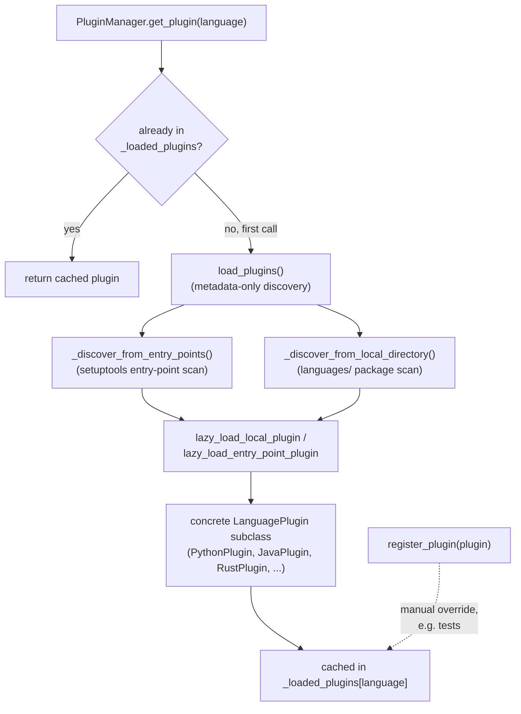

# PluginManager — the per-language plugin registry behind the 13(+)-language claim

## Overview
[`PluginManager`](../catalog/tree_sitter_analyzer/plugins/manager.md#PluginManager) is where TSA's
"one grounding mechanism, many languages" claim actually cashes out: it is a lazy, two-source plugin
registry (setuptools entry points *and* a local `languages/` directory) that hands out
[`LanguagePlugin`](../catalog/tree_sitter_analyzer/plugins/base.md#LanguagePlugin) instances by
language name, loading each plugin's actual code only on first real use. Every one of the concrete
per-language plugins this packet's subgraph names —
[`PythonPlugin`](../catalog/tree_sitter_analyzer/languages/python_plugin/plugin.md#PythonPlugin),
[`JavaPlugin`](../catalog/tree_sitter_analyzer/languages/java_plugin.md#JavaPlugin),
[`JavaScriptPlugin`](../catalog/tree_sitter_analyzer/languages/javascript_plugin/plugin.md#JavaScriptPlugin),
[`TypeScriptPlugin`](../catalog/tree_sitter_analyzer/languages/typescript_plugin/plugin.md#TypeScriptPlugin),
[`RustPlugin`](../catalog/tree_sitter_analyzer/languages/rust_plugin.md#RustPlugin),
[`CSharpPlugin`](../catalog/tree_sitter_analyzer/languages/csharp_plugin.md#CSharpPlugin),
[`PHPPlugin`](../catalog/tree_sitter_analyzer/languages/php_plugin.md#PHPPlugin),
[`RubyPlugin`](../catalog/tree_sitter_analyzer/languages/ruby_plugin.md#RubyPlugin),
[`SwiftPlugin`](../catalog/tree_sitter_analyzer/languages/swift_plugin.md#SwiftPlugin),
[`SQLPlugin`](../catalog/tree_sitter_analyzer/languages/sql_plugin/plugin.md#SQLPlugin),
[`HtmlPlugin`](../catalog/tree_sitter_analyzer/languages/html_plugin.md#HtmlPlugin),
[`CssPlugin`](../catalog/tree_sitter_analyzer/languages/css_plugin.md#CssPlugin),
[`YAMLPlugin`](../catalog/tree_sitter_analyzer/languages/yaml_plugin.md#YAMLPlugin) — is a subclass of
the same abstract `LanguagePlugin`, recovered here as a `(virtual)` dynamic-dispatch edge by
class-hierarchy analysis rather than a static call. This is the "one interface, N implementations"
seam the [call graph](tree_sitter_analyzer-call_graph.md) and
[core parser](tree_sitter_analyzer-core-parser.md) pages assume exists but don't themselves define.

## Diagram

## Design rationale (why it's built this way)
**Discovery is metadata-only; loading is lazy.**
[`load_plugins`](../catalog/tree_sitter_analyzer/plugins/manager.md#PluginManager.load_plugins)'s own
docstring says it plainly: *"Discover available plugins without fully loading them for
performance. They will be lazily loaded in `get_plugin()`."* The discovery pass only scans entry-point
metadata and the local `languages/` directory layout — it does not import a single plugin module.
Only [`get_plugin`](../catalog/tree_sitter_analyzer/plugins/manager.md#PluginManager.get_plugin),
called with a *specific* language, triggers the actual import and instantiation for that one language.
Combined with `LanguageLoader`'s equally lazy grammar loading (see
[core-parser](tree_sitter_analyzer-core-parser.md)), this means analyzing a Python-only repository
never imports the Swift, Kotlin, or Scala grammar/plugin code at all — the "13(+)-language support"
claim does not cost anything for a project that only uses one of them.

**Two independent discovery sources, one registry.** A plugin can arrive via a setuptools entry
point (`self._entry_point_group = "tree_sitter_analyzer.plugins"` — an external, installable
extension point for third-party language support) *or* via TSA's own bundled `languages/` package.
`get_plugin` tries the local-module path first, then the entry-point path, then falls back to a
case-insensitive lookup among whatever is already loaded — a plugin discovered through either
channel ends up in the same `_loaded_plugins` dict and is indistinguishable to every caller
afterward. This is the concrete mechanism that keeps "add a language" additive: a new language plugin
is either a new file under `languages/` or a separately-installed package, never a change to
`PluginManager` itself.

**`register_plugin` is an escape hatch, not the common path.** Tests (e.g.
`test_end_to_end_typescript_workflow`) construct a plugin directly and
[`register_plugin`](../catalog/tree_sitter_analyzer/plugins/manager.md#PluginManager.register_plugin)
it manually, bypassing discovery entirely — useful for isolating a single plugin's behavior or
injecting a mock (`MockLanguagePlugin`/`MockPlugin` both appear in this packet's subgraph as
`LanguagePlugin` subclasses used exactly this way) without paying for the full discovery scan.

> [!inferred]
> This packet's subgraph alone lists 22 concrete `(virtual)` `LanguagePlugin` subclasses — 19 real
> per-language implementations (Bash, C, C++, C#, CSS, HTML, Java, JavaScript, Kotlin, Markdown, PHP,
> Python, Ruby, Rust, Scala, SQL, Swift, TypeScript, YAML), one `DefaultLanguagePlugin` fallback, and
> two test mocks. This is a *broader* set than the README's "13 languages" figure for the
> family-gated call graph — the plugin registry also covers structural/markup formats (HTML, CSS,
> YAML, Markdown, SQL) that are parsed and queried but are not part of the call-graph's classified
> cross-language resolution cascade. The two numbers answer different questions: "how many languages
> can `PluginManager` hand you a structural extractor for" vs. "how many languages does the call-graph
> resolver classify with its own gated resolution tier."

## Entry points
- [`PluginManager.get_plugin`](../catalog/tree_sitter_analyzer/plugins/manager.md#PluginManager.get_plugin) —
  the only path any caller needs; handles discovery-on-first-use internally.
- [`PluginManager.load_plugins`](../catalog/tree_sitter_analyzer/plugins/manager.md#PluginManager.load_plugins) —
  called explicitly by callers that want the full discovered set up front, e.g.
  [`is_language_supported`](../catalog/tree_sitter_analyzer/language_detector.md#is_language_supported).
- [`PluginManager.register_plugin`](../catalog/tree_sitter_analyzer/plugins/manager.md#PluginManager.register_plugin) —
  manual injection path used by tests and any caller with a pre-built plugin instance.
- [`LanguagePlugin.get_language_name`](../catalog/tree_sitter_analyzer/plugins/base.md#LanguagePlugin.get_language_name) —
  the abstract contract every plugin implements; `register_plugin` calls it to key the registry.

## Mechanism (step-by-step)
1. **First `get_plugin` call triggers one-time discovery.** If `self._discovered` is `False`,
   [`get_plugin`](../catalog/tree_sitter_analyzer/plugins/manager.md#PluginManager.get_plugin) calls
   [`load_plugins`](../catalog/tree_sitter_analyzer/plugins/manager.md#PluginManager.load_plugins),
   which scans both discovery sources and sets `_discovered = True` — every subsequent call, for any
   language, skips straight past this step.
2. **Resolution tries local-module lazy-load first.**
   [`get_plugin`](../catalog/tree_sitter_analyzer/plugins/manager.md#PluginManager.get_plugin) looks
   up `plugin_module_for_language` for the requested language and attempts a lazy import of that
   specific module — not the whole `languages/` package — via `lazy_load_local_plugin`.
3. **Entry-point plugins are the second tier**, tried only if the local lookup inside
   [`get_plugin`](../catalog/tree_sitter_analyzer/plugins/manager.md#PluginManager.get_plugin) fails —
   `lazy_load_entry_point_plugin` walks the previously-discovered entry-point metadata and imports the
   one matching module.
4. **A final case-insensitive fallback** (`find_loaded_plugin_case_insensitive`, also inside
   [`get_plugin`](../catalog/tree_sitter_analyzer/plugins/manager.md#PluginManager.get_plugin))
   catches a language name that differs only in case from what's already loaded, rather than
   triggering a redundant reload.
5. **Every concrete plugin fulfills the same four-method
   [`LanguagePlugin`](../catalog/tree_sitter_analyzer/plugins/base.md#LanguagePlugin) contract** —
   `get_language_name`, `get_file_extensions`, `create_extractor`, and the async `analyze_file` — so
   any caller holding a `LanguagePlugin` reference (the query service's
   `_execute_plugin_query`, the complexity heatmap's `_extract_functions_via_plugin`, the grammar
   coverage validator) can treat all 19+ languages uniformly through one interface, with the actual
   per-language tree-sitter node-type knowledge fully encapsulated inside each plugin's extractor.
6. **[`register_plugin`](../catalog/tree_sitter_analyzer/plugins/manager.md#PluginManager.register_plugin)
   replaces, it does not merge** — registering a plugin for a language that already has one logs a
   warning and overwrites the existing entry in `_loaded_plugins`, a deliberate "last write wins"
   semantics useful for test isolation.

## Key data structures
- **`PluginManager._loaded_plugins`** — `dict[str, LanguagePlugin]`, the single source of truth for
  "what plugin backs this language right now"; every discovery/registration path writes into it, and
  `get_plugin`/`get_supported_languages` both read from it.
- **`PluginManager._plugin_modules`** — `dict[str, str]` mapping language name to its local module
  name, populated by `_discover_from_local_directory` without importing anything.
- **`PluginManager._entry_point_group`** — the fixed string `"tree_sitter_analyzer.plugins"`, the
  setuptools entry-point namespace third-party packages register into.
- **`LanguagePlugin`** (ABC) — the four-method contract (`get_language_name`,
  `get_file_extensions`, `create_extractor`, `analyze_file`) every language implementation commits to.

## Dynamics (design intent)
Discovery (`load_plugins`) is idempotent and guarded by `self._discovered` — safe to call repeatedly
from multiple call sites (`is_language_supported`, `get_supported_languages`, `get_plugin` itself all
call it) without repeating the entry-point/directory scan. There's no async here despite
`LanguagePlugin.analyze_file` being `async` — the manager's own methods (`get_plugin`, `load_plugins`,
`register_plugin`) are synchronous; only the plugin's own analysis work is async, per-plugin.

## Edge cases
- **A plugin registered manually for a language that discovery would also find** silently wins
  (`register_plugin` overwrites `_loaded_plugins[language]` unconditionally after logging a warning) —
  useful for test doubles, but means a manual registration always shadows the "real" discovered
  plugin for the rest of that `PluginManager`'s lifetime.
- **`register_plugin` swallows a broken `get_language_name`** — if the plugin instance raises when
  asked for its language name, registration fails cleanly (`log_error` + `return False`) rather than
  propagating the exception.
- **Case sensitivity is normalized once, at lookup, not at storage** — `get_plugin` lowercases the
  requested language before every lookup tier, but the final fallback still has to do a
  case-insensitive scan for anything stored under an unnormalized key (e.g. via `register_plugin`,
  which keys directly on whatever `get_language_name()` returns).

## Open questions
- The exact precedence rule when both a local module *and* an entry point exist for the same language
  is not resolvable from this packet's subgraph (both `lazy_load_local_plugin` and
  `lazy_load_entry_point_plugin` are called by `get_plugin`, in that order, but their internal
  matching logic is outside this packet).
- Whether `DefaultLanguagePlugin` (present in the subgraph as a `LanguagePlugin` subclass) is a
  genuine fallback plugin invoked for unrecognized-but-parseable languages, or purely a test/scaffold
  class, isn't settled by this packet alone.

## See also
- [`tree_sitter_analyzer-core-parser`](tree_sitter_analyzer-core-parser.md) — the tree-sitter grammar
  loader this plugin layer sits above; grammars and plugins are loaded independently but both lazily.
- [`tree_sitter_analyzer-call_graph`](tree_sitter_analyzer-call_graph.md) — the 13-language
  classified resolution cascade that is narrower than this registry's full language set.
- [`tree_sitter_analyzer-languages-csharp_plugin`](tree_sitter_analyzer-languages-csharp_plugin.md),
  [`tree_sitter_analyzer-languages-scala_plugin`](tree_sitter_analyzer-languages-scala_plugin.md) —
  two concrete plugin implementations documented in their own packets.
- Cross-repo: [multi-language-extraction](../../../concepts/multi-language-extraction.md).
