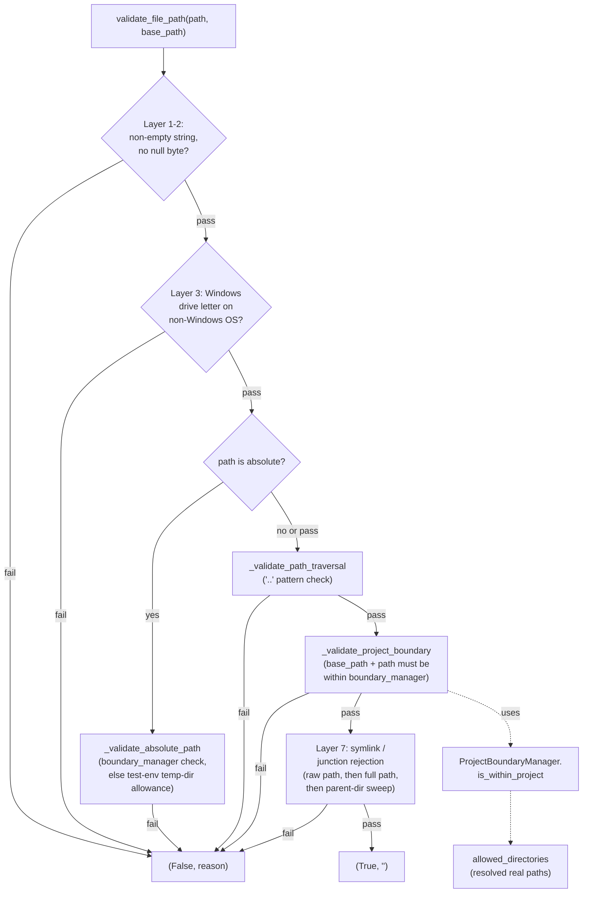

# SecurityValidator — the seven-layer choke point every file path passes through

## Overview
[`SecurityValidator`](../catalog/tree_sitter_analyzer/security/validator.md#SecurityValidator) is the
single object every CLI command and MCP tool is expected to funnel a caller-supplied path through before
touching disk — its own docstring calls it a "unified security validation framework." The design is
defense-in-depth rather than one clever check: [`validate_file_path`](../catalog/tree_sitter_analyzer/security/validator.md#SecurityValidator.validate_file_path)
runs seven independent layers (null bytes, Windows drive letters, absolute-path/boundary checks, `..`
traversal, project-boundary containment, symlink/junction rejection), each of which can veto the path on
its own, backed by a separate [`ProjectBoundaryManager`](../catalog/tree_sitter_analyzer/security/boundary_manager.md#ProjectBoundaryManager)
that does the actual "is this real, symlink-resolved path inside the project root" containment test. A
second, narrower method, [`sanitize_input`](../catalog/tree_sitter_analyzer/security/validator.md#SecurityValidator.sanitize_input),
handles the orthogonal problem of untrusted *string* arguments (query text, regex patterns) rather than
paths. Both are wired into the MCP surface at multiple layers — the server pre-checks `file_path`
arguments before a tool even runs, and each tool re-validates through a shared, cached choke point — so
the same validator instance is consulted repeatedly rather than trusted once.

## Diagram

## Design rationale (why it's built this way)
**Seven layers, each independently vetoing, on purpose.** The docstring on
[`validate_file_path`](../catalog/tree_sitter_analyzer/security/validator.md#SecurityValidator.validate_file_path)
explicitly frames a past refactor as preserving "all 7 layers (each name-tagged)" with "NO security
semantics changed — every check, every short-circuit, every log line is preserved." That note is itself
evidence of the design intent: this is meant to be a *stable, auditable* pipeline where a maintainer can
touch the code's shape (splitting the symlink layer into helper methods, for instance) without silently
weakening any one check. A single unified regex or a single `os.path.realpath` comparison would be
shorter, but it collapses seven independently-reasoned failure modes (null-byte injection, Windows
drive-letter smuggling, `..` traversal, boundary escape, symlink escape) into one piece of logic that is
harder to reason about layer-by-layer in review.

**Boundary containment strictly outranks the test-environment allowance.**
[`_validate_absolute_path`](../catalog/tree_sitter_analyzer/security/validator.md#SecurityValidator._validate_absolute_path)
checks `self.boundary_manager` *first*: if a project root was configured, an absolute path must satisfy
[`is_within_project`](../catalog/tree_sitter_analyzer/security/boundary_manager.md#ProjectBoundaryManager.is_within_project)
or it is rejected outright — the test-environment temp-directory allowance (letting `pytest`/CI runs
touch `/tmp`) is only ever consulted when `boundary_manager` is `None`. Read the other way: the
convenience path for tests exists *only* in the unconfigured case, so a real deployment that always
constructs `SecurityValidator(project_root)` never falls into the looser branch at all — the loosest
check is unreachable once a project root exists.

**`is_within_project` resolves the real path before containment, specifically to defeat symlinks.**
[`is_within_project`](../catalog/tree_sitter_analyzer/security/boundary_manager.md#ProjectBoundaryManager.is_within_project)
calls `Path(file_path).resolve()` before testing membership against
[`allowed_directories`](../catalog/tree_sitter_analyzer/security/boundary_manager.md#ProjectBoundaryManager.allowed_directories) —
a symlink inside the project that points outside it would otherwise pass a naive string-prefix check.
`allowed_directories` itself is seeded from `Path(project_root).resolve()` at construction (never the raw
string), so both sides of the comparison are canonicalized the same way; this is also why the class
docstring lists "Real path resolution for symlink protection" as a named feature rather than an
incidental detail.

**Layer 7 (symlinks/junctions) still runs a two-pass sweep even though only the boundary check (Layer 6)
looks at project membership.** Reading `_validate_symlinks_and_junctions` directly: it checks the *raw*
`file_path` for being a symlink, then separately checks the resolved `base_path`-joined full path, then
walks every parent directory for a Windows junction/reparse point. This layer is not gated by whether a
`boundary_manager` exists at all — it runs unconditionally — because a symlink can be a traversal vector
even in a boundary-less validator (e.g. one used only for the null-byte/traversal-pattern checks).

> [!inferred]
> `_validate_symlinks_and_junctions` and its Windows-specific junction-detection helpers
> (`_is_junction_or_reparse_point`, `_has_junction_in_path`) are not part of this packet's cited
> subgraph, so the two-pass-plus-parent-sweep description above is grounded in directly reading
> `tree_sitter_analyzer/security/validator.py` rather than in a citable symbol. Likewise, the
> test-environment allowance's specific triggers (`PYTEST_CURRENT_TEST`, `CI`, `GITHUB_ACTIONS` env vars,
> or a path under the system temp directory) come from reading `_check_test_environment_access` directly.

## Entry points
- [`resolve_and_validate_file_path`](../catalog/tree_sitter_analyzer/mcp/tools/base_tool.md#BaseMCPTool.resolve_and_validate_file_path) —
  the entry point every `BaseMCPTool` subclass is expected to call before touching `arguments["file_path"]`;
  wraps [`validate_file_path`](../catalog/tree_sitter_analyzer/security/validator.md#SecurityValidator.validate_file_path)
  with a shared cache keyed on `(file_path, project_root)`.
- [`_validate_file_path_security`](../catalog/tree_sitter_analyzer/mcp/server.md#TreeSitterAnalyzerMCPServer._validate_file_path_security) —
  a *second*, earlier choke point at the MCP server level that pre-checks `file_path` arguments before a
  tool call is even dispatched, going through the server's own
  [`security_validator`](../catalog/tree_sitter_analyzer/mcp/server.md#TreeSitterAnalyzerMCPServer.security_validator)
  instance and the same shared cache.
- [`execute`](../catalog/tree_sitter_analyzer/mcp/tools/universal_analyze_tool.md#UniversalAnalyzeTool.execute) /
  [`_execute_single_file`](../catalog/tree_sitter_analyzer/mcp/tools/analyze_scale_tool.md#AnalyzeScaleTool._execute_single_file) —
  concrete tool implementations that call `resolve_and_validate_file_path` *and*
  [`sanitize_input`](../catalog/tree_sitter_analyzer/security/validator.md#SecurityValidator.sanitize_input)
  before doing any real analysis work, showing the pattern repeated at every tool boundary rather than
  centralized once.
- [`set_project_path`](../catalog/tree_sitter_analyzer/mcp/server.md#TreeSitterAnalyzerMCPServer.set_project_path) —
  reached whenever the active project root changes; rebuilds `security_validator` from scratch and clears
  the shared validation cache, so no boundary decision from the old root can leak into the new one.
- [`detect_language`](../catalog/tree_sitter_analyzer/cli/commands/base_command.md#BaseCommand.detect_language) /
  [`_resolve_query`](../catalog/tree_sitter_analyzer/cli/commands/query_command.md#QueryCommand._resolve_query) —
  CLI-side callers of [`sanitize_input`](../catalog/tree_sitter_analyzer/security/validator.md#SecurityValidator.sanitize_input)
  for user-supplied language names and query text, independent of the MCP path-validation flow.

## Mechanism (step-by-step)
1. **The pipeline is a strict short-circuit chain wrapped in one broad `try/except`.**
   [`validate_file_path`](../catalog/tree_sitter_analyzer/security/validator.md#SecurityValidator.validate_file_path)
   returns `(False, reason)` the moment any layer fails, and — critically — the entire seven-layer body
   runs inside a single `except Exception` that converts *any* unexpected internal error into
   `(False, f"Validation error: {e}")` rather than propagating it. A caller that forgets to handle an
   exception from this method still cannot accidentally treat an internal bug as "path is safe."
2. **Absolute paths get their own dedicated branch, gated on whether a project root exists.**
   [`_validate_absolute_path`](../catalog/tree_sitter_analyzer/security/validator.md#SecurityValidator._validate_absolute_path)
   is only invoked when `Path(file_path).is_absolute()` — relative paths skip straight past it — and
   inside it, `self.boundary_manager` presence is the deciding branch: with a boundary manager, the check
   is exactly [`is_within_project`](../catalog/tree_sitter_analyzer/security/boundary_manager.md#ProjectBoundaryManager.is_within_project);
   without one, it falls through to the test-environment allowance described in Design rationale.
3. **Traversal detection works on the string form of a `Path`, not a filesystem call.**
   [`_validate_path_traversal`](../catalog/tree_sitter_analyzer/security/validator.md#SecurityValidator._validate_path_traversal)
   normalizes via `str(Path(file_path))` and then does plain substring/prefix matching for `../`, `..\`,
   and a leading `..` — it never touches the filesystem, so it catches traversal *syntax* even for a path
   that doesn't exist yet, ahead of the boundary and symlink layers that do resolve real paths.
4. **Project-boundary validation only fires when both a manager and a `base_path` were supplied, and it
   checks the *joined* path, not the raw one.**
   [`_validate_project_boundary`](../catalog/tree_sitter_analyzer/security/validator.md#SecurityValidator._validate_project_boundary)
   builds `Path(base_path) / normalized(file_path)` and hands that combined path to
   [`is_within_project`](../catalog/tree_sitter_analyzer/security/boundary_manager.md#ProjectBoundaryManager.is_within_project) —
   a relative `file_path` is meaningless on its own for a boundary check; it only becomes checkable once
   anchored at the caller-supplied base.
5. **`ProjectBoundaryManager` treats "within" as "resolves under any allowed directory," not just the
   root.** [`is_within_project`](../catalog/tree_sitter_analyzer/security/boundary_manager.md#ProjectBoundaryManager.is_within_project)
   iterates every entry in [`allowed_directories`](../catalog/tree_sitter_analyzer/security/boundary_manager.md#ProjectBoundaryManager.allowed_directories)
   (a `set[str]` seeded with the resolved project root, extensible via `add_allowed_directory`) and
   accepts the path if `Path(real_path).relative_to(Path(allowed_dir))` succeeds for *any* of them —
   membership in one allowed directory is sufficient, so a project can legitimately span more than one
   real root.
6. **`sanitize_input` is a strip-and-raise pair, not strip-only.**
   [`sanitize_input`](../catalog/tree_sitter_analyzer/security/validator.md#SecurityValidator.sanitize_input)
   raises [`SecurityError`](../catalog/tree_sitter_analyzer/_exceptions_security.md#SecurityError) outright
   for a non-string or an over-length input (both are treated as hard failures, not something to silently
   truncate), then only *for well-formed input* strips control characters, HTML tags, and angle-bracket/quote
   characters via regex substitution — a length violation and a content violation are handled with
   deliberately different severities (exception vs. silent rewrite).
7. **The MCP-facing entry point adds caching on top of the same validator, keyed on the pair that
   actually determines the answer.** [`resolve_and_validate_file_path`](../catalog/tree_sitter_analyzer/mcp/tools/base_tool.md#BaseMCPTool.resolve_and_validate_file_path)
   looks up `(file_path, project_root)` in a shared cache before calling
   [`validate_file_path`](../catalog/tree_sitter_analyzer/security/validator.md#SecurityValidator.validate_file_path)
   at all — repeating the identical check within the same project root, from a different tool instance,
   is a cache hit, confirmed by
   [`test_security_validation_is_cached_within_same_project_root`](../catalog/tests/unit/mcp/test_mcp_security_validation_cache.md#test_security_validation_is_cached_within_same_project_root).
8. **Rebinding the project root invalidates that cache and rebuilds the validator from nothing.**
   [`set_project_path`](../catalog/tree_sitter_analyzer/mcp/server.md#TreeSitterAnalyzerMCPServer.set_project_path)
   constructs a brand-new [`SecurityValidator`](../catalog/tree_sitter_analyzer/security/validator.md#SecurityValidator)
   for the new root and clears the shared cache, so a validation result computed against the *old*
   project boundary can never be served for the new one —
   [`test_cache_is_invalidated_on_project_root_change`](../catalog/tests/unit/mcp/test_mcp_security_validation_cache.md#test_cache_is_invalidated_on_project_root_change)
   pins exactly this.

## Key data structures
- **`SecurityValidator.boundary_manager`** — an `Optional[ProjectBoundaryManager]`; its mere presence (not
  just its contents) changes which branch several layers take, so "no project root configured" is a
  materially different security posture, not just an empty boundary set.
- **`ProjectBoundaryManager.allowed_directories`** — a `set[str]` of *resolved* real paths; the only state
  a containment check consults. Grows via `add_allowed_directory`, never shrinks.
- **The exception hierarchy** — [`SecurityError`](../catalog/tree_sitter_analyzer/_exceptions_security.md#SecurityError)
  and [`FileRestrictionError`](../catalog/tree_sitter_analyzer/_exceptions_security.md#FileRestrictionError)
  (a `SecurityError` subclass) sit under the shared
  [`TreeSitterAnalyzerError`](../catalog/tree_sitter_analyzer/_exceptions_core.md#TreeSitterAnalyzerError)
  base alongside sibling error families
  ([`AnalysisError`](../catalog/tree_sitter_analyzer/_exceptions_core.md#AnalysisError),
  [`MCPError`](../catalog/tree_sitter_analyzer/_exceptions_core.md#MCPError) →
  [`MCPToolError`](../catalog/tree_sitter_analyzer/_exceptions_mcp_types.md#MCPToolError),
  [`QueryError`](../catalog/tree_sitter_analyzer/_exceptions_core.md#QueryError),
  [`ValidationError`](../catalog/tree_sitter_analyzer/_exceptions_core.md#ValidationError) →
  [`MCPValidationError`](../catalog/tree_sitter_analyzer/_exceptions_mcp_types.md#MCPValidationError)) —
  a caller can catch `SecurityError` specifically without also swallowing an unrelated `QueryError`.
- **The two `security_validator` attributes** — one on
  [`BaseMCPTool`](../catalog/tree_sitter_analyzer/mcp/tools/base_tool.md#BaseMCPTool.security_validator)
  and one on [`TreeSitterAnalyzerMCPServer`](../catalog/tree_sitter_analyzer/mcp/server.md#TreeSitterAnalyzerMCPServer.security_validator) —
  are separate instances constructed independently from the same `project_root`, not a shared singleton;
  they agree only because both are rebuilt together whenever the project root changes.

## Dynamics (design intent)
Everything here is synchronous CPU-bound work (regex, path resolution, filesystem `stat` calls) — there
is no async path in this subsystem despite `execute` and `_execute_single_file` being `async` methods on
their callers. The only "concurrency-adjacent" behavior is the shared validation cache: it exists purely
to avoid re-running the identical seven-layer check when multiple tool instances validate the same
`(file_path, project_root)` pair in the same server session, and it is explicitly cleared — not merged or
partially invalidated — on any `set_project_path` call, favoring a correctness-over-hit-rate tradeoff on
project switches.

## Edge cases
- **An absolute path is not automatically rejected — its fate depends entirely on whether a project root
  was configured.** With `boundary_manager` set, `_validate_absolute_path` rejects anything outside it;
  without one, the same absolute path can be *allowed* if it happens to fall under a system temp directory
  or the process is detected as a test/CI run — a validator constructed with `project_root=None` is
  meaningfully more permissive for absolute paths than one constructed with a root.
- **`validate_file_path` never lets an internal exception look like anything other than "invalid path."**
  The outer `try/except Exception` means a bug in, say, the symlink-resolution logic surfaces as a
  rejection with a generic "Validation error: ..." message rather than crashing the caller — safe by
  default, but it also means a validator-internal bug could masquerade as a legitimate security rejection
  in logs.
- **`sanitize_input`'s length check and content check have different failure modes** — too-long input
  raises `SecurityError` (a hard stop the caller must handle), while dangerous *characters* within an
  acceptable length are silently stripped and merely logged via `log_warning` — a caller relying on
  sanitize_input to *reject* suspicious content rather than *rewrite* it would be surprised.
- **Containment is "in any allowed directory," which is a broader guarantee than "under the project
  root"** — once `add_allowed_directory` has been called, a path only needs to resolve under *one* of
  potentially several allowed roots, not specifically the original `project_root` string.

## Open questions
- Whether the test-environment absolute-path allowance (temp directories, `pytest`/`CI` environment
  markers) is ever reachable in a real MCP server deployment — since it only applies when
  `boundary_manager` is `None`, and production server construction always passes a `project_root` — isn't
  settled by this packet's subgraph; it reads as a deliberate test-only escape hatch, but the ordinary
  runtime path never seems to reach it once a project is configured.
- The precise interaction between the server-level pre-check
  ([`_validate_file_path_security`](../catalog/tree_sitter_analyzer/mcp/server.md#TreeSitterAnalyzerMCPServer._validate_file_path_security))
  and the tool-level check ([`resolve_and_validate_file_path`](../catalog/tree_sitter_analyzer/mcp/tools/base_tool.md#BaseMCPTool.resolve_and_validate_file_path)) —
  whether the server check is a strict superset, a fast-fail optimization, or can diverge for any
  argument shape — is not fully resolvable from this packet's cited subgraph alone.

## See also
- [`tree_sitter_analyzer-plugins-manager`](tree_sitter_analyzer-plugins-manager.md) — a different
  cross-cutting subsystem (plugin discovery) that, like this one, is consulted from every per-language
  code path rather than centralized in one call.
- [`tree_sitter_analyzer-graph-edge_store`](tree_sitter_analyzer-graph-edge_store.md) — the persisted
  graph this validator's path-safety guarantees ultimately protect access to.
