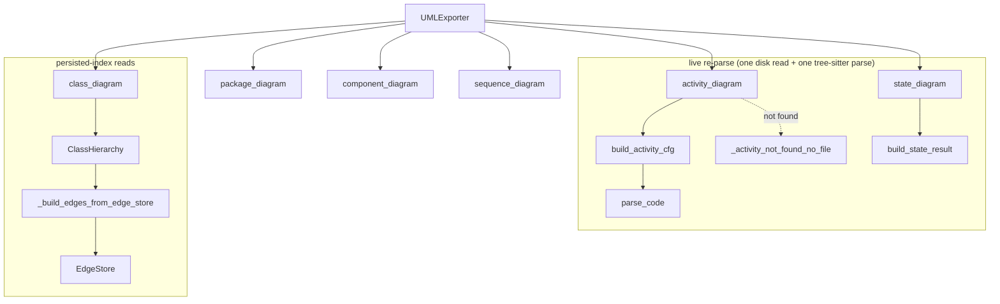

# UML Export

## Overview

[`UMLExporter`](../catalog/tree_sitter_analyzer/uml_export.md#UMLExporter) turns tree-sitter-analyzer's already-computed project intelligence into Mermaid diagram text an agent (or a human) can render directly — its own docstring: "Build Mermaid UML-style diagrams from existing CodeGraph indexes." Six diagram kinds share one exporter object: [`class_diagram`](../catalog/tree_sitter_analyzer/uml_export.md#UMLExporter.class_diagram), [`package_diagram`](../catalog/tree_sitter_analyzer/uml_export.md#UMLExporter.package_diagram), and [`component_diagram`](../catalog/tree_sitter_analyzer/uml_export.md#UMLExporter.component_diagram) read from *persisted* indexes (class hierarchy, import graph) built once and reused; [`sequence_diagram`](../catalog/tree_sitter_analyzer/uml_export.md#UMLExporter.sequence_diagram) reads from the call-path/call-graph machinery; [`activity_diagram`](../catalog/tree_sitter_analyzer/uml_export.md#UMLExporter.activity_diagram) and [`state_diagram`](../catalog/tree_sitter_analyzer/uml_export.md#UMLExporter.state_diagram) instead re-parse a single target file live, on every call, via [`build_activity_cfg`](../catalog/tree_sitter_analyzer/uml_activity.md#build_activity_cfg) / [`build_state_result`](../catalog/tree_sitter_analyzer/uml_state.md#build_state_result). What ties all six together — and what makes this module relevant to the survey's grounding-substrate question — is that every builder is explicit, in its *output metadata*, about how confident the underlying data actually is: `verdict="NOT_FOUND"` / `"INFO"`, `analysis_kind="static_approximation"` / `"structural_approximation"`, and (uniquely on `sequence_diagram`) a `"call_path+synapse_resolved"` vs. plain `"call_path"` source label that reports whether cross-file call resolution actually found the target for this specific query, rather than falling back to a guess. The diagrams don't just show a graph; they self-report how much to trust it.

## Diagram

## Design rationale (why it's built this way)

**Two-tier data source, made explicit rather than hidden.** [`ClassHierarchy`](../catalog/tree_sitter_analyzer/class_hierarchy.md#ClassHierarchy)'s own docstring says it is "Cache-backed... Reads class definitions (with parent class names) from the AST cache's `symbols_json` column" — so [`class_diagram`](../catalog/tree_sitter_analyzer/uml_export.md#UMLExporter.class_diagram) is effectively a set of SQLite reads plus in-memory graph assembly, no source re-parsing. [`activity_diagram`](../catalog/tree_sitter_analyzer/uml_export.md#UMLExporter.activity_diagram)'s docstring states the opposite explicitly: it "requires a disk read + tree-sitter parse at query time (AST bodies are NOT cache-resident)." The AST cache stores structural *symbols* (classes, methods, their line ranges) cheaply, but not full parse trees — so anything needing function-body control flow or enum/match FSM detail has no choice but to re-open and re-parse the file each time it's asked. The module doesn't try to hide this cost difference from the caller; both docstrings state their own cost budget ("typically < 50 ms" for activity; "ONE disk read + ONE tree-sitter parse (rule-11 invariant)" for state) so a caller building a batch of diagrams knows which calls are index lookups and which are live I/O.

**Honesty over confidence in the failure paths.** [`activity_diagram`](../catalog/tree_sitter_analyzer/uml_export.md#UMLExporter.activity_diagram) never returns a bare empty Mermaid string on failure — every not-found branch returns a self-describing placeholder plus a `verdict`/`next_step` pair in [`metadata`](../catalog/tree_sitter_analyzer/uml_export.md#UMLDiagram.metadata), and [`_activity_not_found_no_file`](../catalog/tree_sitter_analyzer/uml_export.md#UMLExporter._activity_not_found_no_file) even distinguishes "not found in the index at all" from "found in multiple files, ambiguous" (listing up to five candidate files) so an agent gets a concrete next action instead of a dead end. [`state_diagram`](../catalog/tree_sitter_analyzer/uml_export.md#UMLExporter.state_diagram) goes further and introduces a third outcome besides found/not-found: `verdict="INFO"` when enum members are extracted as states but no match/case transition pattern was recognized — a genuinely partial result, not a failure, and the mermaid output is still suppressed in that case (only header + a note comment) so a consumer reading just the `mermaid` field never sees a structurally-valid-looking diagram for data that's actually incomplete.

**Scoping priority, applied first-match-wins.** [`class_diagram`](../catalog/tree_sitter_analyzer/uml_export.md#UMLExporter.class_diagram)'s docstring documents an explicit priority order: a `class_name` gets a neighbourhood subgraph (the class, its direct bases, its direct subclasses); failing that, a `file_path` scopes to that file's classes plus their bases; with neither, the whole project is rendered — but with test/fixture classes stripped by default (`include_tests=False`), so the diagram an agent sees out of the box reflects shipped code, not the test corpus.

**Truncation is reported, never silent.** Every diagram carries a [`truncated`](../catalog/tree_sitter_analyzer/uml_export.md#UMLDiagram.truncated) boolean, and when it's set, [`class_diagram`](../catalog/tree_sitter_analyzer/uml_export.md#UMLExporter.class_diagram) / `package_diagram` / `component_diagram` all append a literal Mermaid comment telling the reader to raise `max_edges` or scope down — the truncation is visible *inside the diagram text itself*, not only in a side-channel metadata field a consumer might not check.

**Cross-file resolution reports on itself.** [`sequence_diagram`](../catalog/tree_sitter_analyzer/uml_export.md#UMLExporter.sequence_diagram) computes `has_resolved` by checking whether *any* traversed hop has a populated `callee_file`, and sets its `metadata["source"]` to `"call_path+synapse_resolved"` only in that case, otherwise `"call_path"` plain. This is the one place in the exporter where the survey's central question — how well does tree-sitter-plus-family-gating actually resolve a cross-module call target, versus stopping at a name-only guess — surfaces directly in a diagram's own output, per query, rather than as an aggregate claim.

## Entry points

- [`UMLExporter`](../catalog/tree_sitter_analyzer/uml_export.md#UMLExporter) — constructed with a `project_root` and an optional pre-opened cache object; every diagram method below is reached through one shared instance.
- [`execute`](../catalog/tree_sitter_analyzer/mcp/tools/uml_tool.md#CodeGraphUMLTool.execute) — the MCP tool's async entry point: it reads a `diagram` argument (`class`/`package`/`component`/`sequence`/`activity`/`state`) out of the incoming MCP call and dispatches to the matching `UMLExporter` method, then serializes the resulting [`UMLDiagram`](../catalog/tree_sitter_analyzer/uml_export.md#UMLDiagram) via [`to_dict`](../catalog/tree_sitter_analyzer/uml_export.md#UMLDiagram.to_dict) — this is where control first reaches the exporter from an agent's tool call.
- [`class_diagram`](../catalog/tree_sitter_analyzer/uml_export.md#UMLExporter.class_diagram), [`sequence_diagram`](../catalog/tree_sitter_analyzer/uml_export.md#UMLExporter.sequence_diagram), [`activity_diagram`](../catalog/tree_sitter_analyzer/uml_export.md#UMLExporter.activity_diagram), [`state_diagram`](../catalog/tree_sitter_analyzer/uml_export.md#UMLExporter.state_diagram), [`package_diagram`](../catalog/tree_sitter_analyzer/uml_export.md#UMLExporter.package_diagram), [`component_diagram`](../catalog/tree_sitter_analyzer/uml_export.md#UMLExporter.component_diagram) — the six public builders `execute` can reach; each is also directly callable from a CLI code path outside this packet's subgraph.

## Mechanism (step-by-step)

1. [`execute`](../catalog/tree_sitter_analyzer/mcp/tools/uml_tool.md#CodeGraphUMLTool.execute) validates its arguments, resolves an exporter from the visualization hub, and branches on the requested `diagram` type to call exactly one of the six builder methods — every branch ultimately produces a [`UMLDiagram`](../catalog/tree_sitter_analyzer/uml_export.md#UMLDiagram), which `execute` then formats for the wire.

2. [`class_diagram`](../catalog/tree_sitter_analyzer/uml_export.md#UMLExporter.class_diagram) opens (or reuses) an AST cache, constructs a [`ClassHierarchy`](../catalog/tree_sitter_analyzer/class_hierarchy.md#ClassHierarchy) over it and calls [`build`](../catalog/tree_sitter_analyzer/class_hierarchy.md#ClassHierarchy.build) — which itself tries [`_build_edges_from_edge_store`](../catalog/tree_sitter_analyzer/class_hierarchy.md#ClassHierarchy._build_edges_from_edge_store) (reading persisted [`EdgeKind`](../catalog/tree_sitter_analyzer/graph/edge_store.md#EdgeKind)-tagged rows from the shared edge table) before falling back to a slower reconstruction path if that store is empty. Only after the hierarchy is built does scoping (class-name neighbourhood / file / whole-project) and test-class filtering apply, followed by edge clamping to `max_edges` and Mermaid rendering.

3. [`activity_diagram`](../catalog/tree_sitter_analyzer/uml_export.md#UMLExporter.activity_diagram) first resolves a bare `function_name` to a file when no `file_path` is supplied, by searching the AST index for an exact, Python-only, function-or-method-kind match; an ambiguous or absent match returns early through [`_activity_not_found_no_file`](../catalog/tree_sitter_analyzer/uml_export.md#UMLExporter._activity_not_found_no_file) rather than guessing. Once a file is resolved, [`build_activity_cfg`](../catalog/tree_sitter_analyzer/uml_activity.md#build_activity_cfg) performs exactly one existence check, one parse, and one control-flow walk, returning a typed error string (`NOT_FOUND:file_missing`, `NOT_FOUND:function_missing`, `NOT_FOUND:empty_body`, or `PARSE_FAILED`) rather than partial or garbage nodes on any failure.

4. [`state_diagram`](../catalog/tree_sitter_analyzer/uml_export.md#UMLExporter.state_diagram) resolves its target file either directly from `file_path` or, when only `class_name` is given, by building a fresh [`ClassHierarchy`](../catalog/tree_sitter_analyzer/class_hierarchy.md#ClassHierarchy) and looking up the class's file — a second, independent use of the same class-hierarchy machinery `class_diagram` relies on. It then hands off to [`build_state_result`](../catalog/tree_sitter_analyzer/uml_state.md#build_state_result), which extracts enum members as candidate states and walks `match_statement` nodes for `<Enum>.<Member>` return/assignment patterns as transitions — a heuristic the module's own docstring calls "Python only for this phase."

5. [`sequence_diagram`](../catalog/tree_sitter_analyzer/uml_export.md#UMLExporter.sequence_diagram) is the one diagram sourced from call-path search rather than the class hierarchy or import graph; it renders only the *first* discovered path into a Mermaid `sequenceDiagram` while separately recording the total number of paths found in `metadata["path_count"]` — a caller who wants alternate paths has to know to look at that count, since the diagram itself only ever shows one.

6. Every builder converges on the same shape: a [`UMLDiagram`](../catalog/tree_sitter_analyzer/uml_export.md#UMLDiagram) carrying `mermaid` text, `nodes`/`edges` lists, a `truncated` flag, and a `metadata` dict, and [`to_dict`](../catalog/tree_sitter_analyzer/uml_export.md#UMLDiagram.to_dict) is the single place those frozen dataclasses get turned into the plain dict that actually crosses the MCP boundary (and, per the TOON encoder's design, gets compacted for token cost from there).

## Key data structures

- [`UMLDiagram`](../catalog/tree_sitter_analyzer/uml_export.md#UMLDiagram) / [`UMLEdge`](../catalog/tree_sitter_analyzer/uml_export.md#UMLEdge) — frozen dataclasses that unify all six diagram kinds into one result shape: [`diagram_type`](../catalog/tree_sitter_analyzer/uml_export.md#UMLDiagram.diagram_type), [`mermaid_type`](../catalog/tree_sitter_analyzer/uml_export.md#UMLDiagram.mermaid_type), [`mermaid`](../catalog/tree_sitter_analyzer/uml_export.md#UMLDiagram.mermaid) (the rendered text), [`nodes`](../catalog/tree_sitter_analyzer/uml_export.md#UMLDiagram.nodes)/[`edges`](../catalog/tree_sitter_analyzer/uml_export.md#UMLDiagram.edges) (the same information as structured data, for a consumer that wants to walk the graph without parsing Mermaid), [`truncated`](../catalog/tree_sitter_analyzer/uml_export.md#UMLDiagram.truncated), and [`metadata`](../catalog/tree_sitter_analyzer/uml_export.md#UMLDiagram.metadata) (the honesty/verdict channel described above).
- **`ActivityCFG` / `CFGNode`** — the intermediate, tree-sitter-derived control-flow representation [`build_activity_cfg`](../catalog/tree_sitter_analyzer/uml_activity.md#build_activity_cfg) produces before `activity_diagram` converts it to `UMLEdge`/`UMLDiagram`; each [`node_id`](../catalog/tree_sitter_analyzer/uml_activity.md#CFGNode.node_id) carries a [`kind`](../catalog/tree_sitter_analyzer/uml_activity.md#CFGNode.kind) tag ("entry", "condition", "loop", "return", "raise", "try", "except", "exit") that both drives Mermaid label rendering and (per source read directly) is used to detect an "empty body" function — one with only entry/exit and no condition/loop/return/raise/try/except node — so a stub function reports `NOT_FOUND:empty_body` instead of a degenerate two-node diagram.
- **`StateResult` / `StateTransition`** — the equivalent intermediate for the FSM path: [`states`](../catalog/tree_sitter_analyzer/uml_state.md#StateResult.states), [`transitions`](../catalog/tree_sitter_analyzer/uml_state.md#StateResult.transitions) (each a [`source`](../catalog/tree_sitter_analyzer/uml_state.md#StateTransition.source)/[`target`](../catalog/tree_sitter_analyzer/uml_state.md#StateTransition.target) pair extracted by [`_extract_transitions`](../catalog/tree_sitter_analyzer/uml_state.md#_extract_transitions)), and an [`error`](../catalog/tree_sitter_analyzer/uml_state.md#StateResult.error) string mirroring the CFG path's typed-error convention.
- [`EdgeKind`](../catalog/tree_sitter_analyzer/graph/edge_store.md#EdgeKind) / [`EdgeStore`](../catalog/tree_sitter_analyzer/graph/edge_store.md#EdgeStore) — the persisted, SQLite-backed edge table ([`parse_node_id`](../catalog/tree_sitter_analyzer/graph/edge_store.md#parse_node_id) turns a stable node id back into file/name/line components) that [`_build_edges_from_edge_store`](../catalog/tree_sitter_analyzer/class_hierarchy.md#ClassHierarchy._build_edges_from_edge_store) reads as the fast path for inheritance edges, before [`_load_from_cache`](../catalog/tree_sitter_analyzer/class_hierarchy.md#ClassHierarchy._load_from_cache)'s slower reconstruction is used as a fallback.

## Dynamics (design intent)

No concurrency inside the exporter — each diagram call is a self-contained synchronous computation (`execute` itself is `async def`, but that's MCP-transport-level async, not internal parallelism). The persisted-index diagrams (class/package/component/sequence) are effectively O(cache size) reads; the re-parse diagrams (activity/state) are each budgeted, in their own docstrings, at "typically < 50 ms" / "ONE disk read + ONE tree-sitter parse" — both explicitly frame this as a bounded, per-call cost rather than something requiring caching or batching.

## Edge cases

- An `activity_diagram` call with no `file_path` and an ambiguous `function_name` (matches in more than one file) returns `NOT_FOUND` with the candidate file list rather than picking one arbitrarily — see [`_activity_not_found_no_file`](../catalog/tree_sitter_analyzer/uml_export.md#UMLExporter._activity_not_found_no_file).
- `state_diagram` on a class with enum members but no recognized transition pattern returns `verdict="INFO"` (not `NOT_FOUND`) with the extracted states still populated — a genuinely partial, still-useful result rather than an all-or-nothing outcome.
- `class_diagram`'s `include_tests=True` whole-project view prioritizes production edges over test edges when both together exceed `max_edges` — production edges are clamped first, test edges only fill the remaining budget — exercised by [`test_include_tests_production_classes_not_displaced`](../catalog/tests/unit/test_uml_bugs_787_788_789.md#test_include_tests_production_classes_not_displaced) (bug #789).
- `sequence_diagram`'s own `truncated` flag deliberately does *not* inherit the underlying call-path search's truncation state — it reflects only whether the *rendered hop list* was clipped to `max_hops`, so a short, fully-resolved path is never mislabeled truncated just because the broader path search hit its own limit (bug #787, visible directly in the source's `path_search_truncated` computation).
- An unknown `class_name` passed to `class_diagram` is distinguished from a *known* class with an empty neighbourhood via a `not_found` metadata flag — otherwise both cases would render as an identical empty diagram, which an agent can't tell apart without that signal.

## Open questions

> [!inferred]
> `CallPathFinder` — the actual call-graph traversal `sequence_diagram` delegates to, including however family-gated cross-language resolution feeds into the `callee_file` field that drives the `"synapse_resolved"` label — is not itself a symbol in this packet's subgraph. This page can ground *that the label exists and what triggers it* (via `sequence_diagram`'s own source), but not the internals of how well family-gating actually performs at resolving cross-module or cross-language targets; that belongs to whatever concept page documents the call-graph/resolution mechanism directly.
>
> `_resolve_function_file`'s activity-lookup heuristic (exact name match, Python-only, function/method kind only) is hard-coded to `language == "python"` even though `activity_diagram`'s own docstring says the CFG node-type map is designed so "future languages register there without touching this method" — whether the *index lookup* step would need its own generalization once a second language's CFG support lands isn't answered within this subgraph.

## See also

- [Legacy Table Formatter](tree_sitter_analyzer-legacy_table_formatter.md) and [TOON Encoder](tree_sitter_analyzer-formatters-toon_encoder.md) — the other two ways this repo turns already-computed project intelligence into agent-facing output; UML export is the diagram-shaped member of that family.
- [`tree_sitter_analyzer-core-parser`](tree_sitter_analyzer-core-parser.md) — the `Parser` wrapper `activity_diagram`/`state_diagram` depend on for their live re-parse.
- [`tree_sitter_analyzer-call_graph`](tree_sitter_analyzer-call_graph.md) — the call-graph machinery underlying `sequence_diagram`, including the family-gated resolution this page can only observe the output label of.
