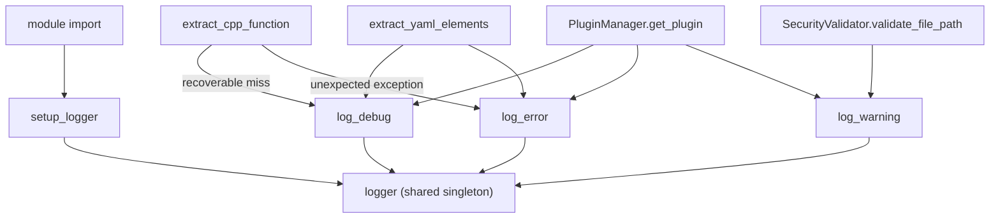

# Logging utility — the choke point every language plugin fails through

## Overview

This module is a thin wrapper over the standard library logger, and its entire reason to exist is
one design constraint: a logging call itself must never be allowed to crash the extraction it was
trying to report on. [`log_debug`](../catalog/tree_sitter_analyzer/utils/logging.md#log_debug), [`log_warning`](../catalog/tree_sitter_analyzer/utils/logging.md#log_warning), and
[`log_error`](../catalog/tree_sitter_analyzer/utils/logging.md#log_error) each wrap a single stdlib logger call in a narrow `except (ValueError, OSError)`
guard, and [`setup_logger`](../catalog/tree_sitter_analyzer/utils/logging.md#setup_logger) builds the one process-wide [`logger`](../catalog/tree_sitter_analyzer/utils/logging.md#logger)
instance every one of those wrappers writes through. What makes this module worth its own page is
not its size but its reach: reading the packet's own "called by" fan-out shows these three
functions are the *single shared failure-reporting path* for every one of the 13-plus language
plugins' per-node extraction code — a C++ function extractor, a YAML element walker, a Kotlin
function extractor, and a plugin-manager lookup all degrade to the exact same three-line wrapper
when something goes wrong, rather than each language maintaining its own error-handling convention.

## Diagram

## Design rationale (why it's built this way)

**The try/except around every emit call is not defensive boilerplate — it targets a real, recurring
failure.** `logging.Logger.debug/warning/error` can raise `ValueError` when the handler's underlying
stream is already closed; this is not a hypothetical, it happens routinely at interpreter shutdown
and inside pytest's captured-output teardown — both of which a test suite exercising 13+ language
plugins triggers constantly. [`log_debug`](../catalog/tree_sitter_analyzer/utils/logging.md#log_debug), [`log_warning`](../catalog/tree_sitter_analyzer/utils/logging.md#log_warning), and
[`log_error`](../catalog/tree_sitter_analyzer/utils/logging.md#log_error) exist specifically to swallow that one narrow failure mode and fall back to a
raw stderr write, rather than letting a *logging* call raise out of an *extraction* call site that
was only trying to report a problem, not create a new one.

**`setup_logger`'s default level is `WARNING`, not `DEBUG` or `INFO`.** Its own signature pins
`level: int | str = logging.WARNING` as the default — meaning every one of the dozens of
[`log_debug`](../catalog/tree_sitter_analyzer/utils/logging.md#log_debug) call sites scattered across the language plugins is silent by default; only
[`log_warning`](../catalog/tree_sitter_analyzer/utils/logging.md#log_warning)/[`log_error`](../catalog/tree_sitter_analyzer/utils/logging.md#log_error) calls surface unless an operator explicitly raises the
configured level. The three-tier split (debug/warning/error) only pays for itself once someone
turns debug logging on to investigate a specific extraction failure — day to day, it's the
warning/error tier doing the actual reporting.

**`setup_logger`'s handler-attachment is idempotent, and test loggers get special-cased.** It only
attaches handlers `if not logger.handlers` — so importing (or calling `setup_logger` from) more than
one of the many modules that share this logger never doubles up output. Logger names starting with
`test_` are cleared unconditionally on every call instead, so pytest fixtures always start from a
clean handler set rather than accumulating one across a session — a `setup_logger` (cite) call from
inside a test always wants "start over," while a call from production code always wants "attach
once."

## Entry points

- [`setup_logger`](../catalog/tree_sitter_analyzer/utils/logging.md#setup_logger) — reached once at module import time to build the
  process-wide [`logger`](../catalog/tree_sitter_analyzer/utils/logging.md#logger) singleton every wrapper below writes through; nothing else in
  this packet's subgraph calls it a second time in production, since its own idempotence guard makes
  a second call a no-op for handler attachment.
- [`log_debug`](../catalog/tree_sitter_analyzer/utils/logging.md#log_debug) — the "recoverable, expected" tier: reached from per-node extraction
  helpers across the language plugins — [`extract_class`](../catalog/tree_sitter_analyzer/languages/typescript_plugin/_class_helpers.md#extract_class) and
  [`extract_method`](../catalog/tree_sitter_analyzer/languages/typescript_plugin/_function_helpers.md#extract_method) (TypeScript), [`extract_arrow_function`](../catalog/tree_sitter_analyzer/languages/typescript_plugin/_function_helpers.md#extract_arrow_function),
  [`extract_interface`](../catalog/tree_sitter_analyzer/languages/typescript_plugin/_class_helpers.md#extract_interface), [`extract_property`](../catalog/tree_sitter_analyzer/languages/typescript_plugin/_variable_helpers.md#extract_property),
  [`parse_variable_declarator`](../catalog/tree_sitter_analyzer/languages/typescript_plugin/_variable_helpers.md#parse_variable_declarator), and their JavaScript-plugin counterparts — control
  reaches it whenever an individual syntax node fails to yield a structured element but the file as
  a whole should keep being processed.
- [`log_error`](../catalog/tree_sitter_analyzer/utils/logging.md#log_error) — the "this element/file could not be extracted at all" tier: reached
  from each language plugin's own `analyze_file` entry point — [`analyze_file`](../catalog/tree_sitter_analyzer/languages/rust_plugin.md#RustPlugin.analyze_file) (Rust),
  [`analyze_file`](../catalog/tree_sitter_analyzer/languages/go_plugin.md#GoPlugin.analyze_file) (Go), [`analyze_file`](../catalog/tree_sitter_analyzer/languages/c_plugin.md#CPlugin.analyze_file) (C),
  [`analyze_file`](../catalog/tree_sitter_analyzer/languages/cpp_plugin.md#CppPlugin.analyze_file) (C++), [`analyze_file`](../catalog/tree_sitter_analyzer/languages/csharp_plugin.md#CSharpPlugin.analyze_file) (C#),
  [`analyze_file`](../catalog/tree_sitter_analyzer/languages/php_plugin.md#PHPPlugin.analyze_file) (PHP), [`analyze_file`](../catalog/tree_sitter_analyzer/languages/ruby_plugin.md#RubyPlugin.analyze_file) (Ruby),
  [`analyze_file`](../catalog/tree_sitter_analyzer/languages/sql_plugin/plugin.md#SQLPlugin.analyze_file) (SQL), and [`analyze_file`](../catalog/tree_sitter_analyzer/languages/kotlin_plugin.md#KotlinPlugin.analyze_file) (Kotlin) all
  share the identical top-level `except Exception` → `log_error` shape — plus lower-level helpers
  like [`extract_cpp_function`](../catalog/tree_sitter_analyzer/languages/_cpp_element_helpers.md#extract_cpp_function), [`extract_cpp_class`](../catalog/tree_sitter_analyzer/languages/_cpp_element_helpers.md#extract_cpp_class), and
  [`extract_c_function`](../catalog/tree_sitter_analyzer/languages/_c_function_helpers.md#extract_c_function) — meaning a single malformed file surfaces as one log
  line here, not an exception that propagates out of whichever bulk operation was walking the
  project when it hit that file.
- [`log_warning`](../catalog/tree_sitter_analyzer/utils/logging.md#log_warning) — the middle tier: reached from
  [`validate_file_path`](../catalog/tree_sitter_analyzer/security/validator.md#SecurityValidator.validate_file_path) (a detected null byte in a path),
  [`validate_pattern`](../catalog/tree_sitter_analyzer/security/regex_checker.md#RegexSafetyChecker.validate_pattern) (an unsafe regex), [`load_language`](../catalog/tree_sitter_analyzer/language_loader.md#LanguageLoader.load_language)
  (a grammar that failed to load), and [`get_plugin`](../catalog/tree_sitter_analyzer/plugins/manager.md#PluginManager.get_plugin)/
  [`register_plugin`](../catalog/tree_sitter_analyzer/plugins/manager.md#PluginManager.register_plugin) (plugin registration problems) — used for conditions worth
  flagging but not severe enough to be `log_error`.

## Mechanism (step-by-step)

1. [`setup_logger`](../catalog/tree_sitter_analyzer/utils/logging.md#setup_logger) runs once, at import time, to produce the shared [`logger`](../catalog/tree_sitter_analyzer/utils/logging.md#logger)
   object: it resolves an effective level, attaches a handler only if the logger doesn't already
   have one, and applies the test-name-prefix clean-slate behavior described above. Every later
   caller of [`log_debug`](../catalog/tree_sitter_analyzer/utils/logging.md#log_debug)/[`log_warning`](../catalog/tree_sitter_analyzer/utils/logging.md#log_warning)/[`log_error`](../catalog/tree_sitter_analyzer/utils/logging.md#log_error) reaches
   for this one already-configured object rather than creating or configuring their own.
2. [`logger`](../catalog/tree_sitter_analyzer/utils/logging.md#logger) is the single point every wrapper delegates to — because it is created once and
   held at module scope, none of the dozens of call sites across the language-plugin roster
   ([`extract_cpp_function`](../catalog/tree_sitter_analyzer/languages/_cpp_element_helpers.md#extract_cpp_function), [`extract_yaml_elements`](../catalog/tree_sitter_analyzer/languages/yaml_plugin.md#YAMLElementExtractor.extract_yaml_elements),
   [`get_plugin`](../catalog/tree_sitter_analyzer/plugins/manager.md#PluginManager.get_plugin), and the rest) has its own logging configuration to keep in
   sync with any other's — a level or handler change made once at `setup_logger` time is visible
   everywhere simultaneously.
3. [`log_debug`](../catalog/tree_sitter_analyzer/utils/logging.md#log_debug), [`log_warning`](../catalog/tree_sitter_analyzer/utils/logging.md#log_warning), and [`log_error`](../catalog/tree_sitter_analyzer/utils/logging.md#log_error) are three
   near-identical one-line delegations to `logger.debug`/`.warning`/`.error`, each wrapped in the
   same `except (ValueError, OSError)` guard described in Design rationale. Every language plugin's
   own try/except around its extraction logic terminates in exactly one of these three calls — for
   example [`validate_file_path`](../catalog/tree_sitter_analyzer/security/validator.md#SecurityValidator.validate_file_path) calls both
   [`log_debug`](../catalog/tree_sitter_analyzer/utils/logging.md#log_debug) and [`log_warning`](../catalog/tree_sitter_analyzer/utils/logging.md#log_warning) at different points along its
   seven-layer path-validation sequence, and [`get_plugin`](../catalog/tree_sitter_analyzer/plugins/manager.md#PluginManager.get_plugin) calls all
   three depending on which stage of plugin resolution fails — so the effect of a single file's
   worth of extraction trouble is always "one more log line," never a crash that takes down whatever
   larger operation (a project-wide index, a batch analysis) was in progress.

## Key data structures

There is no persistent state here beyond the module-level [`logger`](../catalog/tree_sitter_analyzer/utils/logging.md#logger) object itself — a
plain `logging.Logger` instance, configured once by [`setup_logger`](../catalog/tree_sitter_analyzer/utils/logging.md#setup_logger) and then
read by every wrapper. The three wrapper functions carry no state of their own; they are pure
pass-throughs with an exception guard.

> [!inferred] The module also defines a separately-configured performance logger and a couple of
> logging-suppression context managers alongside the functions this page covers; they sit outside
> this packet's cited subgraph (the Seeds are `log_debug`/`log_error`/`log_warning`/`setup_logger`)
> and so are only noted here, not described in detail.

## Dynamics (design intent)

[`setup_logger`](../catalog/tree_sitter_analyzer/utils/logging.md#setup_logger)'s idempotence (skip handler attachment when handlers already exist)
is what makes it safe for [`logger`](../catalog/tree_sitter_analyzer/utils/logging.md#logger) to be imported and implicitly re-touched from many
modules across a large plugin roster without accumulating duplicate handlers — a common Python
logging footgun this module's tests are explicitly guarding against for the `test_`-prefixed case.

> [!inferred] Under the multiprocessing worker-pool path used for parallel indexing, each spawned
> process starts a fresh interpreter and therefore re-imports this module and re-runs
> `setup_logger` independently; this packet's subgraph doesn't include the spawn-pool code itself,
> so this is inference from how Python's `spawn` start method works generally, not a directly cited
> behavior.

## Edge cases

- The exception guard is narrow by design: only `ValueError`/`OSError` are suppressed inside
  [`log_debug`](../catalog/tree_sitter_analyzer/utils/logging.md#log_debug)/[`log_warning`](../catalog/tree_sitter_analyzer/utils/logging.md#log_warning)/[`log_error`](../catalog/tree_sitter_analyzer/utils/logging.md#log_error). Any other
  exception raised by a misbehaving custom handler still propagates out of these functions — a
  caller that assumes "logging can never fail" is only protected against the two specific,
  observed failure modes (closed stream, I/O error), not against an arbitrary broken handler.
  Reading the source, this looks like a deliberate scope narrowing (only silence what's actually
  been observed to happen), not an oversight.
- Because [`setup_logger`](../catalog/tree_sitter_analyzer/utils/logging.md#setup_logger)'s default level is `WARNING`, the extensive
  [`log_debug`](../catalog/tree_sitter_analyzer/utils/logging.md#log_debug) instrumentation scattered through every language plugin's extraction
  code is normally invisible; a reader who greps the plugin source and finds a `log_debug` call at a
  suspected failure point still needs to raise the configured level before that instrumentation
  produces any visible output.

## Open questions

- Whether the effective log level is ever raised by an environment variable or CLI flag at
  `setup_logger` call time is implied by "resolves the configured log level" behavior visible in the
  source, but the specific configuration mechanism sits outside this packet's cited subgraph.
- The exact count of call sites across the full plugin roster that terminate in one of these three
  wrappers is larger than what this packet's subgraph samples; the entry points above list the
  concrete callers visible here, not an exhaustive census.

## See also

- [`tree_sitter_analyzer-plugins-manager`](tree_sitter_analyzer-plugins-manager.md) — `PluginManager.get_plugin`/
  `register_plugin`, two of the heavier consumers of all three logging tiers.
- [`tree_sitter_analyzer-ast_cache`](tree_sitter_analyzer-ast_cache.md) — the bulk indexing path whose
  per-file failures are exactly the kind of "log and keep going" case this module exists to support.
