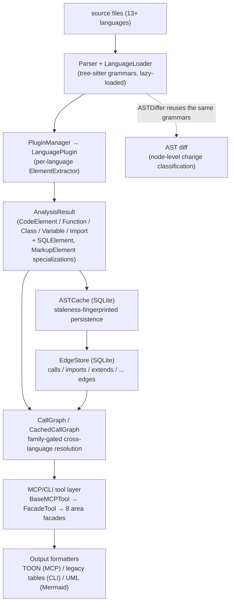

# tree-sitter-analyzer — what it is and how it fits together

## In one paragraph
tree-sitter-analyzer (TSA) is a code-intelligence tool that grounds entirely on **tree-sitter parse
trees** — no compiler front-end, no SCIP index, no graph database — and builds everything else on
top: a uniform, language-neutral data model that lets 13+ languages share one `Function`/`Class`
shape; a **family-gated** call graph whose only defense against cross-language mis-wires is a small
language-compatibility function, applied exactly where an unscoped name search would otherwise need
it; a persistence layer (`ASTCache` + `EdgeStore`) that is nothing more exotic than two SQLite tables;
and an MCP/CLI surface that exposes all of it to an agent, self-reporting how confident each answer is
rather than presenting every result as equally certain. The central design idea, repeated at every
layer, is: **do the minimum-infrastructure thing, and make correctness an explicit, checkable gate**
(a language-compatibility check, a staleness fingerprint, a `verdict` field) rather than an implicit
assumption.

## Core architecture

## Main concepts

**The tree-sitter grounding substrate.** Every other subsystem touches source code through exactly
one seam: `Parser.parse_file`/`parse_code`, backed by `LanguageLoader`'s lazily-imported, per-language
tree-sitter grammar packages. There is no compiler, no SCIP index, and no language is load-bearing for
any other — a missing grammar degrades to a clear error, never a crash. See
[`tree_sitter_analyzer-core-parser`](concepts/tree_sitter_analyzer-core-parser.md).

**The per-language plugin architecture.** `PluginManager` discovers and lazily loads one
`LanguagePlugin` per language (19+ concrete implementations, e.g. C# and Scala, recovered as
`(virtual)` dynamic-dispatch edges off one narrow four-method abstract contract shared with
`ElementExtractor`); this is the seam that keeps "add a language" additive rather than invasive. See
[`tree_sitter_analyzer-plugins-manager`](concepts/tree_sitter_analyzer-plugins-manager.md),
[`tree_sitter_analyzer-plugins-base`](concepts/tree_sitter_analyzer-plugins-base.md),
[`tree_sitter_analyzer-languages-csharp_plugin`](concepts/tree_sitter_analyzer-languages-csharp_plugin.md),
[`tree_sitter_analyzer-languages-scala_plugin`](concepts/tree_sitter_analyzer-languages-scala_plugin.md).

**One uniform data model across every language.** `CodeElement` and its subclasses (`Function`,
`Class`, `Variable`, `Import`) give every language plugin the same shape to fill in, with
language-specific concepts as optional fields rather than per-language types; `AnalysisResult` is the
neutral wire format every `analyze_file` override returns; SQL and markup languages get their own
specialized subtrees (`SQLElement`, the self-referential `MarkupElement`) where the flat model
genuinely doesn't fit. See
[`tree_sitter_analyzer-models-base`](concepts/tree_sitter_analyzer-models-base.md),
[`tree_sitter_analyzer-models-result`](concepts/tree_sitter_analyzer-models-result.md),
[`tree_sitter_analyzer-models-sql_models`](concepts/tree_sitter_analyzer-models-sql_models.md),
[`tree_sitter_analyzer-models-markup_models`](concepts/tree_sitter_analyzer-models-markup_models.md).

**The family-gated call graph — the survey's headline mechanism.** `CallGraph`/`CachedCallGraph`
resolve calls through a confidence-scored, three-tier cascade (local file match → resolved import →
unscoped project-wide name search); only that last, unscoped tier needs a cross-language gate, and
`languages_compatible` supplies it — symmetric for JS/TS dialects, directional for C/C++/Objective-C.
The same gate is reused, independently, at the PR-review impact layer. This is the concrete mechanism
behind the repo's benchmarked claim of far fewer cross-language mis-wires than name-only resolvers.
See [`tree_sitter_analyzer-call_graph`](concepts/tree_sitter_analyzer-call_graph.md).

**Persistence without a compiler or a graph database.** `ASTCache` is one SQLite table keyed by a
`(mtime, size, extractor_version)` staleness fingerprint, so a warm re-index only re-parses files that
actually changed; `EdgeStore` is a second SQLite table holding typed, directed edges (`calls`,
`imports`, `extends`, …) that the call graph and UML/class-hierarchy tools read from in preference to
re-parsing. Two flat tables are TSA's entire answer to "how do you persist a code graph" — no Kùzu, no
Neo4j, no FalkorDB. See [`tree_sitter_analyzer-ast_cache`](concepts/tree_sitter_analyzer-ast_cache.md),
[`tree_sitter_analyzer-graph-edge_store`](concepts/tree_sitter_analyzer-graph-edge_store.md).

**Node-level AST diffing.** `ASTDiffer` reuses the same tree-sitter grammars to compare two source
revisions at the *node* level (signature/body/rename/add/remove) rather than the line level, funneling
every language's node types through one shared `ASTNodeKind` vocabulary. See
[`tree_sitter_analyzer-ast_diff`](concepts/tree_sitter_analyzer-ast_diff.md).

**The MCP/CLI exposure layer.** `BaseMCPTool` is the abstract contract ~30+ concrete tools subclass;
`FacadeTool` consolidates them into eight area facades (`nav`, `structure`, `search`, `health`, `edit`,
`project`, `viz`, `index`) so an LLM's tool-selection context sees 8 tools, not 55+; `ReadPartialTool`
is the exact-range complement to the structure tools; `ErrorHandler` classifies every exception
surfacing at this boundary into a category/severity and attempts a recovery strategy;
`AnalysisRequest` is the one parameter object every plugin's `analyze_file` accepts; the server itself
defers the expensive half of its tool registry construction to fix a startup-latency bug. See
[`tree_sitter_analyzer-mcp-server`](concepts/tree_sitter_analyzer-mcp-server.md),
[`tree_sitter_analyzer-mcp-tools-base_tool`](concepts/tree_sitter_analyzer-mcp-tools-base_tool.md),
[`tree_sitter_analyzer-mcp-tools-facade_tool`](concepts/tree_sitter_analyzer-mcp-tools-facade_tool.md),
[`tree_sitter_analyzer-mcp-tools-read_partial_tool`](concepts/tree_sitter_analyzer-mcp-tools-read_partial_tool.md),
[`tree_sitter_analyzer-mcp-utils-error_handler`](concepts/tree_sitter_analyzer-mcp-utils-error_handler.md),
[`tree_sitter_analyzer-core-request`](concepts/tree_sitter_analyzer-core-request.md).

**Output formatting and self-reported confidence.** TOON is TSA's own compact, stack-safe, iterative
encoder for MCP responses (LOCKED as the MCP default over JSON for token cost); `LegacyTableFormatter`
renders the same structural data as byte-compatible text tables for the CLI; `UMLExporter` renders six
kinds of Mermaid diagrams and — uniquely among the formatters — tags its own output with a
`verdict`/`analysis_kind` confidence label rather than presenting every diagram as equally certain.
See [`tree_sitter_analyzer-formatters-toon_encoder`](concepts/tree_sitter_analyzer-formatters-toon_encoder.md),
[`tree_sitter_analyzer-legacy_table_formatter`](concepts/tree_sitter_analyzer-legacy_table_formatter.md),
[`tree_sitter_analyzer-uml_export`](concepts/tree_sitter_analyzer-uml_export.md).

**Security as defense-in-depth.** `SecurityValidator` funnels every caller-supplied path through seven
independent veto layers (null bytes, drive letters, traversal, boundary containment, symlink
rejection) before any tool touches disk — one object every CLI command and MCP tool is expected to
route through. See [`tree_sitter_analyzer-security-validator`](concepts/tree_sitter_analyzer-security-validator.md).

*(A thin, crash-proof logging wrapper — [`tree_sitter_analyzer-utils-logging`](concepts/tree_sitter_analyzer-utils-logging.md)
— underlies nearly every subsystem above but isn't a "main concept" in its own right.)*

## How a request flows
A file lands in front of `Parser` via a `LanguagePlugin`'s `analyze_file`, producing an
`AnalysisResult` that `ASTCache` persists with a staleness fingerprint. A later call-graph query
(`CallGraph`/`CachedCallGraph`) reads from that cache and `EdgeStore` instead of re-parsing, resolving
each call through the three-tier cascade and gating only the unscoped tier on language family. An MCP
client reaches all of this through `FacadeTool`'s eight area facades, each backed by concrete
`BaseMCPTool` subclasses; the response is serialized as TOON (MCP) or a legacy table (CLI), optionally
carrying a UML diagram whose metadata says how much to trust it; anything that goes wrong along the
way is classified and logged by `ErrorHandler`, and every path argument is checked by
`SecurityValidator` before any of this touches disk.

## Map of the wiki
- **"How does the call graph avoid cross-language mistakes?"** →
  [`tree_sitter_analyzer-call_graph`](concepts/tree_sitter_analyzer-call_graph.md).
- **"How does TSA parse 13+ languages without a compiler?"** →
  [`tree_sitter_analyzer-core-parser`](concepts/tree_sitter_analyzer-core-parser.md),
  [`tree_sitter_analyzer-plugins-manager`](concepts/tree_sitter_analyzer-plugins-manager.md).
- **"How is a code graph persisted without a graph database?"** →
  [`tree_sitter_analyzer-ast_cache`](concepts/tree_sitter_analyzer-ast_cache.md),
  [`tree_sitter_analyzer-graph-edge_store`](concepts/tree_sitter_analyzer-graph-edge_store.md).
- **"How does an agent actually call this tool?"** →
  [`tree_sitter_analyzer-mcp-server`](concepts/tree_sitter_analyzer-mcp-server.md),
  [`tree_sitter_analyzer-mcp-tools-facade_tool`](concepts/tree_sitter_analyzer-mcp-tools-facade_tool.md).
- **"What is symbol `X` — signature, definition, callers?"** → the per-module
  [`catalog/`](catalog/) pages (1883 modules, 100% of the 43,362 documentable symbols represented;
  481 get a deep concept page).
- **What exists at all** → [`index.md`](index.md)'s concept table.
