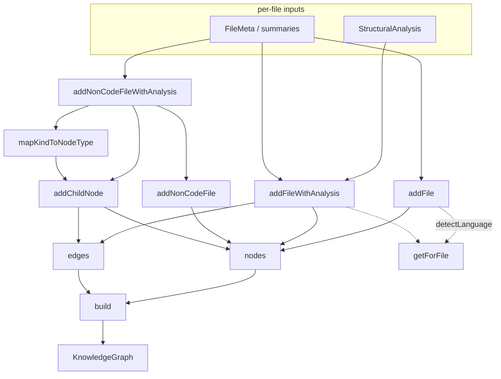

# GraphBuilder — assembling the knowledge graph substrate

<!-- connect:up:begin -->
> **Cross-repo concept:** part of [multi-language-extraction](../../../concepts/multi-language-extraction.md), [symbol-graph](../../../concepts/symbol-graph.md) across this wiki's repos.
<!-- connect:up:end -->
## Overview
`GraphBuilder` is the accumulator that turns per-file analysis into Understand-Anything's
central artifact: a single typed **knowledge graph** of nodes (files, functions, classes,
tables, services, endpoints, …) and edges (`contains`, `imports`, `calls`). Everything else
in the tool — the React dashboard, tours, search, staleness checks — reads that graph, so
this class is the grounding substrate: the place where heterogeneous inputs (tree-sitter
structural analysis for code, parser output for non-code formats, LLM-written summaries) are
normalized into one uniform node/edge vocabulary. The key design idea is a **builder that
owns identity**: it mints deterministic, human-readable string IDs (`file:src/x.ts`,
`function:src/x.ts:foo`), deduplicates against a seen-set, and only at the end snapshots an
immutable [`KnowledgeGraph`](../catalog/understand-anything-plugin/packages/core/src/types.ts.md#KnowledgeGraph)
via [`build`](../catalog/understand-anything-plugin/packages/core/src/analyzer/graph-builder.ts.md#GraphBuilder.build).

Compared with wikify-repo (SCIP monikers) or graphify (community-detected god-nodes),
Understand-Anything's substrate is deliberately lighter: identity is a string convention, not
a compiler-grade symbol table, and the "call graph" is only as complete as the callers the
upstream pipeline chooses to feed in. What it buys instead is breadth — the same builder
ingests SQL schemas, Docker services, and Terraform resources alongside TypeScript.

## Diagram

## Design rationale (why it's built this way)
The most consequential decision is that **node identity is a string template, not a symbol
resolution**. `addFile` stores a node whose `id` is literally `file:${filePath}`
([`id`](../catalog/understand-anything-plugin/packages/core/src/types.ts.md#GraphNode.id),
[`addFile`](../catalog/understand-anything-plugin/packages/core/src/analyzer/graph-builder.ts.md#GraphBuilder.addFile)),
and functions/classes are `function:${filePath}:${name}` / `class:${filePath}:${name}`. This
makes cross-references trivial to author from any producer — an edge just names its endpoints
by convention — but it also means identity is **path- and name-scoped**, not scope-aware:
two same-named local functions in one file, or a file that moves, are not disambiguated the
way a SCIP moniker would be. The builder maintains a `Set` of seen IDs, but only the child-node
path ([`addChildNode`](../catalog/understand-anything-plugin/packages/core/src/analyzer/graph-builder.ts.md#GraphBuilder.addChildNode))
actually consults it to catch a re-added id; the direct file paths add to the set without checking
(see Edge cases).

> [!inferred]
> This string-ID scheme is what lets the graph absorb code and non-code uniformly (a SQL table
> and a TS function are both just `<kind>:<path>:<name>`), at the cost of the precise,
> collision-free identity a compiler-backed index (SCIP) provides. The tradeoff reads as
> deliberate: breadth of source types over resolution precision.

A second decision is the **separation of extraction from assembly**. `GraphBuilder` never
parses source; it consumes a language-neutral
[`StructuralAnalysis`](../catalog/understand-anything-plugin/packages/core/src/types.ts.md#StructuralAnalysis)
(functions, classes, imports, exports, plus optional non-code arrays) produced upstream by
tree-sitter/parsers. That keeps the builder language-agnostic and lets new languages plug in
by emitting the same shape rather than touching this class.

Third, the builder is **write-then-snapshot**: mutations push into private `nodes`/`edges`
arrays, and only `build` freezes a copy. Callers cannot observe a half-built graph.

## Entry points
- [`addFile`](../catalog/understand-anything-plugin/packages/core/src/analyzer/graph-builder.ts.md#GraphBuilder.addFile) — the minimal path: record a file as a single `file`-typed node with an LLM summary, tags, and complexity, no interior structure. Hit when the pipeline wants a file represented but hasn't (or won't) run deep structural analysis on it.
- [`addFileWithAnalysis`](../catalog/understand-anything-plugin/packages/core/src/analyzer/graph-builder.ts.md#GraphBuilder.addFileWithAnalysis) — the code path: given a [`StructuralAnalysis`](../catalog/understand-anything-plugin/packages/core/src/types.ts.md#StructuralAnalysis), it emits the file node plus a child node per function and per class, wiring `contains` edges. This is where a source file becomes a small subtree of the graph.
- [`addNonCodeFileWithAnalysis`](../catalog/understand-anything-plugin/packages/core/src/analyzer/graph-builder.ts.md#GraphBuilder.addNonCodeFileWithAnalysis) — the breadth path: same idea for non-code formats, expanding parsed [`DefinitionInfo`](../catalog/understand-anything-plugin/packages/core/src/types.ts.md#DefinitionInfo) tables/schemas, services, endpoints, pipeline steps, and resources into typed child nodes. Reached for SQL, Docker Compose, OpenAPI, Terraform, Makefiles, etc.
- [`build`](../catalog/understand-anything-plugin/packages/core/src/analyzer/graph-builder.ts.md#GraphBuilder.build) — the terminal call: snapshots accumulated [`nodes`](../catalog/understand-anything-plugin/packages/core/src/analyzer/graph-builder.ts.md#GraphBuilder.nodes) and [`edges`](../catalog/understand-anything-plugin/packages/core/src/analyzer/graph-builder.ts.md#GraphBuilder.edges) into an immutable [`KnowledgeGraph`](../catalog/understand-anything-plugin/packages/core/src/types.ts.md#KnowledgeGraph) with project metadata.

## Mechanism (step-by-step)
1. **Classify the file's language and remember it.** Both code paths first resolve the file
   to a language config through the registry's
   [`getForFile`](../catalog/understand-anything-plugin/packages/core/src/languages/language-registry.ts.md#LanguageRegistry.getForFile),
   which tries a filename match first (so `docker-compose.yml`, `Makefile` win) then falls
   back to the extension via
   [`getByExtension`](../catalog/understand-anything-plugin/packages/core/src/languages/language-registry.ts.md#LanguageRegistry.getByExtension).
   Anything resolved (id `!= "unknown"`) is added to the builder's language set, which later
   becomes the project's [`languages`](../catalog/understand-anything-plugin/packages/core/src/types.ts.md#ProjectMeta.languages)
   list. This filename-first ordering is why format-defined files without a distinctive
   extension still classify correctly — the multi-language surface starts here.
2. **Emit the file node.** [`addFile`](../catalog/understand-anything-plugin/packages/core/src/analyzer/graph-builder.ts.md#GraphBuilder.addFile)
   pushes one [`GraphNode`](../catalog/understand-anything-plugin/packages/core/src/types.ts.md#GraphNode)
   of [`type`](../catalog/understand-anything-plugin/packages/core/src/types.ts.md#GraphNode.type)
   `"file"`, carrying the basename as
   [`name`](../catalog/understand-anything-plugin/packages/core/src/types.ts.md#GraphNode.name),
   the LLM-authored [`summary`](../catalog/understand-anything-plugin/packages/core/src/types.ts.md#GraphNode.summary),
   [`tags`](../catalog/understand-anything-plugin/packages/core/src/types.ts.md#GraphNode.tags),
   and a [`complexity`](../catalog/understand-anything-plugin/packages/core/src/types.ts.md#GraphNode.complexity)
   bucket. This is the substrate detail that distinguishes the tool: nodes carry *natural-language*
   grounding (summary/tags) written by an agent, not just structural facts.
3. **Explode code structure into a subtree.** [`addFileWithAnalysis`](../catalog/understand-anything-plugin/packages/core/src/analyzer/graph-builder.ts.md#GraphBuilder.addFileWithAnalysis)
   iterates the analysis's [`functions`](../catalog/understand-anything-plugin/packages/core/src/types.ts.md#StructuralAnalysis.functions)
   and [`classes`](../catalog/understand-anything-plugin/packages/core/src/types.ts.md#StructuralAnalysis.classes),
   minting a child node per member (id `function:<path>:<name>` / `class:<path>:<name>`) with
   its [`lineRange`](../catalog/understand-anything-plugin/packages/core/src/types.ts.md#StructuralAnalysis.functions.Array.typeLiteral0.lineRange)
   preserved for later source-linking, then pushing a `contains`
   [`GraphEdge`](../catalog/understand-anything-plugin/packages/core/src/types.ts.md#GraphEdge)
   from file to member. The per-member summary is looked up by name from the meta's summaries
   map — grounding is keyed by symbol [`name`](../catalog/understand-anything-plugin/packages/core/src/types.ts.md#StructuralAnalysis.functions.Array.typeLiteral0.name),
   which is exactly why the string-ID convention has to include the name.
4. **Map non-code definitions across formats.** [`addNonCodeFileWithAnalysis`](../catalog/understand-anything-plugin/packages/core/src/analyzer/graph-builder.ts.md#GraphBuilder.addNonCodeFileWithAnalysis)
   first lays down the container via [`addNonCodeFile`](../catalog/understand-anything-plugin/packages/core/src/analyzer/graph-builder.ts.md#GraphBuilder.addNonCodeFile)
   (which honors a caller-supplied `nodeType`), then loops each parsed
   [`DefinitionInfo`](../catalog/understand-anything-plugin/packages/core/src/types.ts.md#DefinitionInfo)
   and translates its parser-reported [`kind`](../catalog/understand-anything-plugin/packages/core/src/types.ts.md#DefinitionInfo.kind)
   (`"table"`, `"message"`, `"resource"`, …) into one of the graph's node types via
   [`mapKindToNodeType`](../catalog/understand-anything-plugin/packages/core/src/analyzer/graph-builder.ts.md#GraphBuilder.mapKindToNodeType).
   This is the normalization seam that makes a Postgres table and a protobuf message
   first-class peers of a TypeScript class — the multi-language-extraction payoff.
5. **Attach children uniformly and dedupe.** Every non-code child (definitions, services,
   endpoints, steps, resources) goes through [`addChildNode`](../catalog/understand-anything-plugin/packages/core/src/analyzer/graph-builder.ts.md#GraphBuilder.addChildNode),
   which is the single choke point that enforces id uniqueness (warn-and-skip on a duplicate
   [`id`](../catalog/understand-anything-plugin/packages/core/src/types.ts.md#GraphNode.id)) and
   wires the `contains` edge with a `forward`
   [`direction`](../catalog/understand-anything-plugin/packages/core/src/types.ts.md#GraphEdge.direction)
   and unit [`weight`](../catalog/understand-anything-plugin/packages/core/src/types.ts.md#GraphEdge.weight).
   Routing all child creation through one method is why the containment hierarchy is
   consistent regardless of source format.
6. **Snapshot the immutable graph.** [`build`](../catalog/understand-anything-plugin/packages/core/src/analyzer/graph-builder.ts.md#GraphBuilder.build)
   copies [`nodes`](../catalog/understand-anything-plugin/packages/core/src/analyzer/graph-builder.ts.md#GraphBuilder.nodes)
   and [`edges`](../catalog/understand-anything-plugin/packages/core/src/analyzer/graph-builder.ts.md#GraphBuilder.edges)
   into a fresh [`KnowledgeGraph`](../catalog/understand-anything-plugin/packages/core/src/types.ts.md#KnowledgeGraph),
   fills a `project` block with the sorted [`languages`](../catalog/understand-anything-plugin/packages/core/src/types.ts.md#ProjectMeta.languages),
   an [`analyzedAt`](../catalog/understand-anything-plugin/packages/core/src/types.ts.md#ProjectMeta.analyzedAt)
   ISO timestamp and the captured [`gitCommitHash`](../catalog/understand-anything-plugin/packages/core/src/types.ts.md#ProjectMeta.gitCommitHash),
   and leaves [`layers`](../catalog/understand-anything-plugin/packages/core/src/types.ts.md#KnowledgeGraph.layers)
   and [`tour`](../catalog/understand-anything-plugin/packages/core/src/types.ts.md#KnowledgeGraph.tour)
   empty for later stages to populate. The `gitCommitHash` is the hook a downstream staleness
   check uses to know which commit the graph describes.

## Key data structures
- [`GraphNode`](../catalog/understand-anything-plugin/packages/core/src/types.ts.md#GraphNode) — the universal node: a string `id`, one of 21 `NodeType`s, a `name`, optional `filePath`/`lineRange` for source-linking, and the grounding trio `summary`/`tags`/`complexity`. Non-code and knowledge variants reuse the same shape (with optional `domainMeta`/`knowledgeMeta`), which is what keeps the builder's logic format-independent.
- [`GraphEdge`](../catalog/understand-anything-plugin/packages/core/src/types.ts.md#GraphEdge) — a typed, weighted, directional relation between two node ids. In this file only `contains` (weight 1) is produced by the child-node paths; `imports`/`calls` edges come from the sibling `addImportEdge`/`addCallEdge` methods (see Open questions). The [`source`](../catalog/understand-anything-plugin/packages/core/src/types.ts.md#GraphEdge.source)/[`target`](../catalog/understand-anything-plugin/packages/core/src/types.ts.md#GraphEdge.target) fields reference node ids by the string convention, so edges are decoupled from node objects.
- [`StructuralAnalysis`](../catalog/understand-anything-plugin/packages/core/src/types.ts.md#StructuralAnalysis) — the language-neutral extraction contract the builder consumes: required `functions`/`classes`/imports/exports for code, plus optional [`DefinitionInfo`](../catalog/understand-anything-plugin/packages/core/src/types.ts.md#DefinitionInfo) and friends for non-code. The optionality is explicitly "for backward compat," so older parsers that don't emit non-code arrays still work.
- [`KnowledgeGraph`](../catalog/understand-anything-plugin/packages/core/src/types.ts.md#KnowledgeGraph) — the output envelope: versioned, with `project` [`ProjectMeta`](../catalog/understand-anything-plugin/packages/core/src/types.ts.md#KnowledgeGraph.project), nodes, edges, layers, and tour. This is the single JSON artifact the dashboard and query layers load.
- The builder's private accumulators — [`nodes`](../catalog/understand-anything-plugin/packages/core/src/analyzer/graph-builder.ts.md#GraphBuilder.nodes), [`edges`](../catalog/understand-anything-plugin/packages/core/src/analyzer/graph-builder.ts.md#GraphBuilder.edges), and the id/edge-key seen-sets — hold mutable in-progress state; nothing escapes until `build` copies it.

## Dynamics (design intent)
The unit test `graph-builder.test.ts`
pins the contract: two `addFile` calls followed by [`build`](../catalog/understand-anything-plugin/packages/core/src/analyzer/graph-builder.ts.md#GraphBuilder.build)
yield exactly two nodes whose ids/types/names/summaries match the `file:<path>` convention,
and a `StructuralAnalysis` with functions and classes produces the corresponding child nodes.
This confirms the builder is a **pure, single-pass accumulator**: output is a deterministic
function of the calls made, with no hidden ordering effect beyond insertion order.

> [!inferred]
> The class holds no async or concurrency machinery — it is meant to be driven synchronously
> by one orchestrator that has already gathered per-file analysis (agents write intermediate
> results to disk first, per the project's CLAUDE.md), then assembled in one pass. I do not
> see incremental/streaming rebuild logic in this file, so I have not tagged
> `incremental-reconcile`.

## Edge cases
- **Unknown language.** `detectLanguage` returns `"unknown"` when [`getForFile`](../catalog/understand-anything-plugin/packages/core/src/languages/language-registry.ts.md#LanguageRegistry.getForFile) finds no [`LanguageConfig`](../catalog/understand-anything-plugin/packages/core/src/languages/types.ts.md#LanguageConfig); such files still become nodes but do not contribute to the project's language list.
- **Unknown definition kind.** [`mapKindToNodeType`](../catalog/understand-anything-plugin/packages/core/src/analyzer/graph-builder.ts.md#GraphBuilder.mapKindToNodeType) logs a warning and falls back to a `"concept"` node type rather than dropping the definition — so a parser emitting a kind outside `KIND_TO_NODE_TYPE` degrades gracefully instead of failing.
- **Duplicate ids.** Only [`addChildNode`](../catalog/understand-anything-plugin/packages/core/src/analyzer/graph-builder.ts.md#GraphBuilder.addChildNode) guards against duplicates (warn-and-skip). The code paths [`addFile`](../catalog/understand-anything-plugin/packages/core/src/analyzer/graph-builder.ts.md#GraphBuilder.addFile) / [`addFileWithAnalysis`](../catalog/understand-anything-plugin/packages/core/src/analyzer/graph-builder.ts.md#GraphBuilder.addFileWithAnalysis) push directly, so adding the same file twice would append a duplicate file node — the caller is trusted not to.
- **Empty optional arrays.** `addNonCodeFileWithAnalysis` uses `?? []` on every non-code array, so a file with a `nodeType` but no parsed definitions simply yields a lone container node.

## Open questions
- The `imports`/`calls` edges (`addImportEdge`, `addCallEdge`) exist in this file but are not in the packet subgraph, so I cannot cite them; the completeness of the *behavioral* call graph (how many call edges the pipeline actually feeds in vs. structural `contains` edges) is not determinable from this page's evidence.
- `layers` and `tour` are emitted empty by [`build`](../catalog/understand-anything-plugin/packages/core/src/analyzer/graph-builder.ts.md#GraphBuilder.build); which later stage populates them (and whether it re-runs the builder) is out of scope here.
- Whether re-analysis reuses prior graph state (true incremental reconcile) or always rebuilds from scratch is not visible in this file.

## See also
- Catalog home for this module: [`graph-builder.ts` catalog](../catalog/understand-anything-plugin/packages/core/src/analyzer/graph-builder.ts.md) — signatures, source lines, and uses-by for every symbol cited above.
- The shared type vocabulary: [`types.ts` catalog](../catalog/understand-anything-plugin/packages/core/src/types.ts.md) — `GraphNode`, `GraphEdge`, `KnowledgeGraph`, `StructuralAnalysis`.
