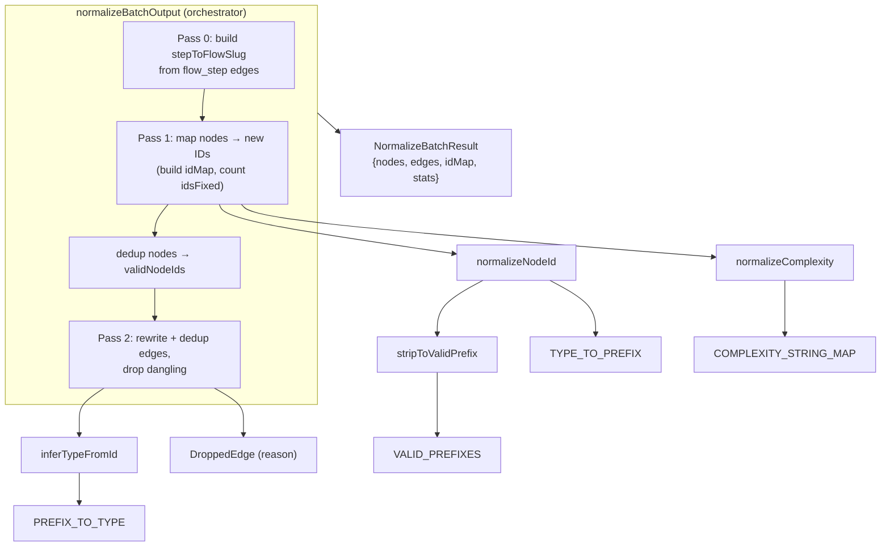

# Graph normalization — canonical node identity and edge reconciliation

<!-- connect:up:begin -->
> **Cross-repo concept:** part of [symbol-graph](../../../concepts/symbol-graph.md) across this wiki's repos.
<!-- connect:up:end -->
## Overview
Understand-Anything represents a codebase as a **knowledge graph** whose nodes are code and
architecture entities (files, functions, classes, but also `service`, `endpoint`, `domain`,
`flow`, `step`) and whose edges are relationships between them. That graph is produced by
LLMs and tree-sitter working over *batches* of files, so the raw output is noisy: the same
file can be named `file:src/x.ts` in one batch and `my-project:src/x.ts` in another, complexity
comes back as `"trivial"` or `7`, and edges point at IDs that no node actually carries. This
module is the **reconciliation layer** that turns that noise into a graph with stable identity.
Its single key idea is a canonical `type:path` node ID: [`normalizeNodeId`](../catalog/understand-anything-plugin/packages/core/src/analyzer/normalize-graph.ts.md#normalizeNodeId)
computes one deterministic ID per node, and [`normalizeBatchOutput`](../catalog/understand-anything-plugin/packages/core/src/analyzer/normalize-graph.ts.md#normalizeBatchOutput)
rewrites every edge through the resulting old→new [`idMap`](../catalog/understand-anything-plugin/packages/core/src/analyzer/normalize-graph.ts.md#NormalizeBatchResult.idMap)
so that only edges whose *both* endpoints resolve to a real node survive.

For the cross-tool comparison: this is Understand-Anything's **grounding substrate**. Where
wikify-repo grounds identity in SCIP monikers emitted by a real compiler, this tool has no such
oracle — its nodes come from LLM guesses — so identity is *manufactured* by string canonicalization,
and the "citation linter" equivalent is the dangling-edge drop: an edge that cannot be grounded in
two existing nodes is discarded and recorded, never silently kept.

## Diagram

## Design rationale (why it's built this way)
The controlling docstring on [`normalizeBatchOutput`](../catalog/understand-anything-plugin/packages/core/src/analyzer/normalize-graph.ts.md#normalizeBatchOutput)
states the boundary explicitly: it *"runs BEFORE upstream's sanitizeGraph/autoFixGraph/normalizeGraph
pipeline, handling concerns that pipeline does not cover: malformed IDs, numeric complexity, edge
reference rewriting after ID correction, and edge deduplication."* So this file is deliberately a
**pre-normalizer** — it fixes the problems that only exist because the graph was assembled from
independent LLM/tree-sitter batches, and it does so before the schema-level cleanup runs. This
ordering is load-bearing: edges can only be rewritten *after* node IDs are corrected, because the
rewrite is keyed off the [`idMap`](../catalog/understand-anything-plugin/packages/core/src/analyzer/normalize-graph.ts.md#NormalizeBatchResult.idMap)
that the node pass produces.

Idempotency is a stated design goal — the docstring on [`normalizeNodeId`](../catalog/understand-anything-plugin/packages/core/src/analyzer/normalize-graph.ts.md#normalizeNodeId)
says *"Idempotent — correct IDs pass through unchanged."* This matters because the same normalization
runs over merged output that may already contain canonical IDs; re-normalizing a clean graph must not
churn it. The test suite pins this with cases like a correct `file:src/index.ts` returning unchanged.

The prefix vocabulary is intentionally broad. [`VALID_PREFIXES`](../catalog/understand-anything-plugin/packages/core/src/analyzer/normalize-graph.ts.md#VALID_PREFIXES)
admits sixteen kinds — not just `file`/`func`/`class`/`module` but `service`, `table`, `endpoint`,
`pipeline`, `domain`, `flow`, `step`. This is the tell that Understand-Anything's graph is not a pure
call/symbol graph but a **mixed code-and-architecture graph**; normalization has to speak both the
code vocabulary and the domain-modeling vocabulary in one identity scheme.

The `step` handling carries the most non-obvious design.

> [!inferred]
> The elaborate step-ID reconstruction (`step:flowSlug:filePath:stepSlug`) exists to solve a
> collision problem the code comments call out directly: *"Keeps the flow discriminator to avoid
> collisions when two flows have a same-named step in the same file."* Two different flows can each
> have a "validate" step in the same `order.ts`; without the flow slug in the ID they would collapse
> into one node and their edges would merge. The comment is source-grounded; the reading that this is
> the primary motivation is mine.

## Entry points
- [`normalizeBatchOutput`](../catalog/understand-anything-plugin/packages/core/src/analyzer/normalize-graph.ts.md#normalizeBatchOutput) —
  the module's public orchestrator and the only entry that touches whole graphs. Control reaches it
  after batches of per-file analysis have been merged into one `{ nodes, edges }` object (it is
  re-exported from the package barrel and consumed by the merge-batch-graphs skill). It returns a
  [`NormalizeBatchResult`](../catalog/understand-anything-plugin/packages/core/src/analyzer/normalize-graph.ts.md#NormalizeBatchResult)
  carrying the cleaned graph plus an audit trail in [`stats`](../catalog/understand-anything-plugin/packages/core/src/analyzer/normalize-graph.ts.md#NormalizeBatchResult.stats).
- [`normalizeNodeId`](../catalog/understand-anything-plugin/packages/core/src/analyzer/normalize-graph.ts.md#normalizeNodeId) —
  the identity function, also exported standalone. It is hit once per node during Pass 1, and again
  during Pass 2 as an edge-endpoint fallback. Given an ID and a node descriptor of
  [`type`](../catalog/understand-anything-plugin/packages/core/src/analyzer/normalize-graph.ts.md#normalizeNodeId.node-typeLiteral16.type)/[`filePath`](../catalog/understand-anything-plugin/packages/core/src/analyzer/normalize-graph.ts.md#normalizeNodeId.node-typeLiteral16.filePath)/[`name`](../catalog/understand-anything-plugin/packages/core/src/analyzer/normalize-graph.ts.md#normalizeNodeId.node-typeLiteral16.name)/[`parentFlowSlug`](../catalog/understand-anything-plugin/packages/core/src/analyzer/normalize-graph.ts.md#normalizeNodeId.node-typeLiteral16.parentFlowSlug),
  it returns the canonical `type:path` string.
- [`normalizeComplexity`](../catalog/understand-anything-plugin/packages/core/src/analyzer/normalize-graph.ts.md#normalizeComplexity) —
  the per-node attribute normalizer, exported standalone and called during Pass 1 whenever a node
  carries a `complexity`. It coerces any string or numeric estimate into the closed set
  [`VALID_COMPLEXITIES`](../catalog/understand-anything-plugin/packages/core/src/analyzer/normalize-graph.ts.md#VALID_COMPLEXITIES).

## Mechanism (step-by-step)
1. **Derive edge-based context before touching nodes.** [`normalizeBatchOutput`](../catalog/understand-anything-plugin/packages/core/src/analyzer/normalize-graph.ts.md#normalizeBatchOutput)
   first scans the raw [`nodes`](../catalog/understand-anything-plugin/packages/core/src/analyzer/normalize-graph.ts.md#normalizeBatchOutput.data-typeLiteral53.nodes)
   for `flow` nodes (slugging their names) and the raw [`edges`](../catalog/understand-anything-plugin/packages/core/src/analyzer/normalize-graph.ts.md#normalizeBatchOutput.data-typeLiteral53.edges)
   for `flow_step` relationships, building a `stepToFlowSlug` map. This is the crucial ordering trick:
   a step node's own record often does not know which flow owns it, but the `flow_step` edge does — so
   the normalizer mines the *edges* to recover the [`parentFlowSlug`](../catalog/understand-anything-plugin/packages/core/src/analyzer/normalize-graph.ts.md#normalizeNodeId.node-typeLiteral16.parentFlowSlug)
   discriminator it will need when it canonicalizes step IDs a moment later.
2. **Pass 1 — canonicalize each node ID and complexity, recording the remap.** For every node,
   [`normalizeNodeId`](../catalog/understand-anything-plugin/packages/core/src/analyzer/normalize-graph.ts.md#normalizeNodeId)
   is called with the mined context, the old→new pair is stored in the
   [`idMap`](../catalog/understand-anything-plugin/packages/core/src/analyzer/normalize-graph.ts.md#NormalizeBatchResult.idMap),
   and [`idsFixed`](../catalog/understand-anything-plugin/packages/core/src/analyzer/normalize-graph.ts.md#NormalizationStats.idsFixed)
   increments when the ID actually changed. In the same pass, any `complexity` is run through
   [`normalizeComplexity`](../catalog/understand-anything-plugin/packages/core/src/analyzer/normalize-graph.ts.md#normalizeComplexity)
   and [`complexityFixed`](../catalog/understand-anything-plugin/packages/core/src/analyzer/normalize-graph.ts.md#NormalizationStats.complexityFixed)
   is bumped on change. The `idMap` is the whole reconciliation contract — Pass 2 depends on it.
3. **Canonicalize one ID.** Inside [`normalizeNodeId`](../catalog/understand-anything-plugin/packages/core/src/analyzer/normalize-graph.ts.md#normalizeNodeId),
   [`stripToValidPrefix`](../catalog/understand-anything-plugin/packages/core/src/analyzer/normalize-graph.ts.md#stripToValidPrefix)
   peels colon-separated segments off the front until it hits a member of
   [`VALID_PREFIXES`](../catalog/understand-anything-plugin/packages/core/src/analyzer/normalize-graph.ts.md#VALID_PREFIXES),
   returning the recovered [`prefix`](../catalog/understand-anything-plugin/packages/core/src/analyzer/normalize-graph.ts.md#stripToValidPrefix.typeLiteral0.prefix)
   and bare [`path`](../catalog/understand-anything-plugin/packages/core/src/analyzer/normalize-graph.ts.md#stripToValidPrefix.typeLiteral0.path).
   This single loop absorbs three malformations at once: a garbage project-name prefix
   (`my-project:file:x` → strip `my-project`), a double prefix (`file:file:x` → detected by the
   inner-colon check and collapsed), and a bare path with no prefix at all. If a valid prefix was
   found it is kept; otherwise the node's declared type is mapped through
   [`TYPE_TO_PREFIX`](../catalog/understand-anything-plugin/packages/core/src/analyzer/normalize-graph.ts.md#TYPE_TO_PREFIX)
   to synthesize one, and for `function`/`class`/`step` nodes the ID is *rebuilt* from
   [`filePath`](../catalog/understand-anything-plugin/packages/core/src/analyzer/normalize-graph.ts.md#normalizeNodeId.node-typeLiteral16.filePath)
   plus [`name`](../catalog/understand-anything-plugin/packages/core/src/analyzer/normalize-graph.ts.md#normalizeNodeId.node-typeLiteral16.name)
   (or the flow slug) rather than trusting the raw string.
4. **Coerce complexity into a closed vocabulary.** [`normalizeComplexity`](../catalog/understand-anything-plugin/packages/core/src/analyzer/normalize-graph.ts.md#normalizeComplexity)
   handles two shapes of LLM output: a free-text label is lowercased, checked against
   [`VALID_COMPLEXITIES`](../catalog/understand-anything-plugin/packages/core/src/analyzer/normalize-graph.ts.md#VALID_COMPLEXITIES),
   then against the alias table [`COMPLEXITY_STRING_MAP`](../catalog/understand-anything-plugin/packages/core/src/analyzer/normalize-graph.ts.md#COMPLEXITY_STRING_MAP)
   (`low→simple`, `advanced→complex`, …); a numeric estimate is bucketed (≤3 simple, ≤6 moderate,
   else complex). Anything unrecognized falls back to `"moderate"` rather than propagating a junk
   value — a deliberate lossy default that keeps the attribute always-valid downstream.
5. **Deduplicate nodes, then reconcile edges through the map.** After Pass 1 the nodes are
   deduplicated (last occurrence wins) into the authoritative `validNodeIds` set. Pass 2 then walks
   the raw edges: each endpoint is first looked up in the
   [`idMap`](../catalog/understand-anything-plugin/packages/core/src/analyzer/normalize-graph.ts.md#NormalizeBatchResult.idMap),
   and when that miss (an ID that appeared on an edge but never on a node),
   [`inferTypeFromId`](../catalog/understand-anything-plugin/packages/core/src/analyzer/normalize-graph.ts.md#inferTypeFromId)
   recovers a probable type from the ID's prefix via
   [`PREFIX_TO_TYPE`](../catalog/understand-anything-plugin/packages/core/src/analyzer/normalize-graph.ts.md#PREFIX_TO_TYPE)
   so the endpoint can be re-normalized directly and re-checked. Rewritten endpoints bump
   [`edgesRewritten`](../catalog/understand-anything-plugin/packages/core/src/analyzer/normalize-graph.ts.md#NormalizationStats.edgesRewritten).
6. **Drop what cannot be grounded, and prove it.** If either endpoint still isn't in `validNodeIds`,
   the edge is discarded, [`danglingEdgesDropped`](../catalog/understand-anything-plugin/packages/core/src/analyzer/normalize-graph.ts.md#NormalizationStats.danglingEdgesDropped)
   increments, and a [`DroppedEdge`](../catalog/understand-anything-plugin/packages/core/src/analyzer/normalize-graph.ts.md#DroppedEdge)
   record is pushed capturing its [`source`](../catalog/understand-anything-plugin/packages/core/src/analyzer/normalize-graph.ts.md#DroppedEdge.source),
   [`target`](../catalog/understand-anything-plugin/packages/core/src/analyzer/normalize-graph.ts.md#DroppedEdge.target),
   [`type`](../catalog/understand-anything-plugin/packages/core/src/analyzer/normalize-graph.ts.md#DroppedEdge.type),
   and a diagnostic [`reason`](../catalog/understand-anything-plugin/packages/core/src/analyzer/normalize-graph.ts.md#DroppedEdge.reason)
   of `missing-source`/`missing-target`/`missing-both`. Surviving edges are deduplicated by a
   `source|target|type` composite key. This drop-and-record step is the grounding gate: the final
   graph is guaranteed edge-consistent, and the discarded relationships are auditable rather than lost.

## Key data structures
- [`NormalizeBatchResult`](../catalog/understand-anything-plugin/packages/core/src/analyzer/normalize-graph.ts.md#NormalizeBatchResult) —
  the return payload: cleaned [`nodes`](../catalog/understand-anything-plugin/packages/core/src/analyzer/normalize-graph.ts.md#NormalizeBatchResult.nodes)
  and [`edges`](../catalog/understand-anything-plugin/packages/core/src/analyzer/normalize-graph.ts.md#NormalizeBatchResult.edges),
  plus the [`idMap`](../catalog/understand-anything-plugin/packages/core/src/analyzer/normalize-graph.ts.md#NormalizeBatchResult.idMap)
  (exposed so callers can rewrite *their own* references to renamed nodes) and the audit
  [`stats`](../catalog/understand-anything-plugin/packages/core/src/analyzer/normalize-graph.ts.md#NormalizeBatchResult.stats).
- [`NormalizationStats`](../catalog/understand-anything-plugin/packages/core/src/analyzer/normalize-graph.ts.md#NormalizationStats) —
  the provenance/telemetry of what the pass changed: counts for
  [`idsFixed`](../catalog/understand-anything-plugin/packages/core/src/analyzer/normalize-graph.ts.md#NormalizationStats.idsFixed),
  [`complexityFixed`](../catalog/understand-anything-plugin/packages/core/src/analyzer/normalize-graph.ts.md#NormalizationStats.complexityFixed),
  [`edgesRewritten`](../catalog/understand-anything-plugin/packages/core/src/analyzer/normalize-graph.ts.md#NormalizationStats.edgesRewritten),
  [`danglingEdgesDropped`](../catalog/understand-anything-plugin/packages/core/src/analyzer/normalize-graph.ts.md#NormalizationStats.danglingEdgesDropped),
  and the full [`droppedEdges`](../catalog/understand-anything-plugin/packages/core/src/analyzer/normalize-graph.ts.md#NormalizationStats.droppedEdges)
  list.
- The three constant tables are the vocabulary the whole module speaks:
  [`VALID_PREFIXES`](../catalog/understand-anything-plugin/packages/core/src/analyzer/normalize-graph.ts.md#VALID_PREFIXES)
  (what counts as a real ID prefix), [`TYPE_TO_PREFIX`](../catalog/understand-anything-plugin/packages/core/src/analyzer/normalize-graph.ts.md#TYPE_TO_PREFIX)
  (node type → ID prefix, used when synthesizing), and its inverse
  [`PREFIX_TO_TYPE`](../catalog/understand-anything-plugin/packages/core/src/analyzer/normalize-graph.ts.md#PREFIX_TO_TYPE)
  (used to guess a type from a stray edge endpoint).

## Dynamics (design intent)
This is pure, synchronous, single-pass-per-concern transformation — no I/O, no concurrency. The
ordering *is* the design: Pass 0 mines context, Pass 1 fixes nodes and produces the map, dedup
finalizes the node set, Pass 2 rewrites and prunes edges against it. The tests document the intended
behavior precisely: `normalize-graph.test.ts`
pins the ID rules (pass-through of already-canonical IDs, double-prefix collapse, project-name
stripping, bare-path prefixing), and `domain-normalize.test.ts`
pins the domain/flow/step cases, including that a bare `"validate"` step with a `filePath` becomes
`step:src/validators/order.ts:validate` and that the flow discriminator is inserted when known.

## Edge cases
- **Empty / whitespace ID** — [`normalizeNodeId`](../catalog/understand-anything-plugin/packages/core/src/analyzer/normalize-graph.ts.md#normalizeNodeId)
  trims and returns early on an empty string, so blank IDs pass through untouched rather than getting
  a synthesized prefix.
- **Unknown node type with no valid prefix** — if the type isn't in
  [`TYPE_TO_PREFIX`](../catalog/understand-anything-plugin/packages/core/src/analyzer/normalize-graph.ts.md#TYPE_TO_PREFIX)
  and no prefix was recovered, the trimmed ID is returned as-is; such a node may then fail to match
  edges and cause those edges to be dropped as dangling.
- **Step without a resolvable flow** — when the `flow_step` lookup yields no
  [`parentFlowSlug`](../catalog/understand-anything-plugin/packages/core/src/analyzer/normalize-graph.ts.md#normalizeNodeId.node-typeLiteral16.parentFlowSlug),
  the step ID is built without the discriminator (`step:filePath:slug`), which reintroduces the
  same-named-step collision risk the discriminator exists to prevent.
- **Edge endpoint that never appears as a node** — [`inferTypeFromId`](../catalog/understand-anything-plugin/packages/core/src/analyzer/normalize-graph.ts.md#inferTypeFromId)
  falls back to `"file"` for any unrecognized prefix, so a mistyped endpoint gets one re-normalization
  attempt as a file before being dropped.
- **Lossy complexity default** — an unrecognized complexity silently becomes `"moderate"` via
  [`normalizeComplexity`](../catalog/understand-anything-plugin/packages/core/src/analyzer/normalize-graph.ts.md#normalizeComplexity);
  distinct-but-unknown values are indistinguishable downstream.

## Open questions
- The upstream `sanitizeGraph`/`autoFixGraph`/`validateGraph` pipeline this pre-normalizer feeds into
  lives in `schema.ts` (referenced by the docstring and the test imports) and is outside this
  subgraph, so exactly which residual issues it still fixes after this pass is not settled here.
- How `normalizeBatchOutput`'s returned [`idMap`](../catalog/understand-anything-plugin/packages/core/src/analyzer/normalize-graph.ts.md#NormalizeBatchResult.idMap)
  is consumed by the merge/persistence layer — whether callers use it to rewrite prior graph state
  during incremental updates — is not visible from this file alone.

## See also
- [graph-builder](understand-anything-plugin-packages-core-src-analyzer-graph-builder.ts.md)
- [schema](understand-anything-plugin-packages-core-src-schema.ts.md)
- [types](understand-anything-plugin-packages-core-src-types.ts.md)
- [merge-batch-graphs](understand-anything-plugin-skills-understand-merge-batch-graphs.md)
