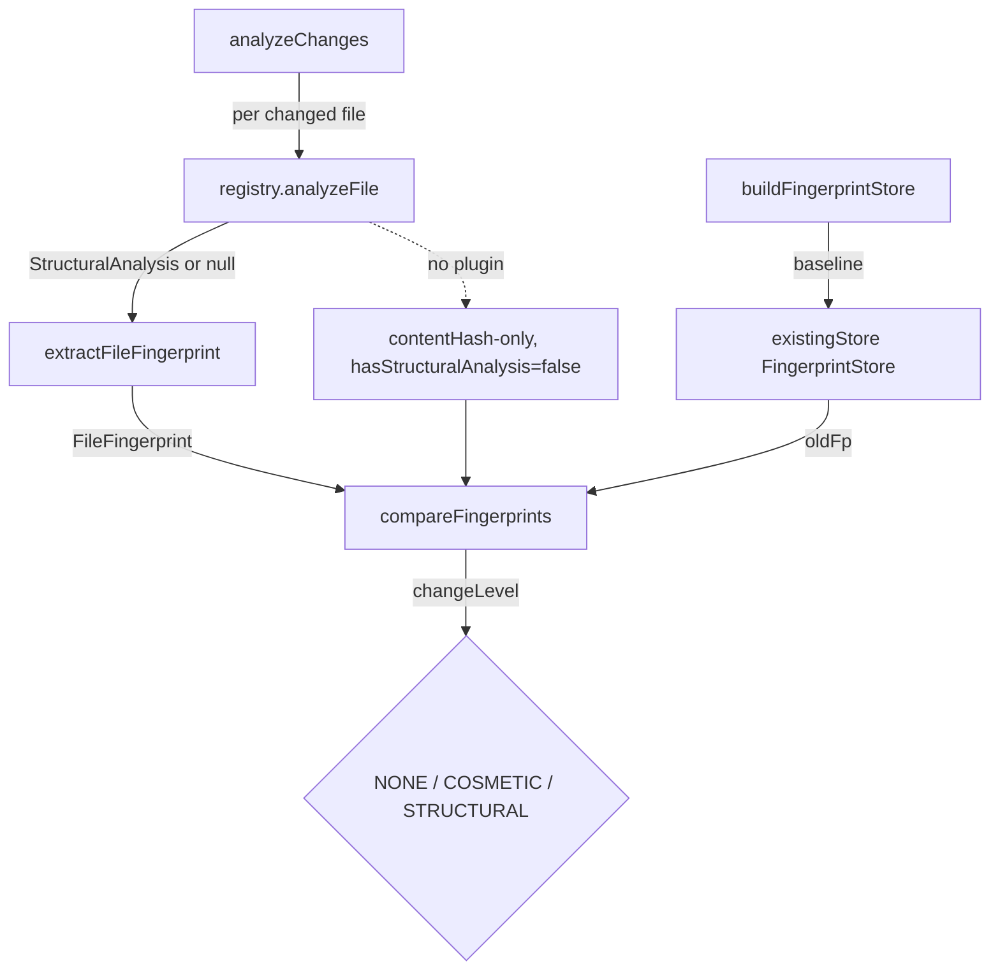

# Structural fingerprinting — change detection for incremental graph rebuilds

<!-- connect:up:begin -->
> **Cross-repo concept:** part of [incremental-reconcile](../../../concepts/incremental-reconcile.md) across this wiki's repos.
<!-- connect:up:end -->
## Overview
This module is Understand-Anything's **staleness gate**: the cheap, deterministic layer that decides *whether* the expensive LLM-driven knowledge-graph analysis needs to re-run for a given file. The key idea is that not all edits matter. A file whose bytes changed but whose public shape (function/class signatures, imports, exports) did not cannot affect the code graph, so it should never trigger a re-analysis. To make that call the module reduces each file to a **fingerprint** — a SHA-256 content hash plus the extracted structural signatures — and compares old against new to emit one of three verdicts: [`changeLevel`](../catalog/understand-anything-plugin/packages/core/src/fingerprint.ts.md#FileChangeResult.changeLevel) `NONE`, `COSMETIC`, or `STRUCTURAL`. Only `STRUCTURAL` (and new/deleted files) forces a rebuild; `NONE` and `COSMETIC` are free skips. This is the same "rebuild only the delta" economics that wikify-repo gets from `ingest --ref` — here it is homegrown, purely static, and language-agnostic.

## Diagram

## Design rationale (why it's built this way)
The whole module exists to keep the LLM out of the loop whenever it can be kept out. The author's docstring on [`extractFileFingerprint`](../catalog/understand-anything-plugin/packages/core/src/fingerprint.ts.md#extractFileFingerprint) states the intent precisely: the fingerprint "captures only the elements that affect the knowledge graph (function/class/import/export signatures), **not** implementation details." That single design choice is what makes the `COSMETIC` tier possible — a refactor inside a function body changes the [`contentHash`](../catalog/understand-anything-plugin/packages/core/src/fingerprint.ts.md#contentHash) but leaves every signature identical, so the graph is provably unaffected and the file is skipped.

The three-way [`changeLevel`](../catalog/understand-anything-plugin/packages/core/src/fingerprint.ts.md#FileChangeResult.changeLevel) enum is deliberately more expressive than a boolean "changed?". A binary flag would force every whitespace or comment edit to pay for a full re-analysis; the middle `COSMETIC` tier is the payoff of doing structural extraction at all.

A second, quieter decision is **conservatism under uncertainty**. When a file has no structural analysis — no language plugin matched it — the fingerprint records [`hasStructuralAnalysis`](../catalog/understand-anything-plugin/packages/core/src/fingerprint.ts.md#FileFingerprint.hasStructuralAnalysis) `false`, and [`compareFingerprints`](../catalog/understand-anything-plugin/packages/core/src/fingerprint.ts.md#compareFingerprints) refuses to guess: any content change on such a file is classified `STRUCTURAL`. The comment in source is explicit — "we cannot verify structure didn't change — classify as STRUCTURAL." The system would rather do redundant work than silently miss a real change, which is the correct bias for a cache-invalidation layer.

## Entry points
- [`buildFingerprintStore`](../catalog/understand-anything-plugin/packages/core/src/fingerprint.ts.md#buildFingerprintStore) — the baseline builder. Called once (per commit) to snapshot an entire file set into a [`FingerprintStore`](../catalog/understand-anything-plugin/packages/core/src/fingerprint.ts.md#FingerprintStore) keyed by path, stamped with the `gitCommitHash`. This is the "before" picture that later diffs compare against.
- [`analyzeChanges`](../catalog/understand-anything-plugin/packages/core/src/fingerprint.ts.md#analyzeChanges) — the incremental entry point. Given a list of `changedFiles` (typically from git) and the stored [`FingerprintStore`](../catalog/understand-anything-plugin/packages/core/src/fingerprint.ts.md#FingerprintStore), it re-fingerprints each and buckets the result into new / deleted / structural / cosmetic / unchanged. This is what the reconcile pipeline consults to decide what to re-analyze.
- [`extractFileFingerprint`](../catalog/understand-anything-plugin/packages/core/src/fingerprint.ts.md#extractFileFingerprint) — the reducer both entry points share: takes a file's content plus its [`StructuralAnalysis`](../catalog/understand-anything-plugin/packages/core/src/types.ts.md#StructuralAnalysis) and collapses them into a [`FileFingerprint`](../catalog/understand-anything-plugin/packages/core/src/fingerprint.ts.md#FileFingerprint).
- [`compareFingerprints`](../catalog/understand-anything-plugin/packages/core/src/fingerprint.ts.md#compareFingerprints) — the classifier: two fingerprints in, one [`changeLevel`](../catalog/understand-anything-plugin/packages/core/src/fingerprint.ts.md#FileChangeResult.changeLevel) verdict plus human-readable [`details`](../catalog/understand-anything-plugin/packages/core/src/fingerprint.ts.md#FileChangeResult.details) out.

## Mechanism (step-by-step)
1. **Produce structural signatures per file.** Both builders route each file's content through the plugin layer's [`analyzeFile`](../catalog/understand-anything-plugin/packages/core/src/plugins/registry.ts.md#PluginRegistry.analyzeFile), which selects a plugin via [`getPluginForFile`](../catalog/understand-anything-plugin/packages/core/src/plugins/registry.ts.md#PluginRegistry.getPluginForFile) → [`getForFile`](../catalog/understand-anything-plugin/packages/core/src/languages/language-registry.ts.md#LanguageRegistry.getForFile) and returns a [`StructuralAnalysis`](../catalog/understand-anything-plugin/packages/core/src/types.ts.md#StructuralAnalysis) or `null`. Crucially the fingerprint is language-agnostic: whether the signatures came from the WASM [`TreeSitterPlugin.analyzeFile`](../catalog/understand-anything-plugin/packages/core/src/plugins/tree-sitter-plugin.ts.md#TreeSitterPlugin.analyzeFile) (via an [`extractStructure`](../catalog/understand-anything-plugin/packages/core/src/plugins/extractors/types.ts.md#LanguageExtractor.extractStructure) extractor) or a hand-written parser like the Dockerfile/GraphQL/SQL implementations of [`analyzeFile`](../catalog/understand-anything-plugin/packages/core/src/plugins/parsers/dockerfile-parser.ts.md#DockerfileParser.analyzeFile), fingerprinting treats them identically.
2. **Reduce to a fingerprint.** [`extractFileFingerprint`](../catalog/understand-anything-plugin/packages/core/src/fingerprint.ts.md#extractFileFingerprint) hashes the content with [`contentHash`](../catalog/understand-anything-plugin/packages/core/src/fingerprint.ts.md#contentHash) (SHA-256) and projects the analysis into signature-only records: each function keeps its [`name`](../catalog/understand-anything-plugin/packages/core/src/fingerprint.ts.md#FunctionFingerprint.name), [`params`](../catalog/understand-anything-plugin/packages/core/src/types.ts.md#StructuralAnalysis.functions.Array.typeLiteral0.params), [`returnType`](../catalog/understand-anything-plugin/packages/core/src/types.ts.md#StructuralAnalysis.functions.Array.typeLiteral0.returnType) and a `lineCount` derived from [`lineRange`](../catalog/understand-anything-plugin/packages/core/src/types.ts.md#StructuralAnalysis.functions.Array.typeLiteral0.lineRange); classes keep their [`methods`](../catalog/understand-anything-plugin/packages/core/src/fingerprint.ts.md#ClassFingerprint.methods) and [`properties`](../catalog/understand-anything-plugin/packages/core/src/fingerprint.ts.md#ClassFingerprint.properties). An `exported` flag is computed by cross-referencing each name against the analysis [`exports`](../catalog/understand-anything-plugin/packages/core/src/types.ts.md#StructuralAnalysis.exports) set, so a symbol going from private to public counts as a structural change even if nothing else moved.
3. **Snapshot the baseline (`buildFingerprintStore`).** [`buildFingerprintStore`](../catalog/understand-anything-plugin/packages/core/src/fingerprint.ts.md#buildFingerprintStore) walks every path, skips ones that no longer exist, and for files with no matching plugin (analysis `null`) writes a degenerate fingerprint with empty structure arrays and [`hasStructuralAnalysis`](../catalog/understand-anything-plugin/packages/core/src/fingerprint.ts.md#FileFingerprint.hasStructuralAnalysis) `false`. The result is a [`FingerprintStore`](../catalog/understand-anything-plugin/packages/core/src/fingerprint.ts.md#FingerprintStore) — a `path → fingerprint` map plus version and commit provenance — which serializes to disk as the comparison baseline.
4. **Fast path on identical hashes.** [`compareFingerprints`](../catalog/understand-anything-plugin/packages/core/src/fingerprint.ts.md#compareFingerprints) first checks whether the old and new [`contentHash`](../catalog/understand-anything-plugin/packages/core/src/fingerprint.ts.md#FileFingerprint.contentHash) match; if so it returns `NONE` immediately, without touching structure. This is the cheapest possible cache hit and the common case for files git flagged only because of a rename or a sibling edit.
5. **Structural diff when content differs.** When hashes differ, [`compareFingerprints`](../catalog/understand-anything-plugin/packages/core/src/fingerprint.ts.md#compareFingerprints) compares signature sets: added/removed function and class names, per-function `params`/`returnType`/`exported` deltas, sorted method/property sets per class, and order-insensitive [`imports`](../catalog/understand-anything-plugin/packages/core/src/fingerprint.ts.md#FileFingerprint.imports)/[`exports`](../catalog/understand-anything-plugin/packages/core/src/fingerprint.ts.md#FileFingerprint.exports) comparison. Each divergence appends a line to [`details`](../catalog/understand-anything-plugin/packages/core/src/fingerprint.ts.md#FileChangeResult.details). If any detail was recorded the verdict is `STRUCTURAL`; if the content changed but every signature matched, the verdict is `COSMETIC` — the "internal logic changed" skip.
6. **Bucket the whole changeset (`analyzeChanges`).** [`analyzeChanges`](../catalog/understand-anything-plugin/packages/core/src/fingerprint.ts.md#analyzeChanges) drives the diff over every changed path: a file gone from disk but present in the store is a deletion (`STRUCTURAL`); a file absent from the store is new (`STRUCTURAL`); otherwise it re-fingerprints via [`extractFileFingerprint`](../catalog/understand-anything-plugin/packages/core/src/fingerprint.ts.md#extractFileFingerprint) and runs [`compareFingerprints`](../catalog/understand-anything-plugin/packages/core/src/fingerprint.ts.md#compareFingerprints), sorting each result into the `structurallyChangedFiles` / `cosmeticOnlyFiles` / `unchangedFiles` lists that the reconcile step reads to decide what to re-analyze.

## Key data structures
- [`FileFingerprint`](../catalog/understand-anything-plugin/packages/core/src/fingerprint.ts.md#FileFingerprint) — the per-file summary: [`filePath`](../catalog/understand-anything-plugin/packages/core/src/fingerprint.ts.md#FileFingerprint.filePath), [`contentHash`](../catalog/understand-anything-plugin/packages/core/src/fingerprint.ts.md#FileFingerprint.contentHash), the signature arrays ([`functions`](../catalog/understand-anything-plugin/packages/core/src/fingerprint.ts.md#FileFingerprint.functions), [`classes`](../catalog/understand-anything-plugin/packages/core/src/fingerprint.ts.md#FileFingerprint.classes), [`imports`](../catalog/understand-anything-plugin/packages/core/src/fingerprint.ts.md#FileFingerprint.imports), [`exports`](../catalog/understand-anything-plugin/packages/core/src/fingerprint.ts.md#FileFingerprint.exports)), a total line count, and the pivotal [`hasStructuralAnalysis`](../catalog/understand-anything-plugin/packages/core/src/fingerprint.ts.md#FileFingerprint.hasStructuralAnalysis) flag that switches the comparator between precise and conservative modes.
- [`FingerprintStore`](../catalog/understand-anything-plugin/packages/core/src/fingerprint.ts.md#FingerprintStore) — the serializable baseline: a versioned, commit-stamped `path → FileFingerprint` map. Its `gitCommitHash` field is what ties a stored graph to the exact source revision it was derived from.
- [`StructuralAnalysis`](../catalog/understand-anything-plugin/packages/core/src/types.ts.md#StructuralAnalysis) — the plugin-produced input, the shared vocabulary ([`functions`](../catalog/understand-anything-plugin/packages/core/src/types.ts.md#StructuralAnalysis.functions), [`classes`](../catalog/understand-anything-plugin/packages/core/src/types.ts.md#StructuralAnalysis.classes), [`imports`](../catalog/understand-anything-plugin/packages/core/src/types.ts.md#StructuralAnalysis.imports), [`exports`](../catalog/understand-anything-plugin/packages/core/src/types.ts.md#StructuralAnalysis.exports)) every language plugin must emit so fingerprinting can stay language-blind. Its optional [`sections`](../catalog/understand-anything-plugin/packages/core/src/types.ts.md#StructuralAnalysis.sections)/[`definitions`](../catalog/understand-anything-plugin/packages/core/src/types.ts.md#StructuralAnalysis.definitions) fields (used by config/markup parsers) are notably *not* projected into the fingerprint.

## Dynamics (design intent)
The comparability tells here — the axis that lines this tool up against wikify-repo and graphify — is the **grounding substrate**. Understand-Anything grounds on **tree-sitter structural extraction**, not a SCIP symbol index. [`getForFile`](../catalog/understand-anything-plugin/packages/core/src/languages/language-registry.ts.md#LanguageRegistry.getForFile) dispatches by filename-then-extension across a [`LanguageRegistry`](../catalog/understand-anything-plugin/packages/core/src/languages/language-registry.ts.md#LanguageRegistry) of [`LanguageConfig`](../catalog/understand-anything-plugin/packages/core/src/languages/types.ts.md#LanguageConfig) entries, and the resulting [`AnalyzerPlugin.analyzeFile`](../catalog/understand-anything-plugin/packages/core/src/types.ts.md#AnalyzerPlugin.analyzeFile) contract lets the fingerprint span WASM-parsed languages and regex-based config/markup parsers uniformly. The fingerprint is the incremental-reconcile mechanism built on top of that substrate: content-plus-signature hashing turns "which files changed meaningfully" into a pure static computation, so the LLM analysis budget is spent only on files that can actually move the graph.

The tests confirm the intended contract rather than timing: `contentHash` is asserted to be a stable 64-hex-char SHA-256, and [`extractFileFingerprint`](../catalog/understand-anything-plugin/packages/core/src/fingerprint.ts.md#extractFileFingerprint) is exercised against hand-built [`StructuralAnalysis`](../catalog/understand-anything-plugin/packages/core/src/types.ts.md#StructuralAnalysis) inputs (see the `fingerprint.test.ts` suite, which mocks `node:fs` so [`analyzeChanges`](../catalog/understand-anything-plugin/packages/core/src/fingerprint.ts.md#analyzeChanges) can be driven over synthetic file states).

## Edge cases
- **No plugin for a file type.** Analysis is `null`, so the fingerprint has empty signatures and [`hasStructuralAnalysis`](../catalog/understand-anything-plugin/packages/core/src/fingerprint.ts.md#FileFingerprint.hasStructuralAnalysis) `false`; [`compareFingerprints`](../catalog/understand-anything-plugin/packages/core/src/fingerprint.ts.md#compareFingerprints) then classifies *any* content change as `STRUCTURAL`. Such files can never be classified `COSMETIC`.
- **`lineCount` divergence is a soft heuristic — but still forces `STRUCTURAL`.** A shared function whose body grew or shrank by more than 50% is *reported* in [`details`](../catalog/understand-anything-plugin/packages/core/src/fingerprint.ts.md#FileChangeResult.details) and therefore tips the verdict to `STRUCTURAL`, even though a size change alone does not alter the signature. Large refactors of a function body thus do not stay `COSMETIC`.

  > [!inferred] This looks like a deliberate heuristic: a big body change often accompanies behavioral change worth re-analyzing, so the author chose to err toward rebuild. The source records it as a `significant size change` detail rather than a separate change tier.
- **Order-insensitive imports/exports.** Import specifiers and exports are sorted before comparison, so reordering imports or exports is *not* flagged — only genuine additions/removals are. Reordering *functions or classes* within a file, however, has no fingerprint effect at all since sets are name-keyed.
- **File deletions require store presence.** In [`analyzeChanges`](../catalog/understand-anything-plugin/packages/core/src/fingerprint.ts.md#analyzeChanges), a path that is absent from disk *and* absent from the store is silently ignored (not counted as deleted) — deletion is only recorded when the file existed in the prior [`FingerprintStore`](../catalog/understand-anything-plugin/packages/core/src/fingerprint.ts.md#FingerprintStore).

## Open questions
- The staleness consumers that turn a [`ChangeAnalysis`](../catalog/understand-anything-plugin/packages/core/src/fingerprint.ts.md#analyzeChanges) into an actual partial graph rebuild (the `getChangedFiles` / `isStale` / `mergeGraphUpdate` exports referenced from `index.ts`) are outside this packet's subgraph, so exactly how `cosmeticOnlyFiles` vs `structurallyChangedFiles` map to re-analysis work is not settled here.
- `gitCommitHash` is stored on the [`FingerprintStore`](../catalog/understand-anything-plugin/packages/core/src/fingerprint.ts.md#FingerprintStore) but not consulted anywhere in this module; whether staleness detection uses it as a coarse pre-filter before per-file diffing is not visible in this source.

## See also
- Symbol homes: [`fingerprint.ts` catalog](../catalog/understand-anything-plugin/packages/core/src/fingerprint.ts.md) · [`types.ts` catalog](../catalog/understand-anything-plugin/packages/core/src/types.ts.md) · [`registry.ts` catalog](../catalog/understand-anything-plugin/packages/core/src/plugins/registry.ts.md)
