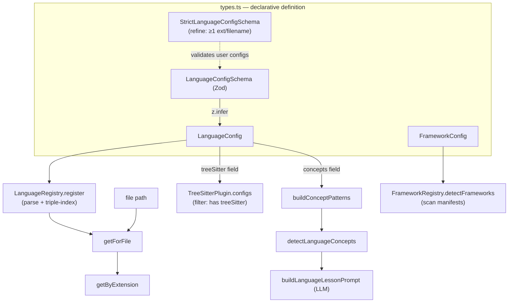

# Language & framework definitions — the declarative substrate for language-agnostic comprehension

<!-- connect:up:begin -->
> **Cross-repo concept:** part of [multi-language-extraction](../../../concepts/multi-language-extraction.md) across this wiki's repos.
<!-- connect:up:end -->
## Overview
This subsystem is the answer to the question the tool's name poses: how do you "understand *anything*"
without writing a bespoke analyzer per language? The design decision here is to make *what a language
is* into **declarative data** — a [`LanguageConfig`](../catalog/understand-anything-plugin/packages/core/src/languages/types.ts.md#LanguageConfig)
object (id, extensions, filenames, an optional tree-sitter grammar pointer, a list of idiomatic
*concepts*, and file-role patterns) — rather than into code. Adding Kotlin or Terraform support is
adding a config file, not editing the pipeline. A Zod schema
([`LanguageConfigSchema`](../catalog/understand-anything-plugin/packages/core/src/languages/types.ts.md#LanguageConfigSchema))
is both the runtime validator *and* the source of the TypeScript type, and two small registries turn
a flat list of ~40 configs into O(1) "given this file, which language / which frameworks?" lookups.
That config then fans out two ways: its `treeSitter` field drives structural extraction, and its
`concepts` field drives the LLM's language-specific "lessons".

For the cross-tool survey, this is understand-anything's **multi-language-extraction** seam. Where
wikify-repo/graphify ground on SCIP symbol monikers from a per-language indexer, understand-anything
grounds on a two-track substrate declared *in this file*: tree-sitter WASM grammars for languages that
have them, and LLM analysis (steered by declared concepts) for everything else — with a single
`LanguageConfig` shape unifying both tracks.

## Diagram

## Design rationale (why it's built this way)

**One schema, two artifacts (type + validator).** The type
[`LanguageConfig`](../catalog/understand-anything-plugin/packages/core/src/languages/types.ts.md#LanguageConfig)
is defined as `z.infer<typeof LanguageConfigSchema>` — the Zod object *is* the single source of truth,
and the compile-time type is derived from it. This means a config can never drift from its validator:
[`LanguageRegistry.register`](../catalog/understand-anything-plugin/packages/core/src/languages/language-registry.ts.md#LanguageRegistry.register)
calls `LanguageConfigSchema.parse(config)` at ingestion, so a malformed config fails loudly at
registration rather than producing a silently-wrong analysis downstream. This is the tool's grounding
gate for its language layer, analogous to a schema check on a symbol index.

**Two-tier schema — permissive base, strict for outsiders.** There are deliberately *two* schemas.
The base [`LanguageConfigSchema`](../catalog/understand-anything-plugin/packages/core/src/languages/types.ts.md#LanguageConfigSchema)
is what `register` uses and it does *not* require any extension or filename. The author's docstring on
[`StrictLanguageConfigSchema`](../catalog/understand-anything-plugin/packages/core/src/languages/types.ts.md#StrictLanguageConfigSchema)
explains why: *"ensures at least one extension or filename is provided so the config can actually be
detected… some builtin configs like kubernetes/github-actions intentionally lack both and rely on
future content-based detection."* So the base schema tolerates a config that can't yet be matched to a
file, while the strict refinement is the gate you apply to *new/user-supplied* configs to guarantee
they're detectable. The design accepts "known-undetectable" builtins as a forward-looking placeholder
rather than forbidding them.

**Language knowledge is split into structural and semantic tracks.** A `LanguageConfig` carries both a
`treeSitter` grammar pointer *and* a `concepts` list, and these feed entirely different consumers. The
`treeSitter` field is optional; the
[`TreeSitterPlugin` constructor](../catalog/understand-anything-plugin/packages/core/src/plugins/tree-sitter-plugin.ts.md#TreeSitterPlugin.-constructor)
filters the passed configs down to only those with it (`configs.filter((c) => c.treeSitter)`), and its
docstring notes that *"Languages without tree-sitter configs are gracefully skipped (the LLM agent
handles analysis for those)."* Meanwhile the `concepts` list is consumed by
[`buildConceptPatterns`](../catalog/understand-anything-plugin/packages/core/src/analyzer/language-lesson.ts.md#buildConceptPatterns).
The same declarative object thus decides both "can we parse this structurally?" and "what idioms should
the LLM explain?" — the two comprehension tracks share one definition.

> [!inferred]
> The `TreeSitterConfig` comment in source ("The extraction logic in tree-sitter-plugin.ts is currently
> TS/JS-specific… language-specific extractors should be registered via the customAnalyzer escape hatch")
> implies that although ~15 code languages ship a `treeSitter` grammar, only some have working structural
> extractors — the rest load a grammar but lean on extractors / LLM analysis. The exact per-language
> coverage is not settled by this subgraph.

**Frameworks are a separate axis from languages.** A [`FrameworkConfig`](../catalog/understand-anything-plugin/packages/core/src/languages/types.ts.md#FrameworkConfig)
is not detected by file extension at all; it declares `manifestFiles` and `detectionKeywords`, and
[`FrameworkRegistry.detectFrameworks`](../catalog/understand-anything-plugin/packages/core/src/languages/framework-registry.ts.md#FrameworkRegistry.detectFrameworks)
finds it by scanning manifest *contents* (e.g. "django" inside `requirements.txt`). Language ≈ "what
syntax is this file", framework ≈ "what runtime/idiom pervades this project" — two orthogonal questions
answered by two registries over two schemas.

## Entry points

- [`LanguageRegistry.getForFile`](../catalog/understand-anything-plugin/packages/core/src/languages/language-registry.ts.md#LanguageRegistry.getForFile)
  is the hot path of the whole subsystem: the analysis pipeline hands it a file path and gets back the
  `LanguageConfig` that should govern that file's extraction. Control reaches it once per file scanned.
  It resolves filename-first, then extension via
  [`getByExtension`](../catalog/understand-anything-plugin/packages/core/src/languages/language-registry.ts.md#LanguageRegistry.getByExtension).
- The [`TreeSitterPlugin` constructor](../catalog/understand-anything-plugin/packages/core/src/plugins/tree-sitter-plugin.ts.md#TreeSitterPlugin.-constructor)
  is where `LanguageConfig`s enter the *structural* track: it is handed the config list, keeps only
  grammar-bearing ones into its [`configs`](../catalog/understand-anything-plugin/packages/core/src/plugins/tree-sitter-plugin.ts.md#TreeSitterPlugin.configs)
  field, and derives its supported-languages and extension→language maps from them.
- [`buildLanguageLessonPrompt`](../catalog/understand-anything-plugin/packages/core/src/analyzer/language-lesson.ts.md#buildLanguageLessonPrompt)
  is where a `LanguageConfig` enters the *semantic* track: given a graph node it builds the LLM prompt
  that asks for a language-specific lesson, using the config's declared concepts (via
  [`detectLanguageConcepts`](../catalog/understand-anything-plugin/packages/core/src/analyzer/language-lesson.ts.md#detectLanguageConcepts))
  to pre-seed what the model should explain.
- [`FrameworkRegistry.detectFrameworks`](../catalog/understand-anything-plugin/packages/core/src/languages/framework-registry.ts.md#FrameworkRegistry.detectFrameworks)
  is the project-level entry: given a map of manifest filenames→contents, it returns which
  `FrameworkConfig`s the project uses. Called once during project scanning.

## Mechanism (step-by-step)

1. **Definition.** Each language ships as a `LanguageConfig`-shaped object in `src/languages/configs/`
   (e.g. `typescript.ts`,
   `python.ts`,
   and ~40 more), each conforming to the
   [`LanguageConfigSchema`](../catalog/understand-anything-plugin/packages/core/src/languages/types.ts.md#LanguageConfigSchema)
   shape. This is where a maintainer teaches the tool a new language — declaratively, no pipeline code.

2. **Registration + validation.** [`LanguageRegistry.register`](../catalog/understand-anything-plugin/packages/core/src/languages/language-registry.ts.md#LanguageRegistry.register)
   runs each config through `LanguageConfigSchema.parse` (throwing on any violation) and then indexes it
   *three ways*: by id, by extension (normalizing a leading dot), and by lowercased filename. The
   triple index is what makes later per-file lookup O(1) instead of a linear scan over 40 configs. The
   default registry is built by registering every entry the configs barrel
   (`configs/index.ts`)
   exports.

3. **File → language resolution.** For each scanned file,
   [`getForFile`](../catalog/understand-anything-plugin/packages/core/src/languages/language-registry.ts.md#LanguageRegistry.getForFile)
   tries the *basename* against the filename map first — this is deliberate, because `docker-compose.yml`
   or `Makefile` are more specific than their extension — then falls back to
   [`getByExtension`](../catalog/understand-anything-plugin/packages/core/src/languages/language-registry.ts.md#LanguageRegistry.getByExtension),
   which lowercases and dot-normalizes the extension before the map lookup. A file with neither a known
   filename nor a known extension returns `null` and is simply not language-typed.

4. **Structural track.** The resolved config's `treeSitter` grammar pointer is consumed by the
   [`TreeSitterPlugin` constructor](../catalog/understand-anything-plugin/packages/core/src/plugins/tree-sitter-plugin.ts.md#TreeSitterPlugin.-constructor),
   which filters to grammar-bearing configs into
   [`configs`](../catalog/understand-anything-plugin/packages/core/src/plugins/tree-sitter-plugin.ts.md#TreeSitterPlugin.configs)
   and builds its own extension→language table. Languages lacking a `treeSitter` field are silently
   dropped from structural parsing — the graceful-degradation path to LLM-only analysis.

5. **Semantic track.** In parallel, the config's `concepts` array flows into
   [`buildConceptPatterns`](../catalog/understand-anything-plugin/packages/core/src/analyzer/language-lesson.ts.md#buildConceptPatterns),
   which merges the ~12 language-agnostic `BASE_CONCEPT_PATTERNS` (async/await, generics, decorators…)
   with the config's own concepts (each concept name becomes its own detection keyword). Then
   [`detectLanguageConcepts`](../catalog/understand-anything-plugin/packages/core/src/analyzer/language-lesson.ts.md#detectLanguageConcepts)
   substring-matches those keyword sets against a node's tags/summary/languageNotes to decide which
   concepts are present, and
   [`buildLanguageLessonPrompt`](../catalog/understand-anything-plugin/packages/core/src/analyzer/language-lesson.ts.md#buildLanguageLessonPrompt)
   folds the detected concepts into the LLM prompt so the "lesson" targets idioms actually in the code.

6. **Framework detection.** Independently,
   [`FrameworkRegistry.detectFrameworks`](../catalog/understand-anything-plugin/packages/core/src/languages/framework-registry.ts.md#FrameworkRegistry.detectFrameworks)
   iterates its registered configs (stored in
   [`byId`](../catalog/understand-anything-plugin/packages/core/src/languages/framework-registry.ts.md#FrameworkRegistry.byId)),
   matches each config's `manifestFiles` against the supplied manifest map by basename-or-path-suffix,
   and does a case-insensitive substring search for any `detectionKeyword` in that manifest's content —
   short-circuiting to the next framework on first hit. Results feed project-level understanding
   (e.g. "this is a Django project").

## Key data structures

- **`LanguageConfig`** — `{ id, displayName, extensions[], filenames?, treeSitter?, concepts[], filePatterns }`.
  The `filePatterns` sub-object (entryPoints/barrels/tests/config globs) encodes file *roles* per
  language so the analyzer can distinguish an entry point from a test. `treeSitter` and `filenames` are
  optional, and their presence/absence is load-bearing (drives structural-vs-LLM and filename-vs-extension
  routing respectively). Type is [`LanguageConfig`](../catalog/understand-anything-plugin/packages/core/src/languages/types.ts.md#LanguageConfig).
- **`FrameworkConfig`** — `{ id, displayName, languages[], detectionKeywords[], manifestFiles[], promptSnippetPath, entryPoints?, layerHints? }`.
  Detection is content-based (`manifestFiles` + `detectionKeywords`); `promptSnippetPath` points to
  framework-specific LLM prompt material. Type is [`FrameworkConfig`](../catalog/understand-anything-plugin/packages/core/src/languages/types.ts.md#FrameworkConfig).
- **The registry indexes** — `LanguageRegistry` holds three `Map`s (byId/byExtension/byFilename);
  `FrameworkRegistry` holds byId and byLanguage. These are the runtime-resident lookup structures the
  per-file and per-project hot paths hit ([`getById`](../catalog/understand-anything-plugin/packages/core/src/languages/language-registry.ts.md#LanguageRegistry.getById),
  [`getForLanguage`](../catalog/understand-anything-plugin/packages/core/src/languages/framework-registry.ts.md#FrameworkRegistry.getForLanguage)).

## Dynamics (design intent)

The registries are plain in-memory `Map`s with no concurrency machinery — construction (`register` all
builtins) happens once up front, then reads dominate. The test suite
(`language-registry.test.ts`)
pins the intended semantics: `getByExtension(".ts")` and `.tsx` both resolve to `typescript`;
`getForFile` picks language by extension across a mixed set; unknown extensions and extension-less files
return `null`. Ordering intent is explicit in `getForFile`: filename match *wins over* extension match.
[`FrameworkRegistry.register`](../catalog/understand-anything-plugin/packages/core/src/languages/framework-registry.ts.md#FrameworkRegistry.register)
is idempotent (it early-returns on a duplicate id), which matters because a framework can be listed
under multiple languages and would otherwise be indexed twice.

## Edge cases

- **Deliberately undetectable configs.** kubernetes/github-actions ship with no extensions *and* no
  filenames, so [`getForFile`](../catalog/understand-anything-plugin/packages/core/src/languages/language-registry.ts.md#LanguageRegistry.getForFile)
  will never return them (they'd only be reached via `getById`). They pass the base schema but would
  *fail* [`StrictLanguageConfigSchema`](../catalog/understand-anything-plugin/packages/core/src/languages/types.ts.md#StrictLanguageConfigSchema)
  — an intentional gap awaiting content-based detection.
- **Extension case sensitivity.** `register` stores extension keys without lowercasing, while
  [`getByExtension`](../catalog/understand-anything-plugin/packages/core/src/languages/language-registry.ts.md#LanguageRegistry.getByExtension)
  lowercases the *lookup*. Configs are therefore expected to declare lowercase extensions; an uppercase
  declared extension would silently never match.
- **No dedup in the language registry.** Unlike `FrameworkRegistry.register`,
  [`LanguageRegistry.register`](../catalog/understand-anything-plugin/packages/core/src/languages/language-registry.ts.md#LanguageRegistry.register)
  does not guard against duplicate ids/extensions — a later config with the same extension overwrites the
  earlier one in `byExtension` (registration order decides the winner).
- **Concept keyword collisions.** [`buildConceptPatterns`](../catalog/understand-anything-plugin/packages/core/src/analyzer/language-lesson.ts.md#buildConceptPatterns)
  only adds a language concept if its name isn't already a base pattern key, and uses the bare concept
  name (lowercased) as its sole keyword — so a config concept that duplicates a base name is ignored, and
  short concept names risk broad substring false-positives in `detectLanguageConcepts`.

## Open questions

- The `treeSitter` field is present on many configs, but the source comment says structural extraction is
  "currently TS/JS-specific." Exactly which languages have working extractors vs. grammar-only vs.
  LLM-only is not resolvable from this subgraph (see the extractor pages).
- `FrameworkConfig.promptSnippetPath` and `layerHints` are declared here but their consumers are outside
  this packet — how framework-specific prompt material is loaded and injected is not visible.
- "Future content-based detection" for filename/extension-less configs (kubernetes, etc.) is referenced in
  the docstring but not implemented in any symbol in this subgraph.

## See also
- [tree-sitter-plugin](./understand-anything-plugin-packages-core-src-plugins-tree-sitter-plugin.ts.md) — the structural-extraction consumer of `LanguageConfig.treeSitter`.
- [base-extractor](./understand-anything-plugin-packages-core-src-plugins-extractors-base-extractor.ts.md) — per-language structural extractors behind the tree-sitter track.
- [registry](./understand-anything-plugin-packages-core-src-plugins-registry.ts.md) — the analyzer plugin registry.
- [extractor types](./understand-anything-plugin-packages-core-src-plugins-extractors-types.ts.md) — the `LanguageExtractor` interface.
- [graph-builder](./understand-anything-plugin-packages-core-src-analyzer-graph-builder.ts.md) — assembles the knowledge graph these configs help populate.
