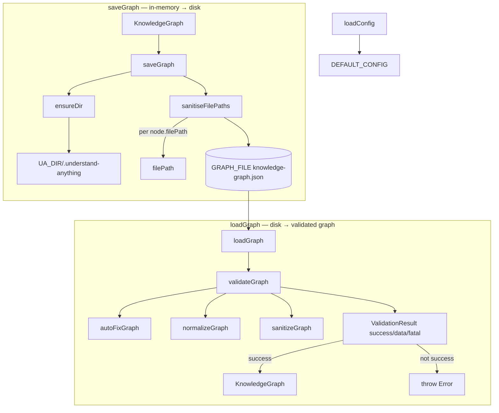

# Persistence — the on-disk home of the knowledge graph

<!-- connect:up:begin -->
> **Cross-repo concept:** part of [incremental-reconcile](../../../concepts/incremental-reconcile.md) across this wiki's repos.
<!-- connect:up:end -->
## Overview
This module is the boundary where Understand-Anything's in-memory *understanding* of a
codebase becomes a durable artifact and back again. An analysis run produces a
[`KnowledgeGraph`](../catalog/understand-anything-plugin/packages/core/src/types.ts.md#KnowledgeGraph) —
LLM-authored nodes (files, domains) and edges (imports, calls, relationships) with prose
summaries — and this file serializes it as plain JSON under a `.understand-anything/`
directory inside the analyzed project. The single design idea is that the graph is the
*product*, not a transient: once written, it is re-read by the dashboard, by later
analysis runs, and by anyone who checks the JSON into their repo. Two things make the
boundary trustworthy rather than a naive `JSON.stringify`: **paths are sanitized on the
way out** (via [`sanitiseFilePaths`](../catalog/understand-anything-plugin/packages/core/src/persistence/index.ts.md#sanitiseFilePaths))
so the file is safe to commit and serve, and **the graph is validated on the way in**
(via [`validateGraph`](../catalog/understand-anything-plugin/packages/core/src/schema.ts.md#validateGraph))
so a hand-edited or model-drifted file is repaired or rejected before it reaches a
consumer.

Comprehension lens: where wikify-repo grounds its wiki in a SCIP symbol index and
graphify builds a community-detected graph, Understand-Anything's substrate is this
LLM-authored graph persisted as versioned JSON. Persisting it — alongside `config.json`,
`meta.json`, and `fingerprints.json` written by sibling functions in this same file — is
what lets a re-run compare against prior state instead of re-analyzing from scratch, and
what makes the whole analysis a shareable, diffable file rather than a one-shot answer.

## Diagram

## Design rationale (why it's built this way)
The most revealing decision is the FIX comment on
[`saveGraph`](../catalog/understand-anything-plugin/packages/core/src/persistence/index.ts.md#saveGraph):
absolute paths were being written verbatim into `knowledge-graph.json` and later served by
the dashboard server, leaking the developer's home directory, username, and company
directory layout. The author's docstring on
[`sanitiseFilePaths`](../catalog/understand-anything-plugin/packages/core/src/persistence/index.ts.md#sanitiseFilePaths)
states the intent directly — "Sanitise every node's filePath before writing to disk" — and
enumerates three cases: a path inside the project root becomes relative, an absolute path
*outside* the root is reduced to its bare filename ("so we leak as little as possible"),
and an already-relative path is left alone. This is a privacy/portability decision baked
into the write path so that the on-disk graph is safe to commit and safe to ship over HTTP;
it is not the consumer's job to clean up after the model.

The second decision is asymmetric trust between write and read. Writes are trusted (the
graph came from Understand-Anything's own pipeline, so `saveGraph` only sanitizes), but
reads are treated as adversarial: `loadGraph` defaults `validate` to on and runs the graph
through [`validateGraph`](../catalog/understand-anything-plugin/packages/core/src/schema.ts.md#validateGraph),
a tiered repair-and-reject pipeline. This matters because the JSON is expected to be
hand-editable and checked into repos — a human or a diff or an older tool version can
produce a graph that no longer matches the current schema, and the loader must cope. The
`validate: false` escape hatch exists for callers that already trust the bytes (tests,
internal round-trips) and want to skip the cost.

> [!inferred]
> The choice of pretty-printed JSON (`JSON.stringify(sanitised, null, 2)`) rather than a
> compact or binary format reads as a deliberate bet on human-readability and
> version-control diffability — the graph is meant to be reviewed and committed, not just
> machine-loaded — but the source states only the two-space indent, not the motivation.

## Entry points
- [`saveGraph`](../catalog/understand-anything-plugin/packages/core/src/persistence/index.ts.md#saveGraph) — the write boundary. Reached at the end of an analysis run to persist the assembled codebase graph. It ensures `.understand-anything/` exists via [`ensureDir`](../catalog/understand-anything-plugin/packages/core/src/persistence/index.ts.md#ensureDir), rewrites every node's path through [`sanitiseFilePaths`](../catalog/understand-anything-plugin/packages/core/src/persistence/index.ts.md#sanitiseFilePaths), and writes pretty-printed JSON to [`GRAPH_FILE`](../catalog/understand-anything-plugin/packages/core/src/persistence/index.ts.md#GRAPH_FILE) (`knowledge-graph.json`). The parallel `saveDomainGraph` (not in subgraph) writes the same sanitized shape to `domain-graph.json`.
- [`loadGraph`](../catalog/understand-anything-plugin/packages/core/src/persistence/index.ts.md#loadGraph) — the read boundary. Reached by the dashboard, by staleness checks, and by any re-run that wants prior state. Returns `null` when no graph exists yet (first run), otherwise parses the JSON and — unless [`validate`](../catalog/understand-anything-plugin/packages/core/src/persistence/index.ts.md#loadGraph.options-typeLiteral29.validate) is explicitly `false` — pushes it through validation before handing back a typed [`KnowledgeGraph`](../catalog/understand-anything-plugin/packages/core/src/types.ts.md#KnowledgeGraph).
- [`loadDomainGraph`](../catalog/understand-anything-plugin/packages/core/src/persistence/index.ts.md#loadDomainGraph) — the same read path aimed at [`DOMAIN_GRAPH_FILE`](../catalog/understand-anything-plugin/packages/core/src/persistence/index.ts.md#DOMAIN_GRAPH_FILE) (`domain-graph.json`), the higher-level domain/concept view rather than the structural code graph. Its own [`validate`](../catalog/understand-anything-plugin/packages/core/src/persistence/index.ts.md#loadDomainGraph.options-typeLiteral63.validate) flag mirrors `loadGraph`, and `domain-persistence.test.ts` exercises a `type: "domain"` node round-trip through it.
- [`loadConfig`](../catalog/understand-anything-plugin/packages/core/src/persistence/index.ts.md#loadConfig) — reads per-project settings from `config.json`, falling back to [`DEFAULT_CONFIG`](../catalog/understand-anything-plugin/packages/core/src/persistence/index.ts.md#DEFAULT_CONFIG) when the file is absent or unparseable. This governs run behavior such as `autoUpdate` and `outputLanguage`.

## Mechanism (step-by-step)
1. **Locate and materialize the store.** Every path in this module is anchored at
   [`UA_DIR`](../catalog/understand-anything-plugin/packages/core/src/persistence/index.ts.md#UA_DIR)
   (`.understand-anything`) joined to the analyzed project's root — the graph lives *with*
   the code it describes, not in a global cache.
   [`ensureDir`](../catalog/understand-anything-plugin/packages/core/src/persistence/index.ts.md#ensureDir)
   creates that directory recursively on demand, so a write never fails on a fresh project.
   The filenames are fixed constants —
   [`GRAPH_FILE`](../catalog/understand-anything-plugin/packages/core/src/persistence/index.ts.md#GRAPH_FILE),
   [`DOMAIN_GRAPH_FILE`](../catalog/understand-anything-plugin/packages/core/src/persistence/index.ts.md#DOMAIN_GRAPH_FILE),
   and [`CONFIG_FILE`](../catalog/understand-anything-plugin/packages/core/src/persistence/index.ts.md#CONFIG_FILE) —
   so a consumer can find the artifact by convention.

2. **Sanitize paths on write.**
   [`saveGraph`](../catalog/understand-anything-plugin/packages/core/src/persistence/index.ts.md#saveGraph)
   never serializes the raw graph. It first maps every node through
   [`sanitiseFilePaths`](../catalog/understand-anything-plugin/packages/core/src/persistence/index.ts.md#sanitiseFilePaths),
   which inspects each node's
   [`filePath`](../catalog/understand-anything-plugin/packages/core/src/types.ts.md#GraphNode.filePath):
   relative paths pass through untouched, absolute paths under the project root are made
   relative, and absolute paths *outside* the root collapse to just their basename. The
   result is a new graph object (nodes are copied, not mutated), so the caller's in-memory
   graph keeps its absolute paths while the disk copy carries only project-relative ones.

3. **Serialize.** The sanitized graph is written with two-space-indented JSON to the graph
   file inside the ensured directory, still in
   [`saveGraph`](../catalog/understand-anything-plugin/packages/core/src/persistence/index.ts.md#saveGraph).
   This is the artifact the dashboard reads and the developer commits.

4. **Load with an existence gate.**
   [`loadGraph`](../catalog/understand-anything-plugin/packages/core/src/persistence/index.ts.md#loadGraph)
   returns `null` immediately when the file does not exist — the caller reads this as "no
   prior analysis," the signal that distinguishes a first run from a re-run. Otherwise it
   parses the JSON into a raw
   [`data`](../catalog/understand-anything-plugin/packages/core/src/schema.ts.md#ValidationResult.data)
   value. [`loadDomainGraph`](../catalog/understand-anything-plugin/packages/core/src/persistence/index.ts.md#loadDomainGraph)
   performs the identical gate against the domain file.

5. **Validate, repair, or reject on load.** Unless the caller passes
   [`validate: false`](../catalog/understand-anything-plugin/packages/core/src/persistence/index.ts.md#loadGraph.options-typeLiteral29.validate),
   the parsed data is handed to
   [`validateGraph`](../catalog/understand-anything-plugin/packages/core/src/schema.ts.md#validateGraph),
   which runs a tiered pipeline:
   [`sanitizeGraph`](../catalog/understand-anything-plugin/packages/core/src/schema.ts.md#sanitizeGraph)
   (null→empty-array/undefined, lowercasing enum-like strings),
   [`normalizeGraph`](../catalog/understand-anything-plugin/packages/core/src/schema.ts.md#normalizeGraph)
   (mapping legacy type names via
   [`NODE_TYPE_ALIASES`](../catalog/understand-anything-plugin/packages/core/src/schema.ts.md#NODE_TYPE_ALIASES) /
   [`EDGE_TYPE_ALIASES`](../catalog/understand-anything-plugin/packages/core/src/schema.ts.md#EDGE_TYPE_ALIASES)),
   then [`autoFixGraph`](../catalog/understand-anything-plugin/packages/core/src/schema.ts.md#autoFixGraph)
   which fills defaults (missing `type` → `"file"`, missing `complexity` → `"moderate"`)
   and records each repair as a
   [`GraphIssue`](../catalog/understand-anything-plugin/packages/core/src/schema.ts.md#GraphIssue).

6. **Branch on the verdict.** `validateGraph` returns a
   [`ValidationResult`](../catalog/understand-anything-plugin/packages/core/src/schema.ts.md#ValidationResult).
   When [`success`](../catalog/understand-anything-plugin/packages/core/src/schema.ts.md#ValidationResult.success)
   is true, `loadGraph` returns the repaired
   [`data`](../catalog/understand-anything-plugin/packages/core/src/schema.ts.md#ValidationResult.data)
   cast to `KnowledgeGraph`. When it is false — malformed collections (caught by
   [`buildInvalidCollectionIssue`](../catalog/understand-anything-plugin/packages/core/src/schema.ts.md#buildInvalidCollectionIssue)),
   missing project metadata, or a non-object input — the loader throws with the
   [`fatal`](../catalog/understand-anything-plugin/packages/core/src/schema.ts.md#ValidationResult.fatal)
   message, so a corrupt graph fails loudly at the boundary rather than propagating garbage.

7. **Config loads defensively.**
   [`loadConfig`](../catalog/understand-anything-plugin/packages/core/src/persistence/index.ts.md#loadConfig)
   treats a missing *or* unparseable `config.json` identically: it returns a fresh spread
   of [`DEFAULT_CONFIG`](../catalog/understand-anything-plugin/packages/core/src/persistence/index.ts.md#DEFAULT_CONFIG)
   (`{ autoUpdate: false, outputLanguage: "en" }`). Unlike graph loading, a bad config is
   never fatal — the tool would rather run with defaults than refuse to start.

## Key data structures
- [`KnowledgeGraph`](../catalog/understand-anything-plugin/packages/core/src/types.ts.md#KnowledgeGraph) —
  the unit of persistence: `version`, an optional `kind` (`"codebase" | "knowledge"`),
  `project` metadata, and four parallel collections — `nodes`, `edges`, `layers`, `tour`.
  Both the structural graph and the domain graph share this one type; only the file they
  land in and the node `type` values differ.
- [`GraphNode`](../catalog/understand-anything-plugin/packages/core/src/types.ts.md#GraphNode) —
  a node carries an `id`, `type`, `name`, prose `summary`, `tags`, a `complexity` rating,
  and an optional [`filePath`](../catalog/understand-anything-plugin/packages/core/src/types.ts.md#GraphNode.filePath).
  That `filePath` is the one field `sanitiseFilePaths` rewrites, and the one the dashboard's
  path allowlist keys off, which is why leaking absolute paths mattered.
- [`ValidationResult`](../catalog/understand-anything-plugin/packages/core/src/schema.ts.md#ValidationResult) —
  the loader's verdict object:
  [`success`](../catalog/understand-anything-plugin/packages/core/src/schema.ts.md#ValidationResult.success),
  the repaired [`data`](../catalog/understand-anything-plugin/packages/core/src/schema.ts.md#ValidationResult.data),
  a list of [`issues`](../catalog/understand-anything-plugin/packages/core/src/schema.ts.md#ValidationResult.issues)
  ([`GraphIssue`](../catalog/understand-anything-plugin/packages/core/src/schema.ts.md#GraphIssue) with
  [`level`](../catalog/understand-anything-plugin/packages/core/src/schema.ts.md#GraphIssue.level),
  [`category`](../catalog/understand-anything-plugin/packages/core/src/schema.ts.md#GraphIssue.category),
  [`message`](../catalog/understand-anything-plugin/packages/core/src/schema.ts.md#GraphIssue.message),
  [`path`](../catalog/understand-anything-plugin/packages/core/src/schema.ts.md#GraphIssue.path)),
  and the [`fatal`](../catalog/understand-anything-plugin/packages/core/src/schema.ts.md#ValidationResult.fatal)
  string that `loadGraph` surfaces on failure.
- [`ProjectConfig`](../catalog/understand-anything-plugin/packages/core/src/types.ts.md#ProjectConfig) —
  the small settings record ([`autoUpdate`](../catalog/understand-anything-plugin/packages/core/src/types.ts.md#ProjectConfig.autoUpdate),
  [`outputLanguage`](../catalog/understand-anything-plugin/packages/core/src/types.ts.md#ProjectConfig.outputLanguage))
  whose absent-file fallback is [`DEFAULT_CONFIG`](../catalog/understand-anything-plugin/packages/core/src/persistence/index.ts.md#DEFAULT_CONFIG).

## Dynamics (design intent)
The tests pin the round-trip contract. `persistence.test.ts` writes a sample
[`KnowledgeGraph`](../catalog/understand-anything-plugin/packages/core/src/types.ts.md#KnowledgeGraph)
into a temp directory with
[`saveGraph`](../catalog/understand-anything-plugin/packages/core/src/persistence/index.ts.md#saveGraph)
and reads it back with
[`loadGraph`](../catalog/understand-anything-plugin/packages/core/src/persistence/index.ts.md#loadGraph),
and its sample node uses an already-relative
[`filePath`](../catalog/understand-anything-plugin/packages/core/src/types.ts.md#GraphNode.filePath)
(`src/index.ts`) — the case `sanitiseFilePaths` must leave untouched. `domain-persistence.test.ts`
saves and loads a `type: "domain"` node through
[`loadDomainGraph`](../catalog/understand-anything-plugin/packages/core/src/persistence/index.ts.md#loadDomainGraph)
and asserts the node id survives, confirming the domain and codebase graphs share one
serialization path but two files. Both tests use fresh temp dirs per case, which
demonstrates the intended isolation: persistence is keyed entirely on `projectRoot`, with no
shared global state between projects.

> [!inferred]
> Because the store is per-project and identified only by the presence of files under
> `.understand-anything/`, a re-run's ability to do incremental work rests on `loadGraph`
> returning the prior graph (and the sibling `loadFingerprints`/`loadMeta`, outside this
> subgraph, returning prior hashes/metadata). This module supplies the substrate for
> incremental reconcile rather than the reconcile logic itself.

## Edge cases
- **First run vs. re-run.** A missing graph file makes `loadGraph`/`loadDomainGraph` return
  `null`, not throw — the caller must handle `null` as "nothing analyzed yet."
- **Absolute paths outside the project.** `sanitiseFilePaths` deliberately keeps only the
  basename for such nodes, so a node pointing at a system or dependency file outside the
  root loses its directory context in the persisted graph (intentional, to minimize leakage).
- **Corrupt or drifted graph.** With validation on (the default), a structurally invalid
  graph throws via the
  [`fatal`](../catalog/understand-anything-plugin/packages/core/src/schema.ts.md#ValidationResult.fatal)
  message; recoverable problems are silently auto-fixed by
  [`autoFixGraph`](../catalog/understand-anything-plugin/packages/core/src/schema.ts.md#autoFixGraph)
  and recorded as issues rather than surfaced to the loader's return value.
- **Bad config never blocks.** A malformed `config.json` is swallowed by
  [`loadConfig`](../catalog/understand-anything-plugin/packages/core/src/persistence/index.ts.md#loadConfig)'s
  `try/catch` and replaced with defaults — asymmetric with graph loading, which is strict.
- **Trailing slash in `projectRoot`.** `sanitiseFilePaths` normalizes the root with and
  without a trailing `/` before the prefix check, so both forms classify inside-root paths
  correctly.

## Open questions
- The persisted issue list from `autoFixGraph` is not returned by `loadGraph` (only the
  repaired data or a throw). Where — if anywhere — those auto-correction warnings surface to
  the user (e.g. the dashboard's error banner) is not settled by this file.
- `saveGraph` writes but never prunes: whether stale nodes from a prior run are removed on
  re-analysis, or whether reconcile happens upstream before `saveGraph` is called, depends on
  callers (`loadFingerprints`/`saveFingerprints`, `loadMeta`) that are outside this packet's
  subgraph.

## See also
- [`persistence/index.ts` catalog](../catalog/understand-anything-plugin/packages/core/src/persistence/index.ts.md) — every symbol in this module with signatures and source links.
- [`schema.ts` catalog](../catalog/understand-anything-plugin/packages/core/src/schema.ts.md) — the validation/repair pipeline (`validateGraph`, `autoFixGraph`, `sanitizeGraph`, `normalizeGraph`) invoked on load.
