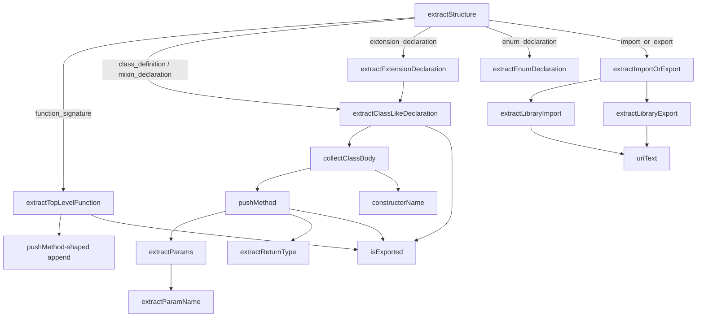

# Dart extractor — Dart AST to structural graph

<!-- connect:up:begin -->
> **Cross-repo concept:** part of [multi-language-extraction](../../../concepts/multi-language-extraction.md) across this wiki's repos.
<!-- connect:up:end -->
How Understand-Anything turns a Dart file into the language-neutral `StructuralAnalysis` record that feeds its knowledge graph: one of several per-language plugins that each translate a tree-sitter parse tree into the same four buckets — functions, classes, imports, exports.

## Overview

This is a **concrete language plugin** in Understand-Anything's multi-language extraction layer. Its whole job is to reduce a Dart concrete-syntax tree (produced by `web-tree-sitter` against the Dart WASM grammar) to the *same* shape every other extractor produces: [`StructuralAnalysis`](../catalog/understand-anything-plugin/packages/core/src/types.ts.md#StructuralAnalysis), a flat record of [`functions`](../catalog/understand-anything-plugin/packages/core/src/types.ts.md#StructuralAnalysis.functions), [`classes`](../catalog/understand-anything-plugin/packages/core/src/types.ts.md#StructuralAnalysis.classes), [`imports`](../catalog/understand-anything-plugin/packages/core/src/types.ts.md#StructuralAnalysis.imports), and [`exports`](../catalog/understand-anything-plugin/packages/core/src/types.ts.md#StructuralAnalysis.exports). The grounding substrate here is **the tree-sitter parse tree plus positional line ranges** — not a compiler symbol table, not embeddings. That is the key comparability axis with the other surveyed tools: where wikify-repo grounds on a SCIP index (resolved cross-file monikers) and graphify builds a semantic graph, this extractor grounds purely on *syntax* — node types and text, walked child-by-child.

The single design idea is a **dispatch-on-node-type walk**: [`extractStructure`](../catalog/understand-anything-plugin/packages/core/src/plugins/extractors/dart-extractor.ts.md#DartExtractor.extractStructure) switches over the top-level children of the root, and each declaration kind (class, mixin, extension, enum, function, import/export) routes to a handler that appends to the shared arrays. All the difficulty lives below that switch, in matching Dart's grammar shapes — the many wrapper nodes tree-sitter interposes around methods, getters, setters, constructors, and combinators.

## Diagram

## Design rationale (why it's built this way)

**Why one flat schema for every language.** The extractor implements the [`LanguageExtractor.extractStructure`](../catalog/understand-anything-plugin/packages/core/src/plugins/extractors/types.ts.md#LanguageExtractor.extractStructure) contract, whose docstring is verbatim identical to the Dart method's — *"Extract functions, classes, imports, exports from the root AST node."* This is the plugin seam: the graph builder never knows it is looking at Dart. That forces per-language *impedance matching* — Dart concepts with no schema slot get folded into the nearest bucket. The class docstring states the policy plainly: *"mixin / extension / enum declarations are folded into `StructuralAnalysis.classes[]` because the shared schema does not have a first-class slot for them."* So [`extractClassLikeDeclaration`](../catalog/understand-anything-plugin/packages/core/src/plugins/extractors/dart-extractor.ts.md#DartExtractor.extractClassLikeDeclaration) is deliberately generic over a `bodyNodeType` parameter (`"class_body"` for classes and mixins, `"extension_body"` for extensions) precisely so one routine serves several Dart constructs.

**Why name-based visibility.** [`isExported`](../catalog/understand-anything-plugin/packages/core/src/plugins/extractors/dart-extractor.ts.md#isExported) is a one-liner — `!name.startsWith("_")` — because Dart has no `public`/`private` keyword. The docstring calls out that this rule is *"the INVERSE of Kotlin's"*: there is no modifier to inspect, only the leading underscore. This is a good illustration of why extraction must be per-language: the same abstract question ("is this exported?") has a completely different syntactic answer in each grammar.

**Why anonymous constructs get synthetic names.** [`extractExtensionDeclaration`](../catalog/understand-anything-plugin/packages/core/src/plugins/extractors/dart-extractor.ts.md#DartExtractor.extractExtensionDeclaration) invents the name `"on <TargetType>"` for a nameless extension. The comment gives the reason: *"Name the entry 'on <TargetType>' so the graph builder doesn't drop it for having an empty name."* An empty-named node would be silently pruned downstream — so the extractor must guarantee every emitted entry has a non-empty `name`. That is a grounding decision made *for the graph's benefit*, at extraction time.

**Why so many wrapper-unwrapping helpers.** Dart's tree-sitter grammar wraps the same logical thing (a function signature) in different parent shapes depending on context — `method_signature > function_signature` for concrete methods, `declaration > function_signature` for abstract ones, and separate `getter_signature` / `setter_signature` / `factory_constructor_signature` nodes. The bulk of [`collectClassBody`](../catalog/understand-anything-plugin/packages/core/src/plugins/extractors/dart-extractor.ts.md#collectClassBody) is a cascade of `findChild` probes that peel these wrappers to reach the inner signature before naming it. This is the real cost of syntax-only grounding: correctness depends on encoding the grammar's exact tree shapes by hand.

## Entry points

- [`DartExtractor.extractStructure`](../catalog/understand-anything-plugin/packages/core/src/plugins/extractors/dart-extractor.ts.md#DartExtractor.extractStructure) — the sole public entry, reached once per Dart file when the analysis pipeline finds a `.dart` file (the class advertises `languageIds = ["dart"]`). It receives the tree-sitter root node, allocates the four output arrays, iterates the root's direct children, and dispatches each by `node.type`. It implements the shared [`LanguageExtractor.extractStructure`](../catalog/understand-anything-plugin/packages/core/src/plugins/extractors/types.ts.md#LanguageExtractor.extractStructure) interface, which is how the language-agnostic graph builder invokes it without knowing it is Dart.

## Mechanism (step-by-step)

1. **Top-level dispatch.** [`extractStructure`](../catalog/understand-anything-plugin/packages/core/src/plugins/extractors/dart-extractor.ts.md#DartExtractor.extractStructure) walks `rootNode`'s children with an index loop (not a recursive descent) and `switch`es on `node.type`. Only six top-level kinds are recognized; anything else is ignored. This shallow-then-delegate structure keeps the routing legible and pushes all grammar knowledge into the handlers. The four accumulator arrays it allocates *are* the return value — [`StructuralAnalysis`](../catalog/understand-anything-plugin/packages/core/src/types.ts.md#StructuralAnalysis) is assembled by mutation, not by merging sub-results.

2. **Top-level functions.** [`extractTopLevelFunction`](../catalog/understand-anything-plugin/packages/core/src/plugins/extractors/dart-extractor.ts.md#DartExtractor.extractTopLevelFunction) names the function via [`extractFunctionName`](../catalog/understand-anything-plugin/packages/core/src/plugins/extractors/dart-extractor.ts.md#extractFunctionName) (the first `identifier` child), bails if unnamed, then appends a [`functions`](../catalog/understand-anything-plugin/packages/core/src/types.ts.md#StructuralAnalysis.functions) entry whose [`lineRange`](../catalog/understand-anything-plugin/packages/core/src/types.ts.md#StructuralAnalysis.functions.Array.typeLiteral0.lineRange) is `[startRow+1, endRow+1]` — the `+1` converts tree-sitter's 0-based rows to human 1-based line numbers, which is the graph's anchor back to source.

3. **Class-like declarations.** [`extractClassLikeDeclaration`](../catalog/understand-anything-plugin/packages/core/src/plugins/extractors/dart-extractor.ts.md#DartExtractor.extractClassLikeDeclaration) resolves the class name — from an explicit `nameOverride` if given (the anonymous-extension path), else the first `identifier` child via [`findChild`](../catalog/understand-anything-plugin/packages/core/src/plugins/extractors/base-extractor.ts.md#findChild). It locates the body by the parameterized `bodyNodeType`, delegates member collection to `collectClassBody`, then pushes a [`classes`](../catalog/understand-anything-plugin/packages/core/src/types.ts.md#StructuralAnalysis.classes) entry carrying the collected [`methods`](../catalog/understand-anything-plugin/packages/core/src/types.ts.md#StructuralAnalysis.classes.Array.typeLiteral1.methods) and [`properties`](../catalog/understand-anything-plugin/packages/core/src/types.ts.md#StructuralAnalysis.classes.Array.typeLiteral1.properties) name lists. Note the schema keeps members as bare *name strings*, not nested records — the full per-method entry goes into the flat `functions[]` array instead, so a method appears twice (once as a class member name, once as a function).

4. **Class-body member matching.** [`collectClassBody`](../catalog/understand-anything-plugin/packages/core/src/plugins/extractors/dart-extractor.ts.md#collectClassBody) is the grammar-heavy core. For each body child it probes, in order, for a factory constructor, getter, setter, then plain method inside `method_signature`; and for regular/abstract constructors, abstract getters/setters, abstract methods, and finally field declarations inside `declaration`. Each matched signature is funneled through [`pushMethod`](../catalog/understand-anything-plugin/packages/core/src/plugins/extractors/dart-extractor.ts.md#pushMethod); fields append `initialized_identifier` names to properties (handling comma-lists like `int a, b, c;`). Constructor names are built by [`constructorName`](../catalog/understand-anything-plugin/packages/core/src/plugins/extractors/dart-extractor.ts.md#constructorName), which joins two identifiers as `Class.named` for named constructors.

5. **Uniform method emission.** [`pushMethod`](../catalog/understand-anything-plugin/packages/core/src/plugins/extractors/dart-extractor.ts.md#pushMethod) is the single choke point every method/function passes through — its docstring: *"Push a method/function entry. Used by `collectClassBody` for both."* It records the name in the class's method list, appends a full `functions[]` record with [`params`](../catalog/understand-anything-plugin/packages/core/src/types.ts.md#StructuralAnalysis.functions.Array.typeLiteral0.params) from [`extractParams`](../catalog/understand-anything-plugin/packages/core/src/plugins/extractors/dart-extractor.ts.md#extractParams) and [`returnType`](../catalog/understand-anything-plugin/packages/core/src/types.ts.md#StructuralAnalysis.functions.Array.typeLiteral0.returnType) from [`extractReturnType`](../catalog/understand-anything-plugin/packages/core/src/plugins/extractors/dart-extractor.ts.md#extractReturnType), and conditionally mirrors it into [`exports`](../catalog/understand-anything-plugin/packages/core/src/types.ts.md#StructuralAnalysis.exports) via [`isExported`](../catalog/understand-anything-plugin/packages/core/src/plugins/extractors/dart-extractor.ts.md#isExported).

6. **Parameter and return-type reconstruction.** [`extractParams`](../catalog/understand-anything-plugin/packages/core/src/plugins/extractors/dart-extractor.ts.md#extractParams) walks the `formal_parameter_list`, descending one level into `optional_formal_parameters`, and names each via [`extractParamName`](../catalog/understand-anything-plugin/packages/core/src/plugins/extractors/dart-extractor.ts.md#extractParamName) — which prefers a direct `identifier` but falls back to the *last* identifier inside `constructor_param` / `super_formal_parameter` wrappers (so `this.x` / `super.x` params yield `x`). [`extractReturnType`](../catalog/understand-anything-plugin/packages/core/src/plugins/extractors/dart-extractor.ts.md#extractReturnType) has no dedicated grammar node to read; it concatenates the *named children preceding* the function's `identifier` / `formal_parameter_list` / `type_parameters`, treating everything before the name as the return type — a positional heuristic, and one of the more fragile pieces.

7. **Enums.** [`extractEnumDeclaration`](../catalog/understand-anything-plugin/packages/core/src/plugins/extractors/dart-extractor.ts.md#DartExtractor.extractEnumDeclaration) does not go through `collectClassBody`; it pushes a [`classes`](../catalog/understand-anything-plugin/packages/core/src/types.ts.md#StructuralAnalysis.classes) entry with empty [`methods`](../catalog/understand-anything-plugin/packages/core/src/types.ts.md#StructuralAnalysis.classes.Array.typeLiteral1.methods) and the `enum_constant` identifiers as [`properties`](../catalog/understand-anything-plugin/packages/core/src/types.ts.md#StructuralAnalysis.classes.Array.typeLiteral1.properties), using [`findChildren`](../catalog/understand-anything-plugin/packages/core/src/plugins/extractors/base-extractor.ts.md#findChildren) to enumerate constants. This is the "folded into classes[]" policy in action — an enum becomes a class with no methods.

8. **Imports and exports.** [`extractImportOrExport`](../catalog/understand-anything-plugin/packages/core/src/plugins/extractors/dart-extractor.ts.md#DartExtractor.extractImportOrExport) forks on whether the directive has a `library_import` or `library_export` child. [`extractLibraryImport`](../catalog/understand-anything-plugin/packages/core/src/plugins/extractors/dart-extractor.ts.md#DartExtractor.extractLibraryImport) reads the URI via [`uriText`](../catalog/understand-anything-plugin/packages/core/src/plugins/extractors/dart-extractor.ts.md#uriText) and then interprets `combinator`s: `show X` names become [`specifiers`](../catalog/understand-anything-plugin/packages/core/src/types.ts.md#StructuralAnalysis.imports.Array.typeLiteral2.specifiers), `hide X` is skipped, and a bare `as Foo` alias is recorded only when there were no show/hide names. [`extractLibraryExport`](../catalog/understand-anything-plugin/packages/core/src/plugins/extractors/dart-extractor.ts.md#DartExtractor.extractLibraryExport) records the re-exported URI itself as an export [`name`](../catalog/understand-anything-plugin/packages/core/src/types.ts.md#StructuralAnalysis.exports.Array.typeLiteral3.name). URIs are unwrapped from `string_literal` by [`uriText`](../catalog/understand-anything-plugin/packages/core/src/plugins/extractors/dart-extractor.ts.md#uriText) delegating to [`getStringValue`](../catalog/understand-anything-plugin/packages/core/src/plugins/extractors/base-extractor.ts.md#getStringValue).

## Key data structures

- [`StructuralAnalysis`](../catalog/understand-anything-plugin/packages/core/src/types.ts.md#StructuralAnalysis) — the language-neutral output contract, and the sole thing this extractor exists to produce. Its four core arrays ([`functions`](../catalog/understand-anything-plugin/packages/core/src/types.ts.md#StructuralAnalysis.functions), [`classes`](../catalog/understand-anything-plugin/packages/core/src/types.ts.md#StructuralAnalysis.classes), [`imports`](../catalog/understand-anything-plugin/packages/core/src/types.ts.md#StructuralAnalysis.imports), [`exports`](../catalog/understand-anything-plugin/packages/core/src/types.ts.md#StructuralAnalysis.exports)) are the graph's node/edge source. The type also carries optional non-code buckets (sections, endpoints, services…) for prose/config extractors, unused by Dart.
- [`TreeSitterNode`](../catalog/understand-anything-plugin/packages/core/src/plugins/extractors/types.ts.md#TreeSitterNode) — a type alias for `web-tree-sitter`'s `Node`. Every helper here operates on this opaque parse-tree node via `childCount` / `child(i)` / `.type` / `.text` / `.startPosition`. The extractor never touches native tree-sitter (the repo uses the WASM build to sidestep native-binding failures on macOS/Node 24).
- The per-function record — [`name`](../catalog/understand-anything-plugin/packages/core/src/types.ts.md#StructuralAnalysis.functions.Array.typeLiteral0.name), [`lineRange`](../catalog/understand-anything-plugin/packages/core/src/types.ts.md#StructuralAnalysis.functions.Array.typeLiteral0.lineRange), [`params`](../catalog/understand-anything-plugin/packages/core/src/types.ts.md#StructuralAnalysis.functions.Array.typeLiteral0.params), [`returnType`](../catalog/understand-anything-plugin/packages/core/src/types.ts.md#StructuralAnalysis.functions.Array.typeLiteral0.returnType) — is the finest-grained unit of grounding: a name plus the exact source lines it spans. There are no resolved cross-file references at this layer.

## Dynamics (design intent)

The one test in the subgraph, `dart-extractor.test.ts`, confirms the intended contract: it parses a real Dart source string with the WASM grammar and asserts that `int add(int a, int b) => a + b;` yields exactly one function named `add`, params `["a", "b"]`, and return type `int`. It also asserts `languageIds` is `["dart"]`. So the design intent is a **stateless, per-file, pure transform**: parse tree in, `StructuralAnalysis` out, no cross-file resolution, no shared mutable state between files. The extractor is one instance reused across all Dart files (the test constructs a single `DartExtractor`).

> [!inferred]
> Because output records carry only line ranges and unresolved names (not SCIP-style monikers), any cross-file linking, call-graph edges, or "who imports this symbol" resolution must happen in a later graph-assembly stage that consumes many `StructuralAnalysis` records together — this extractor deliberately does not attempt it. The subgraph exposes no reconcile/incremental machinery here, so incremental behavior (if any) lives outside this file.

## Edge cases

- **Anonymous extensions** — no `identifier` child; named synthetically `"on <TargetType>"` from the first `type_identifier` so the graph builder does not drop them ([`extractExtensionDeclaration`](../catalog/understand-anything-plugin/packages/core/src/plugins/extractors/dart-extractor.ts.md#DartExtractor.extractExtensionDeclaration)).
- **`hide` vs `show` combinators** — a `hide` clause is skipped entirely (its names are *excluded*, not imported), and an `as Foo` alias is only recorded when no show-names were present ([`extractLibraryImport`](../catalog/understand-anything-plugin/packages/core/src/plugins/extractors/dart-extractor.ts.md#DartExtractor.extractLibraryImport)).
- **Named constructors** — `Class.named(...)` produces the joined name `Class.named`; a single-identifier constructor yields just that identifier ([`constructorName`](../catalog/understand-anything-plugin/packages/core/src/plugins/extractors/dart-extractor.ts.md#constructorName)).
- **`this.x` / `super.x` params** — no direct `identifier`; [`extractParamName`](../catalog/understand-anything-plugin/packages/core/src/plugins/extractors/dart-extractor.ts.md#extractParamName) falls back to the last identifier inside the `constructor_param` / `super_formal_parameter` wrapper.
- **Missing return type** — [`extractReturnType`](../catalog/understand-anything-plugin/packages/core/src/plugins/extractors/dart-extractor.ts.md#extractReturnType) returns `undefined` when it hits the name/param-list/type-params boundary having collected nothing; there is no dedicated return-type node, so this is a positional inference over preceding siblings.
- **Comma-declared fields** — `int a, b, c;` yields three properties, each an `initialized_identifier` under one `initialized_identifier_list` ([`collectClassBody`](../catalog/understand-anything-plugin/packages/core/src/plugins/extractors/dart-extractor.ts.md#collectClassBody)).

## Open questions

- How the produced [`StructuralAnalysis`](../catalog/understand-anything-plugin/packages/core/src/types.ts.md#StructuralAnalysis) is composed into the cross-file knowledge graph, and where import/export URIs get resolved to actual files, is outside this subgraph.
- The `dart-extractor.ts` module also imports `CallGraphEntry` (line 1 of source), implying a call-graph extraction path parallel to the structural one, but no call-graph method appears in this packet's subgraph — its mechanism is undocumented here.
- Whether extraction is ever re-run incrementally per changed file (an `incremental-reconcile` concern) is not observable from these symbols.

## See also

- [base-extractor](understand-anything-plugin-packages-core-src-plugins-extractors-base-extractor.ts.md) — the shared `findChild` / `findChildren` / `getStringValue` tree-walking primitives this extractor is built on.
- [swift-extractor](understand-anything-plugin-packages-core-src-plugins-extractors-swift-extractor.ts.md) — a sibling concrete extractor; the natural cross-language comparison for how each grammar maps onto the same schema.
- [extractors-types](understand-anything-plugin-packages-core-src-plugins-extractors-types.ts.md) — the `LanguageExtractor` interface and `TreeSitterNode` alias that define the plugin seam.
